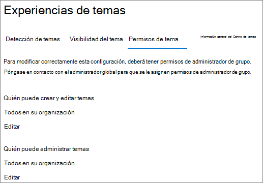
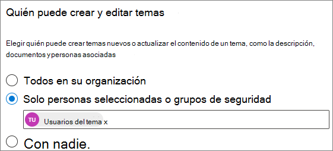
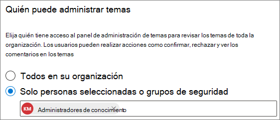

# Administrar los permisos de temas en Microsoft 365

Puede administrar la configuración de los permisos de temas en el [centro de administración de Microsoft 365](https://admin.microsoft.com). Debe ser administrador global o administrador de SharePoint para realizar estas tareas.

Con la configuración de los permisos de tema, puede elegir:

- Qué usuarios pueden crear y editar temas: crear temas nuevos que no se encontraron durante la detección o editar los detalles del tema existente.
- Qué usuarios pueden administrar temas: obtener acceso al centro de administración de temas y ver los comentarios sobre los temas, así como mover temas a través del ciclo de vida.

## Para acceder a la configuración de administración de temas:

1. En el centro de administración de Microsoft 365, haga clic en **configuración** y, a continuación, en configuración de la **organización**.
2. En la pestaña **servicios** , haga clic en **red de conocimiento**.

     

3. Seleccione la pestaña **permisos de tema** . Consulte las secciones siguientes para obtener información sobre cada configuración.

     

## Cambiar quién tiene permisos para actualizar los detalles del tema

Para actualizar quién tiene permisos para crear y editar temas:

1. En la ficha **permisos de tema** , en **quién puede crear y editar temas**, seleccione **Editar**.
2. En la página **quién puede crear y editar temas** , puede seleccionar:
    - **Todos en su organización**
    - **Solo personas seleccionadas o grupos de seguridad**
    - **No hay nadie**

      

3. Seleccione **Guardar**.

Para actualizar quién tiene permisos para administrar temas:

1. En la ficha **permisos de tema** , en **¿quién puede administrar temas**?, seleccione **Editar**.
2. En la página **quién puede administrar temas** , puede seleccionar:
    - **Todos en su organización**
    - **Personas o grupos de seguridad seleccionados**

      

3. Seleccione **Guardar**.

## Vea también

[Administrar la detección de temas en Microsoft 365](topic-experiences-discovery.md)

[Administrar la visibilidad de los temas en Microsoft 365](topic-experiences-knowledge-rules.md)

[Cambiar el nombre del centro de temas en Microsoft 365](topic-experiences-administration.md)
