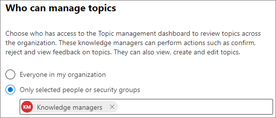

# Administrar permisos de temas en Temas de Microsoft VivaManage topic permissions in Microsoft Viva Topics

Puede administrar la configuración de permisos de temas en el [centro Microsoft 365 de administración.](https://admin.microsoft.com)You can manage topic permissions settings in the [Microsoft 365 admin center](https://admin.microsoft.com). Debe ser un administrador global o SharePoint administrador para realizar estas tareas.You must be a global administrator or SharePoint administrator to perform these tasks.

Con la configuración de permisos de tema puede elegir:With topic permissions settings you can choose:

- Qué usuarios pueden crear y editar temas: cree nuevos temas que no se encontraron durante la detección o editar detalles de temas existentes.Which users can create and edit topics: Create new topics that were not found during discovery or edit existing topic details.
- Qué usuarios pueden administrar los temas: obtener acceso al centro de administración de temas y ver comentarios sobre temas, así como mover temas a lo largo del ciclo de vida.Which users can manage topics: Access the topic management center and view feedback on topics as well as move topics through the lifecycle.

## Para acceder a la configuración de administración de temas:To access topics management settings:

1. En el Centro Microsoft 365 administración, haga clic **en Configuración** y, a continuación, en Configuración de **la organización.**In the Microsoft 365 admin center, click **Settings**, then **Org settings**.
2. En la **pestaña Servicios,** haga clic en **Experiencias del tema**.On the **Services** tab, click **Topic experiences**.

     

3. Seleccione la **pestaña Permisos de tema.** Vea las secciones siguientes para obtener información sobre cada configuración.Select the **Topic permissions** tab. See the following sections for information about each setting.

     

## Cambiar quién tiene permisos para actualizar los detalles del temaChange who has permissions to update topic details

Para actualizar quién tiene permisos para crear y editar temas:To update who has permissions to create and edit topics:

1. En la **pestaña Permisos del tema,** en **Quién puede crear** y editar temas , seleccione **Editar**.On the **Topic permissions** tab, under **Who can create and edit topics**, select **Edit**.
2. En la **Quién puede crear y editar temas,** puede seleccionar:On the **Who can create and edit topics** page, you can select:
    - **Todos en su organización****Everyone in your organization**
    - **Solo personas o grupos de seguridad seleccionados****Only selected people or security groups**
    - **Nadie****No one**

      

3. Seleccione **Guardar**.Select **Save**.

Para actualizar quién tiene permisos para administrar temas:To update who has permissions to manage topics:

1. En la **pestaña Permisos del tema,** en **Quién puede administrar temas,** seleccione **Editar**.On the **Topic permissions** tab, under **Who can manage topics**, select **Edit**.
2. En la **Quién puede administrar temas,** puede seleccionar:On the **Who can manage topics** page, you can select:
    - **Todos en su organización****Everyone in your organization**
    - **Personas o grupos de seguridad seleccionados****Selected people or security groups**

      

3. Seleccione **Guardar**.Select **Save**.

## Consulte tambiénSee also

[Administrar la detección de temas en Temas de Microsoft VivaManage topic discovery in Microsoft Viva Topics](topic-experiences-discovery.md)

[Administrar visibilidad de temas en Temas de Microsoft VivaManage topic visibility in Microsoft Viva Topics](topic-experiences-knowledge-rules.md)

[Cambiar el nombre del centro de temas en Temas de Microsoft VivaChange the name of the topic center in Microsoft Viva Topics](topic-experiences-administration.md)
