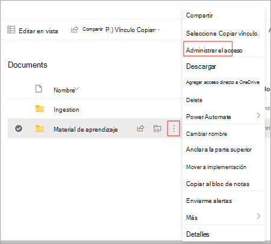
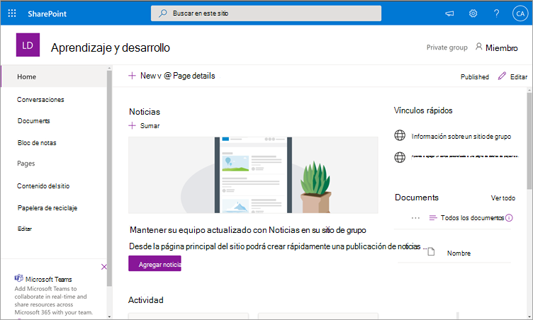
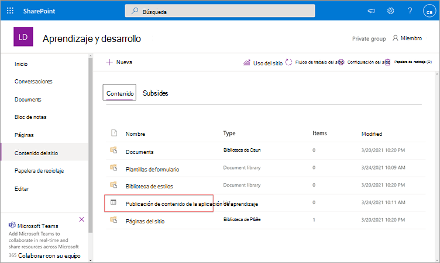
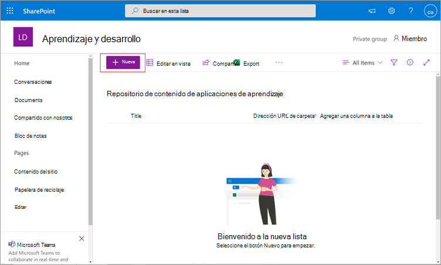
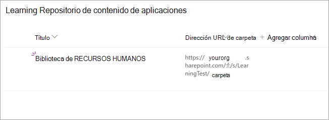
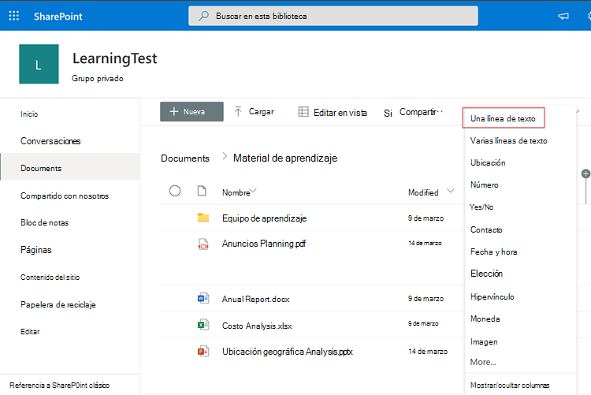
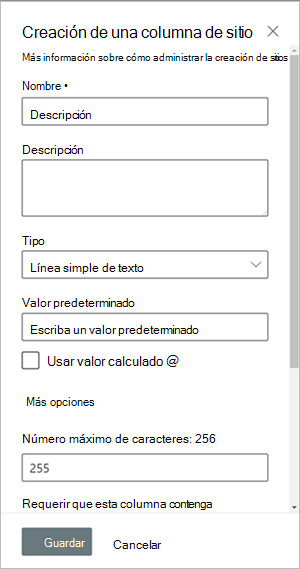
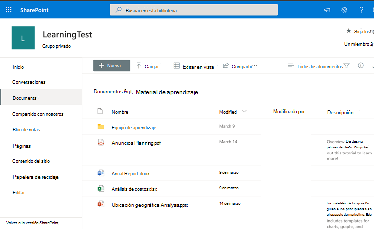
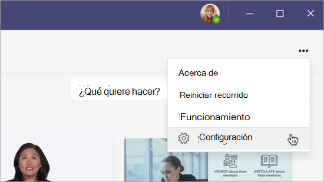

# Próximamente: Configure SharePoint como un origen de contenido de aprendizaje para Microsoft Viva Learning (versión preliminar)Coming soon: Configure SharePoint as a learning content source for Microsoft Viva Learning (Preview)

> [!NOTE]
> La información de este artículo se refiere a un producto de vista previa que puede modificarse considerablemente antes de su lanzamiento comercial.The information in this article relates to a preview product that may be substantially modified before it's commercially released. 

Puede configurar el SharePoint como un origen de contenido de aprendizaje para que el propio contenido de su organización esté disponible en Viva Learning (versión preliminar).You can configure SharePoint as a learning content source to make your organization's own content available in Viva Learning (Preview).

## Información generalOverview

El administrador del conocimiento (o administrador global) proporciona una dirección URL del sitio a la que el servicio de aprendizaje puede crear una ubicación centralizada vacía (el repositorio de contenido de la aplicación de aprendizaje) en forma de una lista de SharePoint estructurada.The knowledge admin (or global administrator) provides a site URL to where the Learning Service can create an empty centralized location—the Learning App Content Repository—in the form of a structured SharePoint list. La organización puede usar esta lista para hospedar vínculos a carpetas entre SharePoint que contienen contenido de aprendizaje.This list can be used by your organization to house links to cross-company SharePoint folders that contain learning content. Los administradores son responsables de recopilar y comisariar una lista de direcciones URL de carpetas.Admins are responsible for collecting and curating a list of URLs for folders. Estas carpetas solo deben incluir contenido que pueda estar disponible en Viva Learning (versión preliminar).These folders should only include content that can be made available in Viva Learning (Preview).

Viva Learning (versión preliminar) admite los siguientes tipos de documentos:Viva Learning (Preview) supports the following document types:

- Word, PowerPoint, Excel, PDFWord, PowerPoint, Excel, PDF
- Audio (.m4a)Audio (.m4a)
- Vídeo (.mov, .mp4, .avi)Video (.mov, .mp4, .avi)

Para obtener más información, [vea SharePoint límites](/office365/servicedescriptions/sharepoint-online-service-description/sharepoint-online-limits?redirectSourcePath=%252farticle%252fSharePoint-Online-limits-8f34ff47-b749-408b-abc0-b605e1f6d498).For more information, see [SharePoint limits](/office365/servicedescriptions/sharepoint-online-service-description/sharepoint-online-limits?redirectSourcePath=%252farticle%252fSharePoint-Online-limits-8f34ff47-b749-408b-abc0-b605e1f6d498). 

## PermisosPermissions

Las direcciones URL de carpetas de biblioteca de documentos se pueden recopilar SharePoint sitio de la organización.Document library folder URLs can be collected from any SharePoint site in the organization. Viva Learning (versión preliminar) sigue todos los permisos de contenido existentes.Viva Learning (Preview) follows all existing content permissions. Por lo tanto, solo se puede buscar y ver el contenido para el que un usuario tiene permiso de acceso en Viva Learning (versión preliminar).Therefore, only content for which a user has permission to access is searchable and visible within Viva Learning (Preview). Cualquier contenido dentro de estas carpetas se puede buscar, pero solo se puede usar el contenido al que el empleado individual tenga permisos.Any content within these folders will be searchable, but only content to which the individual employee has permissions can be used.

Actualmente, no se admite la eliminación de contenido del repositorio de la organización.Content deletion from your organization’s repository is not currently supported.

Para quitar contenido que no se ha presentado de forma involuntarla, siga estos pasos:To remove unintentionally surfaced content, follow these steps:

1.  Para restringir el acceso a la biblioteca de documentos, seleccione la **opción Mostrar acciones** y, a continuación, seleccione Administrar **acceso**.To restrict access to the document library, select the **Show actions** option, and then select **Manage access**.
     
     

2.  Elimine el documento original dentro de la biblioteca de documentos.Delete the original document within the document library.

Para obtener más información, vea [Sharing and permissions in the SharePoint modern experience](/sharepoint/modern-experience-sharing-permissions).For more information, see [Sharing and permissions in the SharePoint modern experience](/sharepoint/modern-experience-sharing-permissions). 

## Servicio de aprendizajeLearning Service

El servicio de aprendizaje usa las direcciones URL de carpeta proporcionadas para obtener metadatos de todo el contenido almacenado en esas carpetas.The Learning Service uses the provided folder URLs to get metadata from all content stored in those folders. En un plazo de 24 horas después de proporcionar la dirección URL de carpeta en el repositorio centralizado, los empleados pueden buscar y usar el contenido de la organización en Viva Learning (versión preliminar).Within 24 hours of supplying the folder URL in the centralized repository, employees can search for and use your organization’s content within Viva Learning (Preview). Todos los cambios en el contenido, incluidos los metadatos y permisos actualizados, también se aplicarán en el Servicio de aprendizaje en un plazo de 24 horas.All changes to content, including updated metadata and permissions, will also be applied in the Learning Service within 24 hours.

## Configurar SharePoint como origenConfigure SharePoint as a source

Debe ser un administrador Microsoft 365 global, SharePoint administrador o administrador de conocimientos para realizar estas tareas.You must be a Microsoft 365 global administrator, SharePoint administrator, or knowledge admin to perform these tasks.

Para configurar SharePoint como orígenes de contenido de aprendizaje en para Viva Learning (versión preliminar), siga estos pasos:To configure SharePoint as a learning content sources in for Viva Learning (Preview), follow these steps:

1.  En la navegación izquierda del centro Microsoft 365 administración, vaya a **Configuración**  >  **configuración de la organización.**In the left navigation of the Microsoft 365 admin center, go to **Settings** > **Org settings**.
 
2.  En la **página Configuración de** la organización, en la pestaña **Servicios,** seleccione **Viva Learning (versión preliminar).**On the **Org settings** page, on the **Services** tab, select **Viva Learning (Preview)**.

     

3.  En el panel **Viva Learning (versión** preliminar), en SharePoint, proporciona la dirección URL del sitio al sitio de SharePoint donde desea que Viva Learning (versión preliminar) cree un repositorio centralizado.On the **Viva Learning (Preview)** panel, under SharePoint, provides the site URL to the SharePoint site where you want Viva Learning (Preview) to create a centralized repository.

     

4.  Una SharePoint se crea automáticamente en el sitio SharePoint proporcionado.A SharePoint list is created automatically within the provided SharePoint site.

     

     En la navegación izquierda del sitio SharePoint, seleccione **Contenido** del sitio Aprendizaje del repositorio de contenido  >  **de la aplicación**.In the left navigation of the SharePoint site, select **Site contents** > **Learning App Content Repository**. 

      

5. En la **página Repositorio de contenido de** la aplicación de aprendizaje, rellene la lista SharePoint con direcciones URL a las carpetas de contenido de aprendizaje.On the **Learning App Content Repository** page, populate the SharePoint list with URLs to the learning content folders.

   1. Seleccione **Nuevo** para ver el **panel Nuevo** elemento.Select **New** to view the **New item** panel. 

       
 
   2. En el **panel Nuevo elemento,** en el **campo Título,** agregue un nombre de directorio de su elección.On the **New item** panel, in the **Title** field, add a directory name of your choice. En el **campo Dirección URL de** carpeta, agregue la dirección URL a la carpeta de contenido de aprendizaje.In the **Folder URL** field, add the URL to the learning content folder. Seleccione **Guardar**.Select **Save**.

       

   3. La **página Repositorio de contenido de** la aplicación de aprendizaje se actualiza con el nuevo contenido de aprendizaje.The **Learning App Content Repository** page is updated with the new learning content.

       

> [!NOTE]
> Para permitir un acceso más amplio al repositorio de contenido de la aplicación de aprendizaje, pronto estará disponible un vínculo a la lista en la interfaz de Viva Learning (versión preliminar), donde los usuarios pueden solicitar acceso y, en última instancia, ayudar a rellenar la lista.To allow for broader access to the Learning App Content Repository, a link to the list soon will be available in the Viva Learning (Preview) interface where users can request access and ultimately help populate the list. Los propietarios del sitio y los administradores globales tendrán que conceder acceso a la lista.Site owners and global administrators will be required to grant access to the list. El acceso es específico de la lista únicamente y no se aplica al sitio donde se almacena la lista.Access is specific to the list only and does not apply to the site where the list is stored. Para obtener más información, [vea Proporcionar el contenido](#provide-your-own-organizations-content) de su propia organización más adelante en este artículo.For more information, see [Provide your own organization's content](#provide-your-own-organizations-content) later in this article.

### Curación de la biblioteca de documentos de dirección URL de carpetaFolder URL document library curation

Los metadatos predeterminados (como la fecha de modificación, creados por, el nombre del documento, el tipo de contenido y el nombre de la organización) se extraen automáticamente en Viva Learning (versión preliminar) mediante la API de Microsoft Graph.Default metadata (such as modified date, created by, document name, content type, and organization name) is automatically pulled into Viva Learning (Preview) by the Microsoft Graph API.
 
Para mejorar la detección general y la relevancia de búsqueda del contenido, se recomienda agregar una **columna** Descripción.To improve overall discovery and search relevance of the content, we recommend adding a **Description** column.

Para agregar una **columna Description** a la página de la biblioteca de documentos, siga estos pasos:To add a **Description** column to the document library page, follow these steps:

1.  En la **página Documentos,** seleccione **Agregar columna**.On the **Documents** page, select **Add column**.

2. Seleccione la **opción Mostrar acciones** y, a continuación, seleccione Línea única de **texto**.Select the **Show actions** option, and then select **Single line of text**.

     

3. En el panel **Crear una columna,** en el **campo Nombre,** agregue un nombre descriptivo para la columna.On the **Create a column** panel, in the **Name** field, add a descriptive name for the column. Seleccione **Guardar**.Select **Save**.

     
 
4. En la **página Documentos,** en la **columna Descripción,** agregue descripciones personalizadas para cada elemento.On the **Documents** page, in the **Description** column, add custom descriptions for each item. Si no se proporciona ninguna descripción, Viva Learning (versión preliminar) proporcionará un mensaje predeterminado que resalta el contenido como de su propia SharePoint biblioteca.If no description is supplied, Viva Learning (Preview) will provide a default message that highlights the content as being from your own SharePoint library. 

     
 
### Proporcionar el contenido de su propia organizaciónProvide your own organization's content

Los administradores de conocimientos pueden acceder al repositorio de contenido de aplicaciones de aprendizaje de su organización en SharePoint, donde pueden proporcionar referencias a bibliotecas de documentos entre organizaciones.Knowledge admins can access their organization’s Learning App Content Repository in SharePoint, where they can provide references to cross-organization document libraries. El contenido de estas bibliotecas aparecerá como contenido de aprendizaje en Viva Learning (versión preliminar).Content within these libraries will be then surfaced as learning content in Viva Learning (Preview).

1. En Viva Learning (versión preliminar), seleccione **Más opciones** (**...**) y, a continuación, **seleccione Configuración**.In Viva Learning (Preview), select **More options** (**...**), and then select **Settings**.

     
     
2. En **Configuración**, seleccione **Permisos**.Under **Settings**, select **Permissions**.

     

3. Seleccione **Comprobar el acceso** para conectarse a la biblioteca centralizada de la organización.Select **Check access** to connect to your organization’s centralized library.
     
