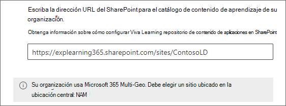

# Agregar SharePoint como origen de contenido para Aprendizaje Microsoft Viva

Puede configurar SharePoint como un origen de contenido de aprendizaje para que el propio contenido de su organización esté disponible en Viva Learning.

>[!NOTE]
> El contenido accesible a través de Viva Learning está sujeto a términos distintos de los Términos del producto de Microsoft. Cualquier contenido que agregue a Viva Learning, como el contenido hospedado SharePoint, está sujeto a los términos de privacidad y servicio asociados con dicho contenido.

## Información general

El administrador de conocimientos (o administrador global) proporciona una dirección URL de sitio a la que el servicio [de Learning](configure-sharepoint-content-source.md#learning-service) puede crear una ubicación centralizada vacía en forma de una lista SharePoint estructurada. Esta lista se denomina repositorio Learning contenido de aplicaciones. La organización puede usar esta lista para hospedar vínculos a carpetas entre SharePoint que contienen contenido de aprendizaje. Los administradores son responsables de recopilar y comisariar una lista de direcciones URL de carpetas. Estas carpetas solo deben incluir contenido que pueda estar disponible en Viva Learning.

Viva Learning admite los siguientes tipos de documento:

- Word, PowerPoint, Excel, PDF
- Audio (.m4a)
- Vídeo (.mov, .mp4, .avi)

Para obtener más información, [vea SharePoint límites](/office365/servicedescriptions/sharepoint-online-service-description/sharepoint-online-limits?redirectSourcePath=%252farticle%252fSharePoint-Online-limits-8f34ff47-b749-408b-abc0-b605e1f6d498).

## Multi-Geo

Si usas [Microsoft 365 Multi-geo](/microsoft-365/enterprise/microsoft-365-multi-geo), la dirección URL del sitio proporcionada por el administrador del conocimiento (donde se ubicará el repositorio de contenido de la aplicación Learning) debe pertenecer a la ubicación central donde se aprovisionó originalmente la suscripción Microsoft 365. Las carpetas vinculadas al repositorio también deben pertenecer a la ubicación central. Viva Learning ha agregado esta restricción para cumplir con los requisitos de residencia de datos.

[Microsoft 365 Multi-geo](/microsoft-365/enterprise/microsoft-365-multi-geo) está diseñado para cumplir los requisitos de residencia de datos. Para obtener más información, [vea Multi-geo capabilities in SharePoint Online](/microsoft-365/enterprise/multi-geo-capabilities-in-onedrive-and-sharepoint-online-in-microsoft-365).

## Permisos

Las direcciones URL de carpetas de biblioteca de documentos se pueden recopilar SharePoint sitio de la organización. Viva Learning todos los permisos de contenido existentes. Por lo tanto, solo se puede buscar y ver el contenido para el que un usuario tiene permiso de acceso en Viva Learning. Cualquier contenido dentro de estas carpetas se puede buscar, pero solo se puede usar el contenido al que el empleado individual tenga permisos.

Actualmente, no se admite la eliminación de contenido del repositorio de la organización.

Para quitar contenido que no se ha presentado de forma involuntarla, siga estos pasos:

1. Para restringir el acceso a la biblioteca de documentos, seleccione la **opción Mostrar acciones** y, a continuación, seleccione Administrar **acceso**.

     

2. Elimine el documento original dentro de la biblioteca de documentos.

Para obtener más información, vea [Sharing and permissions in the SharePoint modern experience](/sharepoint/modern-experience-sharing-permissions).

## Learning Servicio

El Learning usa las direcciones URL de carpeta proporcionadas para obtener metadatos de todo el contenido almacenado en esas carpetas. Dentro de las 24 horas siguientes a la entrega de la dirección URL de carpeta en el repositorio centralizado, los empleados pueden buscar y usar el contenido de la organización en Viva Learning. Todos los cambios en el contenido, incluidos los metadatos y permisos actualizados, también se aplicarán en el servicio de Learning dentro de las 24 horas.

## Configurar SharePoint como origen

Debe ser un administrador Microsoft 365 global, SharePoint administrador o administrador de conocimientos para realizar estas tareas.

Para configurar SharePoint como orígenes de contenido de aprendizaje en para Viva Learning, siga estos pasos:

1. En la navegación izquierda de la Centro de administración de Microsoft 365, vaya **a** Configuración  >  **configuración de la organización**.

2. En la **página Configuración de** la organización, en la pestaña **Servicios,** seleccione **Viva Learning**.

     

3. En el panel **Learning Viva,** en SharePoint, proporcione la dirección URL del sitio al sitio de SharePoint donde desea que Viva Learning cree un repositorio centralizado. Si su SharePoint es nuevo, tendrá que esperar 1 hora después de la creación del sitio para agregarlo aquí.

     

     Si su organización usa [Microsoft 365 Multi-geo](/microsoft-365/enterprise/microsoft-365-multi-geo), puede encontrar su región o país en [Microsoft 365 disponibilidad multige geográfica](/microsoft-365/enterprise/microsoft-365-multi-geo#microsoft-365-multi-geo-availability). El **panel Learning** Viva también muestra esta información.

     

4. Una SharePoint se crea automáticamente en el sitio SharePoint proporcionado.

     En la navegación izquierda del sitio SharePoint, seleccione **Contenido del** sitio Learning repositorio de  >  **contenido de la aplicación**.

     

5. En la **Learning repositorio** de contenido de la aplicación, rellene la lista SharePoint con direcciones URL a las carpetas de contenido de aprendizaje.

   1. Seleccione **Nuevo** para ver el **panel Nuevo** elemento.

       

   2. En el **panel Nuevo elemento,** en el **campo Título,** agregue un nombre de directorio de su elección. En el **campo Dirección URL de** carpeta, agregue la dirección URL a la carpeta de contenido de aprendizaje. Seleccione **Guardar**. [Obtenga información sobre cómo crear la dirección URL de la carpeta](#folder-url-document-library-curation).

       

   3. La Learning repositorio de **contenido de la aplicación** se actualiza con el nuevo contenido de aprendizaje.

       

   4. Si su organización usa [Microsoft 365 Multi-geo](/microsoft-365/enterprise/microsoft-365-multi-geo) e intenta agregar un vínculo a una carpeta que no pertenece a la ubicación central, verá un mensaje de error. Todas las carpetas deben pertenecer a la ubicación central.
       

  > [!NOTE]
  > Para permitir un acceso más amplio al repositorio de contenido de aplicaciones de Learning, pronto estará disponible un vínculo a la lista en la interfaz viva Learning donde los usuarios pueden solicitar acceso y, en última instancia, ayudar a rellenar la lista. Los propietarios del sitio y los administradores globales tendrán que conceder acceso a la lista. El acceso es específico de la lista únicamente y no se aplica al sitio donde se almacena la lista. Para obtener más información, [vea Proporcionar el contenido](#provide-your-own-organizations-content) de su propia organización más adelante en este artículo.

### Curación de la biblioteca de documentos de dirección URL de carpeta

Cree una carpeta para almacenar contenido de aprendizaje para su organización.

1. Vaya a la biblioteca documentos y seleccione **+ Nuevo**.

    

2. Elija **Carpeta** y escriba un nombre de carpeta.

    

3. Seleccione **Crear**. La carpeta aparecerá ahora en la biblioteca de documentos.

    

4. Upload que desea publicar como contenido de aprendizaje en esta carpeta.
5. Para obtener la dirección URL de la carpeta, elija esta carpeta y seleccione **Copiar vínculo**.

    

Los metadatos predeterminados (como la fecha de modificación, creados por, el nombre del documento, el tipo de contenido y el nombre de la organización) se integran automáticamente en Viva Learning mediante la API de Microsoft Graph.

Para mejorar la detección general y la relevancia de búsqueda del contenido, se recomienda agregar una **columna** Descripción. Si ya hay una columna de descripción presente, puede eliminarla y agregar una nueva siguiendo los pasos siguientes.

Para agregar una **columna Description** a la página de la biblioteca de documentos, siga estos pasos:

1. En la **página Documentos,** seleccione **Agregar columna**.

2. Seleccione la **opción Mostrar acciones** y, a continuación, seleccione Línea única de **texto**.

    :::image type="content" alt-text="Página Documentos en SharePoint que muestra las opciones Mostrar acciones con una sola línea de texto resaltada." source="../media/learning/learning-sharepoint-curation1.png":::

3. En el panel **Crear una columna,** en el **campo Nombre,** agregue un nombre descriptivo para la columna. Seleccione **Guardar**.

    

4. En la **página Documentos,** en la **columna Descripción,** agregue descripciones personalizadas para cada elemento. Si no se proporciona ninguna descripción, Viva Learning proporcionará un mensaje predeterminado que resalta el contenido como de su propia SharePoint biblioteca.

     

### Proporcionar el contenido de su propia organización

Los administradores de conocimientos pueden acceder al repositorio de contenido Learning aplicaciones de su organización en SharePoint, donde pueden proporcionar referencias a bibliotecas de documentos entre organizaciones. El contenido de estas bibliotecas se mostrará como contenido de aprendizaje en Viva Learning.

1. En Viva Learning, seleccione los puntos suspensivos (**...**) y, a continuación, **seleccione Configuración**.

    
  
2. En **Configuración**, seleccione **Permisos**.

    

3. Seleccione **Comprobar el acceso** para conectarse a la biblioteca centralizada de la organización.

## Paso siguiente

[Agregar sistemas de administración de aprendizaje para Viva Learning](configure-lms.md) o Agregar otros proveedores de contenido para [Aprendizaje Microsoft Viva](configure-other-content-sources.md).
