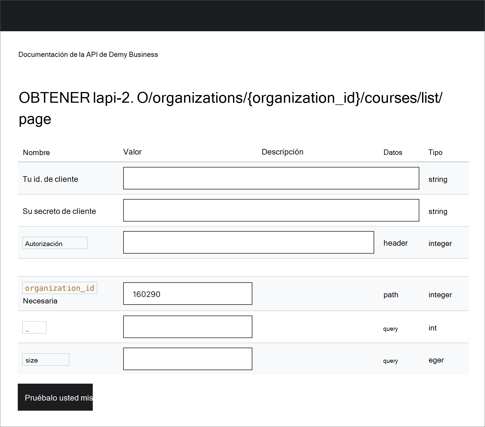

# Configurar Udemy como origen de contenido para Aprendizaje Microsoft Viva

En este artículo se muestra cómo configurar Udemy como un origen de contenido de aprendizaje de terceros para Aprendizaje Microsoft Viva.

>[!NOTE]
>El contenido accesible a través de Viva Learning está sujeto a términos distintos de los Términos del producto de Microsoft. El contenido de Udemy y los servicios asociados están sujetos a los términos de privacidad y servicio de Udemy.

## Configurar en el portal de Udemy

>[!NOTE]
>Tendrás que tener permisos de administrador en Udemy para completar estos pasos.

Siga estos pasos para habilitar las API en el entorno de Udemy Business y generar credenciales de cliente para que su aplicación LMS/LXP pueda tener acceso a ellas.

1. Vaya a **Administrar**, a **continuación, Configuración** y, a continuación, **API**. Compruebe el estado de las API. Si están deshabilitados, puede ponerse en contacto con el soporte técnico para que estén habilitados o siga los pasos que se indican a continuación para habilitarlos.

    

2. Si las API están deshabilitadas, vaya a Integraciones **LMS/LXP**, **inicie La** configuración y, a continuación, **Otros**.

    

3. En la siguiente pantalla, escriba el nombre de la aplicación personalizada de LMS/LXP o de terceros. A continuación, active o desactive la opción de inscripción automática y seleccione **Guardar**. La opción de inscripción automática permite que los usuarios que inician un curso a través de su LMS/LXP se inscriban automáticamente en Udemy.

    

4. Una vez que hayas guardado, se generarán el id. de cliente y el secreto de cliente y podrás copiarlos desde la pantalla. Ahora puede obtener acceso a las API con las credenciales de cliente proporcionadas.

    

5. Para obtener acceso a los puntos de conexión de la API, debe tener la dirección ACCOUNT_ID y la dirección URL del punto de conexión. Para obtener acceso a esta información y probar las **API,** vaya a **Administrar**, a continuación, **Configuración** api . Una vez habilitadas las API, debería ver el estado de las API como "Habilitado". Seleccione el vínculo documentación de la API.

    

6. Obtenga la dirección URL del punto de conexión de la API ACCOUNT_ID de la página de información general. Vaya a los métodos admitidos para probar una llamada a la API. Ahora estás listo para realizar llamadas a las API de Udemy Business.

    
    

## Configurar en el Centro de administración de Microsoft 365

>[!NOTE]
>Tendrás que tener permisos de administrador en Microsoft 365 para completar estos pasos.

Después de recibir los detalles de configuración necesarios del portal udemy mediante los pasos anteriores, el administrador de inquilinos debe configurar Udemy como un origen de aprendizaje en el Centro de administración de Microsoft 365 mediante los pasos siguientes.

1. Vaya a la [Centro de administración de Microsoft 365](https://admin.microsoft.com).

2. Vaya a **Configuración** y, a continuación, **configuración de la organización**. Busque Viva Learning y habilite Udemy desde las opciones.

3. Rellene los siguientes detalles de configuración necesarios:

    - **Dirección URL de host del cliente:** se trata de la dirección URL del punto de conexión de la API recopilada desde el portal udemy en el paso 6.
    - **Id. de** organización: este es el ACCOUNT_ID recopilado desde el portal Udemy en el paso 6.
    - **Id. de** cliente: este es el id. de cliente recopilado del portal Udemy en el paso 4.
    - **Secreto de** cliente: este es el secreto de cliente recopilado del portal Udemy en el paso 4.

4. Selecciona **Guardar** para activar el contenido de Udemy en Aprendizaje Microsoft Viva. El contenido puede tardar hasta 24 horas en estar disponible en Viva Learning.

>[!NOTE]
>Los metadatos del espacio empresarial se almacenan de forma centralizada en nuestros almacenes de datos y no se almacenan en almacenes de datos específicos geográficamente.
