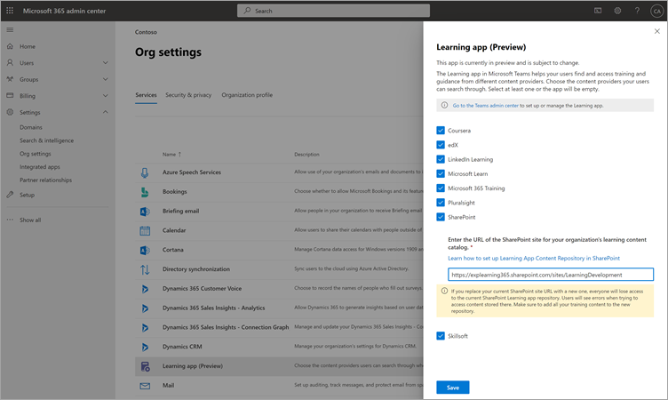

# Configurar orígenes de contenido de aprendizaje para Microsoft Viva Learning (versión preliminar) en el Centro Microsoft 365 administraciónConfigure learning content sources for Microsoft Viva Learning (Preview) in the Microsoft 365 admin center

> [!NOTE]
> La información de este artículo se refiere a un producto de vista previa que puede modificarse considerablemente antes de su lanzamiento comercial.The information in this article relates to a preview product that may be substantially modified before it's commercially released. 

Los administradores del centro de administración de Microsoft 365, ya sea por sí mismos o asignando el rol de administrador de conocimientos a individuos seleccionados de la organización, pueden administrar la configuración relacionada con Viva Learning (versión preliminar) y pueden configurar los orígenes de contenido de aprendizaje.The administrators for the Microsoft 365 admin center—either by themselves or by assigning the knowledge admin role to selected individuals in your organization—can manage settings related to Viva Learning (Preview) and can configure the learning content sources.

El administrador selecciona qué otros orígenes de contenido de aprendizaje (por ejemplo, SharePoint o orígenes de proveedores de contenido de terceros compatibles) estarán disponibles para los usuarios de Viva Learning (versión preliminar).The administrator selects which other learning content sources (for example, SharePoint or supported third-party content provider sources) will be available to users of Viva Learning (Preview). A continuación, el administrador configura esos orígenes para asegurarse de que el contenido está disponible para la búsqueda y la detección y los empleados que usan Viva Learning (versión preliminar) pueden examinarlo.The admin then configures those sources to make sure the content is available for search and discovery and can be browsed by the employees who use Viva Learning (Preview).

> [!NOTE]
>  Los usuarios inician sesión en usuarios que no son de Microsoft y LinkedIn Learning Pro aprendizaje en un explorador o visor incrustado.Users sign in to non-Microsoft and LinkedIn Learning Pro learnings in a browser or embedded viewer. Este aprendizaje configurado está sujeto a los términos de licencia, privacidad y servicio independientes entre su organización y el tercero, y no a los términos de Viva Learning (versión preliminar).This configured learning is subject to the separate license, privacy and service terms between your organization and the third party, and not the Viva Learning (Preview) terms. Antes de seleccionar este tipo de aprendizaje, compruebe que tiene un acuerdo para la organización y los usuarios.Before selecting this type of learning, verify you have an agreement in place for your organization and users.

## Asignar el rol de administrador de conocimientos (opcional)Assign the knowledge admin role (Optional)

Debe ser un administrador Microsoft 365 global para realizar estas tareas.You must be a Microsoft 365 global administrator to perform these tasks.

> [!TIP]
> El administrador de conocimientos debe ser moderadamente técnico y tener credenciales de administrador de SharePoint existentes, preferiblemente alguien que esté bien informado en la parte de educación, aprendizaje, formación o experiencia de los empleados de la organización.The knowledge admin should be moderately technical and have existing SharePoint admin credentials, preferably someone who is well-versed in the education, learning, training, or employee experience part of the organization.

### Agregar un administrador de conocimientosAdd a knowledge admin

Para agregar un administrador de conocimientos para Viva Learning (versión preliminar), siga estos pasos:To add a knowledge admin for Viva Learning (Preview), follow these steps:

1.  En la navegación izquierda del centro Microsoft 365 administración, vaya a **Roles**.In the left navigation of the Microsoft 365 admin center, go to **Roles**.

2.  En la **página Roles,** en la **pestaña Azure AD,** seleccione **Administrador de conocimientos.**On the **Roles** page, on the **Azure AD** tab, select **Knowledge Administrator**.
 
3.  En el panel **Administrador de** conocimientos, seleccione **Administradores asignados** y, a continuación, **seleccione Agregar**.On the **Knowledge Administrator** panel, select **Assigned admins**, and then select **Add**.

     

3.  En el **panel Agregar administradores,** seleccione la persona que elija para el rol y, a continuación, **seleccione Agregar**.On the **Add admins** panel, select the person you choose for the role, and then select **Add**.

     

### Quitar un administrador de conocimientosRemove a knowledge admin

Para quitar un administrador de conocimientos para Viva Learning (versión preliminar), siga estos pasos:To remove a knowledge admin for Viva Learning (Preview), follow these steps:

1.  En la navegación izquierda del centro Microsoft 365 administración, vaya a **Roles**.In the left navigation of the Microsoft 365 admin center, go to **Roles**.

2.  En la **página Roles,** en la **pestaña Azure AD** y, a continuación, seleccione Administrador de **conocimientos.**On the **Roles** page, on the **Azure AD** tab, and then select **Knowledge Administrator**.
 
3.  En el panel **Administrador de** conocimientos, en la pestaña Administradores **asignados,** seleccione Quitar **y,** a continuación, seleccione la persona que desea quitar del rol.On the **Knowledge Administrator** panel, on the **Assigned Admins** tab, select **Remove**, and then select the person you want to remove from the role. Para confirmarlo, seleccione **Quitar**.To confirm, select **Remove**.

     

## Configuración de los orígenes de contenido de aprendizajeConfigure settings for the learning content sources

Debe ser un administrador Microsoft 365 global o administrador de conocimientos para realizar estas tareas.You must be a Microsoft 365 global administrator or knowledge admin to perform these tasks.

Para configurar la configuración de orígenes de contenido de aprendizaje en Viva Learning, siga estos pasos:To configure settings for learning content sources in Viva Learning, follow these steps:

1.  En la navegación izquierda del centro Microsoft 365 administración, vaya a **Configuración**  >  **configuración de la organización.**In the left navigation of the Microsoft 365 admin center, go to **Settings** > **Org settings**.

2.  En la **página Configuración de** la organización, en la pestaña **Servicios,** seleccione **Viva Learning (versión preliminar).**On the **Org settings** page, on the **Services** tab, select **Viva Learning (Preview)**.

     

3.  En el **panel Viva Learning (versión** preliminar), seleccione los orígenes de contenido de aprendizaje que desea configurar para la organización y, a continuación, **seleccione Guardar**.On the **Viva Learning (Preview)** panel, select the learning content sources you want to configure for the organization, and then select **Save**.

     

Entre todos los orígenes de aprendizaje que existen, algunos se habilitarán de forma predeterminada.Among all the learning sources that exist, some will be enabled by default. Estos orígenes de aprendizaje incluyen:These learning sources include:

- LinkedIn Learning (contenido gratuito)LinkedIn Learning (free content)
- Microsoft LearnMicrosoft Learn
- Microsoft 365 FormaciónMicrosoft 365 Training

> [!NOTE]
> El contenido gratuito de LinkedIn se proporciona a los usuarios en virtud de las directivas de privacidad y el contrato de usuario de LinkedIn.LinkedIn free content is provided to users under the LinkedIn privacy policies and user agreement. LinkedIn recibirá la dirección IP del usuario, las cookies establecidas anteriormente por LinkedIn y establecerá una nueva cookie para realizar un seguimiento del uso del contenido gratuito.LinkedIn will receive the user’s IP address, any cookies previously set by LinkedIn, and will set a new cookie to track use of free content. No es necesario que los usuarios inicien sesión con LinkedIn para recibir contenido gratuito.Users are not required to sign in with LinkedIn to receive free content.  
Para el contenido premium de LinkedIn, su organización necesita una suscripción para que su equipo pueda acceder a ese contenido.For LinkedIn premium content, your organization needs a subscription for your team to access that content. Los usuarios tendrán que iniciar sesión en LinkedIn para obtener acceso a ese aprendizaje, que se proporciona en los términos de los términos de usuario y de su organización con LinkedIn.Users will need to sign into LinkedIn to access that learning, which is provided under the terms of your organization’s and user terms with LinkedIn.   Para contenido que no sea de Microsoft (excepto contenido gratuito de LinkedIn), asegúrese de que su organización tiene una suscripción para que los usuarios accedan a ese contenido mediante una cuenta de trabajo antes de conectarlo a Viva Learning (versión preliminar).For non-Microsoft content (except free LinkedIn content), ensure your organization has a subscription for your users to access that content using a work account before connecting it to Viva Learning (Preview). Las suscripciones personales de los usuarios a proveedores de aprendizaje que no son de Microsoft no se integrarán con Viva Learning (versión preliminar).Users’ personal subscriptions to non-Microsoft learning providers will not be integrated with Viva Learning (Preview). Los usuarios inician sesión en usuarios que no son de Microsoft y LinkedIn Learning Pro aprendizaje en un explorador o visor incrustado.Users sign in to non-Microsoft and LinkedIn Learning Pro learnings in a browser or embedded viewer. Si los usuarios navegan a contenido donde no tienen una suscripción organizativa, es posible que vean una página de proveedor en la que podrían registrarse para una suscripción individual.If users navigate to content where they do not have an organizational subscription, they may see a provider page where they could sign up for an individual subscription. Todo el aprendizaje que no es de Microsoft se proporciona bajo los términos del proveedor que no es de Microsoft y no como parte de Viva Learning.All non-Microsoft learning is provided under the non-Microsoft provider’s terms and not as part of Viva Learning. 

Para habilitar o deshabilitar un origen de contenido de aprendizaje, active la casilla situada junto al origen.To enable or disable a learning content source, select the check box next to the source. Si un origen está habilitado, se mostrará una marca de verificación.If a source is enabled, a check mark will be visible.

## Proveedores de contenido de tercerosThird-party content providers 

El conjunto de proveedores de aprendizaje conectados disponibles puede cambiar en cualquier momento.The set of available connected learning providers might change at any time. Más proveedores se unirán a medida que el programa crezca.More providers will join as the program grows. Los proveedores disponibles también pueden optar por interrumpir su conexión con Viva Learning (versión preliminar).Available providers might also choose to discontinue their connection with Viva Learning (Preview).

### Skillsoft como origen de contenidoSkillsoft as a content source  

Para Viva Learning (versión preliminar), los usuarios que tienen Skillsoft habilitado y deciden ver contenido de Skillsoft llegarán a una página de Percipio que les pida que introduzcan el nombre del sitio de Percipio de la organización.For Viva Learning (Preview), users who have Skillsoft enabled and choose to view Skillsoft content will land on a Percipio page that asks them to input your organization's Percipio site name. Después de que los usuarios introduzcan el nombre del sitio de la organización, se les dirigirá a la página para que inicien sesión en el sitio de Percipio de la organización.After users input your organization's site name, they will be directed to page to sign in to your organization's Percipio site. Los usuarios iniciarán sesión con sus credenciales existentes y verán el contenido que seleccionaron originalmente.Users will sign in by using their existing credentials and see the content they originally selected. Se pedirá a los usuarios que introduzcan el nombre del sitio de Percipio solo una vez, hasta que se borra la memoria caché del explorador.Users will be asked to input the Percipio site name only once, until their browser cache is cleared. Para simplificar esta experiencia para los usuarios, se recomienda incluir el nombre del sitio de Percipio en las comunicaciones internas que envíe sobre Viva Learning (versión preliminar).To streamline this experience for your users, we recommend including your Percipio site name in internal communications you send about Viva Learning (Preview).

Esto está pensado para ser una experiencia temporal para la versión preliminar y estamos trabajando con Skillsoft para habilitar la integración específica del inquilino para la disponibilidad general, lo que omitirá el paso que requiere que los usuarios proporcionen el nombre del sitio Percipio de su organización.This is intended to be a temporary experience for preview, and we are working with Skillsoft to enable tenant-specific integration for general availability, which will bypass the step that requires users to provide your organization's Percipio site name. 

### Detalles sobre el substrato de MicrosoftDetails on Microsoft substrate  

En el caso de los datos que copie en Viva Learning (versión preliminar) de un servicio que no sea de Microsoft (proveedor de aprendizaje o sistema de administración de aprendizaje), no podrá extraer, corregir ni eliminar directamente los datos en Viva Learning (versión preliminar).For data that you copy to Viva Learning (Preview) from a non-Microsoft service (learning provider or learning management system), you are not able to directly extract, correct, or delete that data in Viva Learning (Preview). Actualizamos los datos que importa de proveedores que no son de Microsoft con prontitud para reflejar los cambios y eliminaciones en los datos de origen que no son de Microsoft.We refresh the data you import from non-Microsoft providers promptly to reflect changes and deletions in the non-Microsoft source data.

Debe trabajar con el proveedor del servicio que no es de Microsoft para obtener acceso, corregir, eliminar o extraer datos según los términos de licencia, servicio o privacidad del servicio que no sea de Microsoft.You need to work with the supplier of the non-Microsoft service to access, correct, delete or extract data under the license, service, or privacy terms of the non-Microsoft service. Los cambios realizados allí se reflejarán en los datos procesados para su uso en Viva Learning (versión preliminar) una vez completados los ciclos de actualización de datos del servicio que no es de Microsoft y Viva Learning (versión preliminar).The changes made there will be reflected in the data processed for your use in Viva Learning (Preview) upon completion of the data update cycles of the non-Microsoft service and Viva Learning (Preview). Si desactiva la conexión entre Viva Learning (Versión preliminar) y un servicio que no es de Microsoft, se eliminarán todos los datos que haya importado anteriormente desde ese servicio.If you turn off the connection between Viva Learning (Preview) and a non-Microsoft service, all data you had previously imported from that service will be deleted. 

## Paso siguienteNext step

[Configurar SharePoint como origen de contenido de aprendizaje para Microsoft Viva Learning (versión preliminar)Configure SharePoint as a learning content source for Microsoft Viva Learning (Preview)](configure-sharepoint-content-source.md)