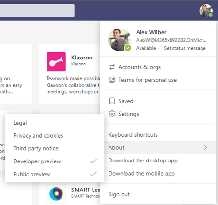
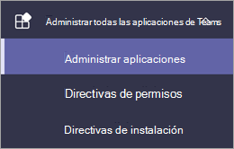
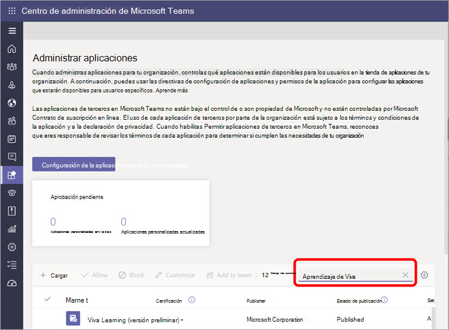
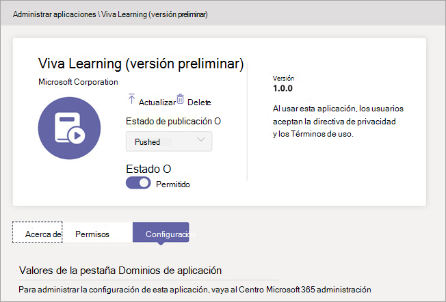

# Configurar Microsoft Viva Learning (versión preliminar) en el Centro Teams administraciónSet up Microsoft Viva Learning (Preview) in the Teams admin center

> [!NOTE]
> La información de este artículo se refiere a un producto de vista previa que puede modificarse considerablemente antes de su lanzamiento comercial.The information in this article relates to a preview product that may be substantially modified before it's commercially released. 

El Teams debe realizar determinados pasos para habilitar Viva Learning (versión preliminar) para sus usuarios en el espacio empresarial.The Teams administrator needs to perform certain steps to enable Viva Learning (Preview) for their users in the tenant. Estos pasos varían en función de cómo se habilita el espacio empresarial: [*Vista previa*](set-up-teams-admin-center.md#public-preview-tenants) pública o Vista [ *previa privada* (o Beta).](set-up-teams-admin-center.md#private-preview-tenants)These steps vary based on how the tenant is enabled:  [*Public Preview*](set-up-teams-admin-center.md#public-preview-tenants) or [*Private Preview* (or Beta)](set-up-teams-admin-center.md#private-preview-tenants).

## Inquilinos de vista previa públicaPublic Preview tenants

### Pasos de administrador para inquilinos de vista previa públicaAdministrator steps for Public Preview tenants

Dado que Viva Learning (versión preliminar) todavía no está disponible en general, se requieren ciertos pasos para habilitar las características y establecer permisos para usuarios o grupos específicos.Because the Viva Learning (Preview) is not yet generally available, certain steps are required to enable the features and set permissions for specific users or groups. 

1. Habilitar las características de vista previa pública para los usuarios de Viva Learning (versión preliminar).Enable Public Preview features for Viva Learning (Preview) users.

    a.a. Modifique Teams de actualización para habilitar las características de Vista previa pública.Modify Teams update policy to enable Public Preview features. Vea [Microsoft Teams Public Preview](/microsoftteams/public-preview-doc-updates).See [Microsoft Teams Public Preview](/microsoftteams/public-preview-doc-updates).

    b.b. Habilite la directiva de actualización para los usuarios o grupos que realizarán las pruebas de Viva Learning (versión preliminar).Enable the update policy for users or groups who will perform Viva Learning (Preview) testing. Vea [Asignar directivas a usuarios y grupos.](/microsoftteams/assign-policies-users-and-groups)See [Assign policies to users and groups](/microsoftteams/assign-policies-users-and-groups).

2. Modifique la directiva de permisos de la aplicación para los usuarios de Viva Learning (versión preliminar).Modify the app permission policy for Viva Learning (Preview) users.

    a.a. A menos que actualmente forma parte de la directiva global, permita todas las aplicaciones de Microsoft en la directiva de permisos de la aplicación.Unless it's currently part of the global policy, allow all Microsoft apps in the app permission policy. Consulta [Administrar directivas de permisos de aplicaciones en Microsoft Teams](/microsoftteams/teams-app-permission-policies).See [Manage app permission policies in Microsoft Teams](/microsoftteams/teams-app-permission-policies). 

    b.b. Habilite la directiva de permisos de la aplicación para los usuarios o grupos que realizarán las pruebas de Viva Learning (versión preliminar).Enable the app permission policy for users or groups who will perform Viva Learning (Preview) testing. Vea [Asignar directivas a usuarios y grupos.](/microsoftteams/assign-policies-users-and-groups)See [Assign policies to users and groups](/microsoftteams/assign-policies-users-and-groups).

3.  Notifique a los usuarios que probarán Viva Learning (versión preliminar) para cambiar su cliente [de compilación](set-up-teams-admin-center.md#user-steps-for-public-preview-tenants)a Public Preview para Teams .Notify users who will test Viva Learning (Preview) to [switch their build client to Public Preview for Teams](set-up-teams-admin-center.md#user-steps-for-public-preview-tenants).

> [!IMPORTANT]
> Para los inquilinos de Vista previa pública, Viva  Learning (versión preliminar) no se mostrará en aplicaciones administradas en el centro de administración de Teams hasta la versión final del producto.For Public Preview tenants, Viva Learning (Preview) will not be displayed in **Managed apps** in the Teams admin center until final product release. Sin embargo, los usuarios habilitados para la vista previa pública pueden encontrar Viva Learning (versión preliminar) en el almacén de aplicaciones de Teams y usarlo, una vez configuradas las directivas y permisos correctos.However, enabled Public Preview users can find Viva Learning (Preview) in the Teams app store and use it, once the correct policies and permissions have been set up.

### Pasos de usuario para inquilinos de vista previa públicaUser steps for Public Preview tenants

Los usuarios que se han habilitado para las pruebas de vista previa pública (habilitando las directivas descritas [anteriormente)](set-up-teams-admin-center.md#administrator-steps-for-public-preview-tenants) deben cambiar a [Public Preview](/microsoftteams/public-preview-doc-updates#enable-public-preview) en su Teams cliente.Users who have been enabled for Public Preview testing — by enabling the [policies previously described](set-up-teams-admin-center.md#administrator-steps-for-public-preview-tenants) — need to [switch to Public Preview](/microsoftteams/public-preview-doc-updates#enable-public-preview) in their Teams client.

1. Los usuarios deben seleccionar su imagen de perfil > **Acerca de** la vista  >  **previa pública**.Users must select their profile image > **About** > **Public Preview**.
   
    
    
2. Los usuarios deben aceptar los términos y condiciones de Public Preview.Users must accept the Public Preview terms and conditions.

    
 
3. Los usuarios ahora pueden encontrar Viva Learning (versión preliminar) en la Teams de aplicaciones y empezar a usarlo.Users can now find Viva Learning (Preview) in the Teams app store and start using it.

## Inquilinos de vista previa privadaPrivate Preview tenants

### Pasos de administrador para inquilinos de versión preliminar privada (o beta)Administrator steps for Private Preview (or Beta) tenants

Para los inquilinos de versión preliminar privada, no hay directivas adicionales que deba habilitarse.For Private Preview tenants, there are no additional policies that need to be enabled. Sin embargo, Viva Learning (versión preliminar) debe estar disponible para los usuarios de la organización.However, Viva Learning (Preview) must be made available for users in your organization.

1. En la navegación izquierda del Centro Teams administración, ve a **Teams aplicaciones Administrar**  >  **aplicaciones**.In the left navigation of the Teams admin center, go to **Teams apps** > **Manage apps**.

   

2. En la **página Administrar aplicaciones,** en el cuadro de búsqueda, escriba *Viva Learning* y, a continuación, seleccione Viva **Learning (vista previa).**On the **Manage apps** page, in the search box, type *Viva Learning*, and then select **Viva Learning (Preview)**.

   

3. En la **página Viva Learning (versión preliminar),** en **Estado,** seleccione **Permitido** activar Viva Learning (vista previa).On the **Viva Learning (Preview)** page, under **Status**, select **Allowed** to turn on Viva Learning (Preview).

   

<!---
The Teams admin installs Viva Learning (Preview) and applies permission policies through the Teams admin center.

1. For Viva Learning (Preview), you must first set the Update policy in Teams. For more information, see [Microsoft Teams Public Preview](/MicrosoftTeams/public-preview-doc-updates).

    1. Sign in to the Teams admin center.

    2. Select **Teams** > **Update policies**.

    3. Select **Add**. 

    4. Name the update policy, add a policy, and turn on **Show preview features**.

2. The admin must notify users of the policy update so that they move their build into the Public Preview for Teams. 

    1. Users must select their profile image > **About** > **Public Preview**.
   
        
    
    2. Users must accept the **Public preview** terms and conditions.

        
 
3. For organizations that have restrictive policies and need to enable Viva Learning (Preview), follow the process in the next section.

## Manage settings for Viva Learning (Preview)

You must be an administrator in the Teams admin center to perform these tasks.

To make Viva Learning (Preview) available for users in your organization, follow these steps:

1. In the left navigation of the Teams admin center, go to **Teams apps** > **Manage apps**.

   

2. On the **Manage apps** page, in the search box, type *Viva learning*, and then select **Viva Learning (Preview)**.

   

3. On the **Viva Learning (Preview)** page:

   1. Under **Status**, select **Allowed** to turn on Viva Learning (Preview).

   2. On the **Settings** tab, under **App settings**, go to the Microsoft 365 admin center to [configure learning content sources](content-sources-365-admin-center.md).

   

4. After **Manage app** settings, go to **Permission policies** and **Setup policies** to grant permission to employees who should have access to Viva Learning (Preview) as part of your organization's participation in the preview.

> [!NOTE]
>  If your organization is in Ring 4.0 as part of Teams TAP100 program, you might need to enable approved users in Ring 3.0 to access Viva Learning (Preview).   As part of the preview, Viva Learning (Preview) is released in Ring 3.0. If your organization is in Ring 4.0, you won’t see Viva Learning (Preview) on the **Manage apps** page. To test the app, you need to create a custom apps permission policy, set it to **Allow all apps**, and assign it to Ring 3.0 approved users.      

--->

## Paso siguienteNext step

[Configurar orígenes de contenido de aprendizaje para Viva Learning (versión preliminar) en el Centro Microsoft 365 administraciónConfigure learning content sources for Viva Learning (Preview) in the Microsoft 365 admin center](content-sources-365-admin-center.md)
