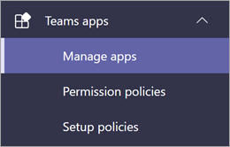

# Configurar Microsoft Viva Learning (versión preliminar) en el Centro Teams administraciónSet up Microsoft Viva Learning (Preview) in the Teams admin center

> [!NOTE]
> La información de este artículo se refiere a un producto de vista previa que puede modificarse considerablemente antes de su lanzamiento comercial.The information in this article relates to a preview product that may be substantially modified before it's commercially released. 

El Teams instala Viva Learning (versión preliminar) y aplica directivas de permisos a través del centro Teams administración.The Teams admin installs Viva Learning (Preview) and applies permission policies through the Teams admin center.

## Administrar la configuración de Viva Learning (versión preliminar)Manage settings for Viva Learning (Preview)

Debe ser administrador en el centro de administración Teams para realizar estas tareas.You must be an administrator in the Teams admin center to perform these tasks.

Para que Viva Learning (versión preliminar) esté disponible para los usuarios de su organización, siga estos pasos:To make Viva Learning (Preview) available for users in your organization, follow these steps:

1. En la navegación izquierda del Centro Teams administración, ve a **Teams aplicaciones Administrar**  >  **aplicaciones**.In the left navigation of the Teams admin center, go to **Teams apps** > **Manage apps**.

   

2. En la **página Administrar aplicaciones,** en el cuadro de búsqueda, escriba *Viva learning* y, a continuación, seleccione Viva **Learning (vista previa).**On the **Manage apps** page, in the search box, type *Viva learning*, and then select **Viva Learning (Preview)**.

   

3. En la **página Viva Learning (versión preliminar):**On the **Viva Learning (Preview)** page:

   1. En **Estado**, seleccione **Permitido** activar Viva Learning (versión preliminar).Under **Status**, select **Allowed** to turn on Viva Learning (Preview).

   2. En la **Configuración,** en Configuración de la **aplicación,** vaya al Centro de administración de Microsoft 365 para configurar orígenes [de contenido de aprendizaje.](content-sources-365-admin-center.md)On the **Settings** tab, under **App settings**, go to the Microsoft 365 admin center to [configure learning content sources](content-sources-365-admin-center.md).

   

4. Después **de** administrar la  configuración  de la aplicación, ve a Directivas de permisos y directivas de configuración para conceder permiso a los empleados que deben tener acceso a Viva Learning (versión preliminar) como parte de la participación de la organización en la versión preliminar.After **Manage app** settings, go to **Permission policies** and **Setup policies** to grant permission to employees who should have access to Viva Learning (Preview) as part of your organization's participation in the preview.

> [!NOTE]
>  Si su organización está en ring 4.0 como parte del programa TAP100 de Teams, es posible que necesite habilitar a los usuarios aprobados en ring 3.0 para tener acceso a Viva Learning (versión preliminar).If your organization is in Ring 4.0 as part of Teams TAP100 program, you might need to enable approved users in Ring 3.0 to access Viva Learning (Preview).   Como parte de la vista previa, Viva Learning (versión preliminar) se publica en Ring 3.0.As part of the preview, Viva Learning (Preview) is released in Ring 3.0. Si su organización está en anillo 4.0, no verá Viva Learning (versión preliminar) en la **página Administrar aplicaciones.**If your organization is in Ring 4.0, you won’t see Viva Learning (Preview) on the **Manage apps** page. Para probar la aplicación, debes crear una directiva de permisos de aplicaciones personalizadas, establecerla en **Permitir** todas las aplicaciones y asignarla a los usuarios aprobados de Ring 3.0.To test the app, you need to create a custom apps permission policy, set it to **Allow all apps**, and assign it to Ring 3.0 approved users.      

## Paso siguienteNext step

[Configurar orígenes de contenido de aprendizaje para Viva Learning (versión preliminar) en el Centro Microsoft 365 administraciónConfigure learning content sources for Viva Learning (Preview) in the Microsoft 365 admin center](content-sources-365-admin-center.md)