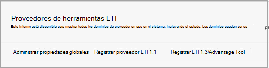
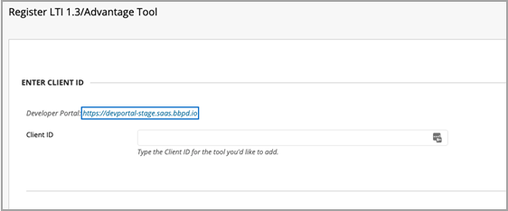

# Usar clases de Microsoft Teams en el sistema de administración de aprendizaje

> [!IMPORTANT]
> Parte de la información se refiere a productos preliminares que pueden ser modificados sustancialmente antes de su lanzamiento comercial. Microsoft no otorga garantías, expresas o implícitas, con respecto a la información que aquí se proporciona.

Microsoft Teams class teams es una aplicación de Interoperabilidad de herramientas de aprendizaje (LTI) que ayuda a los profesores y alumnos a navegar fácilmente entre su Sistema de administración de aprendizaje (LMS) y Teams. Los usuarios pueden acceder a sus equipos de clase asociados con su curso directamente desde su LMS.

## Aprobar la aplicación en el inquilino de Microsoft Azure

El administrador de Microsoft Office 365 y el administrador de Blackboard Learn Ultra completan las siguientes tareas.

Antes de administrar la integración en Blackboard Learn Ultra, el administrador de Microsoft Office 365 debe aprobar la aplicación Desinsistente de Microsoft Azure de Blackboard **MSFT Teams para Learn Ultra Azure** para el inquilino de Microsoft Azure de la institución.

1. Busque su id. de inquilino de Microsoft. Vea [cómo encontrar el espacio empresarial](/azure/active-directory/fundamentals/active-directory-how-to-find-tenant).

2. Redirija el extremo de consentimiento de administrador de la plataforma de identidad de Microsoft según el siguiente ejemplo:

   `https://login.microsoftonline.com/{tenant}/adminconsent?client\_id=2d94989f-457a-47c1-a637-e75acdb11568`

   > [!NOTE]
   > Reemplace {tenant} por el identificador de inquilino de Microsoft de su organización.

## Registrar las aplicaciones de integración

Como administrador de Blackboard Learn Ultra, deberá registrar 2 aplicaciones de integración de LTI 1.3 en su entorno de prueba:

- La integración de Equipos de clase de Aprendizaje de Blackboard para admitir la sincronización de listas

- La aplicación LTI del equipo de clase de Microsoft Teams

1. Anote los siguientes IDs de cliente LTI para ambas aplicaciones:

    - Blackboard - f1561daa-1b21-4693-ba90-6c55f1a0eb41

    - Microsoft - 027328b7-c2e3-4c9e-aaa1-07802dae6c89

2. Accede al Panel de administración y, en **Integraciones,** busca los proveedores de herramientas de LTI.

   

3. Seleccione **Registrar LTI1.3/Advantage Tool**.

4. Escriba el primero de los IDs de cliente proporcionados (Ya sea Blackboard o Microsoft) y seleccione **Enviar**.

   

5. Revise la configuración rellenada previamente y asegúrese de que el estado de la herramienta esté marcado como aprobado.

6. Desplácese hasta la parte inferior y, a continuación, **seleccione Enviar**.

7. Repita los pasos anteriores para registrar la segunda de las aplicaciones de LTI en su entorno.

## Configurar la aplicación REST y el uso compartido de recursos entre orígenes

El administrador de Blackboard Learn Ultra también tendrá que configurar la aplicación REST y la configuración de uso compartido de recursos entre orígenes.

Complete lo siguiente para configurar la aplicación REST

1. Obtenga acceso a Herramientas de administración de Learn y, a continuación, seleccione **Integraciones de API de REST** en la sección **Integraciones.**

2. Seleccione **Crear integraciones e** introduzca el mismo id. de aplicación/cliente que ha especificado para la herramienta LTI de integración de Teams de clase de Blackboard Learn.

3. Escriba el usuario de Learn (podría ser su propio nombre de usuario de administrador de Learn) o **seleccione Examinar** para buscar.

4. Seleccione **Sí para** acceso de usuario **final**.

5. Seleccione **Sí** para **Autorizado para actuar como usuario**

6. Seleccione **Enviar una** vez completada.

## Configurar el uso compartido de recursos entre orígenes

1. Obtenga acceso a herramientas de administración de Learn y seleccione **Uso** compartido de recursos entre orígenes en la **sección Integraciones.**

2. Seleccione **Crear configuración**.

3. Escriba `https://bb-ms-teams-ultra-ext.api.blackboard.com` en el origen.

4. Agregue la palabra **Autorización en** los **encabezados permitidos**.

5. Establezca **Disponible** en **Sí**.

6. Seleccione **Enviar una** vez completada.

## Habilitar Equipos de clase en Blackboard Learn

Una vez habilitadas las herramientas de LTI, el siguiente paso será configurar la integración de Microsoft Class Teams desde su propio espacio empresarial Microsoft Office 365. Para ello, siga estos pasos como administrador de Blackboard Learn Ultra.

1. En **Learn Admin** Tools and  >  **Utilities**, seleccione Microsoft Teams Integration **Admin**.

   

2. Active la casilla habilitar **Microsoft Teams**.

3. Escriba su identificador de inquilino como se hace referencia en la sección de Administración de Microsoft O365

 > [!NOTE]
 > No podrás guardar la configuración hasta que la aplicación haya sido aprobada por el administrador de O365. Consulta [Aprobar la aplicación en el espacio empresarial de Microsoft Azure](#approve-the-app-in-the-microsoft-azure-tenant).

4. Cuando el administrador global de O365 haya aprobado la aplicación Desempresa de Blackboard teams en su inquilino de Microsoft, seleccione **Enviar**.
