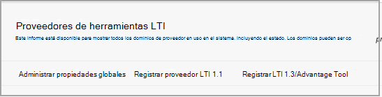
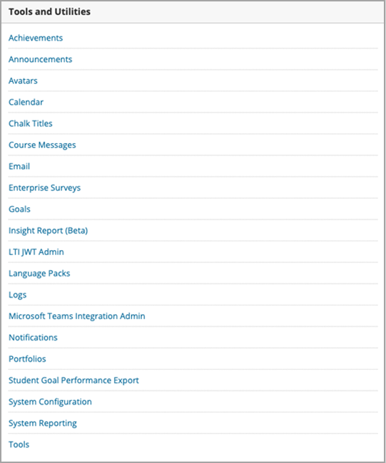

# Usar Microsoft Teams clases con BlackboardUse Microsoft Teams classes with Blackboard

> [!IMPORTANT]
> Parte de la información se refiere a productos preliminares que pueden ser modificados sustancialmente antes de su lanzamiento comercial.Some information relates to prereleased product which may be substantially modified before it's commercially released. Microsoft no otorga garantías, expresas o implícitas, con respecto a la información que aquí se proporciona.Microsoft makes no warranties, express or implied, with respect to the information provided here.

Microsoft Teams clases es una aplicación Learning Tools Interoperability (LTI) que ayuda a los profesores y alumnos a navegar fácilmente entre su sistema de administración de Learning (LMS) y Teams.Microsoft Teams classes is a Learning Tools Interoperability (LTI) app that helps educators and students easily navigate between their Learning Management System (LMS) and Teams. Los usuarios pueden acceder a sus equipos de clase asociados con su curso directamente desde su LMS.Users can access their class teams associated with their course directly from within their LMS.

## Aprobar la aplicación en el Microsoft Azure inquilinoApprove the app in the Microsoft Azure tenant

El administrador de Microsoft Office 365 y el administrador de Blackboard Learn Ultra completan las siguientes tareas.The following tasks are completed by the Microsoft Office 365 admin and the Blackboard Learn Ultra admin.

Antes de administrar la integración en Blackboard Learn Ultra, el administrador de Microsoft Office 365 debe aprobar el Teams de **MSFT** de Blackboard para la aplicación Learn Ultra Azure para el inquilino Microsoft Azure la entidad.Before managing the integration within Blackboard Learn Ultra, the Microsoft Office 365 admin must approve the Blackboard **MSFT Teams for Learn Ultra Azure** app for the institution’s Microsoft Azure tenant.

1. Busque su id. de inquilino de Microsoft.Find your Microsoft Tenant ID. Vea [cómo encontrar el espacio empresarial](/azure/active-directory/fundamentals/active-directory-how-to-find-tenant).See [how to find the tenant](/azure/active-directory/fundamentals/active-directory-how-to-find-tenant).

2. Redirija el extremo de consentimiento de administrador de la plataforma de identidad de Microsoft según el siguiente ejemplo:Redirect the Microsoft Identity Platform Admin Consent Endpoint according to the following example:

   `https://login.microsoftonline.com/{tenant}/adminconsent?client_id=2d94989f-457a-47c1-a637-e75acdb11568`

   > [!NOTE]
   > Reemplace {tenant} por el identificador de inquilino de Microsoft de su organización.Replace {tenant} with your organization’s Microsoft tenant ID.

## Registrar las aplicaciones de integraciónRegister the integration apps

Como administrador de Blackboard Learn Ultra, deberá registrar 2 aplicaciones de integración de LTI 1.3 en su entorno de prueba:As a Blackboard Learn Ultra admin, you'll need to register 2 LTI 1.3 integration apps within your Test environment:

- La clase De Aprendizaje de Blackboard Teams integración para admitir la sincronización de listasThe Blackboard Learn Class Teams integration to support the roster sync

- La Microsoft Teams LTI de grupo de claseThe Microsoft Teams class team LTI app

1. Anote los siguientes IDs de cliente LTI para ambas aplicaciones:Make a note of the following LTI Client IDs for both Apps:

    - Blackboard - f1561daa-1b21-4693-ba90-6c55f1a0eb41Blackboard - f1561daa-1b21-4693-ba90-6c55f1a0eb41

    - Microsoft - 027328b7-c2e3-4c9e-aaa1-07802dae6c89Microsoft - 027328b7-c2e3-4c9e-aaa1-07802dae6c89

2. Accede al Panel de administración y, en **Integraciones,** busca los proveedores de herramientas de LTI.Access the Admin Panel, and under **Integrations**, locate the LTI Tool Providers.

   

3. Seleccione **Registrar LTI1.3/Advantage Tool**.Select **Register LTI1.3/Advantage Tool**.

4. Escriba el primero de los IDs de cliente proporcionados (Ya sea Blackboard o Microsoft) y seleccione **Enviar**.Enter the first of the Client IDs provided (either Blackboard or Microsoft), and select **Submit**.

5. Revise la configuración rellenada previamente y asegúrese de que el estado de la herramienta esté marcado como aprobado.Review the pre-populated settings and ensure that the tool status is marked as approved.

6. Desplácese hasta la parte inferior y, a continuación, **seleccione Enviar**.Scroll to the bottom, and then select **Submit**.

7. Repita los pasos anteriores para registrar la segunda de las aplicaciones de LTI en su entorno.Repeat the previous steps to register the second of the LTI apps within your environment.

## Configurar la aplicación REST y el uso compartido de recursos entre orígenesSet up the REST Application and Cross Origin Resource Sharing

El administrador de Blackboard Learn Ultra también tendrá que configurar la aplicación REST y la configuración de uso compartido de recursos entre orígenes.The Blackboard Learn Ultra admin will also need to configure the REST Application and the Cross Origin Resource Sharing configuration.

Complete lo siguiente para configurar la aplicación RESTComplete the following to set up the REST Application

1. Obtenga acceso a Herramientas de administración de Learn y, a continuación, seleccione **Integraciones de API de REST** en la sección **Integraciones.**Access the Learn Administration Tools, and then select **REST API Integrations** from the **Integrations** section.

2. Seleccione **Crear integraciones** y escriba el mismo id. de aplicación/cliente que escribió para la herramienta LTI de Teams clase de Aprendizaje de Blackboard.Select **Create integrations** and enter the same Application/Client ID that you entered for the Blackboard Learn Class Teams Integration LTI tool.

3. Escriba el usuario de Learn (podría ser su propio nombre de usuario de administrador de Learn) o **seleccione Examinar** para buscar.Enter the Learn User (this could be your own learn admin username), or select **Browse** to locate.

4. Seleccione **Sí para** acceso de usuario **final**.Select **Yes** for **End User Access**.

5. Seleccione **Sí** para **Autorizado para actuar como usuario**Select **Yes** for **Authorized to Act as User**

6. Seleccione **Enviar una** vez completada.Select **Submit** once complete.

## Configurar el uso compartido de recursos entre orígenesSet up Cross-Origin Resource Sharing

1. Obtenga acceso a herramientas de administración de Learn y seleccione **Uso** compartido de recursos entre orígenes en la **sección Integraciones.**Access the Learn Administration Tools, and select **Cross-Origin Resource Sharing** from the **Integrations** section.

2. Seleccione **Crear configuración**.Select **Create Configuration**.

3. Escriba `https://bb-ms-teams-ultra-ext.api.blackboard.com` en el origen.Enter `https://bb-ms-teams-ultra-ext.api.blackboard.com` in the origin.

4. Agregue la palabra **Autorización en** los **encabezados permitidos**.Add the word **Authorization** in the **Allowed Headers**.

5. Establezca **Disponible** en **Sí**.Set **Available** to **Yes**.

6. Seleccione **Enviar una** vez completada.Select **Submit** once complete.

## Habilitar la clase Teams en Blackboard LearnEnable Class Teams in Blackboard Learn

Una vez habilitadas las herramientas de LTI, el siguiente paso será configurar la integración de Microsoft Class Teams desde su propio Microsoft Office 365 inquilino.Once you've enabled the LTI tools, your next step will be to set up the Microsoft Class Teams integration from your own Microsoft Office 365 tenant. Para ello, siga estos pasos como administrador de Blackboard Learn Ultra.You can do this by following these steps as the Blackboard Learn Ultra admin.

1. En **Learn Admin** Tools and  >  **Utilities**, seleccione Microsoft Teams Integration **Admin**.In **Learn Admin** > **Tools and Utilities**, select **Microsoft Teams Integration Admin**.

   

2. Active la casilla de verificación **Habilitar Microsoft Teams**.Select the checkbox for **Enable Microsoft Teams**.

3. Escriba su identificador de inquilino como se hace referencia en la sección de Administración de Microsoft O365Enter your tenant ID as referenced in the section under Microsoft O365 Admin

 > [!NOTE]
 > No podrás guardar la configuración hasta que la aplicación haya sido aprobada por el administrador de O365. Consulta [Aprobar la aplicación en Microsoft Azure inquilino](#approve-the-app-in-the-microsoft-azure-tenant).You won't be able to save the settings until the app has been approved by the O365 admin. See [Approve the app in Microsoft Azure tenant](#approve-the-app-in-the-microsoft-azure-tenant).

4. Cuando el administrador global de O365 haya aprobado la aplicación Teams Desempresa de Blackboard en su inquilino de Microsoft, seleccione **Enviar**.When the global O365 admin has approved the Blackboard Teams application in your Microsoft Tenant, select **Submit**.
