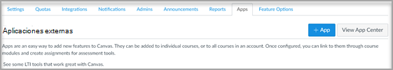
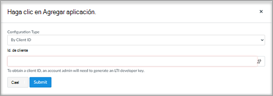

# Usar Microsoft Teams clases con Canvas

> [!IMPORTANT]
> Parte de la información se refiere a productos preliminares que pueden ser modificados sustancialmente antes de su lanzamiento comercial. Microsoft no otorga garantías, expresas o implícitas, con respecto a la información que aquí se proporciona.

Microsoft Teams clases es una aplicación Learning Tools Interoperability (LTI) que ayuda a los profesores y alumnos a navegar fácilmente entre su sistema de administración de Learning (LMS) y Teams. Los usuarios pueden acceder a sus equipos de clase asociados con su curso directamente desde su LMS.

## Microsoft Office 365 Administrador

Antes de administrar la integración de Microsoft Teams en Instructure Canvas, es importante que la aplicación azure de **Microsoft-Teams-Sync-for-Canvas** de Canvas de Canvas sea aprobada por el administrador de Microsoft Office 365 de la institución en el inquilino de Microsoft Azure antes de completar la configuración de administración de Canvas.

1. Inicie sesión en Canvas.
 
2. Seleccione el **vínculo** Administrador en la navegación global y, a continuación, seleccione su cuenta.

3. En la navegación de administración, seleccione el **vínculo Configuración** y, a continuación, la **pestaña Integraciones.** 

4. Habilite Microsoft Teams sincronización activando la alternancia.

   

5. Escriba el nombre del inquilino de Microsoft y el atributo de inicio de sesión. 

   El atributo login se usará para asociar el usuario canvas con un Azure Active Directory usuario. 

6. Seleccione **Actualizar Configuración** una vez que haya terminado.

7. Para aprobar el acceso a la aplicación azure de **Microsoft-Teams-Sync-for-Canvas** de Canvas de Canvas, seleccione el vínculo Conceder acceso **al** espacio empresarial. Se le redirigirá al punto de conexión de consentimiento de administrador de la plataforma de identidad de Microsoft.

   

8. Seleccione **Aceptar**.
 
## Administrador de Canvas

Configure la integración Microsoft Teams LTI 1.3.

Como administrador de Canvas, tendrás que agregar la aplicación LTI de Microsoft Teams clases en tu entorno. Anote el id. de cliente de LTI para la aplicación.

 - Microsoft Teams : 170000000000570

1. Access **Admin settings**  >  **Apps**.

2. Selecciona **+ Aplicación** para agregar las Teams LTI. 
 
   

3. Seleccione **Por identificador de cliente** para el tipo de configuración.

   

4. Escriba el id. de cliente proporcionado y, a continuación, **seleccione Enviar**.
   
   Observarás el nombre de la aplicación Microsoft Teams clases LTI para el identificador de cliente para confirmación. 

5. Seleccione **Instalar**.

   La Microsoft Teams clases de aplicación LTI se agregará a la lista de aplicaciones externas.
