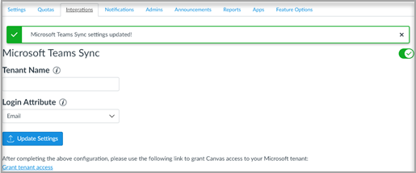

# Usar Microsoft Teams clases con CanvasUse Microsoft Teams classes with Canvas

Microsoft Teams clases es una aplicación Learning Tools Interoperability (LTI) que ayuda a los profesores y alumnos a navegar fácilmente entre su sistema de administración de Learning (LMS) y Teams.Microsoft Teams classes is a Learning Tools Interoperability (LTI) app that helps educators and students easily navigate between their Learning Management System (LMS) and Teams. Los usuarios pueden acceder a sus equipos de clase asociados con su curso directamente desde su LMS.Users can access their class teams associated with their course directly from within their LMS.

## Requisitos previos antes de la implementaciónPrerequisites Before Deployment

> [!NOTE]
> La clase actual Teams LTI solo admite la sincronización de usuarios de Canvas con Microsoft Azure Active Directory (AAD) en un ámbito limitado.The current Class Teams LTI only supports syncing Canvas users with Microsoft Azure Active Directory (AAD) in a limited scope. 
> - El inquilino debe tener una coincidencia exacta entre un campo canvas (correo electrónico, id. de usuario o id. de SIS) y el UPN en Microsoft AAD.Your tenant must have an exact match between a Canvas field (email, user ID, or SIS ID) and the UPN in Microsoft AAD. Estamos trabajando para ampliar la flexibilidad a la funcionalidad de sincronización, pero mientras tanto, los usuarios de Canvas que no coincidan con un UPN en AAD no se agregarán a la clase Teams sincronizada con Canvas.We are working to expand flexibility to the syncing functionality, but in the meantime, any users in Canvas not matched to a UPN in AAD will not be added to the Teams class synced with Canvas. 
> - Solo se puede usar un único espacio empresarial de Microsoft para asignar usuarios entre Canvas y Microsoft.Only a single Microsoft tenant can be used for mapping users between Canvas and Microsoft.
> - Tendrá que desactivar SDS antes de usar la clase Teams LTI para evitar la duplicación de grupos.You will have to turn off SDS before using the Class Teams LTI in order to avoid duplication of groups.

## Microsoft Office 365 AdministradorMicrosoft Office 365 Admin

Antes de administrar la integración de Microsoft Teams en Instructure Canvas, es importante que la aplicación azure de **Microsoft-Teams-Sync-for-Canvas** de Canvas de Canvas sea aprobada por el administrador de Microsoft Office 365 de la institución en el inquilino de Microsoft Azure antes de completar la configuración de administración de Canvas.Before managing the Microsoft Teams integration within Instructure Canvas, it is important to have Canvas’s **Microsoft-Teams-Sync-for-Canvas** Azure app approved by your institution’s Microsoft Office 365 admin in your Microsoft Azure tenant before completing the Canvas admin setup.

1. Inicie sesión en Canvas.Sign in to Canvas.

2. Seleccione el **vínculo** Administrador en la navegación global y, a continuación, seleccione su cuenta.Select the **Admin** link in the global navigation, and then select your account.

3. En la navegación de administración, seleccione el **vínculo Configuración** y, a continuación, la **pestaña Integraciones.**In the admin navigation, select the **Settings** link, and then the **Integrations** tab.

4. Habilite Microsoft Teams sincronización activando la alternancia.Enable Microsoft Teams Sync by turning the toggle on.

   

5. Escriba el nombre del inquilino de Microsoft y el atributo de inicio de sesión.Enter your Microsoft tenant name and login attribute.

   El atributo login se usará para asociar el usuario canvas con un Azure Active Directory usuario.The login attribute will be used for associating the Canvas user with an Azure Active Directory user.

6. Seleccione **Actualizar Configuración** una vez que haya terminado.Select **Update Settings** once done.

7. Para aprobar el acceso a la aplicación azure de **Microsoft-Teams-Sync-for-Canvas** de Canvas de Canvas, seleccione el vínculo Conceder acceso **al** espacio empresarial.To approve access for Canvas’s **Microsoft-Teams-Sync-for-Canvas** Azure app, select the **Grant tenant access** link. Se le redirigirá al punto de conexión de consentimiento de administrador de la plataforma de identidad de Microsoft.You'll be redirected to the Microsoft Identity Platform Admin Consent Endpoint.

   

8. Seleccione **Aceptar**.Select **Accept**.

## Administrador de CanvasCanvas Admin

Configure la integración Microsoft Teams LTI 1.3.Set up the Microsoft Teams LTI 1.3 Integration.

Como administrador de Canvas, tendrás que agregar la aplicación LTI de Microsoft Teams clases en tu entorno.As a Canvas Admin, you'll need to add the Microsoft Teams classes LTI app within your environment. Anote el id. de cliente de LTI para la aplicación.Make a note of the LTI Client ID for the app.

 - Microsoft Teams : 170000000000570Microsoft Teams classes - 170000000000570

1. Access **Admin settings**  >  **Apps**.Access **Admin settings** > **Apps**.

2. Selecciona **+ Aplicación** para agregar las Teams LTI.Select **+ App** to add the Teams LTI apps.

   

3. Seleccione **Por identificador de cliente** para el tipo de configuración.Select **By Client ID** for configuration type.

   

4. Escriba el id. de cliente proporcionado y, a continuación, **seleccione Enviar**.Enter the Client ID provided, and then select **Submit**.

   Observarás el nombre de la aplicación Microsoft Teams clases LTI para el identificador de cliente para confirmación.You'll notice the Microsoft Teams classes LTI app name for the Client ID for confirmation.

5. Seleccione **Instalar**.Select **Install**.

   La Microsoft Teams clases de aplicación LTI se agregará a la lista de aplicaciones externas.The Microsoft Teams classes LTI app will be added to the list of external apps.
   
## Habilitar la aplicación LTI para cursos de CanvasEnabling the LTI app for Canvas courses

Para usar la aplicación LTI dentro de un curso, un instructor del curso canvas debe habilitar la sincronización de integraciones. Cada curso debe estar habilitado por un instructor para que se cree un equipo correspondiente; no hay ningún mecanismo global para la creación de equipos.To use the LTI app within a course, an instructor of the Canvas course must enable integrations sync. Each course must be enabled by an instructor for a corresponding team to be created; there is no global mechanism for teams creation. Esto está diseñado como una medida de precaución para evitar que se creen equipos no deseados.This is designed as a precautionary measure to prevent unwanted teams from being created.

Consulte la documentación  del profesor para habilitar la aplicación LTI para cada curso y completar la configuración de integración.Refer your instructors to the [educator documentation](https://support.microsoft.com/topic/use-microsoft-teams-classes-in-your-lms-preview-ac6a1e34-32f7-45e6-b83e-094185a1e78a#ID0EBD=Instructure_Canvas) for enabling the LTI app for each course and completing the integration setup.
