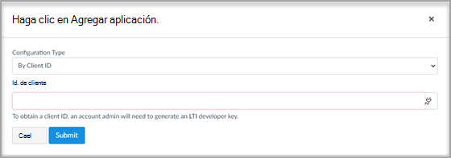

# Uso de reuniones de Microsoft Teams con Canvas

Las reuniones de Microsoft Teams son una aplicación de interoperabilidad de herramientas de aprendizaje (LTI) que ayuda a los educadores y alumnos a navegar fácilmente entre su sistema de administración de aprendizaje (LMS) y Teams. Los usuarios pueden acceder a sus equipos de clase asociados a su curso directamente desde su LMS.

## Requisitos previos antes de la implementación

> [!NOTE]
> El LTI de reuniones de Teams actual solo admite la sincronización de usuarios de Canvas con Microsoft Azure Active Directory (AAD) en un ámbito limitado.
>
> - El inquilino debe tener una licencia de Microsoft Education.
> - Solo se puede usar un único inquilino de Microsoft para asignar usuarios entre Canvas y Microsoft.
> - Si tiene previsto usar la característica de sincronización de Microsoft Teams de Canvas simultáneamente con La sincronización de datos académicos (SDS) de Microsoft, no incluya los datos de la lista de clases y clases en la sincronización de SDS. Puede seguir usando SDS para sincronizar todos los demás datos, incluidos usuarios, organizaciones, contactos primarios y datos demográficos.
> - Puede usar El LTI de reuniones de Teams sin habilitar **la sincronización del curso**. Sin embargo, no podrá usar la opción **Agregar clase completa** . Puede escribir o copiar y pegar las direcciones de correo electrónico de los asistentes, o agregar canales de equipos existentes a las reuniones.

## Microsoft Office 365 Administración

Antes de administrar la integración de Microsoft Teams en Instructure Canvas, es importante que la aplicación **de Azure Microsoft-Teams-Sync-for-Canvas** de Canvas sea aprobada por el administrador de Microsoft Office 365 de la institución en el inquilino de Microsoft Azure antes de completar la configuración del administrador de Canvas.

1. Inicie sesión en Canvas.

2. Seleccione el vínculo **Administración** en la navegación global y, a continuación, seleccione su cuenta.

3. En la navegación del administrador, seleccione el vínculo **Configuración** y, a continuación, la pestaña **Integraciones** .

   

4. Escriba el nombre del inquilino de Microsoft, el atributo de inicio de sesión, el sufijo de dominio y el atributo de búsqueda de AAD. Estos campos se usarán para buscar coincidencias entre los usuarios de Canvas con los usuarios de Microsoft Azure Active Directory.
   - El atributo Login es el atributo de usuario de Canvas utilizado para la coincidencia.
   - El campo Sufijo es opcional y le permite especificar un dominio cuando no hay una asignación exacta entre los atributos de Canvas y los campos de Microsoft AAD. Por ejemplo, si el correo electrónico de Canvas es "name@example.edu" mientras el UPN de Microsoft AAD es "name", puede hacer coincidir a los usuarios escribiendo "example.edu" en el campo sufijo.
   - El atributo de búsqueda de Active Directory es el campo del lado de Microsoft con el que coinciden los atributos de Canvas. Seleccione entre UPN, dirección de correo electrónico principal o el alias de correo electrónico.

5. Seleccione **Actualizar configuración** una vez que haya terminado.

6. Para aprobar el acceso a la aplicación de Azure **Microsoft-Teams-Sync-for-Canvas de** Canvas, seleccione el vínculo **Conceder acceso al inquilino** . Se le redirigirá al punto de conexión de consentimiento de Microsoft Identity Platform Administración.

   

7. Seleccione **Aceptar**.

   > [!NOTE]
   > La sincronización es una funcionalidad administrada por el asociado de LMS y se usa para sincronizar la pertenencia en un nivel de curso al equipo de Teams mediante las API de Microsoft Graph. Se trata principalmente de una funcionalidad que un educador activa como verdadera en un nivel de curso. Posteriormente, cualquier cambio de pertenencia realizado en LMS para la adición o eliminación de los miembros se refleja mediante la sincronización implementada por el asociado de LMS. Incluso antes de habilitar este proceso para un educador, el administrador del instituto de educación M365 permite a sus educadores acceder a la sincronización mediante el modal de permisos de sincronización que se encuentra a continuación. Estos permisos se conceden al asociado de LMS para permitir que los formadores sincronicen la pertenencia entre el curso LMS y los equipos de clase de Teams.

8. Habilite la sincronización de Microsoft Teams activando el botón de alternancia.

   

## Administración de lienzo

Configure la integración de LTI 1.3 de Microsoft Teams.

Como Administración Canvas, deberá agregar la aplicación LTI de reuniones de Microsoft Teams dentro de su entorno. Anote el identificador de cliente LTI de la aplicación.

- Reuniones de Microsoft Teams: 170000000000703

1. Acceso **a la configuración de** >  Administración **Aplicaciones**.

2. Seleccione **+ Aplicación** para agregar las aplicaciones LTI de Teams.

   

3. Seleccione **By Client ID (Por id. de cliente** ) para el tipo de configuración.

   

4. Escriba el identificador de cliente proporcionado y, a continuación, seleccione **Enviar**.

   Observará el nombre de la aplicación LTI de reuniones de Microsoft Teams para el identificador de cliente para su confirmación.

5. Seleccione **Instalar**.

   La aplicación LTI de reuniones de Microsoft Teams se agregará a la lista de aplicaciones externas.

6. Habilite la aplicación; para ello, vaya a las claves para desarrolladores de la cuenta de administrador de Canvas, seleccione Heredado y active el botón de alternancia "Activado" para las reuniones de Microsoft Teams.

## Habilitar para cursos de Canvas

Para usar el LTI dentro de un curso, un instructor del curso de Canvas debe habilitar la sincronización de integraciones. Cada curso debe estar habilitado por un instructor para que se cree un teams correspondiente; no hay ningún mecanismo global para la creación de Teams. Esto se ha diseñado con precaución para evitar que se creen equipos no deseados.

Consulte a los instructores la [documentación del educador](https://support.microsoft.com/topic/use-microsoft-teams-classes-in-your-lms-preview-ac6a1e34-32f7-45e6-b83e-094185a1e78a#ID0EBD=Instructure_Canvas) para habilitar el LTI para cada curso y finalizar la configuración de integración.
