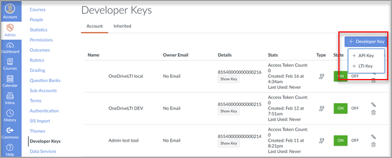

# Usar Microsoft OneDrive con el sistema de administración de aprendizajeUse Microsoft OneDrive with your Learning Management System

> [!IMPORTANT]
> Parte de la información se refiere a productos preliminares que pueden ser modificados sustancialmente antes de su lanzamiento comercial.Some information relates to prereleased product which may be substantially modified before it's commercially released. Microsoft no otorga garantías, expresas o implícitas, con respecto a la información que aquí se proporciona.Microsoft makes no warranties, express or implied, with respect to the information provided here.

Obtenga información sobre las ventajas de usar Microsoft OneDrive con su Sistema de administración de aprendizaje (LMS).Learn the benefits of using Microsoft OneDrive with your Learning Management System (LMS).

**Incluye Microsoft Office 365 directamente en los flujos de trabajo****Brings Microsoft Office 365 directly into your workflows**

La aplicación Microsoft OneDrive Learning Tools Interoperability (LTI) se integra con su LMS para incluir Microsoft OneDrive y Microsoft Office 365 directamente en los flujos de trabajo más importantes que incluyen:The Microsoft OneDrive Learning Tools Interoperability (LTI) App integrates with your LMS to bring Microsoft OneDrive and Microsoft Office 365 directly into your most important workflows that include:

- Adjuntar recursos y organizar contenido.Attaching resources and organizing content.
- Iniciar documentos de colaboración.Starting collaborative documents.
- Creación y calificación de asignaciones.Creating and grading assignments.

**Proteger y cumplir completamente con los estándares LTI más recientes****Secure and fully compliant with latest LTI standards**

La Microsoft OneDrive LTI App es compatible con LTI 1.3 y LTI Advantage.The Microsoft OneDrive LTI App is compatible with LTI 1.3 and LTI Advantage. Esta ventaja permite una experiencia de usuario altamente segura y estrechamente integrada.This advantage allows for a highly secure and tightly integrated user experience.

**Experiencia de usuario moderna y enriquecte****Modern and Rich User Experience**

La Microsoft OneDrive LTI App aporta lo mejor de Microsoft directamente a tu experiencia de LMS.The Microsoft OneDrive LTI App brings the best of Microsoft right into your LMS experience. Estamos mejorando la integración de Office 365 existente en su LMS al ofrecer una experiencia de usuario más moderna, completa con un selector de archivos de Microsoft OneDrive nuevo y expandido y experiencias de edición más enriqueciendo para Office archivos.We're improving upon the existing Office 365 integration in your LMS by delivering a more modern user experience, complete with a new and expanded Microsoft OneDrive file picker and richer editing experiences for Office files. Microsoft también será el propietario completo de la Microsoft OneDrive LTI en el futuro, lo que significa que siempre recibirás lo último y lo mejor de Microsoft automáticamente.Microsoft will also fully own the Microsoft OneDrive LTI App going forward, which means you’ll always get the latest and greatest from Microsoft automatically.

La Microsoft OneDrive LTI app te permite:The Microsoft OneDrive LTI App allows you to:

- Adjunte Office 365 archivos, incluidos documentos de Word, PowerPoint presentaciones y Excel desde el Editor de contenido enriquecido.Attach Office 365 files including Word documents, PowerPoint presentations, and Excel from the Rich Content Editor.

- Distribuir Office 365 de nube.Distribute Office 365 cloud assignments.

- Vea y organice los archivos personales y Microsoft OneDrive curso.View and organize your personal and course Microsoft OneDrive files.

- Cree colaboraciones donde los miembros del curso puedan trabajar juntos en documentos compartidos en tiempo real.Create collaborations where course members can work together on shared documents in real time.

- Accede a varias Microsoft OneDrive, incluidas las cuentas personales y educativas.Access multiple Microsoft OneDrive accounts, including personal and school accounts.

- Integre Office 365 archivos con los módulos del curso.Integrate Office 365 files with your course modules.

- Use su cuenta microsoft para el inicio de sesión único con su LMS.Use your Microsoft account for single sign-on with your LMS.

## Integrar con CanvasIntegrate with Canvas

La persona que realiza esta integración debe ser un administrador de Canvas y un administrador del Microsoft 365 inquilino.The person who performs this integration should be an admin of Canvas and an admin of the Microsoft 365 tenant.

1. Inicie sesión en el portal Microsoft Azure con la cuenta de administrador de inquilinos.Sign in to the Microsoft Azure portal with the tenant admin account. El administrador de inquilinos de Azure también debe tener el rol de administrador de grupo.The Azure tenant administrator should also have the Group administrator role.

    

2. Inicie sesión en el portal [OneDrive LTI de](https://odltiappnl.azurewebsites.net/admin)Microsoft.Sign in to the Microsoft [OneDrive LTI portal](https://odltiappnl.azurewebsites.net/admin).

3. Acepte los permisos para completar el inicio de sesión.Accept the permissions to complete the sign-in.

    

4. Seleccione **Agregar inquilino LTI**.Select **Add LTI Tenant**.

     

5. Selecciona **Plataforma de consumidor de LTI** como **Lienzo** en el desplegable.Select **LTI Consumer Platform** as **Canvas** from the dropdown.

6. Seleccione **Dirección URL base de Canvas** y, a continuación, seleccione **Siguiente**.Select **Canvas Base URL** and then select **Next**.

    

   En la siguiente pantalla se muestran los campos que son confidenciales para usted.The next screen shows fields that are confidential to you.

7. Seleccione **Siguiente** de ??Select **Next** from ?? página.page. ¿LOS REVISORES PUEDEN RELLENAR EL ESPACIO EN BLANCO AQUÍ?CAN REVIEWERS FILL IN THE BLANK HERE?

8. Seleccione **Siguiente** en la pantalla que muestra información confidencial para usted.Select **Next** in the screen that shows information that's confidential to you.

   La pantalla final de Azure Portal muestra los pasos siguientes para agregar la instancia de Canvas.The final screen of the Azure portal shows the next steps for adding your Canvas instance.

9. Copia las claves de desarrollador de esta pantalla.Copy the Developer Keys from this screen. Lo usarás al crear la instancia de Canvas.You'll use when you create the Canvas instance.

## Agregar la instancia de CanvasAdd the Canvas instance

1. En la instancia de Canvas, anule la selección de **Claves de desarrollador** de  >  **administración**.In your Canvas instance, deselect **Admin** > **Developer Keys**.

2. Elija **Clave LTI en** la lista desplegable en Clave de **desarrollador**.Choose **LTI Key** in the dropdown on **Developer Key**.

   

3. Pegue las claves de desarrollador aquí.Paste the developer keys here.

     

   La clave se crea en **modo OFF**The key gets created in **OFF** mode

   

4. Copie el texto resaltado.Copy the highlighted text.
    Esto sirve como identificador de cliente en Microsoft OneDrive portal LTI.This serves as Client ID in Microsoft OneDrive LTI portal.

5. Pegue el texto en el **campo Id.** de cliente en Microsoft OneDrive portal LTI y, a continuación, **seleccione Siguiente**.Paste the text into the **Client ID** field in Microsoft OneDrive LTI portal, and then select **Next**.

6. Seleccione **Guardar**.Select **Save**.

7. Para ver la configuración, seleccione **Ver inquilinos de LTI**.View the settings by selecting **View LTI Tenants**.
