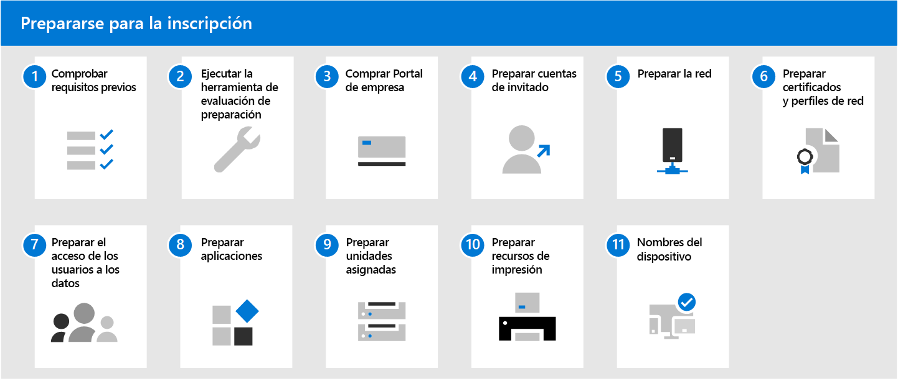

# Prepararse para la inscripción en el Escritorio administrado de Microsoft

En estos temas, se describen los pasos necesarios que llevar a cabo en la organización para preparar la inscripción, incluida la comprobación de que su entorno cumple los requisitos previos clave, la configuración de redes, la configuración de certificados y la preparación de las aplicaciones para que se incluyan en el servicio. Una vez que haya ejecutado las herramientas para evaluar la preparación, puede completar los demás pasos en cualquier orden o en paralelo. Dependiendo de su entorno, es posible que algunos de los pasos no sean relevantes para usted.

1. Revisar los [requisitos previos del Escritorio administrado de Microsoft](prerequisites.md)
2. Ejecutar las [herramientas para evaluar la preparación](readiness-assessment-tool.md).
1. Comprar el [Portal de empresa](../get-started/company-portal.md).
1. Revisar los [requisitos previos para las cuentas de invitado](guest-accounts.md).
1. Comprobar la [configuración de red](network.md).
1. [Preparar los certificados y perfiles de red](certs-wifi-lan.md).
1. [Preparar el acceso de usuario a los datos](authentication.md).
1. [Preparar las aplicaciones](apps.md).
1. [Preparar las unidades asignadas](mapped-drives.md).
1. [Preparar los recursos de impresión](printing.md).
1. [Nombres del dispositivo](address-device-names.md) de dirección.
