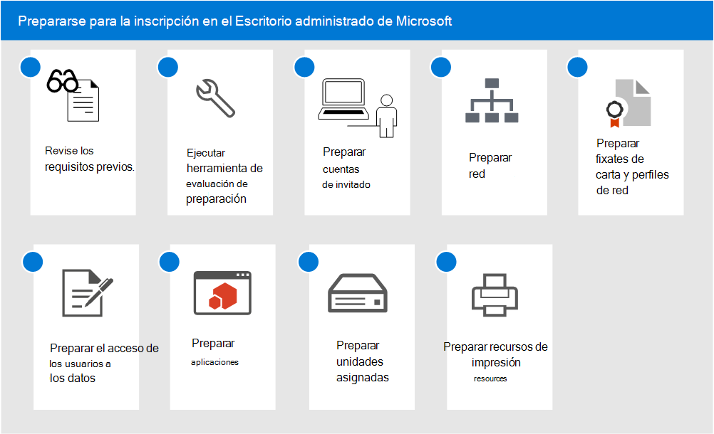

# Prepararse para la inscripción en el Escritorio administrado de MicrosoftGet ready for enrollment in Microsoft Managed Desktop

En estos temas, se describen los pasos necesarios que llevar a cabo en la organización para preparar la inscripción, incluida la comprobación de que su entorno cumple los requisitos previos clave, la configuración de redes, la configuración de certificados y la preparación de las aplicaciones para que se incluyan en el servicio.These topics describe the steps you'll need to take in your organization to prepare for enrollment, including checking that your environment meets key prerequisites, configuring networks, setting up certificates, and preparing your apps for inclusion in the service. Una vez que haya ejecutado las herramientas para evaluar la preparación, puede completar los demás pasos en cualquier orden o en paralelo.Once you have run the readiness assessment tools, you can complete the other steps in any order or in parallel. Dependiendo de su entorno, es posible que algunos de los pasos no sean relevantes para usted.Depending on your environment, some of the steps might not be relevant to you.

1. Revisar los [requisitos previos del Escritorio administrado de Microsoft](prerequisites.md)Review [prerequisites for Microsoft Managed Desktop](prerequisites.md).
2. Usar las [herramientas para evaluar la preparación](readiness-assessment-tool.md)Use [readiness assessment tools](readiness-assessment-tool.md).
3. [Requisitos previos para las cuentas de invitadoPrerequisites for guest accounts](guest-accounts.md)
4. [Configuración de red para el Escritorio administrado de MicrosoftNetwork configuration for Microsoft Managed Desktop](network.md)
5. [Preparar los certificados y los perfiles de red para el Escritorio administrado de MicrosoftPrepare certificates and network profiles for Microsoft Managed Desktop](certs-wifi-lan.md)
6. [Preparar el acceso a los recursos locales para el Escritorio administrado de MicrosoftPrepare on-premises resources access for Microsoft Managed Desktop](authentication.md)
7. [Aplicaciones en el Escritorio administrado de MicrosoftApps in Microsoft Managed Desktop](apps.md)
8. [Preparar unidades asignadas para el Escritorio administrado de MicrosoftPrepare mapped drives for Microsoft Managed Desktop](mapped-drives.md)
9. [Preparar recursos de impresión para el Escritorio administrado de MicrosoftPrepare printing resources for Microsoft Managed Desktop](printing.md)
