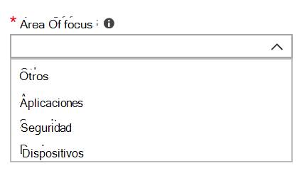

# Agregar y verificar los contactos de administración en el portal de administración

Hay varias maneras en que el Escritorio administrado de Microsoft se comunica con los clientes. Para simplificar la comunicación y asegurarnos de que estamos comprobando con las personas correctas, debe proporcionar un conjunto de contactos de administrador. Escritorio administrado de Microsoft Las operaciones de TI se pondrán en contacto con estas personas para obtener asistencia para solucionar problemas de su inquilino.

> [!IMPORTANT]
> Es posible que ya haya agregado estos contactos en el portal de administración. Si es así, tómese un momento para comprobar que la  lista de contactos es precisa, ya que Escritorio administrado de Microsoft debe poder comunicarse con ellos si se produce un incidente grave.

## Azure Active Directory acceso para el portal Escritorio administrado de Microsoft administración

Escritorio administrado de Microsoft El portal de administración requiere que las personas que tienen acceso al portal tengan uno de estos roles Azure Active Directory (AD):
- Administrador global
- Administrador de servicios de Intune
- Lector global
- Administrador de soporte técnico de servicio

El administrador global debe ser el que inscriba su organización en Escritorio administrado de Microsoft. Los cinco roles tienen el mismo acceso en el portal de administración para iniciar y ver tareas. Para obtener más información sobre cómo asignar estos roles en Azure AD, vea Permisos de roles de administrador [en Azure Active Directory](/azure/active-directory/users-groups-roles/directory-assign-admin-roles). 

## Áreas de contacto de administración de foco

Los contactos de administrador deben ser la mejor persona o grupo que pueda responder preguntas y tomar decisiones para diferentes áreas de enfoque. **Escritorio administrado de Microsoft Las operaciones se pondrán en contacto con estos contactos de administrador para obtener preguntas relacionadas con solicitudes de soporte técnico que el cliente ha presentado.** Estos contactos de administrador recibirán notificaciones de actualizaciones de solicitudes de soporte técnico y mensajes nuevos. Estas áreas incluyen:

Área de foco | Para preguntas sobre
--- | ---
Empaquetado de aplicaciones | Solución de problemas de empaquetado de aplicaciones
Dispositivos | Estado del dispositivo, solución de problemas con Escritorio administrado de Microsoft dispositivos
Seguridad | Solución de problemas de seguridad con Escritorio administrado de Microsoft dispositivos
Servicio de ayuda de IT | en los casos en que nuestro personal de soporte técnico entrega los vales de usuario fuera de Escritorio administrado de Microsoft áreas de soporte técnico 
Otros | Para problemas no cubiertos por otras áreas

**Quien elija para estos contactos debe tener el conocimiento y la autoridad para tomar decisiones para su entorno Escritorio administrado de Microsoft contactos.** Al incorporar el entorno Escritorio administrado de Microsoft, se le pedirá que agregue contactos para el departamento de soporte técnico y seguridad local. 

Los contactos de administrador son necesarios al [enviar una solicitud de soporte técnico.](../service-description/support.md) Tendrás que tener un contacto de administrador para el área de enfoque de la solicitud de soporte técnico. 

**Para agregar contactos de administrador**

1.  Inicie sesión en [Escritorio administrado de Microsoft de administración](https://aka.ms/mwaasportal). 

2.  En **Soporte** técnico, seleccione **Contactos de administrador**. 

    

3. Seleccione **Agregar**.

    

4.  Selecciona un **área de foco** y escribe la información del contacto. 

    

5. Repita cada área de foco. 

## Pasos para empezar con Escritorio administrado de Microsoft

1. Agregar y comprobar contactos de administrador en el portal de administración (este tema)
2. [Ajustar el acceso condicional](conditional-access.md)
3. [Asignar licencias](assign-licenses.md)
4. [Instalar el Portal de empresa de Intune en dispositivos](company-portal.md)
5. [Habilitar Enterprise State Roaming](enterprise-state-roaming.md)
6. [Configurar dispositivos del Escritorio administrado por Microsoft](set-up-devices.md)
7. [Prepare a los usuarios para que usen los dispositivos](get-started-devices.md)
8. [Implementar aplicaciones en dispositivos](deploy-apps.md)