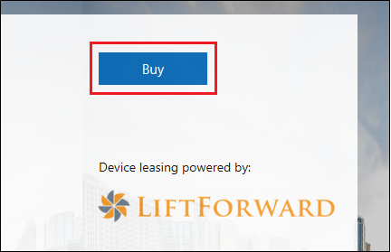

# Pedir dispositivos de escritorio administrados por MicrosoftOrder Microsoft Managed Desktop devices

Actualmente, Microsoft está experimentando una experiencia de compra a pequeña escala en Estados Unidos (EE. UU.), tal como se describe a continuación.Microsoft is currently piloting a small-scale shopping experience in the United States (US), as described below. Si está fuera de los Estados Unidos o el orden de los dispositivos es para más de 50 dispositivos, le recomendamos trabajar con uno de nuestros socios de dispositivo aprobados.If you’re outside of the US or your device order is for more than 50 devices, we recommend working with one of our approved device partners. Puede acceder a su contacto de la cuenta de Microsoft para obtener más ayuda para configurar una asociación de dispositivos.You can reach out to your Microsoft account contact for more help setting up a device partnership.

¿Cómo debo pedir los dispositivos para el escritorio administrado por Microsoft?How should I order devices for Microsoft Managed Desktop?

  |   
 --- | ---
Desde dentro de los Estados Unidos, ordenación de menos de 50 dispositivosFrom within the United States, ordering less than 50 devices | [Pedido desde el portal de administración de escritorio administrado de MicrosoftOrder from Microsoft Managed Desktop Admin portal](https://aka.ms/mmdportal)
Fuera de los Estados UnidosOutside of the United States | Póngase en contacto con su equipo de cuentas de MicrosoftContact your Microsoft Account team
Ordenación de más de 50 dispositivosOrdering more than 50 devices | Póngase en contacto con su equipo de cuentas de MicrosoftContact your Microsoft Account team

## Dispositivos de pedidoOrder devices
Siga estas instrucciones para pedir dispositivos en los Estados Unidos.Use these instructions to order devices in the United States. Comenzará en el portal de **Administración de escritorio administrado**de Microsoft, pero realizará las compras a través **de Microsoft Store para empresas**.You'll start in the Microsoft **Managed Desktop Admin portal**, but you'll make the purchases through **Microsoft Store for Business**. 

 **Para pedir dispositivos****To order devices**
 1. Iniciar sesión en el [portal de administración de escritorio administrado de Microsoft](https://aka.ms/mmdportal)Sign in to [Microsoft Managed Desktop Admin portal](https://aka.ms/mmdportal)
 2. En introducción, en pedir dispositivos, seleccione **Abrir Microsoft Store para empresas para pedir dispositivos**.On Getting Started, under Order Devices, select **Open Microsoft Store for Business to order devices**.
 
    
    
3. En Microsoft Store for Business, puede revisar la información sobre el escritorio administrado de Microsoft y un gráfico de comparación de los dispositivos disponibles.In Microsoft Store for Business, you can review info about Microsoft Managed Desktop and a comparison chart of the devices available. Haga clic en **comprar** para elegir un dispositivo.Click **Buy** to choose a device. 

    

4. Al **elegir el dispositivo**, selecciona el dispositivo que quieras.On **Pick your device**, select the device you want. 

    

5. En **elegir características del dispositivo**, seleccione un **plan de servicio**, escriba el número de dispositivos y, a continuación, haga clic en **Agregar al carro**.On **Choose device features**, select a **Service Plan**, type the number of devices, and then click **Add to Cart**.

6. Revise el carro y, a \*\*\*\* continuación, seleccione desprotección o **Agregar otro dispositivo**.Review your Cart and then select **Checkout**, or **Add another device**. 

7. Continúe el proceso de desprotección, revise los precios, acepte los términos de licencia y seleccione **firmar y realizar pedido**.Continue the checkout process, review your pricing, accept licensing terms, and select **Sign and Place Order**. 

Los dispositivos normalmente se distribuyen en tres días.Devices usually ship within three days. 

Cuando haya terminado de pedir dispositivos, puede comprobar los dispositivos que solicitó en el [portal de administración de escritorio administrado de Microsoft](https://aka.ms/mmdportal).When you're done ordering devices, you can check the devices you ordered in [Microsoft Managed Desktop Admin portal](https://aka.ms/mmdportal). En **inventario**, seleccione **dispositivos**.Under **Inventory**, select **Devices**. 

Cuando lleguen los dispositivos, distribúyalos a los empleados.When devices arrive, distribute them to your employees. No hay ninguna configuración adicional o se requiere configuración.There's no additional set up, or configuration required. 

