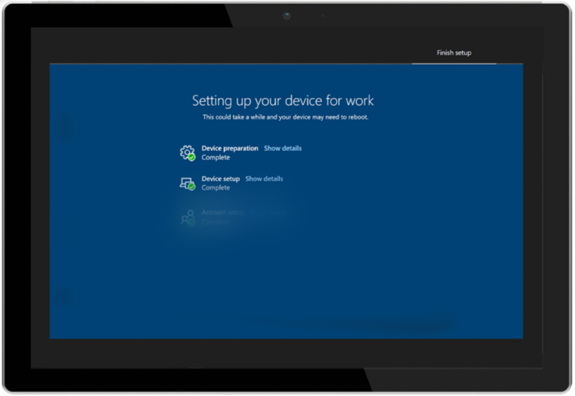

# Experiencia de primera ejecución con piloto automático y la página de estado de inscripción

Escritorio administrado de Microsoft usa [Windows Autopilot](https://docs.microsoft.com/windows/deployment/windows-autopilot/windows-autopilot) y la página de estado de inscripción [(ESP)](https://docs.microsoft.com/windows/deployment/windows-autopilot/enrollment-status) de Microsoft Intune para proporcionar la mejor experiencia de primera ejecución posible a los usuarios.

La página de estado de inscripción se encuentra actualmente en versión preliminar pública.

## Implementación inicial

Para proporcionar la experiencia ESP, debe registrar dispositivos en el servicio de escritorio administrado de Microsoft. Para obtener más información sobre el registro, consulte [Registrar nuevos dispositivos](../get-started/register-devices-self.md) usted mismo o [Pasos para que los asociados registren dispositivos.](../get-started/register-devices-partner.md)

Una vez que los dispositivos están registrados en el servicio, puede habilitar ESP para sus dispositivos de Escritorio administrado de Microsoft mediante la presentación de un vale de soporte técnico a través del [Portal de administración.](https://portal.azure.com/) Inicialmente, implementaremos la configuración esp en el grupo de prueba al presentar el vale. Se implementa en los otros grupos de implementación posteriores (First, Fast y Broad) cada 24 horas. Para pausar la implementación, file another ticket asking Operations to hold.

## Configuración de perfil de Autopilot

Escritorio administrado de Microsoft usa esta configuración en el perfil de Autopilot que se usa para los dispositivos de los usuarios:

|Setting  |Valor  |
|---------|---------|
|Modo de implementación |  Controlado por el usuario       |
|Unirse a Azure AD como     |  Unido a Azure AD       |
|Idioma (región)     | Configuración predeterminada del sistema operativo        |
|Configurar automáticamente el teclado     | No        |
|Términos de licencia del software de Microsoft     |  Ocultar       |
|Configuración de privacidad     | Ocultar        |
|Ocultar opciones de cambiar cuenta     | Show        |
|Tipo de cuenta de usuario     |  Estándar       |
|Permitir OOBE para el blanco     |  Sí       |
|Aplicar plantilla de nombre de dispositivo     | Sí        |
|Escribir un nombre     | MMD-%RAND:11%        |

> [!NOTE]
> Aunque el aprovisionamiento de "white glove" solo está habilitado para los clientes con ESP activado, actualmente no se admite en el Escritorio administrado de Microsoft.

## Configuración de la página de estado de inscripción

Escritorio administrado de Microsoft usa esta configuración para la experiencia de la página de estado de inscripción:

|Setting  |Valor  |
|---------|---------|
|Mostrar el progreso de la configuración de aplicaciones y perfiles     | Sí        |
|Mostrar un error cuando la instalación tarda más de un número de minutos especificado     |  60       |
|Mostrar mensaje personalizado cuando se produce un error de límite de tiempo     |  Sí       |
|Mensaje de error     | Sí, está tardando un poco más en configurar el dispositivo de lo esperado. Haga clic a continuación para empezar y finalizaremos la configuración en segundo plano        |
|Permitir a los usuarios recopilar registros sobre errores de instalación     |  Sí       |
|Mostrar solo la página a los dispositivos aprovisionados por la configuración personalizada (OOBE)     | Sí        |
|Bloquear el uso de dispositivos hasta que se instalen todas las aplicaciones y perfiles     |  Sí       |
|Permitir que los usuarios restablezcan el dispositivo si se produce un error de instalación     |  Sí       |
|Permitir a los usuarios usar el dispositivo si se produce un error de instalación     |  Sí       |
|Bloquear el uso del dispositivo hasta que se instalen estas aplicaciones necesarias si están asignadas al usuario o dispositivo.     |  Lugar de trabajo moderno: corrección de tiempo       |

La experiencia de la página de estado de inscripción se produce en tres fases. Para obtener más información, consulta [información de seguimiento de la página de estado de inscripción.](https://docs.microsoft.com/mem/intune/enrollment/windows-enrollment-status#enrollment-status-page-tracking-information)

La experiencia continúa de la siguiente manera:

1. Se inicia la experiencia de Autopilot y el usuario escribe sus credenciales.
2. El dispositivo abre la página de estado de inscripción y continúa con las fases preparación del dispositivo y configuración del dispositivo. El tercer paso (Configuración de la cuenta) se *omite actualmente* en la configuración de Escritorio administrado de Microsoft porque el usuario ESP está deshabilitado. El dispositivo se reinicia.
3. Después del reinicio, el dispositivo abre la página de inicio de sesión de Windows con **otro usuario.**
4. Los usuarios escriben sus credenciales de nuevo y se abre el escritorio.

> [!NOTE]
> Las aplicaciones de Win32 solo se implementan durante ESP si la versión de Windows 10 es 1903 o posterior.

## Aprovisionamiento de arena blanca

El Escritorio administrado de Microsoft no admite actualmente la característica "white glove" de Windows Autopilot.

## Cambiar a la configuración de Autopilot y la página de estado de inscripción

Si la configuración que usa el Escritorio administrado de Microsoft no coincide exactamente con sus necesidades, puede presentar un vale de soporte técnico a través del [Portal de administración.](https://portal.azure.com/) Estos son algunos ejemplos de los tipos de configuración que puede necesitar:

### Cambio de la configuración de Autopilot

Es posible que quieras solicitar una plantilla de nombre de dispositivo diferente. Sin embargo, no puede cambiar el modo de implementación, unirse a Azure AD As, la configuración de privacidad o el tipo de cuenta de usuario.

### Cambio en la configuración de la página de estado de inscripción

- Un número más largo de minutos para la opción "Mostrar un error cuando la instalación tarda más de un número especificado de minutos".
- El mensaje de error mostrado
- Agregar o quitar aplicaciones en la opción "Bloquear el uso de dispositivos hasta que se instalen estas aplicaciones necesarias si están asignadas al usuario o dispositivo".

## Aplicaciones necesarias

- Debe dirigirse a las aplicaciones de los grupos de *dispositivos* De prueba, Primero, Rápido y General de Modern Workplace. Las aplicaciones deben instalarse en el contexto "Sistema". Asegúrese de completar las pruebas con ESP en el grupo De prueba antes de asignarlas a todos los grupos.
- Ninguna aplicación debe requerir que el dispositivo se reinicie. Te recomendamos que las aplicaciones se establezcan en "No hacer nada" al compilar el paquete de la aplicación si requieren un reinicio.
- Limita las aplicaciones necesarias solo a las aplicaciones principales que un usuario necesita inmediatamente cuando inicia sesión en el dispositivo.
- Mantenga el tamaño total de todas las aplicaciones de forma colectiva por debajo de 1 GB para evitar tiempos de espera durante la fase de instalación de la aplicación.
- Lo ideal es que las aplicaciones no tengan dependencias. Si tiene aplicaciones que *deben tener* dependencias, asegúrese de configurarlas, probarlas y validarlas como parte de la evaluación esp.
- No se puede incluir ninguna aplicación que requiera el contexto de "usuario" (por ejemplo, Teams) en la versión preliminar pública de ESP.
