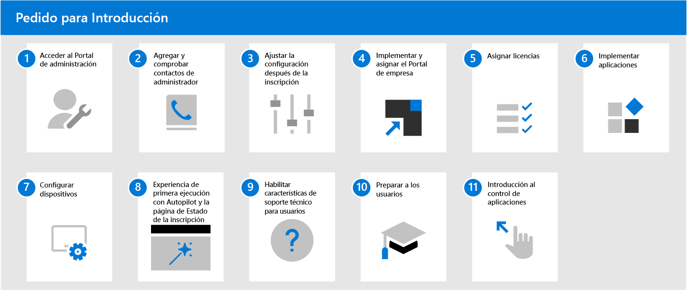

# Introducción al Escritorio administrado de Microsoft

Ahora qu está listo para inscribirse, abra [Microsoft Endpoint Manager](https://endpoint.microsoft.com/) y vaya a **Administración de espacio empresarial**. Seleccione **Inscripción de espacio empresarial** en la subsección **Escritorio administrado de Microsoft** y, a continuación, siga el asistente para inscribir su espacio empresarial en el Escritorio administrado de Microsoft.

> [!NOTE]
> Debe iniciar sesión como Administrador global para completar la inscripción. Para más información, consulte [acceder al portal de administrador](access-admin-portal.md).

Una vez finalizada la inscripción, siga los siguientes pasos para configurar el servicio. Este es el orden recomendado para seguir, pero tiene cierta flexibilidad en la secuencia.

 

1. Acceder al [portal de administrador](access-admin-portal.md).
1. [Agregar y verificar los contactos de administración en el portal de administrador](add-admin-contacts.md).
1. [Ajustar la configuración después de la inscripción](conditional-access.md).
1. Implementar y asignar el [Portal de empresa de Intune](company-portal.md).
1. [Asignar las licencias](assign-licenses.md).
1. [Implementar las aplicaciones](deploy-apps.md).
1. [Configurar los dispositivos](set-up-devices.md).
1. Configurar la [experiencia de primera ejecución con el Autopilot y la página de estado de inscripción](esp-first-run.md).
1. [Habilitar las características de soporte técnico para el usuario](enable-support.md).
1. [Preparar a los usuarios para que usen los dispositivos](get-started-devices.md).
1. [Comenzar a usar el control de aplicaciones](get-started-app-control.md).