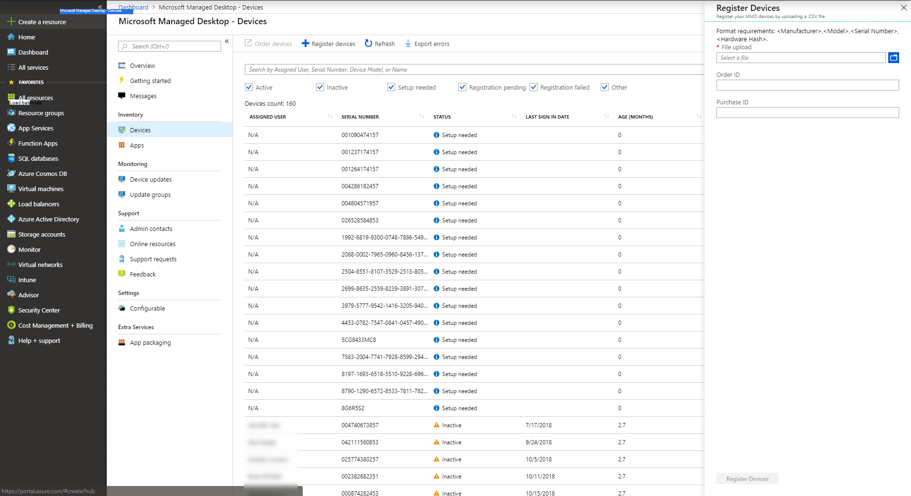

# <a name="register-new-devices-yourself"></a><span data-ttu-id="47d93-103">Registre nuevos dispositivos usted mismo</span><span class="sxs-lookup"><span data-stu-id="47d93-103">Register new devices yourself</span></span>

<span data-ttu-id="47d93-104">Microsoft Managed Desktop puede trabajar con dispositivos nuevos o puede volver a usar dispositivos que ya tiene (lo que requerirá que vuelva a crear imágenes).</span><span class="sxs-lookup"><span data-stu-id="47d93-104">Microsoft Managed Desktop can work with brand-new devices or you can re-use devices you might already have (which will require that you re-image them).</span></span> <span data-ttu-id="47d93-105">Puede registrar dispositivos mediante el portal de administración de escritorio administrado de Microsoft.</span><span class="sxs-lookup"><span data-stu-id="47d93-105">You can register devices by using the Microsoft Managed Desktop Admin Portal.</span></span>

> [!NOTE]
> <span data-ttu-id="47d93-106">¿Está trabajando con un partner para obtener dispositivos?</span><span class="sxs-lookup"><span data-stu-id="47d93-106">Working with a partner to obtain devices?</span></span> <span data-ttu-id="47d93-107">Si es así, no tiene que preocuparse por obtener los hash de hardware; se ocuparán de ello.</span><span class="sxs-lookup"><span data-stu-id="47d93-107">If so, you don't need to worry about getting the hardware hashes; they'll take care of that for you.</span></span> <span data-ttu-id="47d93-108">Asegúrese de que su compañero establece una relación con usted en el [centro de Partners](https://partner.microsoft.com/dashboard).</span><span class="sxs-lookup"><span data-stu-id="47d93-108">Make sure your partner establishes a relationship with you at the [Partner Center](https://partner.microsoft.com/dashboard).</span></span> <span data-ttu-id="47d93-109">Su socio puede obtener más información en [ayuda del centro de asociados](https://docs.microsoft.com/partner-center/request-a-relationship-with-a-customer).</span><span class="sxs-lookup"><span data-stu-id="47d93-109">Your partner can learn more at [Partner Center help](https://docs.microsoft.com/partner-center/request-a-relationship-with-a-customer).</span></span> <span data-ttu-id="47d93-110">Una vez que se ha establecido esta relación, el socio simplemente registrará los dispositivos en su nombre; no se requiere ninguna otra acción por parte del usuario.</span><span class="sxs-lookup"><span data-stu-id="47d93-110">Once this relationship established, your partner will simply register devices on your behalf – no further action required from you.</span></span> <span data-ttu-id="47d93-111">Si desea ver los detalles o su compañero tiene preguntas, consulte [pasos para que los partners registren dispositivos](register-devices-partner.md).</span><span class="sxs-lookup"><span data-stu-id="47d93-111">If you want to see the details, or your partner has questions, see [Steps for Partners to register devices](register-devices-partner.md).</span></span> <span data-ttu-id="47d93-112">Una vez que se hayan registrado los dispositivos, puede continuar con la [comprobación de la imagen](#check-the-image) y [la entrega de los dispositivos](#deliver-the-device) a los usuarios.</span><span class="sxs-lookup"><span data-stu-id="47d93-112">Once the devices are registered, you can proceed with [checking the image](#check-the-image) and [delivering the devices](#deliver-the-device) to your users.</span></span>

## <a name="prepare-to-register-brand-new-devices"></a><span data-ttu-id="47d93-113">Preparar el registro de nuevos dispositivos</span><span class="sxs-lookup"><span data-stu-id="47d93-113">Prepare to register brand-new devices</span></span>


<span data-ttu-id="47d93-114">Una vez que tenga a mano los nuevos dispositivos, siga estos pasos:</span><span class="sxs-lookup"><span data-stu-id="47d93-114">Once you have the new devices in hand, you'll follow these steps:</span></span>

1. [<span data-ttu-id="47d93-115">Obtenga el hash de hardware para cada dispositivo.</span><span class="sxs-lookup"><span data-stu-id="47d93-115">Obtain the hardware hash for each device.</span></span>](#obtain-the-hardware-hash)
2. [<span data-ttu-id="47d93-116">Combinar los datos hash</span><span class="sxs-lookup"><span data-stu-id="47d93-116">Merge the hash data</span></span>](#merge-hash-data)
3. <span data-ttu-id="47d93-117">[Registre los dispositivos en el escritorio administrado por Microsoft](#register-devices).</span><span class="sxs-lookup"><span data-stu-id="47d93-117">[Register the devices in Microsoft Managed Desktop](#register-devices).</span></span>
4. [<span data-ttu-id="47d93-118">Compruebe que la imagen es correcta.</span><span class="sxs-lookup"><span data-stu-id="47d93-118">Double-check that the image is correct.</span></span>](#check-the-image)
5. [<span data-ttu-id="47d93-119">Entregar el dispositivo</span><span class="sxs-lookup"><span data-stu-id="47d93-119">Deliver the device</span></span>](#deliver-the-device)

### <a name="obtain-the-hardware-hash"></a><span data-ttu-id="47d93-120">Obtener el hash de hardware</span><span class="sxs-lookup"><span data-stu-id="47d93-120">Obtain the hardware hash</span></span>

<span data-ttu-id="47d93-121">Microsoft Managed Desktop identifica cada dispositivo de manera única haciendo referencia a su hash de hardware.</span><span class="sxs-lookup"><span data-stu-id="47d93-121">Microsoft Managed Desktop identifies each device uniquely by referencing its hardware hash.</span></span> <span data-ttu-id="47d93-122">Tiene tres opciones para obtener esta información:</span><span class="sxs-lookup"><span data-stu-id="47d93-122">You have three options for getting this information:</span></span>

- <span data-ttu-id="47d93-123">Solicite al proveedor de OEM el archivo de registro de AutoPilot, que incluirá los hash de hardware.</span><span class="sxs-lookup"><span data-stu-id="47d93-123">Ask your OEM supplier for the AutoPilot registration file, which will include the hardware hashes.</span></span>
- <span data-ttu-id="47d93-124">Ejecute un [script de Windows PowerShell](#powershell-script-method) en cada dispositivo y recopile los resultados en un archivo.</span><span class="sxs-lookup"><span data-stu-id="47d93-124">Run a [Windows PowerShell script](#powershell-script-method) on each device and collect the results in a file.</span></span>
- <span data-ttu-id="47d93-125">Inicie cada dispositivo, pero no complete la experiencia del programa de instalación de Windows y [reúna los valores hash en una unidad Flash extraíble](#flash-drive-method).</span><span class="sxs-lookup"><span data-stu-id="47d93-125">Start each device--but don't complete the Windows setup experience--and [collect the hashes on a removable flash drive](#flash-drive-method).</span></span>

#### <a name="powershell-script-method"></a><span data-ttu-id="47d93-126">Método de script de PowerShell</span><span class="sxs-lookup"><span data-stu-id="47d93-126">PowerShell script method</span></span>

1.  <span data-ttu-id="47d93-127">Abra un símbolo del sistema de PowerShell con derechos administrativos.</span><span class="sxs-lookup"><span data-stu-id="47d93-127">Open a PowerShell prompt with administrative rights.</span></span>
2.  <span data-ttu-id="47d93-128">Realizar`Install-Script -Name Get-MMDRegistrationInfo`</span><span class="sxs-lookup"><span data-stu-id="47d93-128">Run `Install-Script -Name Get-MMDRegistrationInfo`</span></span>
3.  <span data-ttu-id="47d93-129">Realizar`powershell -ExecutionPolicy Unrestricted Get-MMDRegistrationInfo -OutputFile <path>\hardwarehash.csv`</span><span class="sxs-lookup"><span data-stu-id="47d93-129">Run `powershell -ExecutionPolicy Unrestricted Get-MMDRegistrationInfo -OutputFile <path>\hardwarehash.csv`</span></span>

#### <a name="flash-drive-method"></a><span data-ttu-id="47d93-130">Método Flash Drive</span><span class="sxs-lookup"><span data-stu-id="47d93-130">Flash drive method</span></span>

1. <span data-ttu-id="47d93-131">Inserte una unidad USB en un dispositivo que no sea el que está registrando.</span><span class="sxs-lookup"><span data-stu-id="47d93-131">On a device other than the one you're registering, insert a USB drive.</span></span>
2. <span data-ttu-id="47d93-132">Abra un símbolo del sistema de PowerShell con derechos administrativos.</span><span class="sxs-lookup"><span data-stu-id="47d93-132">Open a PowerShell prompt with administrative rights.</span></span>
3. <span data-ttu-id="47d93-133">Realizar`Save-Script -Name Get-MMDRegistrationInfo -Path <pathToUsb>`</span><span class="sxs-lookup"><span data-stu-id="47d93-133">Run `Save-Script -Name Get-MMDRegistrationInfo -Path <pathToUsb>`</span></span>
4. <span data-ttu-id="47d93-134">Activa el dispositivo que estás registrando, pero *no inicia la experiencia de instalación*.</span><span class="sxs-lookup"><span data-stu-id="47d93-134">Turn on the device you are registering, but *do not start the setup experience*.</span></span> <span data-ttu-id="47d93-135">Si inicia de forma accidental la experiencia del programa de instalación, tendrá que restablecer o volver a crear una imagen del dispositivo.</span><span class="sxs-lookup"><span data-stu-id="47d93-135">If you accidentally start the setup experience, you'll have to reset or reimage the device.</span></span>
5. <span data-ttu-id="47d93-136">Inserte la unidad USB y, a continuación, presione Mayús + F10.</span><span class="sxs-lookup"><span data-stu-id="47d93-136">Insert the USB drive, and then press SHIFT + F10.</span></span>
6. <span data-ttu-id="47d93-137">Abra un símbolo del sistema de PowerShell con derechos administrativos y, a continuación, ejecute `cd <pathToUsb>` .</span><span class="sxs-lookup"><span data-stu-id="47d93-137">Open a PowerShell prompt with administrative rights, and then run `cd <pathToUsb>`.</span></span>
7. <span data-ttu-id="47d93-138">Realizar`Set-ExecutionPolicy -ExecutionPolicy Unrestricted`</span><span class="sxs-lookup"><span data-stu-id="47d93-138">Run `Set-ExecutionPolicy -ExecutionPolicy Unrestricted`</span></span>
8. <span data-ttu-id="47d93-139">Realizar`.\Get-MMDRegistrationInfo -OutputFile <path>\hardwarehash.csv`</span><span class="sxs-lookup"><span data-stu-id="47d93-139">Run `.\Get-MMDRegistrationInfo -OutputFile <path>\hardwarehash.csv`</span></span>
9. <span data-ttu-id="47d93-140">Quite la unidad USB y, a continuación, apague el dispositivo ejecutando`shutdown -s -t 0`</span><span class="sxs-lookup"><span data-stu-id="47d93-140">Remove the USB drive, and then shut down the device by running `shutdown -s -t 0`</span></span>

>[!IMPORTANT]
><span data-ttu-id="47d93-141">No encienda el dispositivo de nuevo hasta que haya completado el registro para él.</span><span class="sxs-lookup"><span data-stu-id="47d93-141">Do not power on the device you are registering again until you've completed registration for it.</span></span> 


### <a name="merge-hash-data"></a><span data-ttu-id="47d93-142">Combinar datos hash</span><span class="sxs-lookup"><span data-stu-id="47d93-142">Merge hash data</span></span>

<span data-ttu-id="47d93-143">Necesitará tener los datos de los archivos CSV combinados en un único archivo para completar el registro.</span><span class="sxs-lookup"><span data-stu-id="47d93-143">You'll need to have the data in the CSV files combined into a single file to complete registration.</span></span> <span data-ttu-id="47d93-144">Este es un script de PowerShell de ejemplo para facilitar esta tarea:</span><span class="sxs-lookup"><span data-stu-id="47d93-144">Here's a sample PowerShell script to make this easy:</span></span>

`Import-CSV -Path (Get-ChildItem -Filter *.csv) | ConvertTo-Csv -NoTypeInformation | % {$_.Replace('"', '')} | Out-File .\aggregatedDevices.csv`
### <a name="register-devices"></a><span data-ttu-id="47d93-145">Registrar dispositivos</span><span class="sxs-lookup"><span data-stu-id="47d93-145">Register devices</span></span>

<span data-ttu-id="47d93-146">El archivo CSV debe tener un formato en particular para el registro.</span><span class="sxs-lookup"><span data-stu-id="47d93-146">The CSV file must be in a particular format for registration.</span></span> <span data-ttu-id="47d93-147">Si ha recopilado los datos personalmente en los pasos anteriores, el archivo ya debe estar en el formato correcto; Si obtiene el archivo de un proveedor, es posible que deba ajustar el formato.</span><span class="sxs-lookup"><span data-stu-id="47d93-147">If you collected the data yourself in the previous steps, the file should already be in the right format; if you obtain the file from a supplier, you might need to adjust the format.</span></span>

>[!NOTE]
><span data-ttu-id="47d93-148">Para su comodidad, puede descargar un [archivo CSV de muestra](https://github.com/MicrosoftDocs/microsoft-365-docs/raw/public/microsoft-365/managed-desktop/get-started/downloads/device-registration-sample-self.csv).</span><span class="sxs-lookup"><span data-stu-id="47d93-148">For your convenience, you can download a [sample CSV file](https://github.com/MicrosoftDocs/microsoft-365-docs/raw/public/microsoft-365/managed-desktop/get-started/downloads/device-registration-sample-self.csv).</span></span>

<span data-ttu-id="47d93-149">El archivo tiene que incluir **exactamente los mismos encabezados de columna** que el ejemplo uno (fabricante, modelo, etc.), pero sus propios datos para las otras filas.</span><span class="sxs-lookup"><span data-stu-id="47d93-149">Your file needs to include the **exact same column headings** as the sample one (Manufacturer, Model, etc.), but your own data for the other rows.</span></span> <span data-ttu-id="47d93-150">Si usa la plantilla, ábrala en una herramienta de edición de texto como el Bloc de notas y considere la posibilidad de dejar sólo todos los datos de la fila 1, introduciendo solo los datos en las filas 2 y anteriores.</span><span class="sxs-lookup"><span data-stu-id="47d93-150">If you use the template, open it in a text editing tool such as Notepad, and consider leaving all the data in row 1 alone, only entering data in rows 2 and below.</span></span> 
    
  ```
 Manufacturer,Model,Serial Number,Hardware Hash
  SpiralOrbit,ContosoABC,000000000000,dGhpc2RldmljZWlzYW5tbWRkZXZpY2U
  
  
  ```

>[!NOTE]
><span data-ttu-id="47d93-151">Si olvida cambiar alguno de los datos de muestra, se producirá un error en el registro.</span><span class="sxs-lookup"><span data-stu-id="47d93-151">If you forget to change any of the sample data, registration will fail.</span></span>

#### <a name="register-devices-by-using-the-admin-portal"></a><span data-ttu-id="47d93-152">Registrar dispositivos mediante el portal de administración</span><span class="sxs-lookup"><span data-stu-id="47d93-152">Register devices by using the Admin Portal</span></span>

<span data-ttu-id="47d93-153">En el [portal de administración](https://aka.ms/mmdportal)de escritorio administrado de Microsoft, seleccione **dispositivos** en el panel de navegación izquierdo.</span><span class="sxs-lookup"><span data-stu-id="47d93-153">From the Microsoft Managed Desktop [Admin Portal](https://aka.ms/mmdportal), select **Devices** in the left navigation pane.</span></span> <span data-ttu-id="47d93-154">Seleccione **+ registrar dispositivos**; se abre el repaso:</span><span class="sxs-lookup"><span data-stu-id="47d93-154">Select **+ Register devices**; the fly-in opens:</span></span>

<span data-ttu-id="47d93-155">[](../../media/register-devices-flyin-sterile.png)</span><span class="sxs-lookup"><span data-stu-id="47d93-155">[](../../media/register-devices-flyin-sterile.png)</span></span>


[//]: # (Por desgracia, esto no es cierto. Podemos quitar esta nota, pero dejarla ahora hasta que podamos conversar sobre ella.)

<!--Registering any existing devices with Managed Desktop will completely re-image them; make sure you've backed up any important data prior to starting the registration process.-->


<span data-ttu-id="47d93-157">Siga estos pasos:</span><span class="sxs-lookup"><span data-stu-id="47d93-157">Follow these steps:</span></span>

1. <span data-ttu-id="47d93-158">En **carga de archivos**, especifique una ruta de acceso al archivo CSV que creó anteriormente.</span><span class="sxs-lookup"><span data-stu-id="47d93-158">In **File upload**, provide a path to the CSV file you created previously.</span></span>
2. <span data-ttu-id="47d93-159">Opcionalmente, puede Agregar un identificador de **pedido** o un **identificador de compra** para sus propios fines de seguimiento.</span><span class="sxs-lookup"><span data-stu-id="47d93-159">Optionally, you can add an **Order ID** or **Purchase ID** for your own tracking purposes.</span></span> <span data-ttu-id="47d93-160">No hay ningún requisito de formato para estos valores.</span><span class="sxs-lookup"><span data-stu-id="47d93-160">There are no format requirements for these values.</span></span>
3. <span data-ttu-id="47d93-161">Seleccione **registrar dispositivos**.</span><span class="sxs-lookup"><span data-stu-id="47d93-161">Select **Register devices**.</span></span> <span data-ttu-id="47d93-162">El sistema agregará los dispositivos a la lista de dispositivos en la **hoja dispositivos**, marcada como **pendiente de registro**.</span><span class="sxs-lookup"><span data-stu-id="47d93-162">The system will add the devices to your list of devices on the **Devices blade**, marked as **Registration Pending**.</span></span> <span data-ttu-id="47d93-163">El registro suele tardar menos de 10 minutos y, cuando se ejecuta correctamente, el dispositivo se muestra como **listo para el usuario** significa que está listo y esperando a que un usuario final empiece a usar.</span><span class="sxs-lookup"><span data-stu-id="47d93-163">Registration typically takes less than 10 minutes, and when successful the device will show as **Ready for user** meaning it's ready and waiting for an end-user to start using.</span></span>


<span data-ttu-id="47d93-164">Puede supervisar el progreso del registro de dispositivos en la Página principal de **Microsoft administrada para equipos de escritorio** .</span><span class="sxs-lookup"><span data-stu-id="47d93-164">You can monitor the progress of device registration on the main **Microsoft Managed Desktop - Devices** page.</span></span> <span data-ttu-id="47d93-165">Los posibles Estados que se notifican incluyen:</span><span class="sxs-lookup"><span data-stu-id="47d93-165">Possible states reported there include:</span></span>

| <span data-ttu-id="47d93-166">State</span><span class="sxs-lookup"><span data-stu-id="47d93-166">State</span></span> | <span data-ttu-id="47d93-167">Descripción</span><span class="sxs-lookup"><span data-stu-id="47d93-167">Description</span></span> |
|---------------|-------------|
| <span data-ttu-id="47d93-168">Registro pendiente</span><span class="sxs-lookup"><span data-stu-id="47d93-168">Registration pending</span></span> | <span data-ttu-id="47d93-169">Aún no se ha realizado el registro.</span><span class="sxs-lookup"><span data-stu-id="47d93-169">Registration is not done yet.</span></span> <span data-ttu-id="47d93-170">Vuelva a comprobarla más tarde.</span><span class="sxs-lookup"><span data-stu-id="47d93-170">Check back later.</span></span> |
| <span data-ttu-id="47d93-171">Error en el registro</span><span class="sxs-lookup"><span data-stu-id="47d93-171">Registration failed</span></span> | <span data-ttu-id="47d93-172">No se pudo completar el registro.</span><span class="sxs-lookup"><span data-stu-id="47d93-172">Registration could not be completed.</span></span> <span data-ttu-id="47d93-173">Consulte [solución de problemas del registro de dispositivos](#troubleshooting-device-registration) para obtener más información.</span><span class="sxs-lookup"><span data-stu-id="47d93-173">Refer to [Troubleshooting device registration](#troubleshooting-device-registration) for more information.</span></span> |
| <span data-ttu-id="47d93-174">Listo para el usuario</span><span class="sxs-lookup"><span data-stu-id="47d93-174">Ready for user</span></span> | <span data-ttu-id="47d93-175">El registro se realizó correctamente y el dispositivo ya está listo para entregarse al usuario final.</span><span class="sxs-lookup"><span data-stu-id="47d93-175">Registration succeeded and the device is now ready to be delivered to the end user.</span></span> <span data-ttu-id="47d93-176">El escritorio administrado de Microsoft los guiará a través de la primera configuración, por lo que no es necesario que realice ninguna preparación adicional.</span><span class="sxs-lookup"><span data-stu-id="47d93-176">Microsoft Managed Desktop will guide them through first time set-up, so there’s no need for you to do any further preparations.</span></span> |
| <span data-ttu-id="47d93-177">Activo</span><span class="sxs-lookup"><span data-stu-id="47d93-177">Active</span></span> | <span data-ttu-id="47d93-178">El dispositivo se entregó al usuario final y se registró en su espacio empresarial.</span><span class="sxs-lookup"><span data-stu-id="47d93-178">The device has been delivered to the end user and they have registered with your tenant.</span></span> <span data-ttu-id="47d93-179">Esto también indica que los usuarios usan el dispositivo con regularidad.</span><span class="sxs-lookup"><span data-stu-id="47d93-179">This also indicates that they are regularly using the device.</span></span> |
| <span data-ttu-id="47d93-180">Inactivo</span><span class="sxs-lookup"><span data-stu-id="47d93-180">Inactive</span></span> | <span data-ttu-id="47d93-181">El dispositivo se entregó al usuario final y se registró en su espacio empresarial.</span><span class="sxs-lookup"><span data-stu-id="47d93-181">The device has been delivered to the end user and they have registered with your tenant.</span></span> <span data-ttu-id="47d93-182">Sin embargo, no han usado el dispositivo recientemente (en los últimos 7 días).</span><span class="sxs-lookup"><span data-stu-id="47d93-182">However, they have not used the device recently (in the last 7 days).</span></span>  | 

#### <a name="troubleshooting-device-registration"></a><span data-ttu-id="47d93-183">Solución de problemas de registro de dispositivos</span><span class="sxs-lookup"><span data-stu-id="47d93-183">Troubleshooting device registration</span></span>

| <span data-ttu-id="47d93-184">Mensaje de error</span><span class="sxs-lookup"><span data-stu-id="47d93-184">Error message</span></span> | <span data-ttu-id="47d93-185">Detalles</span><span class="sxs-lookup"><span data-stu-id="47d93-185">Details</span></span> |
|---------------|-------------|
| <span data-ttu-id="47d93-186">No se encontró el dispositivo</span><span class="sxs-lookup"><span data-stu-id="47d93-186">Device not found</span></span> | <span data-ttu-id="47d93-187">No pudimos registrar este dispositivo porque no encontramos una coincidencia para el fabricante, modelo o número de serie que se ha proporcionado.</span><span class="sxs-lookup"><span data-stu-id="47d93-187">We couldn’t register this device because we could not find a match for the provided manufacturer, model, or serial number.</span></span> <span data-ttu-id="47d93-188">Confirma estos valores con el proveedor del dispositivo.</span><span class="sxs-lookup"><span data-stu-id="47d93-188">Confirm these values with your device supplier.</span></span> |
| <span data-ttu-id="47d93-189">Hash de hardware no válido</span><span class="sxs-lookup"><span data-stu-id="47d93-189">Hardware hash not valid</span></span> | <span data-ttu-id="47d93-190">El hash de hardware que ha proporcionado para este dispositivo no tiene el formato correcto.</span><span class="sxs-lookup"><span data-stu-id="47d93-190">The hardware hash you provided for this device was not formatted correctly.</span></span> <span data-ttu-id="47d93-191">Compruebe el hash de hardware y vuelva a enviarlo.</span><span class="sxs-lookup"><span data-stu-id="47d93-191">Double-check the hardware hash and then resubmit.</span></span> |
| <span data-ttu-id="47d93-192">El dispositivo ya está registrado</span><span class="sxs-lookup"><span data-stu-id="47d93-192">Device already registered</span></span> | <span data-ttu-id="47d93-193">Este dispositivo ya está registrado en su organización.</span><span class="sxs-lookup"><span data-stu-id="47d93-193">This device is already registered to your organization.</span></span> <span data-ttu-id="47d93-194">No se requiere ninguna otra acción.</span><span class="sxs-lookup"><span data-stu-id="47d93-194">No further action required.</span></span> |
| <span data-ttu-id="47d93-195">Dispositivo reclamado por otra organización</span><span class="sxs-lookup"><span data-stu-id="47d93-195">Device claimed by another organization</span></span> | <span data-ttu-id="47d93-196">Este dispositivo ya ha sido reclamado por otra organización.</span><span class="sxs-lookup"><span data-stu-id="47d93-196">This device has already been claimed by another organization.</span></span> <span data-ttu-id="47d93-197">Consulta con el proveedor del dispositivo.</span><span class="sxs-lookup"><span data-stu-id="47d93-197">Check with your device supplier.</span></span> |
| <span data-ttu-id="47d93-198">Error inesperado</span><span class="sxs-lookup"><span data-stu-id="47d93-198">Unexpected error</span></span> | <span data-ttu-id="47d93-199">La solicitud no se pudo procesar automáticamente.</span><span class="sxs-lookup"><span data-stu-id="47d93-199">Your request could not be automatically processed.</span></span> <span data-ttu-id="47d93-200">Póngase en contacto con el soporte técnico y proporcione el identificador de solicitud:<requestId></span><span class="sxs-lookup"><span data-stu-id="47d93-200">Contact Support and provide the Request ID: <requestId></span></span> |

### <a name="check-the-image"></a><span data-ttu-id="47d93-201">Comprobar la imagen</span><span class="sxs-lookup"><span data-stu-id="47d93-201">Check the image</span></span>

<span data-ttu-id="47d93-202">Si el dispositivo proviene de un proveedor de asociados de escritorio administrado por Microsoft, la imagen debe ser correcta.</span><span class="sxs-lookup"><span data-stu-id="47d93-202">If your device has come from a Microsoft Managed Desktop partner supplier, the image should be correct.</span></span>

<span data-ttu-id="47d93-203">También tiene la bienvenida de aplicar la imagen por su cuenta si lo prefiere.</span><span class="sxs-lookup"><span data-stu-id="47d93-203">You’re also welcome to apply the image on your own if you prefer.</span></span> <span data-ttu-id="47d93-204">Para empezar, póngase en contacto con el representante de Microsoft con el que está trabajando y le proporcionará la ubicación y los pasos para aplicar la imagen.</span><span class="sxs-lookup"><span data-stu-id="47d93-204">To get started, contact the Microsoft representative you’re working with and they will provide you the location and steps for applying the image.</span></span>

### <a name="deliver-the-device"></a><span data-ttu-id="47d93-205">Entregar el dispositivo</span><span class="sxs-lookup"><span data-stu-id="47d93-205">Deliver the device</span></span>

> [!IMPORTANT]
> <span data-ttu-id="47d93-206">Antes de entregar el dispositivo al usuario, asegúrese de que ha obtenido y aplicado las [licencias adecuadas](../get-ready/prerequisites.md) para ese usuario.</span><span class="sxs-lookup"><span data-stu-id="47d93-206">Before you hand off the device to your user, make sure you have obtained and applied the [appropriate licenses](../get-ready/prerequisites.md) for that user.</span></span>

<span data-ttu-id="47d93-207">Si se aplican todas las licencias, puede preparar a los [usuarios para que usen dispositivos](get-started-devices.md)y, a continuación, el usuario puede iniciar el dispositivo y continuar con la experiencia del programa de instalación de Windows.</span><span class="sxs-lookup"><span data-stu-id="47d93-207">If all the licenses are applied, you can [get your users ready to use devices](get-started-devices.md), and then your user can start up the device and proceed through the Windows setup experience.</span></span>


