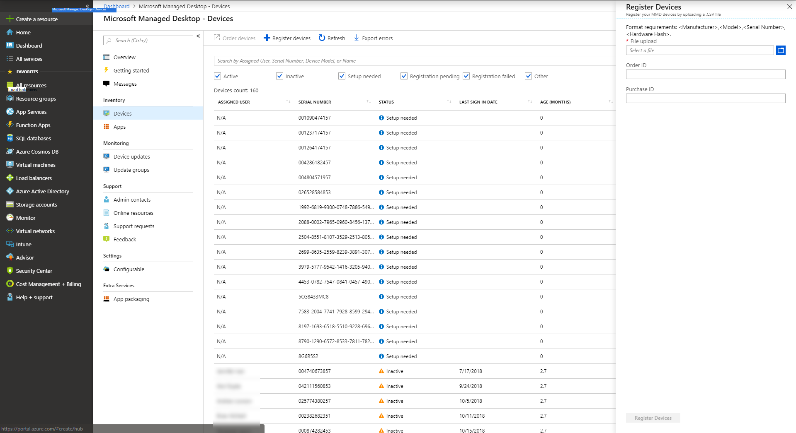

# <a name="register-existing-devices-yourself"></a>Registre dispositivos existentes usted mismo

>[!NOTE]
>En este tema se describen los pasos necesarios para volver a usar dispositivos que ya tiene y registrarlos en el escritorio administrado de Microsoft. Si está trabajando con dispositivos nuevos, siga los pasos descritos en [registrar los nuevos dispositivos en el escritorio administrado de Microsoft en](register-devices-self.md) su lugar.

El proceso para socios se documenta en [pasos para que los partners registren dispositivos](register-devices-partner.md).

Microsoft Managed Desktop puede trabajar con dispositivos nuevos o puede volver a usar dispositivos que ya tiene (lo que requerirá que vuelva a crear imágenes). Puede registrar dispositivos con Microsoft Managed Desktop en el portal de Azure.

## <a name="prepare-to-register-existing-devices"></a>Preparar el registro de los dispositivos existentes


Para registrar los dispositivos existentes, siga estos pasos:

1. [Obtenga el hash de hardware para cada dispositivo.](#obtain-the-hardware-hash)
2. [Combinar los datos hash](#merge-hash-data)
3. [Registre los dispositivos en el escritorio administrado por Microsoft](#register-devices).
4. [Compruebe que la imagen es correcta.](#check-the-image)
5. [Entregar el dispositivo](#deliver-the-device)

### <a name="obtain-the-hardware-hash"></a>Obtener el hash de hardware

Microsoft Managed Desktop identifica cada dispositivo de manera única haciendo referencia a su hash de hardware. Tiene cuatro opciones para obtener esta información de los dispositivos que ya está usando:

- Solicite al proveedor de OEM el archivo de registro de AutoPilot, que incluirá los hash de hardware.
- Cree un informe personalizado en el [Administrador de configuración](#configuration-manager).
- Ejecute un script de Windows PowerShell, ya sea mediante [Active](#active-directory-powershell-script-method) Directory o [manualmente](#manual-powershell-script-method) en cada dispositivo, y recopile los resultados en un archivo.
- Inicie cada dispositivo, pero no complete la experiencia del programa de instalación de Windows y [reúna los valores hash en una unidad Flash extraíble](#flash-drive-method).

#### <a name="configuration-manager"></a>Configuration Manager

Puede usar el administrador de configuración de Microsoft Endpoint para recopilar los hash de hardware de los dispositivos existentes que desee registrar con el escritorio administrado de Microsoft.

> [!IMPORTANT]
> Los dispositivos para los que quiera obtener esta información deben ejecutar Windows 10, versión 1703 o posterior. También necesitará un dispositivo que sea un cliente de Configuration Manager conectado al sitio del administrador de configuración (rama actual). También necesita el rol de sistema del sitio del punto de informe configurado en su entorno con SQL Server Reporting Services habilitado. 

Si ha cumplido todos estos requisitos previos, estará listo para recopilar la información siguiendo estos pasos:

1. En la consola de Configuration Manager, seleccione **supervisión**. 
2. En el área de trabajo supervisión, expanda **informes**y, a continuación, seleccione **informes**. 
3. En la pestaña **Inicio** , en la sección **crear** , seleccione **crear informe** para abrir el asistente crear informe. 
4. En la página de **información** , establezca estas opciones de configuración: 
    - **Name:** Especifique un nombre para el informe. 
    - **Descripción:** Especifique una descripción para el informe. 
    - **Servidor:** Muestra el nombre del servidor de informes en el que se va a crear este informe. 
    - **Ruta de acceso:** Seleccione **examinar** para especificar una carpeta en la que desea almacenar el informe. 
5. Seleccione **Siguiente**. 
6. En la página **Resumen** , revise la configuración. Seleccione **anterior** para cambiar la configuración o seleccione **siguiente** para crear el informe en Configuration Manager. 
7. En la página **finalización** , seleccione **cerrar** para salir del asistente y abrir **Report Builder** para especificar la configuración del informe. Escriba la cuenta de usuario y la contraseña si se le piden y, a continuación, seleccione **Aceptar.** Si el generador de informes no está instalado en el dispositivo, se le pedirá que lo instale. Seleccione **ejecutar para instalar Report Builder**, que es necesario para modificar y crear informes. 


**En el generador de informes de Microsoft**, proporcione la instrucción SQL para el informe y siga estos pasos:

1. En el panel izquierdo, seleccione **conjuntos de valores**y, a continuación, haga clic con el botón secundario para **Agregar DataSet**.
2. Vaya a la pestaña **consulta** y, a continuación, escriba el nombre como *DataSet0*. 
3. Seleccione **usar un conjunto de un objeto incrustado en el informe**; Se abrirá el generador de informes.
4. En el **generador de informes**, seleccione origen de **datos:**. Seleccione el origen de datos predeterminado, que debe empezar por "AutoGen". 
5. Elija **tipo de consulta como texto**y, a continuación, escriba esta consulta:


```sql
SELECT comp.manufacturer0      AS Manufacturer,  
       comp.model0             AS Model,  
       bios.serialnumber0      AS Serial_Number,  
       mdm.devicehardwaredata0 AS HardwareHash  
FROM   Fn_rbac_gs_computer_system(@UserSIDs) comp

       INNER JOIN Fn_rbac_gs_pc_bios(@UserSIDs) bios  
               ON comp.resourceid = bios.resourceid  
       INNER JOIN Fn_rbac_gs_mdm_devdetail_ext01(@UserSIDs) mdm  
               ON comp.resourceid = mdm.resourceid
```


5. Desplácese a la pestaña **campo** , wehre valores para **el nombre de campo** y el origen de **campo** ya deben rellenarse. Si no son, seleccione **Agregar**y, a continuación, seleccione **campo de consulta**. Escriba el **nombre del campo** y el **origen del campo**.
6. Repita este procedimiento para cada uno de estos valores: 
    - Manufacturer 
    - Model 
    - Serial_Number 
    - HardwareHash
7. Seleccione **Aceptar**.

A **continuación, defina la visualización del informe y cree el informe** siguiendo estos pasos:

1. Seleccione **tabla o matriz**; se abrirá un nuevo asistente.
2. En **elegir un conjunto**de recursos, seleccione **elegir un conjunto de recursos existente en este informe o un conjunto de recursos compartido**.  
3. Seleccione **DataSet0** (opción predeterminada) y, a continuación, seleccione **siguiente**.
4. Arrastre **fabricante**, **modelo**y **número de serie** en el cuadro **grupos de filas** . Arrastre **HardwareHash** hasta el cuadro **valores** y, a continuación, seleccione **siguiente**.
5. Desactive las casillas de verificación **Mostrar subtotales y totales generales** y **expandir o contraer grupos**. Seleccione **Siguiente**.
6. Seleccione **Finalizar**.
7. Seleccione **Ejecutar** para ejecutar el informe. Compruebe que el informe proporciona la información que espera. Si es necesario, seleccione **diseño** para volver a la vista Diseño y modificar el informe.
8. Seleccione **Guardar** para guardar el informe en el servidor de informes. Puede ejecutar el nuevo informe en el nodo informes en el área de trabajo supervisión. 

**Por último, exporte el informe y úselo para registrar dispositivos** siguiendo estos pasos. (Solo debe seguir los pasos 1 y 2 de esta sección si ha navegado fuera de los pasos anteriores):

1. En la consola de Configuration Manager, seleccione **supervisión**.
2. En **supervisión**, expanda **informes**y, a continuación, seleccione **informes**.
3. Busque el informe con el nombre que creó anteriormente.
4. Haga clic con el botón derecho en este informe y seleccione **Ejecutar**.
5. En el cuadro de diálogo que se abre, seleccione **exportar** y, a continuación, seleccione **Guardar como CSV**.
6. Esta versión del informe extrae los hash de todos los dispositivos con Windows 10 con los que se comunica Configuration Manager. Tendrá que filtrar los resultados solo para los dispositivos que planea registrar con el escritorio administrado de Microsoft.


> [!IMPORTANT]
> La consulta en Configuration Manager no permite espacios en los nombres de columna exportados; por este motivo, los pasos que ha escrito son "Serial_Number" y "HardwareHash". Ahora que ya tiene el archivo CSV exportado, debe editar los encabezados del informe para leer el *número de serie* y el *hash de hardware* , tal y como se muestra aquí antes de continuar con el registro de dispositivos.

Ahora puede seguir [registrando dispositivos con Azure portal](#register-devices-by-using-the-azure-portal).


#### <a name="active-directory-powershell-script-method"></a>Método de script de PowerShell de Active Directory

En un entorno de Active Directory, puede usar el `Get-MMDRegistrationInfo` cmdlet de PowerShell para recopilar de forma remota la información de los dispositivos de los grupos de Active Directory mediante WinRM. También puede usar el `Get-AD Computer` cmdlet y obtener resultados filtrados para los nombres de modelo de hardware específicos incluidos en el catálogo. Para ello, primero confirme estos requisitos previos y, a continuación, siga los pasos:

- WinRM está habilitado.
- Los dispositivos que desea registrar están activos en la red (es decir, no están desconectados ni desactivados).
- Asegúrese de que tiene un parámetro de credencial de dominio con permiso para ejecutar de forma remota en los dispositivos.
- Asegúrese de que el Firewall de Windows permite el acceso a WMI. Para ello, siga estos pasos:
    1. Abra el panel de control del **firewall de Windows Defender** y seleccione **permitir una aplicación o una característica a través de Firewall de Windows Defender**.
    2. Buscar **instrumental de administración de Windows (WMI)** en la lista, habilitar para **privado y público**y, a continuación, seleccione **Aceptar**.

1.  Abra un símbolo del sistema de PowerShell con derechos administrativos.
2.  Ejecute *alguno de estos* scripts:
```powershell
Install-script -name Get-MMDRegistrationInfo 
#example one – leverage Get-ADComputer to enumerate devices 
Get-ADComputer -filter * | powershell -ExecutionPolicy Unrestricted Get-MMDRegistrationInfo.ps1 -credential Domainname\<accountname>
```
```powershell 
#example two – target specific devices: 
Set-ExecutionPolicy powershell -ExecutionPolicy Unrestricted Get-MMDRegistrationInfo.ps1 -credential Domainname\<accountname> -Name Machine1,Machine2,Machine3
```
3. Obtenga acceso a los directorios en los que haya entradas para los dispositivos. Quite las entradas de *todos los dispositivos de todos los* directorios, incluidos los servicios de dominio de Active Directory de Windows Server y Azure Active Directory. Tenga en cuenta que esta eliminación puede tardar varias horas en procesarse por completo.
4. Acceso a servicios de administración donde es posible que haya entradas para los dispositivos. Quite las entradas de *todos los dispositivos de todos los* servicios de administración, incluidos Microsoft Endpoint Configuration Manager, Microsoft Intune y Windows AutoPilot. Tenga en cuenta que esta eliminación puede tardar varias horas en procesarse por completo.

Ahora puede seguir [registrando dispositivos](#register-devices).

#### <a name="manual-powershell-script-method"></a>Método de script de PowerShell manual

1.  Abra un símbolo del sistema de PowerShell con derechos administrativos.
2.  Realizar`Install-Script -Name Get-MMDRegistrationInfo`
3.  Realizar`powershell -ExecutionPolicy Unrestricted Get-MMDRegistrationInfo -OutputFile <path>\hardwarehash.csv`
4. [Combinar los datos hash.](#merge-hash-data)

#### <a name="flash-drive-method"></a>Método Flash Drive

1. Inserte una unidad USB en un dispositivo que no sea el que está registrando.
2. Abra un símbolo del sistema de PowerShell con derechos administrativos.
3. Realizar`Save-Script -Name Get-MMDRegistrationInfo -Path <pathToUsb>`
4. Activa el dispositivo que estás registrando, pero *no inicia la experiencia de instalación*. Si inicia de forma accidental la experiencia del programa de instalación, tendrá que restablecer o volver a crear una imagen del dispositivo.
5. Inserte la unidad USB y, a continuación, presione Mayús + F10.
6. Abra un símbolo del sistema de PowerShell con derechos administrativos y `cd <pathToUsb>`, a continuación, ejecute.
7. Realizar`Set-ExecutionPolicy -ExecutionPolicy Unrestricted`
8. Realizar`.\Get-MMDRegistrationInfo -OutputFile <path>\hardwarehash.csv`
9. Quite la unidad USB y, a continuación, apague el dispositivo ejecutando`shutdown -s -t 0`
10. [Combinar los datos hash.](#merge-hash-data)

>[!IMPORTANT]
>No encienda el dispositivo de nuevo hasta que haya completado el registro para él. 


### <a name="merge-hash-data"></a>Combinar datos hash

Si ha recopilado los datos de hash de hardware mediante los métodos manuales de la unidad de disco o de PowerShell, ahora debe tener los datos en los archivos CSV combinados en un único archivo para completar el registro. Este es un script de PowerShell de ejemplo para facilitar esta tarea:

`Import-CSV -Path (Get-ChildItem -Filter *.csv) | ConvertTo-Csv -NoTypeInformation | % {$_.Replace('"', '')} | Out-File .\aggregatedDevices.csv`

Una vez que los datos de hash se combinan en un archivo CSV, ahora puede continuar con [el registro de los dispositivos](#register-devices).

### <a name="register-devices"></a>Registrar dispositivos

El archivo CSV debe tener un formato en particular para el registro. Si ha recopilado los datos personalmente en los pasos anteriores, el archivo ya debe estar en el formato correcto; Si obtiene el archivo de un proveedor, es posible que deba ajustar el formato.

>[!NOTE]
>Para su comodidad, puede descargar una [plantilla](https://github.com/MicrosoftDocs/microsoft-365-docs/raw/public/microsoft-365/managed-desktop/get-started/downloads/device-registration-sample-partner.xlsx) para este archivo CSV.

El archivo tiene que incluir **exactamente los mismos encabezados de columna** que el ejemplo uno (fabricante, modelo, etc.), pero sus propios datos para las otras filas. Si usa la plantilla, ábrala en una herramienta de edición de texto como el Bloc de notas y considere la posibilidad de dejar sólo todos los datos de la fila 1, introduciendo solo los datos en las filas 2 y anteriores. 
    
  ```
 Manufacturer,Model,Serial Number,Hardware Hash
  SpiralOrbit,ContosoABC,000000000000,dGhpc2RldmljZWlzYW5tbWRkZXZpY2U
  
  
  ```

>[!NOTE]
>Si olvida cambiar alguno de los datos de muestra, se producirá un error en el registro.

#### <a name="register-devices-by-using-the-azure-portal"></a>Registrar dispositivos con Azure portal

En el portal de Microsoft Managed Desktop [Azure](https://aka.ms/mmdportal), seleccione **dispositivos** en el panel de navegación izquierdo. Seleccione **+ registrar dispositivos**; se abre el repaso:

[](../../media/register-devices-flyin-sterile.png)


[//]: # (Por desgracia, esto no es cierto. Podemos quitar esta nota, pero dejarla ahora hasta que podamos conversar sobre ella.)

<!--Registering any existing devices with Managed Desktop will completely re-image them; make sure you've backed up any important data prior to starting the registration process.-->


Siga estos pasos:

1. En **carga de archivos**, especifique una ruta de acceso al archivo CSV que creó anteriormente.
2. Opcionalmente, puede Agregar un identificador de **pedido** o un **identificador de compra** para sus propios fines de seguimiento. No hay ningún requisito de formato para estos valores.
3. Seleccione **registrar dispositivos**. El sistema agregará los dispositivos a la lista de dispositivos en la **hoja dispositivos**, marcada como **pendiente de registro**. El registro suele tardar menos de 10 minutos y, cuando se ejecuta correctamente, el dispositivo se muestra como **listo para el usuario** significa que está listo y esperando a que un usuario final empiece a usar.


Puede supervisar el progreso del registro de dispositivos en la Página principal de **Microsoft administrada para equipos de escritorio** . Los posibles Estados que se notifican incluyen:

| Estado | Descripción |
|---------------|-------------|
| Registro pendiente | Aún no se ha realizado el registro. Vuelva a comprobarla más tarde. |
| Error en el registro | No se pudo completar el registro. Consulte [solución de problemas del registro de dispositivos](#troubleshooting-device-registration) para obtener más información. |
| Listo para el usuario | El registro se realizó correctamente y el dispositivo ya está listo para entregarse al usuario final. El escritorio administrado de Microsoft los guiará a través de la primera configuración, por lo que no es necesario que realice ninguna preparación adicional. |
| Activo | El dispositivo se entregó al usuario final y se registró en su espacio empresarial. Esto también indica que los usuarios usan el dispositivo con regularidad. |
| Inactivo | El dispositivo se entregó al usuario final y se registró en su espacio empresarial. Sin embargo, no han usado el dispositivo recientemente (en los últimos 7 días).  | 

#### <a name="troubleshooting-device-registration"></a>Solución de problemas de registro de dispositivos

| Mensaje de error | Detalles |
|---------------|-------------|
| No se encontró el dispositivo | No pudimos registrar este dispositivo porque no encontramos una coincidencia para el fabricante, modelo o número de serie que se ha proporcionado. Confirma estos valores con el proveedor del dispositivo. |
| Hash de hardware no válido | El hash de hardware que ha proporcionado para este dispositivo no tiene el formato correcto. Compruebe el hash de hardware y vuelva a enviarlo. |
| El dispositivo ya está registrado | Este dispositivo ya está registrado en su organización. No se requiere ninguna otra acción. |
| Dispositivo reclamado por otra organización | Este dispositivo ya ha sido reclamado por otra organización. Consulta con el proveedor del dispositivo. |
| Error inesperado | La solicitud no se pudo procesar automáticamente. Póngase en contacto con el soporte técnico y proporcione el identificador de solicitud:<requestId> |

### <a name="check-the-image"></a>Comprobar la imagen

Si el dispositivo proviene de un proveedor de asociados de escritorio administrado por Microsoft, la imagen debe ser correcta.

También tiene la bienvenida de aplicar la imagen por su cuenta si lo prefiere. Para empezar, póngase en contacto con el representante de Microsoft con el que está trabajando y le proporcionará la ubicación y los pasos para aplicar la imagen.

### <a name="deliver-the-device"></a>Entregar el dispositivo

> [!IMPORTANT]
> Antes de entregar el dispositivo al usuario, asegúrese de que ha obtenido y aplicado las [licencias adecuadas](../get-ready/prerequisites.md) para ese usuario.

Si se aplican todas las licencias, puede preparar a los [usuarios para que usen dispositivos](get-started-devices.md)y, a continuación, el usuario puede iniciar el dispositivo y continuar con la experiencia del programa de instalación de Windows.


