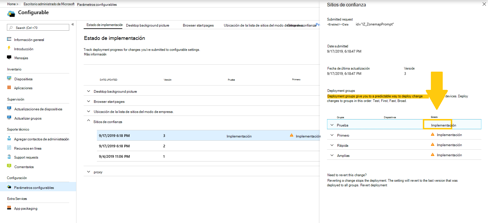
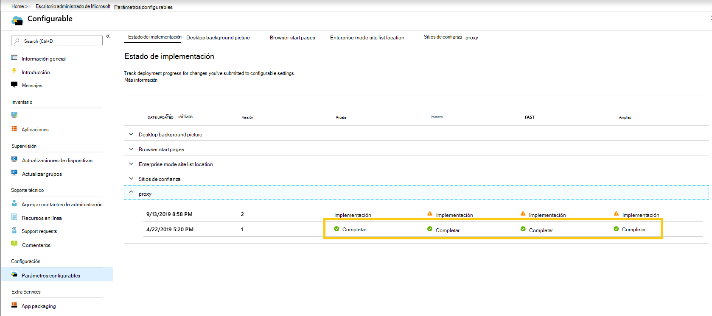
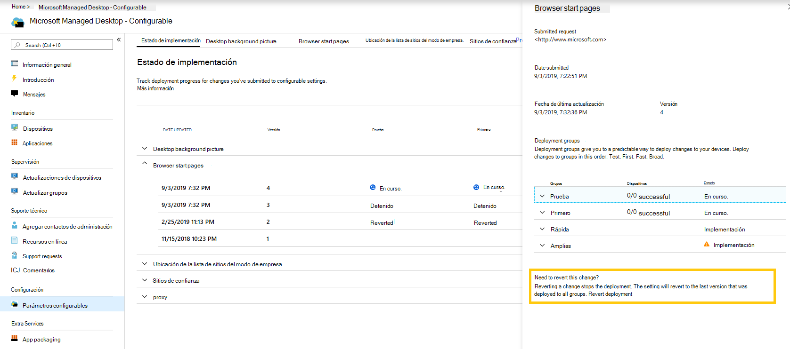

# Implementar y realizar un seguimiento de la configuración configurable: Escritorio administrado de Microsoft

Después de realizar cambios en las categorías de configuración y la fase de una implementación, la página Estado de implementación le permite empezar a implementar la configuración en grupos. Esta página muestra un resumen de cada configuración configurable. Al abrir una categoría de configuración, puede implementar la configuración en grupos y realizar un seguimiento del progreso de estas implementaciones.

## Estados de implementación 

Estos son los estados que verá para cada implementación.

Estado  | Explicación 
--- | --- 
Implementar | El cambio está a la espera de implementarse en este grupo.
En curso | El cambio se aplica a los dispositivos activos de este grupo. 
Completo | El cambio completado en todos los dispositivos activos de este grupo. 
Failed | El cambio no se pudo hacer en un 10 % de los dispositivos activos del grupo, por lo que se detuvo la implementación.   Se abrirá automáticamente una solicitud de soporte técnico con Escritorio administrado de Microsoft para solucionar problemas de la implementación. 
Reverted | El cambio se reviró al último cambio que se implementó correctamente en todos los grupos de implementación.

## Implementar cambios

Mostraremos la imagen de fondo del escritorio en estas instrucciones. Una vez que haya realizado una implementación, implemente los cambios desde la página Estado de implementación. 

**Para implementar cambios**

1. Inicie sesión en [Microsoft Endpoint Manager](https://endpoint.microsoft.com/) y vaya al **menú Dispositivos**
2. Busque la sección Escritorio administrado de Microsoft, seleccione **Configuración**.
3. En **área de trabajo** de estado de implementación, seleccione la configuración que desea implementar y, a continuación, seleccione la implementación por fases que desea implementar.
4. Seleccione **Implementar** para implementar el cambio en uno de los grupos de implementación.

> [!NOTE] 
> El icono de precaución naranja indica que hay un grupo anterior disponible para la implementación, ya que se recomienda implementar en orden. 

<!-- Needs picture updated to show MEM  -->

Se recomienda implementar en grupos de implementación en este orden: Test, First, Fast y, a continuación, Broad. 

Cuando los cambios se completan en cada grupo, el estado cambia a **Complete**.

<!-- Needs picture updated to show MEM  -->

## Revertir implementación

Después de implementar un cambio, puede revertir desde **el estado de implementación**. Cuando se revierte un cambio que está **en curso** o **completado,** se detiene la implementación actual. La configuración volverá a la última versión que se implementó en todos los grupos. 

Mostraremos los pasos para revertir un cambio con la imagen en segundo plano de escritorio como ejemplo. 

**Para revertir un cambio**
1. Inicie sesión en [Microsoft Endpoint Manager](https://endpoint.microsoft.com/) y vaya al **menú Dispositivos**
2. Busque la sección Escritorio administrado de Microsoft, seleccione **Configuración**.
3. En **el área de trabajo** Estado de implementación, seleccione la configuración que desea revertir y, a continuación, seleccione la implementación por fases para revertir.
4. En **¿Necesita revertir este cambio?**, seleccione **Revertir implementación**.

<!-- Needs picture updated to show MEM  -->

## Recursos adicionales
- [Introducción a la configuración configurable](config-setting-overview.md)
- [Referencia de parámetros configurables](config-setting-ref.md) 
