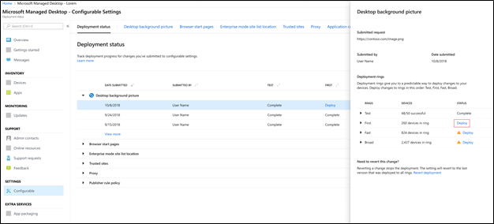

# Implementar y realizar un seguimiento de las opciones configurables-escritorio administrado por MicrosoftDeploy and track configurable settings - Microsoft Managed Desktop

Después de realizar cambios en las categorías de configuración y ensayar una implementación, la página estado de implementación le permite comenzar a implementar la configuración en grupos.After you make changes to your setting categories and stage a deployment, the Deployment status page allows you to begin deploying your settings to groups. En esta página se muestra un resumen de cada configuración configurable.This page shows a summary of each configurable setting. Al abrir una categoría de configuración, puede implementar la configuración en grupos y realizar un seguimiento del progreso de estas implementaciones.By opening a setting category you can deploy settings to groups and track the progress of these deployments.

## Estados de implementaciónDeployment statuses 

Estos son los statues que verá para cada implementación.These are the statues you’ll see for each deployment.

EstadoStatus  | ExplicaciónExplanation 
--- | --- 
ImplementarDeploy | El cambio está esperando a que se implemente en este grupo.Your change is waiting to be deployed to this group.
En cursoIn progress | El cambio se aplica a los dispositivos activos en este grupo.The change is being applied to active devices in this group. 
CompletarComplete | El cambio se completó en todos los dispositivos activos de este grupo.The change completed on all active devices in this group. 
FailedFailed | Se produjo un error en el cambio en un 10% de los dispositivos activos del grupo, por lo que se detuvo la implementación.The change failed on a 10 percent of active devices in the group, so the deployment was stopped.   Se abrirá automáticamente una solicitud de soporte técnico con las operaciones de escritorio administradas de Microsoft para solucionar problemas de la implementación.A support request will be automatically opened with Microsoft Managed Desktop operations to troubleshoot the deployment. 
ReviertenReverted | El cambio se revirtió al último cambio que se implementó correctamente en todos los grupos de implementación.The change was reverted to the last change that was successfully deployed to all deployment groups.

## Implementar cambiosDeploy changes

En estas instrucciones se mostrará la imagen de fondo del escritorio.We’ll show Desktop background picture in these instructions. Una vez que haya ensayado una implementación, implemente los cambios desde la página estado de la implementación.After you’ve staged a deployment, you deploy changes from the Deployment status page. 

**Para implementar los cambios****To deploy changes**

1. Iniciar sesión en el [portal de administración de escritorio administrado de Microsoft](http://aka.ms/mwaasportal)Sign in to [Microsoft Managed Desktop Admin portal](http://aka.ms/mwaasportal)
2. En **configuración**, seleccione **configurable**.Under **Settings**, select **Configurable**.
3. En el área de trabajo del **Estado de implementación** , seleccione la configuración que desee implementar y, a continuación, seleccione la implementación preconfigurada que se va a implementar.In **Deployment status** workspace, select the setting you want to deploy, and then select the staged deployment to deploy.
4. Seleccione **implementar** para implementar el cambio en uno de los grupos de implementación.Select **Deploy** to deploy the change to one of the deployment groups.

Microsoft manAged Desktop recomienda implementar en grupos de implementación en este orden: test, First, Fast y, a continuación, general.Microsoft Managed Desktop recommends deploying to deployment groups in this order: Test, First, Fast, and then Broad. 

Cuando se completen los cambios en cada grupo, el estado cambiará a **completa**.When changes complete in each group, the status changes to **Complete**.

## Revertir la implementaciónRevert deployment

Después de implementar un cambio, puede revertir el estado de **implementación**.After you’ve deployed a change, you can revert from **Deployment status**. Cuando se revierte un cambio que está **en curso** o **completado**, la implementación actual se detiene.When you revert a change that is **In progress** or **Complete**, the current deployment stops. La configuración se revertirá a la última versión que se implementó en todos los grupos.The setting will revert to the last version that was deployed to all groups. 

Mostraremos los pasos para revertir un cambio con la imagen de fondo de escritorio como ejemplo.We’ll show the steps to revert a change using the Desktop background picture as an example. 

**Para revertir un cambio****To revert a change**
1. Iniciar sesión en el [portal de administración de escritorio administrado de Microsoft](http://aka.ms/mwaasportal)Sign in to [Microsoft Managed Desktop Admin portal](http://aka.ms/mwaasportal)
2. En **configuración**, seleccione **configurable**.Under **Settings**, select **Configurable**.
3. En el área de trabajo del **Estado de implementación** , seleccione la configuración que desea revertir y, a continuación, seleccione la implementación preconfigurada que se va a revertir.In **Deployment status** workspace, select the setting you want to revert, and then select the staged deployment to revert.
4. En **es necesario revertir este cambio**, seleccione **revertir la implementación**.Under **Need to revert this change**, select **Revert deployment**.

 

## Recursos adicionalesAdditional resources
- [Información general de configuración configurableConfigurable settings overview](config-setting-overview.md)
- [Referencia de opciones conFigurablesConfigurable settings reference](config-setting-ref.md) 
