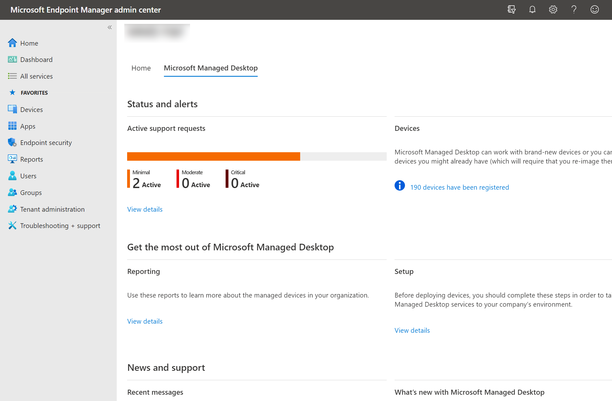

# Trabajar con ideas

Escritorio administrado de Microsoft proporciona una serie de paneles que los administradores de TI de su inquilino pueden usar para comprender diversos aspectos de la población de dispositivos. Puede acceder a ellos directamente, en el [Centro Microsoft 365 administración.](https://admin.microsoft.com/adminportal/home?previewoff=false#/microsoftmanageddesktop)

Con estos paneles puede encontrar las respuestas a preguntas como estas:

- ¿Cuántos dispositivos están activos y cuándo se usaron por última vez?
- ¿Qué aplicaciones se usan más y durante qué horas?
- ¿Qué aplicaciones causan problemas al bloquear o colgar mucho?
- ¿Cómo Escritorio administrado de Microsoft las operaciones de mantenimiento mitigan o resuelven estos problemas?
- ¿Qué aplicaciones consumen más energía?
- ¿Cuál es la duración de la batería pronosticada en mis dispositivos?
- ¿Cuál es el estado actual de las actualizaciones de seguridad en dispositivos?
- ¿Cuánto tiempo se necesita para que el 95 % de los dispositivos se actualice con la última actualización de seguridad?

Para obtener acceso a estas vistas desde [el Microsoft Endpoint Manager](https://endpoint.microsoft.com/), vaya a la pestaña Escritorio administrado de Microsoft de la página principal y seleccione **Ver** detalles en **el** área Informes:

## Información sobre el uso
Esta vista proporciona métricas de uso para Escritorio administrado de Microsoft dispositivos. 

Para ver los datos de uso, seleccione la **pestaña Uso.**

Obtenga más información [sobre las perspectivas de uso](usage-insights.md).

## Información sobre la confiabilidad
Esta vista le proporciona un resumen de estado de los dispositivos administrados. Para ver los datos de confiabilidad, seleccione la **pestaña** Confiabilidad.

Obtenga más información sobre [las perspectivas de confiabilidad](reliability-insights.md).

## Información sobre las baterías
En esta vista se muestra información sobre el consumo de energía de las aplicaciones y la duración de la batería proyectada para los dispositivos de su entorno. Para ver esta información, seleccione la **pestaña** Batería.

Obtenga más información [sobre battery insights](battery-insights.md).

## Información de actualización de seguridad de Windows
En esta vista se muestra información sobre el estado de las actualizaciones de seguridad de los Escritorio administrado de Microsoft dispositivos. Para ver esta información, seleccione la **pestaña Windows actualizaciones de seguridad.**

Obtenga más información sobre [las perspectivas de actualización de seguridad](security-update-insights.md).
