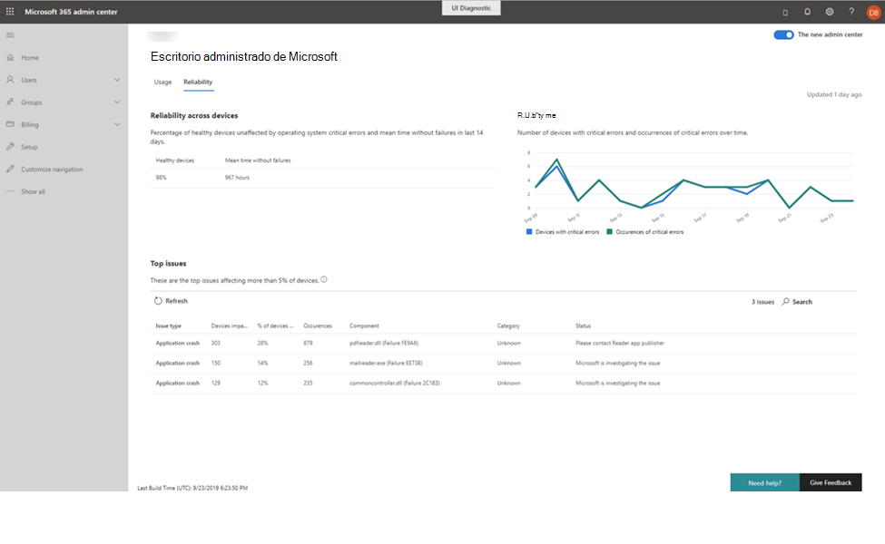

# Información sobre la confiabilidadReliability insights

Esta vista le proporciona un resumen de estado de los dispositivos administrados.This view provides you with a health summary of your managed devices. Para ver los datos de confiabilidad, seleccione la ficha **confiabilidad** .To view reliability data, select the **Reliability** tab.

La sección **confiabilidad en todos los dispositivos** ofrece un resumen rápido del estado de la implementación en los últimos 14 días mediante la generación de informes sobre el porcentaje de dispositivos considerados "correctos" y el tiempo medio observado desde el último error notificado.The **Reliability across devices** section offers a quick health summary of your deployment over the last 14 days by reporting the percentage of devices considered to be “healthy” and the mean time observed since the last reported failure. 

 
El gráfico **confiabilidad sobre el tiempo** de la derecha informa sobre el número de dispositivos con errores críticos y el número total de errores críticos observados a lo largo del tiempo.The **Reliability over time** graph on the right reports the number of devices with critical errors and the total number of observed critical errors over time.

En la sección **problemas principales** se explican los problemas específicos detectados que afectan al menos el 5% de los dispositivos administrados.The **Top issues** section details specific detected issues that affect at least 5% of your managed devices. Los detalles que se indican incluyen:Reported details include:

- El tipo de problemaThe type of issue
    - Bloqueos de aplicación, en los que una aplicación deja de funcionar o se detiene inesperadamenteApplication crashes, in which an app stops functioning or unexpectedly stops
    - La aplicación se bloquea, donde una aplicación deja de responder a la entradaApplication hangs, where an application stops responding to input
    - Errores críticos, que se producen cuando Windows ha encontrado un problema del que no se puede recuperarCritical errors, which occur when Windows has encountered an issue it can't recover from
- El número de dispositivos afectados por el mismo problemaThe number of devices affected by the same issue
- El porcentaje de dispositivos administrados que representa el númeroThe percentage of managed devices that number represents
- Número total de ocurrencias del problema específicoThe total count of occurrences of the specific issue
- Componente de software que parece ser el origen del problemaThe software component that appears to be the source of the problem
- La categoría del problema detectado:The category of the detected problem:
    - Explorador (Edge, Chrome, IE)Browser (Edge, Chrome, IE)
    - Desconocido (componentes que no son de Microsoft)Unknown (Non-Microsoft components)
    - Controlador (audio, gráficos u otros controladores)Driver (audio, graphics, or other drivers)
    - Productividad (margen de demora, G-Suites, Microsoft Office y sus complementos o extensiones, Teams)Productivity (Slack, G-Suites, Microsoft Office and its add-ons or extensions, Teams)
    - Multimedia (imagen, música o aplicaciones de vídeoMedia (image, music, or video apps
    - Seguridad (componentes de seguridad de Windows)Security (Windows security components)
- El estado actual de Microsoft Managed Desktop Operations investiga y corrige el problemaThe current status as Microsoft Managed Desktop Operations investigates and remediates the issue

