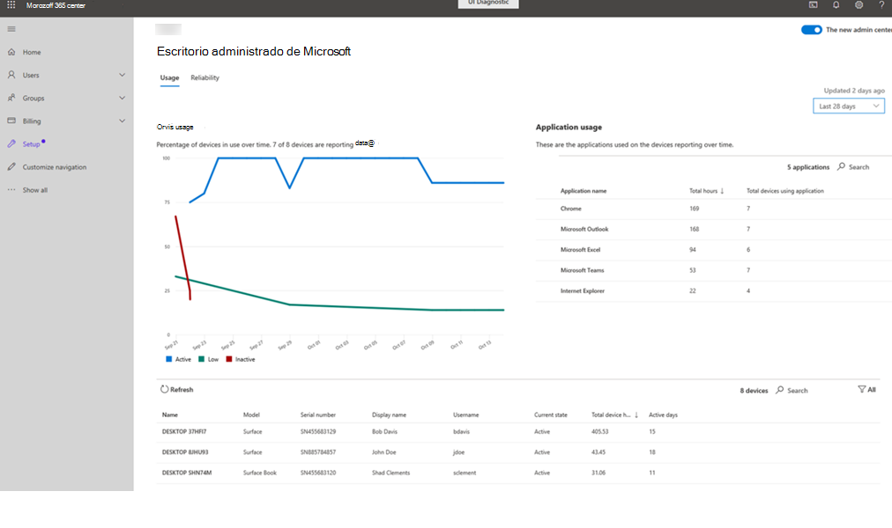

# Información sobre el usoUsage insights
Esta vista proporciona métricas de uso para los dispositivos de escritorio administrados por Microsoft.This view provides usage metrics for your Microsoft Managed Desktop devices. Por estos motivos, una aplicación se considera "en uso" si está en ejecución y en enfoque.For these purposes, an app is considered "in use" if it is running and in focus.

Para ver los datos de uso, seleccione la pestaña **uso** .To view usage data, select the **Usage** tab.

## Uso de dispositivosDevice usage

En el área **uso del dispositivo** , mostramos el nivel de uso de los dispositivos de informes a lo largo del tiempo, así como Cuántos dispositivos registrados están notificando datos.In the **Device usage** area, we display the usage level of reporting devices over time, as well as how many registered devices are reporting data. Para todos los datos que se muestran en esta página, puede cambiar el intervalo para ver los datos del informe en los últimos 14 o 28 días mediante el menú desplegable de la esquina superior derecha.For all data displayed on this page, you can change the interval to view reported data in either the last 14 or 28 days by using the drop-down menu in the upper right.

Clasificamos el nivel de uso con estos términos:We categorize the usage level with these terms:

- **Activo:** al menos 55 horas de uso**Active:** at least 55 hours of usage
- **Bajo:** entre 8 y 55 horas de uso**Low:** between 8 and 55 hours of usage
- **Inactivo:** menos de 8 horas de uso**Inactive:** less than 8 hours of usage

## Uso de aplicacionesApplication usage

El área de uso de la **aplicación** detalla las aplicaciones por orden de uso y sus respectivas horas de uso para los dispositivos administrados.The **Application usage** area details the applications in order of usage and their respective hours of usage for your managed devices. También muestra el número total de dispositivos administrados que usan una aplicación determinada.It also shows the total number of managed devices using a given application. Seleccione **Buscar** para buscar una aplicación específica si aún no aparece.Select **Search** to find a specific application if it isn't already listed.

## Detalles del dispositivoDevice details
El área de detalle proporciona información sobre dispositivos específicos, incluidos el número total de horas de dispositivo y el número de días activos durante el período de tiempo.The detail area provides information on specific devices, including total device hours and number of active days over the time period. Use los filtros para limitar la vista a los dispositivos con un patrón de uso "activo", "inactivo" o "bajo" o aquellos que no sean de informes.Use the filters to limit the view to those devices with a “Active”, “Inactive”, or “Low” usage pattern or those that are “Not Reporting”. 
