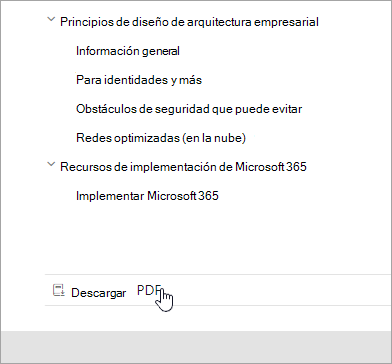
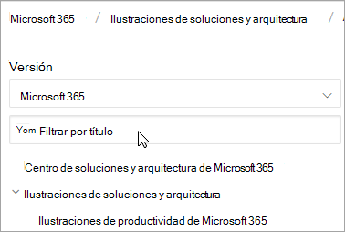
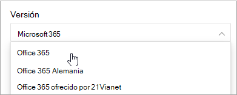
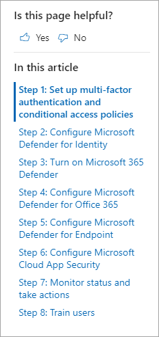
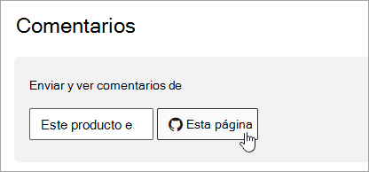

# Guía de navegación de Microsoft 365 docsMicrosoft 365 docs navigation guide

En este tema se proporcionan sugerencias y trucos para navegar por el espacio de documentación técnica de 365 de Microsoft.This topic provides some tips and tricks for navigating the Microsoft 365 technical documentation space.  

## Página del concentradorHub page

La página del concentrador 365 de Microsoft se puede encontrar en [https://aka.ms/microsoft365docs](https://aka.ms/microsoft365docs) y es el punto de entrada para buscar contenido relevante de microsoft 365.The Microsoft 365 hub page can be found at [https://aka.ms/microsoft365docs](https://aka.ms/microsoft365docs) and is the entry point for finding relevant Microsoft 365 content.

Siempre puede volver a esta página seleccionando **Microsoft 365** en el encabezado en la parte superior de cada página dentro del conjunto de documentación técnica de Microsoft 365:You can always navigate back to this page by selecting **Microsoft 365** from the header at the top of every page within the Microsoft 365 technical documentation set:

## Documentación sin conexiónOffline documentation

Si desea ver la documentación de Microsoft 365 en un sistema sin conexión, puede crear un PDF en cualquier lugar de la documentación técnica de Microsoft 365.If you would like to view the Microsoft 365 documentation on an offline system, you can create a PDF wherever you are in the Microsoft 365 technical documentation.

Si quiere crear un PDF, seleccione el vínculo **Descargar PDF** que se encuentra en la parte inferior de cada tabla de contenido.If you'd like to create a PDF, select the **Download PDF** link found at the bottom of every table of contents.

## Búsqueda de TDCTOC search 
En docs.microsoft.com, puede buscar el contenido de la tabla de contenido mediante el cuadro de búsqueda filtrar en la parte superior:On docs.microsoft.com, you can search the content in the table of contents by using the filter search box at the top:

## Filtro de versiónVersion filter
La documentación técnica de Microsoft 365 proporciona contenido para productos adicionales, incluidos Office 365 Germany y Office 365 operado por 21 ViaNet (China).The Microsoft 365 technical documentation provides content for additional products, including Office 365 Germany and Office 365 operated by 21 Vianet (China). Las características pueden variar entre estas versiones y, en ocasiones, el contenido puede variar.Features can vary between these versions, and as such, sometimes the content itself can vary.

Puede usar el filtro de versión para asegurarse de que está viendo el contenido de la versión adecuada de Microsoft 365:You can use the version filter to ensure that you are seeing content for the appropriate version of Microsoft 365:

## Las rutasBreadcrumbs

Las rutas de exploración pueden encontrarse debajo del encabezado y encima de la tabla de contenido, e indican dónde se encuentra el artículo actual en la tabla de contenido.Breadcrumbs can be found below the header and above the table of contents, and indicate where the current article is located in the table of contents.  Esto no solo ayuda a establecer el contexto en el tipo de contenido que está leyendo, sino que también le permite navegar hacia arriba en el árbol de la tabla de contenido:Not only does this help set the context to what type of content you're reading, but it also allows you to navigate back up the table of contents tree:

## Navegación de sección de artículoArticle section navigation

El panel de navegación derecho permite desplazarse rápidamente a las secciones de un artículo, así como identificar su ubicación en el artículo.The right-hand navigation pane allows you to quickly navigate to sections within an article, as well as identify your location within the article.  

## Enviar comentarios de documentosSubmit docs feedback

Si encuentra algún problema en un artículo, puede enviar comentarios al equipo de contenido de SQL para ese artículo desplazándose hacia abajo hasta la parte inferior de la página y seleccionando **comentarios sobre el contenido**.If you find something wrong within an article, you can submit feedback to the SQL Content team for that article by scrolling down to the bottom of the page and selecting **Content feedback**.

## Contribuir a la documentación de Microsoft 365Contribute to Microsoft 365 documentation

¿Sabía que puede editar el contenido de docs.microsoft.com?Did you know that you could edit the content on docs.microsoft.com yourself? Si lo hace, no solo mejorará nuestra documentación, sino que también se le abonará como colaborador a la página.If you do so, not only will our documentation improve, but you'll also be credited as a contributor to the page. Para empezar, vea:To get started, see:

- [Guía del colaborador de Microsoft docsMicrosoft Docs contributor guide](https://docs.microsoft.com/contribute/)

## Pasos siguientesNext steps

- Empiece a trabajar con la [documentación técnica de Microsoft 365](index.yml).Get started with the [Microsoft 365 technical documentation](index.yml).
