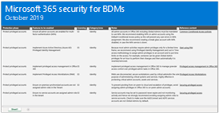
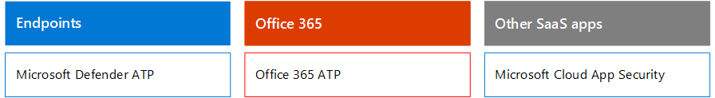

# Seguridad de Microsoft 365 para responsables de decisiones empresarialesMicrosoft 365 Security for Business Decision Makers (BDMs)

En este artículo se describen algunos de los escenarios de amenazas y ataques más comunes que enfrentan actualmente las organizaciones para sus entornos de 365 de Microsoft, así como las acciones recomendadas para mitigar estos riesgos.This article discusses some of the most common threat and attack scenarios currently faced by organizations for their Microsoft 365 environments, and recommended actions for mitigating these risks. Aunque Microsoft 365 incluye una amplia variedad de características de seguridad preconfiguradas, también requiere que usted sea el cliente al que se responsabiliza para proteger sus propias identidades, datos y dispositivos usados para acceder a los servicios en la nube.While Microsoft 365 comes with a wide array of pre-configured security features, it also requires you as the customer to take responsibility to secure your own identities, data, and devices used to access cloud services. Esta guía ha sido desarrollada por Kozeta viga (arquitecto de seguridad en la nube de Microsoft) y Thiagaraj Sundararajan (Consultor Senior de Microsoft).This guidance was developed by Kozeta Beam (Microsoft Cloud Security Architect) and Thiagaraj Sundararajan (Microsoft Senior Consultant).

Este artículo está organizado por prioridad de trabajo, comenzando con la protección de las cuentas que se usan para administrar los activos y servicios más críticos, como el espacio empresarial, el correo electrónico y SharePoint.This article is organized by priority of work, starting with protecting those accounts used to administer the most critical services and assets, such as your tenant, e-mail, and SharePoint. Proporciona un modo metódico para enfocar la seguridad y funciona junto con la siguiente hoja de cálculo para que pueda realizar un seguimiento del progreso con las partes interesadas y los equipos de toda la organización: [hoja de cálculo de Microsoft 365 Security para](https://github.com/MicrosoftDocs/microsoft-365-docs/raw/public/microsoft-365/downloads/Microsoft-365-BDM-security-recommendations-spreadsheet.xlsx)los responsables de la hoja de trabajo.It  provides a methodical way for approaching security and works together with the following spreadsheet so you can track your progress with stakeholders and teams across your organization: [Microsoft 365 security for BDMs spreadsheet](https://github.com/MicrosoftDocs/microsoft-365-docs/raw/public/microsoft-365/downloads/Microsoft-365-BDM-security-recommendations-spreadsheet.xlsx). 

Microsoft le proporciona la herramienta de puntuación segura dentro de su espacio empresarial para analizar automáticamente su postura de seguridad en función de sus actividades habituales, asignar una puntuación y proporcionar recomendaciones para mejorar la seguridad.Microsoft provides you with the Secure Score tool within your tenant to automatically analyze your security posture based on your regular activities, assign a score, and provide security improvement recommendations. Antes de llevar a cabo las acciones recomendadas en este artículo, anote el resultado actual y sus recomendaciones.Before taking the actions recommended in this article, take note of your current score and recommendations. Las acciones que se recomiendan en este artículo aumentarán su puntuación.The actions recommended in this article will increase your score. El objetivo no es conseguir la puntuación máxima, sino que debe tener en cuenta las oportunidades para proteger su entorno que no afectan negativamente a la productividad de los usuarios.The goal is not to achieve the max score, but to be aware of opportunities to protect your environment that do not negatively affect productivity for your users. Consulte [calificación segura de Microsoft](mtp/microsoft-secure-score.md).See [Microsoft Secure Score](mtp/microsoft-secure-score.md).

Otra cosa antes de empezar.One more thing before we get started . . . Asegúrese de [activar el registro de auditoría de Office 365](../compliance/search-the-audit-log-in-security-and-compliance.md).be sure to [turn on the Office 365 audit log](../compliance/search-the-audit-log-in-security-and-compliance.md). Necesitará estos datos más adelante, en caso de que necesite investigar un incidente o una infracción.You’ll need this data later, in the event you need to investigate an incident or a breach. 

## Proteger cuentas con privilegiosProtect privileged accounts

Como primer paso, se recomienda garantizar que las cuentas críticas en el entorno reciben una capa adicional de protección, ya que estas cuentas tienen acceso y permisos para administrar y alterar los servicios y recursos críticos que pueden afectar negativamente a toda la organización. Si está en peligro.As a first step, we recommend ensuring critical accounts in the environment are given an extra layer of protection as these accounts have access and permissions to manage and alter critical services and resources which can negatively impact the entire organization, if compromised. La protección de las cuentas con privilegios es una de las formas más eficaces de proteger contra un atacante que intente elevar los permisos de una cuenta en peligro a un administrador.Protecting privileged accounts is one of the most effective ways to protect against an attacker who seeks to elevate the permissions of a compromised account to an administrative one. 

|RecomendaciónRecommendation  |E3E3 |E5E5  |
|---------|---------|---------|
|Exigir la autenticación multifactor (MFA) para todas las cuentas administrativas.Enforce multi-factor authentication (MFA) for all administrative accounts.||| 
|Implemente Azure Active Directory (Azure AD) privileged Identity Management (PIM) para aplicar el acceso con privilegios justo a tiempo a los recursos de Azure AD y Azure.Implement Azure Active Directory (Azure AD) Privileged Identity Management (PIM) to apply just-in-time privileged access to Azure AD and Azure resources. También puede descubrir quién tiene acceso y revisa el acceso privilegiado.You can also discover who has access and review privileged access.|         | |
|Implemente la administración de acceso privilegiada en Office 365 para administrar el control de acceso granular sobre tareas de administración con privilegios en Office 365.Implement privileged access management in Office 365 to manage granular access control over privileged admin tasks in Office 365. |         | |
|Configurar y usar estaciones de trabajo de acceso privilegiado (pata) para administrar los servicios.Configure and use Privileged Access Workstations (PAW) to administer services. No use las mismas estaciones de trabajo para explorar Internet y compruebe el correo no relacionado con su cuenta administrativa.Do not use the same workstations for browsing the Internet and checking email not related to your administrative account.|  | | 

En el siguiente diagrama se ilustran estas funciones.The following diagram illustrates these capabilities.

Recomendaciones adicionales:Additional recommendations:
- Asegúrese de que las cuentas que se sincronizan desde el entorno local no tienen roles de administrador asignados para los servicios en la nube.Ensure accounts that are synchronized from on-premises are not assigned admin roles for cloud services. Esto ayuda a evitar que un atacante aproveche las cuentas locales para obtener acceso administrativo a los servicios en la nube.This helps prevent an attacker from leveraging on-premises accounts to gain administrative access to cloud services. 
- Asegúrese de que las cuentas de servicio no tienen roles de administrador asignados.Ensure service accounts are not assigned admin roles. A menudo, estas cuentas no se supervisan y se establecen con contraseñas que no expiran.These accounts are often not monitored and set with passwords that do not expire. Para empezar, asegúrese de que los valores de las cuentas de los servicios ADFS no son administradores globales de forma predeterminada.Start by ensuring the AADConnect and ADFS services accounts are not Global Admins by default.
- Quitar licencias de las cuentas de administrador.Remove licenses from admin accounts. A menos que haya un caso de usuario específico para asignar licencias a cuentas de administrador específicas, quite las licencias de estas cuentas.Unless there is a specific user case to assign licenses to specific admin accounts, remove licenses from these accounts. 

## Reducir la superficie del ataqueReduce the surface of attack

El área de enfoque siguiente reduce la superficie de ataque.The next focus area is reducing the surface of attack. Esto puede conseguirse con el mínimo esfuerzo y el mismo impacto para los usuarios y servicios.This can be accomplished with minimal effort and impact to your users and services. Al reducir el área de superficie del ataque, los atacantes tienen menos formas de iniciar un ataque contra su organización.By reducing the surface area of attack, attackers have fewer ways to launch an attack against your organization.

Aquí le mostramos otros ejemplos:Here are some examples:
- Deshabilitar los protocolos POP3, IMAP y SMTP.Disable POP3, IMAP, and SMTP protocols. La mayoría de las organizaciones modernas ya no usan estos protocolos anteriores.Most modern organizations no longer use these older protocols. Puede deshabilitarlos de forma segura y permitir solo las excepciones que sean necesarias.You can safely disable these and allow only exceptions as needed. 
- Reduzca y mantenga el número de administradores globales en el inquilino al mínimo absoluto necesario.Reduce and keep the number of Global Admins in the tenant to the absolute minimum required. Esto reduce directamente el área de superficie del ataque para todas las aplicaciones de la nube.This directly reduces the surface area of attack for all Cloud applications. 
- Retire los servidores y las aplicaciones que ya no se usan en el entorno.Retire servers and applications that are no longer used in your environment. 
- Implemente un proceso para deshabilitar y eliminar cuentas que ya no se usan.Implement a process for disabling and deleting accounts that are no longer used. 

## Protección contra amenazas conocidasProtect against known threats

Las amenazas conocidas incluyen malware, cuentas comprometidas y suplantación de identidad.Known threats include malware, compromised accounts, and phishing. Algunas protecciones contra estas amenazas pueden implementarse rápidamente sin afectar directamente a los usuarios, mientras que otras requieren más planeación y formación de los usuarios.Some protections against these threats can be implemented quickly with no direct impact to your users, while others require more planning and user training. 

|RecomendaciónRecommendation  |E3E3  |E5E5  |
|---------|---------|---------|
|**Configure la autenticación multifactor y use directivas de acceso condicional recomendadas, incluidas las directivas de riesgo de inicio de sesión**.**Setup multi-factor authentication and use recommended conditional access policies, including sign-in risk policies**. Microsoft recomienda y ha probado un conjunto de directivas que funcionan en conjunto para proteger todas las aplicaciones en la nube, incluidos los servicios de Office 365 y Microsoft 365.Microsoft recommends and has tested a set of policies that work together to protect all cloud apps, including Office 365 and Microsoft 365 services. Consulte [configuraciones de identidad y acceso a dispositivos](../enterprise/microsoft-365-policies-configurations.md).See [Identity and device access configurations](../enterprise/microsoft-365-policies-configurations.md). | ||
|**Requerir multi-factor Authentication para todos los usuarios**.**Require multi-factor authentication for all users**. Si no tiene las licencias necesarias para implementar las directivas de acceso condicional recomendadas, como mínimo, necesitará una autenticación multifactor para todos los usuarios.If you don’t have the licensing required to implement the recommended conditional access policies, at a minimum require multi-factor authentication for all users.|||
|**Aumente el nivel de protección contra malware en correo**.**Raise the level of protection against malware in mail**. El entorno de Office 365 o Microsoft 365 incluye protección contra malware, pero puede aumentar esta protección bloqueando los datos adjuntos con tipos de archivo que se usan habitualmente para malware.Your Office 365 or Microsoft 365 environment includes protection against malware, but you can increase this protection by blocking attachments with file types that are commonly used for malware.|||
|**Proteger el correo electrónico de los ataques de suplantación de identidad**.**Protect your email from targeted phishing attacks**. Si ha configurado uno o más dominios personalizados para el entorno de Office 365 o Microsoft 365, puede configurar la protección contra suplantas de identidad (phishing) dirigida.If you've configured one or more custom domains for your Office 365 or Microsoft 365 environment, you can configure targeted anti-phishing protection. La protección contra suplantación de identidad ATP, parte de la protección contra amenazas avanzada de Office 365, puede ayudar a proteger a su organización de ataques de suplantación de identidad (phishing) malintencionados y otros ataques de suplantación de identidad.ATP anti-phishing protection, part of Office 365 Advanced Threat Protection, can help protect your organization from malicious impersonation-based phishing attacks and other phishing attacks. Si no ha configurado un dominio personalizado, no es necesario que lo haga.If you haven't configured a custom domain, you do not need to do this.| ||
|**Protegerse contra ataques de ransomware en el correo electrónico**.**Protect against ransomware attacks in email**. Ransomware desconecta el acceso a los datos mediante el cifrado de los archivos o el bloqueo de las pantallas del equipo.Ransomware takes away access to your data by encrypting files or locking computer screens. A continuación, intenta extort dinero de víctimas solicitando "Ransom", normalmente en forma de cryptocurrencies como bitcoin, en Exchange para devolver el acceso a sus datos.It then attempts to extort money from victims by asking for "ransom," usually in form of cryptocurrencies like Bitcoin, in exchange for returning access to your data. Puede ayudar a defender contra el ransomware si crea una o más reglas de flujo de correo para bloquear extensiones de archivo que se usan habitualmente para ransomware o para advertir a los usuarios que reciben estos datos adjuntos en el correo electrónico.You can help defend against ransomware by creating one or more mail flow rules to block file extensions that are commonly used for ransomware, or to warn users who receive these attachments in email.|||
|**Bloquear conexiones de países con los que no tiene que hacer negocios**.**Block connections from countries that you don’t do business with**. Cree una directiva de acceso condicional de Azure AD para bloquear las conexiones que provengan de estos países y cree eficazmente un firewall geográfico alrededor del espacio empresarial.Create an Azure AD conditional access policy to block any connections coming from these countries, effectively creating a geo firewall around your tenant.| ||

En el siguiente diagrama se ilustran estas funciones.The following diagram illustrates these capabilities.

## Protección contra amenazas desconocidasProtect against unknown threats

Después de agregar protecciones adicionales a sus cuentas con privilegios y proteger contra ataques conocidos, cambie la atención a la protección contra amenazas desconocidas.After adding extra protections to your privileged accounts and protecting against known attacks, shift your attention to protecting against unknown threats. Las adversarios más determinadas y avanzadas usan métodos innovadores y nuevos desconocidos para atacar a las organizaciones.The more determined and advanced adversaries use innovative and new, unknown methods to attack organizations. Con la gran telemetría de Microsoft de datos recopilados sobre miles de millones de dispositivos, aplicaciones y servicios, podemos realizar una protección contra amenazas avanzada en Windows, Office 365 y Azure para evitar ataques de día cero, utilizando entornos de caja de arena y comprobación de la validez antes de permitir el acceso al contenido.With Microsoft’s vast telemetry of data gathered over billions of devices, applications, and services, we are able to perform Advanced Threat Protection on Windows, Office 365, and Azure to prevent against Zero Day attacks, utilizing sand box environments, and checking validity before allowing access to your content. 

|RecomendaciónRecommendation  |E3E3  |E5E5  |
|---------|---------|---------|
|**Configuración de la protección contra amenazas avanzada de Office 365 (ATP)**:**Configure Office 365 Advanced Threat Protection (ATP)**: • Datos adjuntos seguros ATP•    ATP Safe Attachments • Vínculos seguros ATP•   ATP Safe Links • ATP para SharePoint, OneDrive y Microsoft Teams• ATP for SharePoint, OneDrive, and Microsoft Teams • Protección contra la suplantación de identidad ATP•  ATP anti-phishing protection|         | |
|**Configurar las capacidades de la protección contra amenazas avanzada de Microsoft defender**:**Configure Microsoft Defender Advanced Threat Protection capabilities**: • Antivirus de Windows Defender• Windows Defender Antivirus  • Protección contra vulnerabilidades•    Exploit protection   • Reducción de superficie de ataques•   Attack surface reduction   • Aislamiento basado en hardware• Hardware-based isolation  • Acceso controlado a la carpeta•  Controlled folder access     |         | |
|**Use Microsoft Cloud App Security** para detectar aplicaciones SaaS y comenzar a usar análisis de comportamiento y detección de anomalías.**Use Microsoft Cloud App Security** to discover SaaS apps and begin to use behavior analytics and anomaly detection. |         | |

En el siguiente diagrama se ilustran estas funciones.The following diagram illustrates these capabilities.

Recomendaciones adicionales:Additional recommendations:
- Proteger las comunicaciones del canal del asociado como los mensajes de correo electrónico mediante TLS.Secure partner channel communications like Emails using TLS.
- Abra la Federación de Microsoft Teams solo para los asociados con los que se comunica.Open Teams Federation only to Partners you communicate with.
- No incluir dominios de remitentes de listas de blanca, remitentes individuales o IP de origen, ya que esto permite omitir las comprobaciones de correo no deseado y de malware, una práctica común con los clientes es la lista blanca de sus propios dominios aceptados o una serie de dominios en los que se pueden haber problemas de flujo de correo electrónico. Enviado.Do not whitelist sender domains, individual senders, or source IPs as this allows these to bypass spam and malware checks — A common practice with customers is whitelisting their own accepted domains or a number of other domains where email flow issues may have been reported. No agregue dominios en la lista de filtrado de correo no deseado y de conexión, ya que esto puede eludir todas las comprobaciones de correo no deseado.Do not add domains in the Spam and Connection Filtering list as this potentially bypasses all spam checks. 
- Habilitar notificaciones de correo no deseado salientes: habilite las notificaciones de correo no deseado salientes a una lista de distribución internamente para que el Departamento de soporte técnico o de administración de ti informe si alguno de los usuarios internos envía correos electrónicos de correo no deseado de forma externa.Enable outbound spam notifications — Enable outbound spam notifications to a distribution list internally to the Helpdesk or IT Admin team to report if any of the internal users are sending out Spam emails externally. Esto podría ser un indicador de que la cuenta se ha puesto en peligro.This could be an indicator that the account has been compromised.
- Deshabilitar PowerShell remoto para todos los usuarios: los administradores usan principalmente PowerShell remoto para acceder a los servicios de Office 365 con fines administrativos o con acceso a API mediante programación.Disable Remote PowerShell for all users — Remote PowerShell is mainly used by Admins to access Office 365 services for administrative purposes or programmatic API access. Se recomienda deshabilitar esta opción para que los usuarios que no sean administradores puedan evitar el reconocimiento a menos que tengan un requisito de negocio para acceder a ella.We recommended disabling this option for non-Admin users to avoid reconnaissance unless they have a business requirement to access it. 
- Bloquee el acceso al portal de administración de Microsoft Azure a todos los no administradores.Block access to the Microsoft Azure Management portal to all non-administrators. Para ello, puede crear una regla de acceso condicional para bloquear todos los usuarios, con la excepción de los administradores.You can accomplish this by creating a conditional access rule to block all users, with the exception of admins. 

## Asumir una infracciónAssume breach

Mientras que Microsoft toma todas las medidas posibles para evitar amenazas y ataques, recomendamos siempre trabajar con la mentalidad de "asumir una brecha".While Microsoft takes every possible measure to prevent against threats and attacks, we recommend always working under the “Assume Breach” mindset. Incluso si un atacante ha podido infiltrarse en el entorno, debemos asegurarnos de que no pueden exfiltrar datos o información de identidades del entorno.Even if an Attacker has managed to intrude into the environment, we need to make sure they are unable to exfiltrate data or identity information from the environment. Por este motivo, se recomienda habilitar la protección contra pérdidas de datos confidenciales, como números de seguridad social, números de tarjetas de crédito, información personal adicional y otra información confidencial en el nivel de la organización.For this reason, we recommend enabling protection against sensitive data leaks such as Social Security numbers, credit cards numbers, additional personal information, and other organizational level confidential information. 

La mentalización "supone una infracción" requiere implementar una estrategia de red de confianza cero, lo que significa que los usuarios no son de plena confianza, ya que son internos de la red.The “Assume Breach” mindset requires implementing a zero trust network strategy, which means users are not fully trusted just because they are internal to the network. En su lugar, como parte de la autorización de lo que los usuarios pueden hacer, se especifican conjuntos de condiciones y, cuando se cumplen estas condiciones, se aplican ciertos controles.Instead, as part of authorization of what users can do, sets of conditions are specified, and when such conditions are met, certain controls are enforced. Las condiciones pueden incluir el estado de mantenimiento del dispositivo, la aplicación a la que se obtiene acceso, las operaciones realizadas y el riesgo del usuario.Conditions may include device health status, application being accessed, operations being performed and user risk. Por ejemplo, una acción de inscripción de dispositivos siempre debe desencadenar la autenticación MFA para asegurarse de que no se agregan dispositivos Rouge a su entorno.For example, a device enrollment action should always trigger MFA authentication to ensure no rouge devices are added to your environment. 

Una estrategia de red de confianza cero también requiere que sepa dónde se almacena la información y que aplique los controles apropiados para clasificación, protección y retención.A zero trust network strategy also requires that you know where your information is stored and apply appropriate controls for classification, protection, and retention. Para proteger de forma eficaz sus activos más críticos y confidenciales, primero debe identificar dónde se encuentran y realizar el inventario, lo que puede resultar complicado.To effectively protect your most critical and sensitive assets you need to first identify where these are located and take inventory, which can be challenging. A continuación, trabaje con su organización para definir una estrategia de gobierno.Next, work with your organization to define a governance strategy. La definición de un esquema de clasificación para una organización y la configuración de directivas, etiquetas y condiciones requiere una planeación y preparación cuidadosas.Defining a classification schema for an organization and configuring policies, labels, and conditions requires careful planning and preparation. Es importante tener en cuenta que no se trata de un proceso controlado por ti.It is important to realize that this is not an IT driven process. Asegúrese de colaborar con su equipo legal y de cumplimiento para desarrollar un esquema de clasificación y etiquetado adecuado para los datos de su organización.Be sure to work with your legal and compliance team to develop an appropriate classification and labeling schema for your organization’s data.

Las capacidades de protección de la información de Microsoft 365 pueden ayudarle a descubrir qué información tiene, dónde se almacena y qué información requiere protección adicional.Microsoft 365 information protection capabilities can help you discover what information you have, where it is stored, and which information requires additional protection. La protección de la información es un proceso continuo, y las capacidades de Microsoft 365 le proporcionan visibilidad sobre cómo los usuarios usan y distribuyen información confidencial, dónde se almacena actualmente la información y a dónde fluye.Information protection is a continuous process and Microsoft 365 capabilities provide you with visibility into how users are using and distributing sensitive information, where your information is currently stored, and where it flows. También puede ver cómo los usuarios administran la información que se regula para asegurarse de que se aplican las etiquetas y protecciones adecuadas.You can also see how users handling information that is regulated to be sure the appropriate labels and protections are applied.

|RecomendaciónRecommendation |E3E3|E5E5 |
|---------|---------|---------|
|**Revise y optimice el acceso condicional y las directivas relacionadas para alinearse con los objetivos de una red de confianza cero**.**Review and optimize your conditional access and related policies to align with your objectives for a zero trust network**. La protección contra amenazas conocidas incluye la implementación de un conjunto de [directivas recomendadas](../enterprise/microsoft-365-policies-configurations.md).Protecting against known threats includes implementing a set of [recommended policies](../enterprise/microsoft-365-policies-configurations.md). Revise la implementación de estas directivas para asegurarse de que está protegiendo sus aplicaciones y datos de los hackers que han obtenido acceso a su red.Review your implementation of these policies to ensure you’re protecting your apps and data against hackers who have gained access to your network. Tenga en cuenta que la Directiva de protección de aplicaciones de Intune recomendada para Windows 10 habilita Windows Information Protection (WIP).Note that the recommended Intune app protection policy for Windows 10 enables Windows Information Protection (WIP). WIP protege contra pérdidas accidentales de los datos de su organización a través de aplicaciones y servicios, como el correo electrónico, los medios sociales y la nube pública.WIP protects against accidental leaks of your organization data through apps and services, like email, social media, and the public cloud. |         ||
|**Deshabilitar el reenvío externo de correo electrónico**.**Disable external email forwarding**. Los hackers que obtienen acceso al buzón de un usuario pueden robar el correo estableciendo el buzón para reenviar automáticamente el correo electrónico.Hackers who gain access to a user's mailbox can steal your mail by setting the mailbox to automatically forward email. Esto puede ocurrir incluso sin la conciencia del usuario.This can happen even without the user's awareness. Puede evitar que esto suceda mediante la configuración de una regla de flujo de correo.You can prevent this from happening by configuring a mail flow rule.| ||
|**Deshabilitar el uso compartido de calendario externo anónimo**.**Disable anonymous external calendar sharing**. De forma predeterminada, se permite el uso compartido de calendario anónimo externo.By default external anonymous calendar sharing is allowed. [Deshabilite el uso compartido del calendario](https://docs.microsoft.com/en-us/exchange/sharing/sharing-policies/modify-a-sharing-policy) para reducir posibles pérdidas de información confidencial.[Disable calendar sharing](https://docs.microsoft.com/en-us/exchange/sharing/sharing-policies/modify-a-sharing-policy) to reduce potential leaks of sensitive information.| ||
|**Configurar directivas de prevención de pérdida de datos para datos confidenciales**.**Configure data loss prevention policies for sensitive data**. Cree una directiva de prevención de pérdida de datos en el centro de seguridad y cumplimiento de Office 365 para detectar y proteger datos confidenciales, como números de tarjetas de crédito, números de seguridad social y números de cuentas bancarias.Create a Data Loss Prevention Policy in the Office 365 Security and Compliance center to discover and protect sensitive data such as credit card numbers, Social Security numbers and bank account numbers. Office 365 incluye muchos tipos de información confidencial predefinida que puede usar en las directivas de prevención de pérdida de datos.Office 365 includes many predefined sensitive information types you can use in data loss prevention policies. También puede crear sus propios tipos de información confidencial para los datos confidenciales que sean personalizados para su entorno.You can also create your own sensitive information types for sensitive data that is custom to your environment. |||
|**Implementar directivas de clasificación de datos y protección de la información**.**Implement data classification and information protection policies**. Implemente las etiquetas de confidencialidad en Office 365 y úselas para clasificar y aplicar protección a los datos confidenciales.Implement sensitivity labels in Office 365 and use these to classify and apply protection to sensitive data. También puede usar estas etiquetas en directivas de prevención de pérdida de datos.You can also use these labels in data loss prevention policies. Si usa las etiquetas de Azure Information Protection, le recomendamos que Evite crear etiquetas nuevas en otros centros de administración.If you are using Azure Information Protection labels, we recommend that you avoid creating new labels in other admin centers.|         ||
|**Proteja los datos de aplicaciones y servicios de terceros mediante Cloud App Security**.**Protect data in third-party apps and services by using Cloud App Security**. Configure las directivas de Cloud App Security para proteger información confidencial en aplicaciones en la nube de terceros, como Salesforce, Box o Dropbox.Configure Cloud App Security policies to protect sensitive information across third-party cloud apps, such as Salesforce, Box, or Dropbox. Puede usar los tipos de información confidencial y las etiquetas de confidencialidad que haya creado en Office 365 en Cloud App Security Policies y aplicarlas a todas las aplicaciones SaaS.You can use sensitive information types and the sensitivity labels you created in Office 365 in Cloud App Security policies and apply these across your SaaS apps.   Microsoft Cloud App Security le permite aplicar una amplia gama de procesos automatizados.Microsoft Cloud App Security allow you to enforce a wide range of automated processes. Las directivas se pueden configurar para proporcionar análisis continuos de cumplimiento, tareas legales de eDiscovery, DLP para contenido confidencial compartido públicamente, y mucho más.Policies can be set to provide continuous compliance scans, legal eDiscovery tasks, DLP for sensitive content shared publicly, and more. Cloud App Security puede supervisar cualquier tipo de archivo en función de más de 20 filtros de metadatos (por ejemplo, nivel de acceso, tipo de archivo).Cloud App Security can monitor any file type based on more than 20 metadata filters (for example, access level, file type). |         ||
|**Use [ATP de Microsoft defender](https://docs.microsoft.com/en-us/windows/security/threat-protection/microsoft-defender-atp/information-protection-in-windows-overview) para identificar si los usuarios almacenan información confidencial en sus dispositivos Windows**.**Use [Microsoft Defender ATP](https://docs.microsoft.com/en-us/windows/security/threat-protection/microsoft-defender-atp/information-protection-in-windows-overview) to identify if users store sensitive information on their Windows devices**. |         ||
|**Use el [analizador de AIP](https://docs.microsoft.com/en-us/azure/information-protection/deploy-aip-scanner) para identificar y clasificar la información en los servidores y los recursos compartidos de archivos**.**Use [AIP Scanner](https://docs.microsoft.com/en-us/azure/information-protection/deploy-aip-scanner) to identify and classify information across servers and file shares**. Use la herramienta de informes de AIP para ver los resultados y realizar las acciones adecuadas.Use the AIP reporting tool to view the results and take appropriate actions.|         ||

En el siguiente diagrama se ilustran estas funciones.The following diagram illustrates these capabilities.

## Supervisión y auditoría continuasContinuous monitoring and auditing

Por último, la supervisión y la auditoría continuas del entorno de Microsoft 365 junto con Windows y los dispositivos son esenciales para asegurarse de que pueda detectar y corregir rápidamente cualquier intrusión.Last, but not least Continuous Monitoring and Auditing of the Microsoft 365 environment along with the Windows and Devices is critical to making sure you are able to quickly detect and remediate any intrusions. Herramientas como la puntuación segura, el centro de seguridad y los análisis avanzados de Microsoft Intelligent Graph proporcionan información de gran valor en su espacio empresarial y vinculan grandes cantidades de datos de seguridad e inteligencia de amenazas para proporcionar una protección contra amenazas sin igual. y detección.Tools such as Secure Score, Security Center, and Microsoft Intelligent Graph’s advanced analytics provide invaluable information into your tenant and link massive amounts of threat intelligence and security data to provide you unparalleled threat protection and detection.

|RecomendaciónRecommendation |E3E3 |E5E5 |
|---------|---------|---------|
|Asegúrese de que el **registro de auditoría de Office 365** está activado.Ensure the **Office 365 audit log** is turned on.|||
|**Revise la puntuación segura semanalmente** : la calificación segura es una ubicación central para acceder al estado de seguridad del espacio empresarial de Office 365 y emprender acciones basadas en recomendaciones de puntuación seguras.**Review Secure Score weekly** — Secure score is a central location to access the Security status of your Office 365 tenant and take actions based on Secure score recommendations. Se recomienda realizar esta comprobación semanalmente.It is recommended to perform this check weekly.|||
|Usar las herramientas de **Office 365 ATP** :Use **Office 365 ATP** tools: • Investigación de amenazas y capacidades de respuesta• Threat investigation and response capabilities  • Investigación y respuesta automatizadas•    Automated investigation and response |         ||
|Usar **ATP de Microsoft defender**:Use **Microsoft Defender ATP**:  • [Detección de extremos y respuesta](https://docs.microsoft.com/en-us/windows/security/threat-protection/microsoft-defender-atp/overview-endpoint-detection-response)•  [Endpoint detection and response](https://docs.microsoft.com/en-us/windows/security/threat-protection/microsoft-defender-atp/overview-endpoint-detection-response)   • Investigación automatizada y puntuación segura de corrección•   Automated investigation and remediation Secure score  • [Búsqueda avanzada](https://docs.microsoft.com/en-us/windows/security/threat-protection/microsoft-defender-atp/advanced-hunting-overview)•  [Advanced hunting](https://docs.microsoft.com/en-us/windows/security/threat-protection/microsoft-defender-atp/advanced-hunting-overview)  |         ||
|Use **Microsoft Cloud App Security** para detectar un comportamiento inusual en las aplicaciones en la nube para identificar los usuarios en peligro o las aplicaciones no autorizadas, analizar el uso de alto riesgo y corregir el problema automáticamente para limitar el riesgo a su organización.Use **Microsoft Cloud App Security** to detect unusual behavior across cloud apps to identify ransomware, compromised users or rogue applications, analyze high-risk usage and remediate automatically to limit the risk to your organization.|         ||
|Use **Microsoft Azure Sentinel** o su herramienta **Siem actual** para supervisar las amenazas en todo su entorno.Use **Microsoft Azure Sentinel** or your **current SIEM** tool to monitor for threats across your environment. Azure Sentinel es gratuito para su uso durante el período de versión preliminar.Azure Sentinel is free to use during the preview period. |         ||
|\*\*Implemente [Azure ATP](https://docs.microsoft.com/en-us/azure-advanced-threat-protection/what-is-atp) \*\* para supervisar y proteger contra las amenazas dirigidas a su entorno local de Active Directory.**Deploy [Azure ATP](https://docs.microsoft.com/en-us/azure-advanced-threat-protection/what-is-atp)** to monitor and protect against threats targeted to your on-premises Active Directory environment.   |         | |
|Use el **centro de seguridad de Azure** para supervisar las amenazas en las cargas de trabajo híbridas y de nube.Use the **Azure Security Center** to monitor for threats across hybrid and cloud workloads. El centro de seguridad de Azure incluye un nivel de capacidades gratuito y un nivel de capacidades estándar que se pagan en función de las horas o las transacciones de recursos.Azure Security Center includes a free tier of capabilities and a standard tier of capabilities that are paid for based on resource hours or transactions.|         |         |

En el siguiente diagrama se ilustran estas funciones.The following diagram illustrates these capabilities.

Acciones de supervisión recomendadas más importantes:Top recommended monitoring actions:
- **Revisión de la calificación segura de Microsoft semanal** : la calificación segura es una ubicación central para tener acceso al estado de seguridad del inquilino de Office 365 y emprender acciones basadas en las recomendaciones principales.**Review Microsoft Secure Score weekly** — Secure score is a central location to access the security status of your Office 365 tenant and to take actions based on top recommendations. Se recomienda realizar esta comprobación semanalmente.It is recommended to perform this check weekly. La puntuación segura incluye recomendaciones de toda Azure AD, Intune, Cloud App Security y protección contra amenazas avanzada de Microsoft defender, así como Office 365.Secure Score includes recommendations from across Azure AD, Intune, Cloud App Security, and Microsoft Defender Advanced Threat Protection, as well as Office 365. 
- **Revise los inicios de sesión peligrosos semanalmente** : Use el centro de administración de Azure ad para revisar semanalmente los inicios de sesión peligrosos.**Review risky logins weekly** — Use the Azure AD admin center to review risky sign-ins weekly. La identidad recomendada y el conjunto de reglas de acceso a dispositivos incluye una directiva para aplicar el cambio de contraseña en los inicios de sesión de riesgo.The recommended identity and device access ruleset includes a policy to enforce password change on risky sign-ins.  
- **Revise semanalmente el malware y los usuarios phish** : Use el explorador de amenazas de Office Advanced Threat Protection para revisar los principales usuarios orientados con malware y phish y para averiguar la causa raíz de los motivos por los que estos usuarios están afectados.**Review top malware and phished users weekly** — Use Office Advanced Threat Protection Threat Explorer to review top users targeted with malware and phish and to find out the root cause of why these users are affected.
