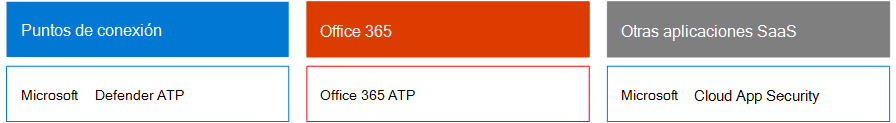

# Seguridad de Microsoft 365 para responsables de decisiones empresariales

En este artículo se describen algunos de los escenarios de amenazas y ataques más comunes que enfrentan actualmente las organizaciones para sus entornos de 365 de Microsoft, así como las acciones recomendadas para mitigar estos riesgos. Aunque Microsoft 365 incluye una amplia variedad de características de seguridad preconfiguradas, también requiere que usted sea el cliente al que se responsabiliza para proteger sus propias identidades, datos y dispositivos usados para acceder a los servicios en la nube. Esta guía ha sido desarrollada por Kozeta viga (arquitecto de seguridad en la nube de Microsoft) y Thiagaraj Sundararajan (Consultor Senior de Microsoft).

Este artículo está organizado por prioridad de trabajo, comenzando con la protección de las cuentas que se usan para administrar los activos y servicios más críticos, como el espacio empresarial, el correo electrónico y SharePoint. Proporciona un modo metódico para enfocar la seguridad y funciona junto con la siguiente hoja de cálculo para que pueda realizar un seguimiento del progreso con las partes interesadas y los equipos de toda la organización: [hoja de cálculo de Microsoft 365 Security para](https://github.com/MicrosoftDocs/microsoft-365-docs/raw/public/microsoft-365/downloads/Microsoft-365-BDM-security-recommendations-spreadsheet.xlsx)los responsables de la hoja de trabajo. 

Microsoft le proporciona la herramienta de puntuación segura dentro de su espacio empresarial para analizar automáticamente su postura de seguridad en función de sus actividades habituales, asignar una puntuación y proporcionar recomendaciones para mejorar la seguridad. Antes de llevar a cabo las acciones recomendadas en este artículo, anote el resultado actual y sus recomendaciones. Las acciones que se recomiendan en este artículo aumentarán su puntuación. El objetivo no es conseguir la puntuación máxima, sino que debe tener en cuenta las oportunidades para proteger su entorno de manera que no afecte negativamente a la productividad de los usuarios. Consulte [calificación segura de Microsoft](mtp/microsoft-secure-score.md).

Otra cosa antes de empezar. . . Asegúrese de [activar el registro de auditoría](../compliance/search-the-audit-log-in-security-and-compliance.md). Necesitará estos datos más adelante, en caso de que necesite investigar un incidente o una infracción. 

## Proteger cuentas con privilegios

Como primer paso, se recomienda garantizar que las cuentas críticas en el entorno reciben una capa adicional de protección, ya que estas cuentas tienen acceso y permisos para administrar y alterar los servicios y recursos críticos que pueden afectar negativamente a toda la organización si están en peligro. La protección de las cuentas con privilegios es una de las formas más eficaces de proteger contra un atacante que intente elevar los permisos de una cuenta en peligro a un administrador. 

|Recomendación  |E3 |E5  |
|---------|---------|---------|
|Exigir la autenticación multifactor (MFA) para todas las cuentas administrativas.||| 
|Implemente Azure Active Directory (Azure AD) privileged Identity Management (PIM) para aplicar el acceso con privilegios justo a tiempo a los recursos de Azure AD y Azure. También puede descubrir quién tiene acceso y revisa el acceso privilegiado.|         | |
|Implemente la administración de acceso privilegiada para administrar el control de acceso granular en las tareas de administración privilegiadas en Office 365. |         | |
|Configurar y usar estaciones de trabajo de acceso privilegiado (pata) para administrar los servicios. No use las mismas estaciones de trabajo para explorar Internet y compruebe el correo no relacionado con su cuenta administrativa.|  | | 

En el siguiente diagrama se ilustran estas funciones.

Recomendaciones adicionales:
- Asegúrese de que las cuentas que se sincronizan desde el entorno local no tienen roles de administrador asignados para los servicios en la nube. Esto ayuda a evitar que un atacante aproveche las cuentas locales para obtener acceso administrativo a los servicios en la nube. 
- Asegúrese de que las cuentas de servicio no tienen roles de administrador asignados. A menudo, estas cuentas no se supervisan y se establecen con contraseñas que no expiran. Para empezar, asegúrese de que los valores de las cuentas de los servicios ADFS no son administradores globales de forma predeterminada.
- Quitar licencias de las cuentas de administrador. A menos que haya un caso de uso específico para asignar licencias a cuentas de administrador específicas, quite las licencias de estas cuentas. 

## Reducir la superficie del ataque

El área de enfoque siguiente reduce la superficie de ataque. Esto puede conseguirse con el mínimo esfuerzo y el mismo impacto para los usuarios y servicios. Al reducir el área de superficie del ataque, los atacantes tienen menos formas de iniciar un ataque contra su organización.

Aquí le mostramos otros ejemplos:
- Deshabilitar los protocolos POP3, IMAP y SMTP. La mayoría de las organizaciones modernas ya no usan estos protocolos anteriores. Puede deshabilitarlos de forma segura y permitir excepciones solo según sea necesario. 
- Reduzca y mantenga el número de administradores globales en el inquilino al mínimo absoluto necesario. Esto reduce directamente el área de superficie del ataque para todas las aplicaciones de la nube. 
- Retire los servidores y las aplicaciones que ya no se usan en el entorno. 
- Implemente un proceso para deshabilitar y eliminar cuentas que ya no se usan. 

## Protección contra amenazas conocidas

Las amenazas conocidas incluyen malware, cuentas comprometidas y suplantación de identidad. Algunas protecciones contra estas amenazas pueden implementarse rápidamente sin afectar directamente a los usuarios, mientras que otras requieren más planeación y formación de los usuarios. 

|Recomendación  |E3  |E5  |
|---------|---------|---------|
|**Configure la autenticación multifactor y use directivas de acceso condicional recomendadas, incluidas las directivas de riesgo de inicio de sesión**. Microsoft recomienda y ha probado un conjunto de directivas que funcionan en conjunto para proteger todas las aplicaciones en la nube, incluidos los servicios de Office 365 y Microsoft 365. Consulte [configuraciones de identidad y acceso a dispositivos](../enterprise/microsoft-365-policies-configurations.md). | ||
|**Requerir multi-factor Authentication para todos los usuarios**. Si no tiene las licencias necesarias para implementar las directivas de acceso condicional recomendadas, como mínimo, necesitará una autenticación multifactor para todos los usuarios.|||
|**Aumente el nivel de protección contra malware en correo**. El entorno de Office 365 o Microsoft 365 incluye protección contra malware, pero puede aumentar esta protección bloqueando los datos adjuntos con tipos de archivo que se usan habitualmente para malware.|||
|**Proteger el correo electrónico de los ataques de suplantación de identidad**. Si ha configurado uno o más dominios personalizados para el entorno de Office 365 o Microsoft 365, puede configurar la protección contra suplantas de identidad (phishing) dirigida. La protección contra suplantación de identidad ATP, parte de la protección contra amenazas avanzada de Office 365, puede ayudar a proteger a su organización de ataques de suplantación de identidad (phishing) malintencionados y otros ataques de suplantación de identidad. Si no ha configurado un dominio personalizado, no es necesario que lo haga.| ||
|**Protegerse contra ataques de ransomware en el correo electrónico**. Ransomware desconecta el acceso a los datos mediante el cifrado de los archivos o el bloqueo de las pantallas del equipo. A continuación, intenta extort dinero de víctimas solicitando "Ransom", normalmente en forma de cryptocurrencies como bitcoin, en Exchange para devolver el acceso a sus datos. Puede ayudar a defender contra el ransomware si crea una o más reglas de flujo de correo para bloquear extensiones de archivo que se usan habitualmente para ransomware o para advertir a los usuarios que reciben estos datos adjuntos en el correo electrónico.|||
|**Bloquear conexiones de países con los que no tiene que hacer negocios**. Cree una directiva de acceso condicional de Azure AD para bloquear las conexiones que provengan de estos países y cree eficazmente un firewall geográfico alrededor del espacio empresarial.| ||

En el siguiente diagrama se ilustran estas funciones.

## Protección contra amenazas desconocidas

Después de agregar protecciones adicionales a sus cuentas con privilegios y proteger contra ataques conocidos, cambie la atención a la protección contra amenazas desconocidas. Las adversarios más determinadas y avanzadas usan métodos innovadores y nuevos desconocidos para atacar a las organizaciones. Con la gran telemetría de Microsoft de datos recopilados sobre miles de millones de dispositivos, aplicaciones y servicios, podemos realizar una protección contra amenazas avanzada en Windows, Office 365 y Azure para evitar ataques de día cero, utilizando entornos de arena y comprobando la validez antes de permitir el acceso al contenido. 

|Recomendación  |E3  |E5  |
|---------|---------|---------|
|**Configuración de la protección contra amenazas avanzada de Office 365 (ATP)**: * Datos adjuntos seguros ATP * Vínculos seguros ATP * ATP para SharePoint, OneDrive y Microsoft Teams * Protección contra la suplantación de identidad ATP|         | |
|**Configurar las capacidades de la protección contra amenazas avanzada de Microsoft defender**: * Antivirus de Windows Defender  * Protección contra la vulnerabilidad   * Reducción de superficie de ataques   * Aislamiento basado en hardware  * Acceso controlado a carpetas     |         | |
|**Use Microsoft Cloud App Security** para detectar aplicaciones SaaS y comenzar a usar análisis de comportamiento y detección de anomalías. |         | |

En el siguiente diagrama se ilustran estas funciones.

Recomendaciones adicionales:
- Proteger las comunicaciones del canal del asociado como los mensajes de correo electrónico mediante TLS.
- Abra la Federación de Microsoft Teams solo para los asociados con los que se comunica.
- No agregue dominios de remitentes, remitentes individuales o direcciones IP de origen a la lista de permitidos, ya que esto permite omitir las comprobaciones de correo no deseado y de malware, una práctica común con los clientes es agregar sus propios dominios aceptados o una serie de dominios en los que se han notificado problemas de flujo de correo a la lista de permitidos. No agregue dominios en la lista de filtrado de correo no deseado y de conexión, ya que esto puede eludir todas las comprobaciones de correo no deseado. 
- Habilitar notificaciones de correo no deseado salientes: habilite las notificaciones de correo no deseado salientes a una lista de distribución internamente para que el Departamento de soporte técnico o de administración de ti informe si alguno de los usuarios internos envía correos electrónicos de correo no deseado de forma externa. Esto podría ser un indicador de que la cuenta se ha puesto en peligro.
- Deshabilitar PowerShell remoto para todos los usuarios: los administradores usan principalmente PowerShell remoto para acceder a los servicios con fines administrativos o mediante el acceso a la API mediante programación. Se recomienda deshabilitar esta opción para que los usuarios que no sean administradores puedan evitar el reconocimiento a menos que tengan un requisito de negocio para acceder a ella. 
- Bloquee el acceso al portal de administración de Microsoft Azure a todos los no administradores. Para ello, puede crear una regla de acceso condicional para bloquear todos los usuarios, con la excepción de los administradores. 

## Asumir una infracción

Mientras que Microsoft toma todas las medidas posibles para evitar amenazas y ataques, recomendamos siempre trabajar con la mentalidad de "asumir una brecha". Incluso si un atacante ha podido infiltrarse en el entorno, debemos asegurarnos de que no pueden exfiltrar datos o información de identidades del entorno. Por este motivo, se recomienda habilitar la protección contra pérdidas de datos confidenciales, como números de seguridad social, números de tarjetas de crédito, información personal adicional y otra información confidencial en el nivel de la organización. 

La mentalización "supone una infracción" requiere implementar una estrategia de red de confianza cero, lo que significa que los usuarios no son de plena confianza, ya que son internos de la red. En su lugar, como parte de la autorización de lo que los usuarios pueden hacer, se especifican conjuntos de condiciones y, cuando se cumplen estas condiciones, se aplican ciertos controles. Las condiciones pueden incluir el estado de mantenimiento del dispositivo, la aplicación a la que se obtiene acceso, las operaciones realizadas y el riesgo del usuario. Por ejemplo, una acción de inscripción de dispositivos siempre debe desencadenar la autenticación MFA para asegurarse de que no se agregan dispositivos Rouge a su entorno. 

Una estrategia de red de confianza cero también requiere que sepa dónde se almacena la información y que aplique los controles apropiados para clasificación, protección y retención. Para proteger de forma eficaz sus activos más críticos y confidenciales, primero debe identificar dónde se encuentran y realizar el inventario, lo que puede resultar complicado. A continuación, trabaje con su organización para definir una estrategia de gobierno. La definición de un esquema de clasificación para una organización y la configuración de directivas, etiquetas y condiciones requiere una planeación y preparación cuidadosas. Es importante tener en cuenta que no se trata de un proceso controlado por ti. Asegúrese de colaborar con su equipo legal y de cumplimiento para desarrollar un esquema de clasificación y etiquetado adecuado para los datos de su organización.

Las capacidades de protección de la información de Microsoft 365 pueden ayudarle a descubrir qué información tiene, dónde se almacena y qué información requiere protección adicional. La protección de la información es un proceso continuo, y las capacidades de Microsoft 365 le proporcionan visibilidad sobre cómo los usuarios usan y distribuyen información confidencial, dónde se almacena actualmente la información y a dónde fluye. También puede ver cómo los usuarios administran la información que se regula para asegurarse de que se aplican las etiquetas y protecciones adecuadas.

|Recomendación |E3|E5 |
|---------|---------|---------|
|**Revise y optimice el acceso condicional y las directivas relacionadas para alinearse con los objetivos de una red de confianza cero**. La protección contra amenazas conocidas incluye la implementación de un conjunto de [directivas recomendadas](../enterprise/microsoft-365-policies-configurations.md). Revise la implementación de estas directivas para asegurarse de que está protegiendo sus aplicaciones y datos de los hackers que han obtenido acceso a su red. Tenga en cuenta que la Directiva de protección de aplicaciones de Intune recomendada para Windows 10 habilita Windows Information Protection (WIP). WIP protege contra pérdidas accidentales de los datos de su organización a través de aplicaciones y servicios, como el correo electrónico, los medios sociales y la nube pública. |         ||
|**Deshabilitar el reenvío externo de correo electrónico**. Los hackers que obtienen acceso al buzón de un usuario pueden robar el correo estableciendo el buzón para reenviar automáticamente el correo electrónico. Esto puede ocurrir incluso sin la conciencia del usuario. Puede evitar que esto suceda mediante la configuración de una regla de flujo de correo.| ||
|**Deshabilitar el uso compartido de calendario externo anónimo**. De forma predeterminada, se permite el uso compartido de calendario anónimo externo. [Deshabilite el uso compartido del calendario](https://docs.microsoft.com/exchange/sharing/sharing-policies/modify-a-sharing-policy) para reducir posibles pérdidas de información confidencial.| ||
|**Configurar directivas de prevención de pérdida de datos para datos confidenciales**. Cree una directiva de prevención de pérdida de datos en el centro de seguridad &amp; y cumplimiento para detectar y proteger datos confidenciales, como números de tarjetas de crédito, números de seguridad social y números de cuentas bancarias. Microsoft 365 incluye muchos tipos de información confidencial predefinida que puede usar en las directivas de prevención de pérdida de datos. También puede crear sus propios tipos de información confidencial para los datos confidenciales que sean personalizados para su entorno. |||
|**Implementar directivas de clasificación de datos y protección de la información**. Implemente las etiquetas de confidencialidad y úselas para clasificar y aplicar la protección a los datos confidenciales. También puede usar estas etiquetas en directivas de prevención de pérdida de datos. Si usa las etiquetas de Azure Information Protection, le recomendamos que Evite crear etiquetas nuevas en otros centros de administración.|         ||
|**Proteja los datos de aplicaciones y servicios de terceros mediante Cloud App Security**. Configure las directivas de Cloud App Security para proteger información confidencial en aplicaciones en la nube de terceros, como Salesforce, Box o Dropbox. Puede usar los tipos de información confidencial y las etiquetas de confidencialidad que haya creado en Cloud App Security Policies y aplicarlas a través de las aplicaciones SaaS.   Microsoft Cloud App Security le permite aplicar una amplia gama de procesos automatizados. Las directivas se pueden configurar para proporcionar análisis continuos de cumplimiento, tareas legales de eDiscovery, DLP para contenido confidencial compartido públicamente, y mucho más. Cloud App Security puede supervisar cualquier tipo de archivo en función de más de 20 filtros de metadatos (por ejemplo, nivel de acceso, tipo de archivo). |         ||
|**Use [ATP de Microsoft defender](https://docs.microsoft.com/windows/security/threat-protection/microsoft-defender-atp/information-protection-in-windows-overview) para identificar si los usuarios almacenan información confidencial en sus dispositivos Windows**. |         ||
|**Use el [analizador de AIP](https://docs.microsoft.com/azure/information-protection/deploy-aip-scanner) para identificar y clasificar la información en los servidores y los recursos compartidos de archivos**. Use la herramienta de informes de AIP para ver los resultados y realizar las acciones adecuadas.|         ||

En el siguiente diagrama se ilustran estas funciones.

## Supervisión y auditoría continuas

Por último, la supervisión y la auditoría continuas del entorno de Microsoft 365 junto con Windows y los dispositivos son esenciales para asegurarse de que pueda detectar y corregir rápidamente cualquier intrusión. Las herramientas como la puntuación segura, el centro de seguridad y los análisis avanzados de Microsoft Intelligent Graph proporcionan información de gran valor en su espacio empresarial y vinculan grandes cantidades de datos de seguridad e inteligencia de amenazas para proporcionar una protección y detección de amenazas incomparables.

|Recomendación |E3 |E5 |
|---------|---------|---------|
|Asegúrese de que el **registro de auditoría** esté activado.|||
|**Revise la puntuación segura semanalmente** : la calificación segura es una ubicación central para acceder al estado de seguridad de su empresa y emprender acciones basadas en recomendaciones de puntuación seguras. Se recomienda realizar esta comprobación semanalmente.|||
|Usar las herramientas de **Office 365 ATP** : * Capacidades de investigación y respuesta de amenazas  * Investigación y respuesta automatizadas |         ||
|Usar **ATP de Microsoft defender**:  *    [Detección y respuesta de extremos](https://docs.microsoft.com/windows/security/threat-protection/microsoft-defender-atp/overview-endpoint-detection-response)   * Investigación automatizada y puntuación segura de corrección  *    [Caza avanzada](https://docs.microsoft.com/windows/security/threat-protection/microsoft-defender-atp/advanced-hunting-overview)  |         ||
|Use **Microsoft Cloud App Security** para detectar un comportamiento inusual en las aplicaciones en la nube para identificar los usuarios en peligro o las aplicaciones no autorizadas, analizar el uso de alto riesgo y corregir el problema automáticamente para limitar el riesgo a su organización.|         ||
|Use **Microsoft Azure Sentinel** o su herramienta Siem actual para supervisar las amenazas en todo su entorno. |         ||
|**Implemente [Azure ATP](https://docs.microsoft.com/azure-advanced-threat-protection/what-is-atp) ** para supervisar y proteger contra las amenazas dirigidas a su entorno local de Active Directory.   |         | |
|Use el **centro de seguridad de Azure** para supervisar las amenazas en las cargas de trabajo híbridas y de nube. El centro de seguridad de Azure incluye un nivel de capacidades gratuito y un nivel de capacidades estándar que se pagan en función de las horas o las transacciones de recursos.|         |         |

En el siguiente diagrama se ilustran estas funciones.

Acciones de supervisión recomendadas más importantes:
- **Revisión de la calificación segura de Microsoft semanal** : la calificación segura es una ubicación central para acceder al estado de seguridad del espacio empresarial y emprender acciones basadas en las recomendaciones principales. Se recomienda realizar esta comprobación semanalmente. La puntuación segura incluye recomendaciones de toda Azure AD, Intune, Cloud App Security y protección contra amenazas avanzada de Microsoft defender, así como Office 365. 
- **Revise los inicios de sesión peligrosos semanalmente** : Use el centro de administración de Azure ad para revisar semanalmente los inicios de sesión peligrosos. La identidad recomendada y el conjunto de reglas de acceso a dispositivos incluye una directiva para aplicar el cambio de contraseña en los inicios de sesión de riesgo.  
- **Revise semanalmente el malware y los usuarios phish** : Use el explorador de amenazas de Office Advanced Threat Protection para revisar los principales usuarios orientados con malware y phish y para averiguar la causa raíz de los motivos por los que estos usuarios están afectados.
