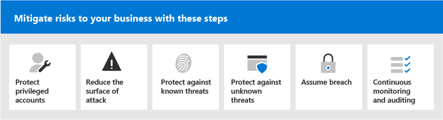

# Microsoft 365 Seguridad para los responsables de la toma de decisiones empresariales (BDMs)

En este artículo se analizan algunos de los escenarios de amenazas y ataques más comunes que enfrentan actualmente las organizaciones para sus entornos de Microsoft 365 y las acciones recomendadas para mitigar estos riesgos. Aunque Microsoft 365 viene con una amplia variedad de características de seguridad preconfiguradas, también requiere que usted como cliente aseste la responsabilidad de proteger sus propias identidades, datos y dispositivos usados para acceder a los servicios en la nube. Esta guía fue desarrollada por Kozeta Beam (Microsoft Cloud Security Architect) y Thiagaraj Sundararajan (Consultor sénior de Microsoft).

Este artículo se organiza por prioridad de trabajo, empezando por proteger las cuentas usadas para administrar los servicios y activos más críticos, como su inquilino, correo electrónico y SharePoint. Proporciona una forma metónica de acercarse a la seguridad y funciona junto con la hoja de cálculo siguiente para que pueda realizar un seguimiento del progreso con las partes interesadas y los equipos de toda la organización: Microsoft 365 seguridad para la hoja de cálculo [bdms](https://github.com/MicrosoftDocs/microsoft-365-docs/raw/public/microsoft-365/downloads/Microsoft-365-BDM-security-recommendations-spreadsheet.xlsx). 

Microsoft le proporciona la herramienta Puntuación segura dentro del espacio empresarial para analizar automáticamente su posición de seguridad en función de sus actividades regulares, asignar una puntuación y proporcionar recomendaciones de mejora de seguridad. Antes de realizar las acciones recomendadas en este artículo, tome nota de la puntuación y recomendaciones actuales. Las acciones recomendadas en este artículo aumentarán la puntuación. El objetivo no es lograr la puntuación máxima, sino tener en cuenta las oportunidades para proteger el entorno de forma que no afecte negativamente a la productividad de los usuarios. Consulta [Puntuación segura de Microsoft](defender/microsoft-secure-score.md).

Una cosa más antes de empezar . . . asegúrese de activar [el registro de auditoría](../compliance/search-the-audit-log-in-security-and-compliance.md). Necesitarás estos datos más adelante, en caso de que necesites investigar un incidente o una infracción. 

## Proteger cuentas con privilegios

Como primer paso, se recomienda garantizar que las cuentas críticas del entorno tengan una capa adicional de protección, ya que estas cuentas tienen acceso y permisos para administrar y modificar los recursos y servicios críticos, lo que puede afectar negativamente a toda la organización, si se pone en peligro. Proteger cuentas con privilegios es una de las formas más eficaces de protegerse de un atacante que busca elevar los permisos de una cuenta comprometida a una administrativa. 

|Recomendación  |E3 |E5  |
|---------|---------|---------|
|Exigir la autenticación multifactor (MFA) para todas las cuentas administrativas.||| 
|Implemente Azure Active Directory (Azure AD) Privileged Identity Management (PIM) para aplicar acceso con privilegios justo a tiempo a los recursos de Azure AD y Azure. También puede descubrir quién tiene acceso y revisar el acceso con privilegios.|         | |
|Implemente la administración de acceso con privilegios para administrar el control de acceso granular sobre las tareas de administración con privilegios en Office 365. |         | |
|Configurar y usar estaciones de trabajo de acceso con privilegios (PAW) para administrar servicios. No use las mismas estaciones de trabajo para navegar por Internet y comprobar el correo electrónico no relacionado con su cuenta administrativa.|  | | 

En el siguiente diagrama se ilustran estas funcionalidades.

Recomendaciones adicionales:
- Asegúrese de que las cuentas sincronizadas desde locales no tienen asignados roles de administrador para los servicios en la nube. Esto ayuda a evitar que un atacante aplique cuentas locales para obtener acceso administrativo a los servicios en la nube. 
- Asegúrese de que las cuentas de servicio no tienen asignados roles de administrador. Estas cuentas a menudo no se supervisan y se establecen con contraseñas que no expiran. Empiece por asegurarse de que las cuentas de servicios de AADConnect y ADFS no sean administradores globales de forma predeterminada.
- Quitar licencias de cuentas de administrador. A menos que haya un caso de uso específico para asignar licencias a cuentas de administrador específicas, quite las licencias de estas cuentas. 

## Reducir la superficie de ataque

El siguiente área de enfoque es reducir la superficie del ataque. Esto se puede lograr con el mínimo esfuerzo e impacto para los usuarios y servicios. Al reducir la superficie de ataque, los atacantes tienen menos formas de iniciar un ataque contra la organización.

Estos son algunos ejemplos:
- Deshabilitar los protocolos POP3, IMAP y SMTP. La mayoría de las organizaciones modernas ya no usan estos protocolos más antiguos. Puede deshabilitarlas de forma segura y permitir excepciones solo según sea necesario. 
- Reduzca y mantenga el número de administradores globales en el inquilino en el mínimo necesario. Esto reduce directamente la superficie de ataque para todas las aplicaciones en la nube. 
- Retire servidores y aplicaciones que ya no se usan en el entorno. 
- Implementar un proceso para deshabilitar y eliminar cuentas que ya no se usan. 

## Proteger contra amenazas conocidas

Entre las amenazas conocidas se incluyen malware, cuentas comprometidas y suplantación de identidad. Algunas protecciones contra estas amenazas se pueden implementar rápidamente sin ningún impacto directo para los usuarios, mientras que otras requieren más planeación y formación de los usuarios. 

|Recomendación  |E3  |E5  |
|---------|---------|---------|
|**Configurar la autenticación multifactor y usar directivas de acceso condicional recomendadas, incluidas** las directivas de riesgo de inicio de sesión. Microsoft recomienda y ha probado un conjunto de directivas que funcionan conjuntamente para proteger todas las aplicaciones en la nube, incluidos Office 365 y Microsoft 365 servicios. Consulta [Configuración de acceso de identidad y dispositivo.](./office-365-security/microsoft-365-policies-configurations.md) | ||
|**Requerir autenticación multifactor para todos los usuarios.** Si no tiene las licencias necesarias para implementar las directivas de acceso condicional recomendadas, como mínimo requiere autenticación multifactor para todos los usuarios.|||
|**Aumentar el nivel de protección contra malware en el correo**. El Office 365 o Microsoft 365 incluye protección contra malware, pero puede aumentar esta protección bloqueando los datos adjuntos con tipos de archivo que se usan habitualmente para malware.|||
|**Proteger el correo electrónico de ataques de suplantación de identidad dirigidos**. Si ha configurado uno o varios dominios personalizados para su entorno Office 365 o Microsoft 365, puede configurar la protección contra suplantación de identidad dirigida. La protección contra phishing, que forma parte de Defender para Office 365, puede ayudar a proteger su organización de ataques de suplantación de identidad malintencionados y otros ataques de suplantación de identidad. Si no ha configurado un dominio personalizado, no es necesario hacerlo.| ||
|**Proteger contra ataques de ransomware en el correo electrónico**. Ransomware quita el acceso a los datos mediante el cifrado de archivos o el bloqueo de pantallas del equipo. A continuación, intenta extorsionar dinero a las víctimas pidiéndoles "rescate", normalmente en forma de criptodivisas como Bitcoin, a cambio de devolver el acceso a sus datos. Puede ayudar a defenderse contra ransomware creando una o más reglas de flujo de correo para bloquear las extensiones de archivo que se usan habitualmente para ransomware, o para advertir a los usuarios que reciben estos datos adjuntos en el correo electrónico.|||
|**Bloquear conexiones de países con los que no haga negocios.** Cree una directiva de acceso condicional de Azure AD para bloquear las conexiones procedentes de estos países, creando de forma eficaz un firewall geográfico alrededor del inquilino.| ||

En el siguiente diagrama se ilustran estas funcionalidades.

## Proteger contra amenazas desconocidas

Después de agregar protecciones adicionales a sus cuentas con privilegios y protegerse contra ataques conocidos, cambie su atención a protegerse contra amenazas desconocidas. Los adversarios más decididos y avanzados usan métodos innovadores y nuevos y desconocidos para atacar a las organizaciones. Con la gran telemetría de datos de Microsoft recopilada por miles de millones de dispositivos, aplicaciones y servicios, podemos realizar Defender para Office 365 en Windows, Office 365 y Azure para evitar ataques Zero-Day, usar entornos de arena y comprobar la validez antes de permitir el acceso al contenido. 

|Recomendación  |E3  |E5  |
|---------|---------|---------|
|**Configurar Microsoft Defender para Office 365**: * Caja fuerte adjuntos * Caja fuerte links * Microsoft Defender para endpoint para SharePoint, OneDrive y Microsoft Teams * Anti-phishing in Defender for Office 365 protection|         | |
|**Configurar Microsoft Defender para las capacidades de punto de conexión:** * Antivirus de Windows Defender  * Protección contra vulnerabilidades   * Reducción de superficie de ataque   * Aislamiento basado en hardware  * Acceso controlado a carpetas     |         | |
|**Usa Microsoft Cloud App Security** para detectar aplicaciones SaaS y empezar a usar análisis de comportamiento y detección de anomalías. |         | |

En el siguiente diagrama se ilustran estas funcionalidades.

Recomendaciones adicionales:
- Proteger las comunicaciones de canales de partners, como correos electrónicos con TLS.
- Abra Teams federación solo a los partners con los que se comunique.
- No agregue dominios de remitente, remitentes individuales o direcciones IP de origen a la lista de permitidos, ya que esto permite omitir las comprobaciones de correo no deseado y malware: una práctica común con los clientes es agregar sus propios dominios aceptados o varios otros dominios en los que se hayan notificado problemas de flujo de correo electrónico a la lista de permitidos. No agregue dominios en la lista de filtrado de correo no deseado y de conexión, ya que esto podría omitir todas las comprobaciones de correo no deseado. 
- Habilitar las notificaciones de correo no deseado salientes: habilite las notificaciones de correo no deseado salientes a una lista de distribución internamente al departamento de soporte técnico o al equipo de administración de TI para informar si alguno de los usuarios internos envía correos electrónicos no deseados externamente. Esto podría ser un indicador de que la cuenta se ha visto comprometida.
- Deshabilitar PowerShell remoto para todos los usuarios: PowerShell remoto lo usan principalmente los administradores para obtener acceso a servicios con fines administrativos o acceso a la API mediante programación. Se recomienda deshabilitar esta opción para que los usuarios que no son administradores eviten el reconocimiento a menos que tengan un requisito empresarial para acceder a ella. 
- Bloquear el acceso al portal de administración Microsoft Azure a todos los usuarios que no son administradores. Para ello, cree una regla de acceso condicional para bloquear todos los usuarios, excepto los administradores. 

## Asumir infracción

Aunque Microsoft toma todas las medidas posibles para evitar amenazas y ataques, se recomienda trabajar siempre con la mentalidad "Asumir vulneración". Incluso si un atacante ha logrado entrar en el entorno, debemos asegurarnos de que no puedan filtrar datos o información de identidad del entorno. Por este motivo, se recomienda habilitar la protección contra pérdidas de datos confidenciales, como números de seguridad social, números de tarjetas de crédito, información personal adicional y otra información confidencial de nivel organizativo. 

La mentalidad "Asumir vulneración" requiere implementar una estrategia de red de confianza cero, lo que significa que los usuarios no son de plena confianza solo porque son internos de la red. En su lugar, como parte de la autorización de lo que los usuarios pueden hacer, se especifican conjuntos de condiciones y, cuando se cumplen estas condiciones, se aplican ciertos controles. Las condiciones pueden incluir el estado del dispositivo, el acceso a la aplicación, las operaciones que se realizan y el riesgo del usuario. Por ejemplo, una acción de inscripción de dispositivos siempre debe desencadenar la autenticación MFA para asegurarse de que no se agregan dispositivos de color rojo al entorno. 

Una estrategia de red de confianza cero también requiere saber dónde se almacena la información y aplicar los controles adecuados para la clasificación, protección y retención. Para proteger eficazmente los activos más críticos y confidenciales, primero debe identificar dónde se encuentran y realizar un inventario, lo que puede resultar complicado. A continuación, trabaje con su organización para definir una estrategia de gobierno. La definición de un esquema de clasificación para una organización y la configuración de directivas, etiquetas y condiciones requieren una planeación y preparación cuidadosas. Es importante tener en cuenta que no se trata de un proceso basado en LA. Asegúrese de trabajar con su equipo legal y de cumplimiento para desarrollar un esquema de clasificación y etiquetado adecuado para los datos de su organización.

Microsoft 365 capacidades de protección de la información pueden ayudarle a descubrir qué información tiene, dónde se almacena y qué información requiere protección adicional. La protección de la información es un proceso continuo y las capacidades de Microsoft 365 proporcionan visibilidad sobre cómo los usuarios usan y distribuyen información confidencial, dónde se almacena actualmente la información y dónde fluye. También puede ver cómo los usuarios administran la información regulada para asegurarse de que se aplican las etiquetas y protecciones adecuadas.

|Recomendación |E3|E5 |
|---------|---------|---------|
|**Revise y optimice el acceso condicional y las directivas** relacionadas para alinearse con los objetivos de una red de confianza cero. La protección contra amenazas conocidas incluye la implementación de un conjunto de [directivas recomendadas.](./office-365-security/microsoft-365-policies-configurations.md) Revisa la implementación de estas directivas para asegurarte de proteger tus aplicaciones y datos contra los hackers que han obtenido acceso a tu red. La directiva de protección de aplicaciones de Intune recomendada para Windows 10 permite Windows Information Protection (WIP). WIP protege contra pérdidas accidentales de datos de la organización a través de aplicaciones y servicios, como correo electrónico, redes sociales y la nube pública. |         ||
|**Deshabilitar el reenvío de correo electrónico externo**. Los hackers que obtienen acceso al buzón de un usuario pueden robar el correo estableciendo el buzón para reenviar automáticamente el correo electrónico. Esto puede ocurrir incluso sin el reconocimiento del usuario. Puede evitar que esto suceda configurando una regla de flujo de correo.| ||
|**Deshabilitar el uso compartido de calendario externo anónimo.** De forma predeterminada, se permite el uso compartido de calendario anónimo externo. [Deshabilitar el uso compartido de](/exchange/sharing/sharing-policies/modify-a-sharing-policy) calendarios para reducir posibles pérdidas de información confidencial.| ||
|**Configurar directivas de prevención de pérdida de datos para datos confidenciales**. Cree una directiva de prevención de pérdida de datos en el Centro de cumplimiento de seguridad para detectar y proteger datos confidenciales, como números de tarjeta de crédito, números de seguridad social y &amp; números de cuenta bancaria. Microsoft 365 incluye muchos tipos de información confidencial predefinidos que puede usar en las directivas de prevención de pérdida de datos. También puede crear sus propios tipos de información confidencial para datos confidenciales personalizados para su entorno. |||
|**Implementar directivas de clasificación de datos y protección de la información**. Implemente etiquetas de confidencialidad y úselas para clasificar y aplicar protección a datos confidenciales. También puede usar estas etiquetas en directivas de prevención de pérdida de datos. Si usa etiquetas de Azure Information Protection, le recomendamos que evite crear nuevas etiquetas en otros centros de administración.|         ||
|**Proteja los datos de servicios y aplicaciones de** terceros mediante Cloud App Security . Configure Cloud App Security directivas para proteger la información confidencial en aplicaciones en la nube de terceros, como Salesforce, Box o Dropbox. Puedes usar tipos de información confidencial y las etiquetas de confidencialidad que creaste en Cloud App Security directivas y aplicarlos en tus aplicaciones SaaS.   Microsoft Cloud App Security permite aplicar una amplia gama de procesos automatizados. Las directivas se pueden establecer para proporcionar exámenes de cumplimiento continuo, tareas legales de exhibición de documentos electrónicos, DLP para contenido confidencial compartido públicamente y mucho más. Cloud App Security puede supervisar cualquier tipo de archivo basado en más de 20 filtros de metadatos (por ejemplo, nivel de acceso, tipo de archivo). |         ||
|**Use [Microsoft Defender para endpoint](/windows/security/threat-protection/microsoft-defender-atp/information-protection-in-windows-overview) para identificar si los usuarios almacenan** información confidencial en sus Windows dispositivos . |         ||
|**Use [AIP Scanner para](/azure/information-protection/deploy-aip-scanner) identificar y clasificar información entre servidores y recursos compartidos de archivos.** Use la herramienta de informes AIP para ver los resultados y realizar las acciones adecuadas.|         ||

En el siguiente diagrama se ilustran estas funcionalidades.

## Supervisión y auditoría continuas

Por último, pero no menos importante, la supervisión continua y la auditoría del entorno de Microsoft 365 junto con el Windows y los dispositivos es fundamental para asegurarse de que es capaz de detectar y corregir rápidamente cualquier intrusión. Herramientas como Puntuación segura, Centro de seguridad y análisis avanzado de Microsoft Intelligent Graph proporcionan información valiosa en su inquilino y vinculan grandes cantidades de datos de seguridad y inteligencia de amenazas para proporcionarle una protección y detección de amenazas sin igual.

|Recomendación |E3 |E5 |
|---------|---------|---------|
|Asegúrese de **que el registro de auditoría** está activado.|||
|**Revisar Puntuación segura semanalmente:** puntuación segura es una ubicación central para obtener acceso al estado de seguridad de su empresa y realizar acciones en función de las recomendaciones de puntuación segura. Se recomienda realizar esta comprobación semanalmente.|||
|Use **Microsoft Defender para Office 365** herramientas: * Capacidades de investigación y respuesta de amenazas  * Investigación y respuesta automatizadas |         ||
|Usar **Microsoft Defender para endpoint**:  *    [Detección y respuesta de puntos de conexión](/windows/security/threat-protection/microsoft-defender-atp/overview-endpoint-detection-response)   * Investigación automatizada y corrección Puntuación segura  *    [Búsqueda avanzada](/windows/security/threat-protection/microsoft-defender-atp/advanced-hunting-overview)  |         ||
|Use **Microsoft Cloud App Security** para detectar comportamientos inusuales en aplicaciones en la nube para identificar ransomware, usuarios comprometidos o aplicaciones no fiables, analizar el uso de alto riesgo y corregir automáticamente para limitar el riesgo para su organización.|         ||
|Usa **Microsoft Azure Sentinel** o la herramienta SIEM actual para supervisar las amenazas en todo el entorno. |         ||
|**Implemente [Microsoft Defender for Identity para](/azure-advanced-threat-protection/what-is-atp)** supervisar y proteger contra amenazas dirigidas a su entorno local de Active Directory.   |         | |
|Use **Azure Defender** _ para supervisar las amenazas en cargas de trabajo híbridas y en la nube. Azure Defender_ incluye un nivel gratuito de funcionalidades y un nivel estándar de funcionalidades que se pagan en función de las horas de recursos o las transacciones.|         |         |

En el siguiente diagrama se ilustran estas funcionalidades.

Principales acciones de supervisión recomendadas:
- **Revisar Puntuación segura de Microsoft** semanalmente: la puntuación segura es una ubicación central para obtener acceso al estado de seguridad de su inquilino y realizar acciones en función de las recomendaciones principales. Se recomienda realizar esta comprobación semanalmente. Puntuación segura incluye recomendaciones de Azure AD, Intune, Cloud App Security y Microsoft Defender para endpoint, así como Office 365. 
- **Revisar inicios de sesión arriesgados semanalmente:** use el Centro de administración de Azure AD para revisar los inicios de sesión arriesgados semanalmente. El conjunto de reglas de acceso a dispositivos y identidades recomendados incluye una directiva para aplicar el cambio de contraseña en los inicios de sesión arriesgados.  
- Revisar los principales usuarios de malware y phished semanalmente: use Microsoft Defender para el Explorador de amenazas de Office 365 para revisar los principales usuarios dirigidos con malware y **phishing** y para averiguar la causa raíz de por qué estos usuarios se ven afectados.