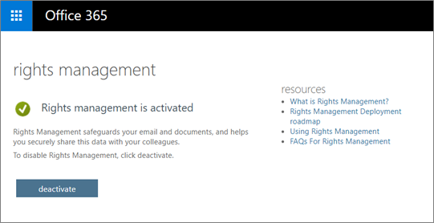
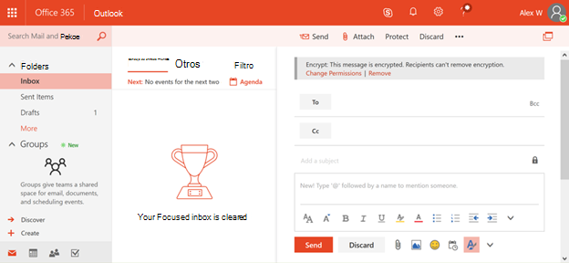

# <a name="protection-features-in-azure-information-protection-rolling-out-to-existing-tenants"></a><span data-ttu-id="55036-103">Características de protección de Azure Information Protection que se están implementando en los inquilinos existentes</span><span class="sxs-lookup"><span data-stu-id="55036-103">Protection features in Azure Information Protection rolling out to existing tenants</span></span>

[!INCLUDE [Microsoft 365 Defender rebranding](../includes/microsoft-defender-for-office.md)]

<span data-ttu-id="55036-104">**Se aplica a**</span><span class="sxs-lookup"><span data-stu-id="55036-104">**Applies to**</span></span>
- [<span data-ttu-id="55036-105">Plan 2 de Microsoft Defender para Office 365</span><span class="sxs-lookup"><span data-stu-id="55036-105">Microsoft Defender for Office 365 plan 2</span></span>](defender-for-office-365.md)
- [<span data-ttu-id="55036-106">Microsoft 365 Defender</span><span class="sxs-lookup"><span data-stu-id="55036-106">Microsoft 365 Defender</span></span>](../defender/microsoft-365-defender.md)

<span data-ttu-id="55036-107">Para ayudar con el paso inicial en la protección de su información, a partir de julio de 2018, todos los inquilinos elegibles de Azure Information Protection tendrán las características de protección de Azure Information Protection activadas de forma predeterminada.</span><span class="sxs-lookup"><span data-stu-id="55036-107">To help with the initial step in protecting your information, starting July 2018 all Azure Information Protection eligible tenants will have the protection features in Azure Information Protection turned on by default.</span></span> <span data-ttu-id="55036-108">Las características de protección de Azure Information Protection se conocían anteriormente en Office 365 como Rights Management o Azure RMS.</span><span class="sxs-lookup"><span data-stu-id="55036-108">The protection features in Azure Information Protection were formerly known in Office 365 as Rights Management or Azure RMS.</span></span> <span data-ttu-id="55036-109">Si su organización tiene un plan de servicio de Office E3 o un plan de servicio superior, ahora podrá empezar a proteger la información a través de Azure Information Protection al implantar estas características.</span><span class="sxs-lookup"><span data-stu-id="55036-109">If your organization has an Office E3 service plan or a higher service plan you will now get a head start protecting information through Azure Information Protection when we roll out these features.</span></span>

## <a name="changes-beginning-july-1-2018"></a><span data-ttu-id="55036-110">Cambios a partir del 1 de julio de 2018</span><span class="sxs-lookup"><span data-stu-id="55036-110">Changes beginning July 1, 2018</span></span>

<span data-ttu-id="55036-111">A partir del 1 de julio de 2018, Microsoft habilitará la funcionalidad de protección en Azure Information Protection para todas las organizaciones con uno de los siguientes planes de suscripción:</span><span class="sxs-lookup"><span data-stu-id="55036-111">Starting July 1, 2018, Microsoft will enable the protection capability in Azure Information Protection for all organizations with one of the following subscription plans:</span></span>

- <span data-ttu-id="55036-112">El cifrado de mensajes de Office 365 se ofrece como parte de Office 365 E3 y E5, Microsoft E3 y E5, Office 365 A1, A3 y A5, y Office 365 G3 y G5.</span><span class="sxs-lookup"><span data-stu-id="55036-112">Office 365 Message Encryption is offered as part of Office 365 E3 and E5, Microsoft E3 and E5, Office 365 A1, A3, and A5, and Office 365 G3 and G5.</span></span> <span data-ttu-id="55036-113">No necesita licencias adicionales para recibir las nuevas funcionalidades de protección con tecnología de Azure Information Protection.</span><span class="sxs-lookup"><span data-stu-id="55036-113">You do not need additional licenses to receive the new protection capabilities powered by Azure Information Protection.</span></span>

- <span data-ttu-id="55036-114">También puede agregar Azure Information Protection Plan 1 a los siguientes planes para recibir las nuevas funcionalidades de cifrado de mensajes de Office 365: Exchange Online Plan 1, Exchange Online Plan 2, Office 365 F1, Microsoft 365 Empresa Basic, Microsoft 365 Empresa Standard o Office 365 Enterprise E1.</span><span class="sxs-lookup"><span data-stu-id="55036-114">You can also add Azure Information Protection Plan 1 to the following plans to receive the new Office 365 Message Encryption capabilities: Exchange Online Plan 1, Exchange Online Plan 2, Office 365 F1, Microsoft 365 Business Basic, Microsoft 365 Business Standard, or Office 365 Enterprise E1.</span></span>

- <span data-ttu-id="55036-115">Cada usuario que se beneficie del cifrado de mensajes de Office 365 debe tener una licencia para que la característica la pueda cubrir.</span><span class="sxs-lookup"><span data-stu-id="55036-115">Each user benefiting from Office 365 Message Encryption needs to be licensed to be covered by the feature.</span></span>

- <span data-ttu-id="55036-116">Para obtener la lista completa, vea las descripciones del servicio [Exchange Online](/office365/servicedescriptions/exchange-online-service-description/exchange-online-service-description) para Cifrado de mensajes de Office 365.</span><span class="sxs-lookup"><span data-stu-id="55036-116">For the full list, see the [Exchange Online service descriptions](/office365/servicedescriptions/exchange-online-service-description/exchange-online-service-description) for Office 365 Message Encryption.</span></span>

<span data-ttu-id="55036-117">Los administradores de inquilinos pueden comprobar el estado de protección en el portal de administradores de Office 365.</span><span class="sxs-lookup"><span data-stu-id="55036-117">Tenant administrators can check the protection status in the Office 365 administrator portal.</span></span>



## <a name="why-are-we-making-this-change"></a><span data-ttu-id="55036-119">¿Por qué estamos realizando este cambio?</span><span class="sxs-lookup"><span data-stu-id="55036-119">Why are we making this change?</span></span>

<span data-ttu-id="55036-120">El cifrado de mensajes de Office 365 aprovecha las capacidades de protección de Azure Information Protection.</span><span class="sxs-lookup"><span data-stu-id="55036-120">Office 365 Message Encryption leverages the protection capabilities in Azure Information Protection.</span></span> <span data-ttu-id="55036-121">En el centro de las mejoras recientes en el cifrado de mensajes de Office 365 y nuestras inversiones más amplias en la protección de la información en Microsoft 365, estamos facilitando a las organizaciones activar y usar nuestras capacidades de protección, ya que históricamente, las tecnologías de cifrado han sido difíciles de configurar.</span><span class="sxs-lookup"><span data-stu-id="55036-121">At the heart of the recent improvements to Office 365 Message Encryption and our broader investments to information protection in Microsoft 365, we are making it easier for organizations to turn on and use our protection capabilities, as historically, encryption technologies have been difficult to set up.</span></span> <span data-ttu-id="55036-122">Al activar las características de protección de Azure Information Protection de forma predeterminada, puede empezar rápidamente a proteger los datos confidenciales.</span><span class="sxs-lookup"><span data-stu-id="55036-122">By turning on the protection features in Azure Information Protection by default, you can quickly get started to protect your sensitive data.</span></span>

## <a name="does-this-impact-me"></a><span data-ttu-id="55036-123">¿Esto me afecta?</span><span class="sxs-lookup"><span data-stu-id="55036-123">Does this impact me?</span></span>

<span data-ttu-id="55036-124">Si su organización ha adquirido una licencia elegible de Office 365, este cambio afectará a su inquilino.</span><span class="sxs-lookup"><span data-stu-id="55036-124">If your organization has purchased an eligible Office 365 license, then your tenant will be impacted by this change.</span></span>

> [!IMPORTANT]
> <span data-ttu-id="55036-125">Si usa Active Directory Rights Management Services (AD RMS) en su entorno local, debe optar por no participar en este cambio inmediatamente o migrar a Azure Information Protection antes de realizar este cambio en los próximos 30 días.</span><span class="sxs-lookup"><span data-stu-id="55036-125">If you're using Active Directory Rights Management Services (AD RMS) in your on-premises environment, you must either opt-out of this change immediately or migrate to Azure Information Protection before we roll out this change within the next 30 days.</span></span> <span data-ttu-id="55036-126">Para obtener información sobre cómo optar por no participar, vea "Uso AD RMS, ¿cómo puedo optar por no participar?"</span><span class="sxs-lookup"><span data-stu-id="55036-126">For information on how to opt-out, see "I use AD RMS, how do I opt out?"</span></span> <span data-ttu-id="55036-127">más adelante en este artículo.</span><span class="sxs-lookup"><span data-stu-id="55036-127">later in this article.</span></span> <span data-ttu-id="55036-128">Si prefiere migrar, consulte [Migración de AD RMS a Azure Information Protection.](/azure/information-protection/plan-design/migrate-from-ad-rms-to-azure-rms).</span><span class="sxs-lookup"><span data-stu-id="55036-128">If you prefer to migrate, see [Migrating from AD RMS to Azure Information Protection.](/azure/information-protection/plan-design/migrate-from-ad-rms-to-azure-rms).</span></span>

## <a name="can-i-use-azure-information-protection-with-active-directory-rights-management-services-ad-rms"></a><span data-ttu-id="55036-129">¿Puedo usar Azure Information Protection con Active Directory Rights Management Services (AD RMS)?</span><span class="sxs-lookup"><span data-stu-id="55036-129">Can I use Azure Information Protection with Active Directory Rights Management Services (AD RMS)?</span></span>

<span data-ttu-id="55036-130">No.</span><span class="sxs-lookup"><span data-stu-id="55036-130">No.</span></span> <span data-ttu-id="55036-131">No se trata de un escenario de implementación compatible.</span><span class="sxs-lookup"><span data-stu-id="55036-131">This is not a supported deployment scenario.</span></span> <span data-ttu-id="55036-132">Sin realizar los pasos adicionales de exclusión, es posible que algunos equipos comiencen a usar automáticamente el servicio Azure Rights Management y también se conecten al clúster de AD RMS.</span><span class="sxs-lookup"><span data-stu-id="55036-132">Without taking the additional opt-out steps, some computers might automatically start using the Azure Rights Management service and also connect to your AD RMS cluster.</span></span> <span data-ttu-id="55036-133">Este escenario no es compatible y tiene resultados poco confiables, por lo que es importante que opte por no realizar este cambio en los próximos 30 días antes de que se presenten estas nuevas características.</span><span class="sxs-lookup"><span data-stu-id="55036-133">This scenario isn't supported and has unreliable results, so it's important that you opt out of this change within the next 30 days before we roll out these new features.</span></span> <span data-ttu-id="55036-134">Para obtener información sobre cómo optar por no participar, vea "Uso AD RMS, ¿cómo puedo optar por no participar?"</span><span class="sxs-lookup"><span data-stu-id="55036-134">For information on how to opt-out, see "I use AD RMS, how do I opt out?"</span></span> <span data-ttu-id="55036-135">más adelante en este artículo.</span><span class="sxs-lookup"><span data-stu-id="55036-135">later in this article.</span></span> <span data-ttu-id="55036-136">Si prefiere migrar, consulte [Migración de AD RMS a Azure Information Protection.](/azure/information-protection/plan-design/migrate-from-ad-rms-to-azure-rms)</span><span class="sxs-lookup"><span data-stu-id="55036-136">If you prefer to migrate, see [Migrating from AD RMS to Azure Information Protection.](/azure/information-protection/plan-design/migrate-from-ad-rms-to-azure-rms)</span></span>

## <a name="how-do-i-know-if-im-using-ad-rms"></a><span data-ttu-id="55036-137">¿Cómo sé si uso AD RMS?</span><span class="sxs-lookup"><span data-stu-id="55036-137">How do I know if I'm using AD RMS?</span></span>

<span data-ttu-id="55036-138">Use estas instrucciones de Preparación del entorno para Azure Rights Management cuando también tenga [Active Directory Rights Management Services (AD RMS)](/azure/information-protection/deploy-use/prepare-environment-adrms) para comprobar si ha implementado AD RMS:</span><span class="sxs-lookup"><span data-stu-id="55036-138">Use these instructions from [Preparing the environment for Azure Rights Management when you also have Active Directory Rights Management Services (AD RMS)](/azure/information-protection/deploy-use/prepare-environment-adrms) to check if you have deployed AD RMS:</span></span>

1. <span data-ttu-id="55036-139">Aunque es opcional, la mayoría de las implementaciones de AD RMS publican el punto de conexión de servicio (SCP) en Active Directory para que los equipos de dominio puedan detectar el clúster de AD RMS.</span><span class="sxs-lookup"><span data-stu-id="55036-139">Although optional, most AD RMS deployments publish the service connection point (SCP) to Active Directory so that domain computers can discover the AD RMS cluster.</span></span>

   <span data-ttu-id="55036-140">Use la edición ADSI para ver si tiene un SCP publicado en Active Directory: CN=Configuration [nombre del servidor], CN=Services, CN=RightsManagementServices, CN=SCP</span><span class="sxs-lookup"><span data-stu-id="55036-140">Use ADSI Edit to see whether you have an SCP published in Active Directory: CN=Configuration [server name], CN=Services, CN=RightsManagementServices, CN=SCP</span></span>

2. <span data-ttu-id="55036-141">Si no usa un SCP, los equipos Windows que se conectan a un clúster de AD RMS deben configurarse para la detección de servicios del lado cliente o el redireccionamiento de licencias mediante el Registro de Windows: `HKEY_LOCAL_MACHINE\SOFTWARE\Microsoft\MSIPC\ServiceLocation or HKEY_LOCAL_MACHINE\SOFTWARE\Wow6432Node\Microsoft\MSIPC\ServiceLocation` .</span><span class="sxs-lookup"><span data-stu-id="55036-141">If you are not using an SCP, Windows computers that connect to an AD RMS cluster must be configured for client-side service discovery or licensing redirection by using the Windows registry: `HKEY_LOCAL_MACHINE\SOFTWARE\Microsoft\MSIPC\ServiceLocation or HKEY_LOCAL_MACHINE\SOFTWARE\Wow6432Node\Microsoft\MSIPC\ServiceLocation`.</span></span>

<span data-ttu-id="55036-142">Para obtener más información acerca de estas configuraciones del Registro, vea [Enabling client-side service discovery by using the Windows Registry](/azure/information-protection/rms-client/client-deployment-notes#enabling-client-side-service-discovery-by-using-the-windows-registry) and [Redirecting licensing server traffic](/azure/information-protection/rms-client/client-deployment-notes#redirecting-licensing-server-traffic).</span><span class="sxs-lookup"><span data-stu-id="55036-142">For more information about these registry configurations, see [Enabling client-side service discovery by using the Windows registry](/azure/information-protection/rms-client/client-deployment-notes#enabling-client-side-service-discovery-by-using-the-windows-registry) and [Redirecting licensing server traffic](/azure/information-protection/rms-client/client-deployment-notes#redirecting-licensing-server-traffic).</span></span>

## <a name="i-use-ad-rms-how-do-i-opt-out"></a><span data-ttu-id="55036-143">Uso AD RMS, ¿cómo puedo excluirme?</span><span class="sxs-lookup"><span data-stu-id="55036-143">I use AD RMS, how do I opt out?</span></span>

<span data-ttu-id="55036-144">Para no participar en el próximo cambio, siga estos pasos:</span><span class="sxs-lookup"><span data-stu-id="55036-144">To opt out of the upcoming change, complete these steps:</span></span>

1. <span data-ttu-id="55036-145">Con una cuenta laboral o educativa que tenga permisos de administrador global en su organización, inicie una sesión de Windows PowerShell y conéctese a Exchange Online.</span><span class="sxs-lookup"><span data-stu-id="55036-145">Using a work or school account that has global administrator permissions in your organization, start a Windows PowerShell session and connect to Exchange Online.</span></span> <span data-ttu-id="55036-146">Para obtener instrucciones, consulte [Conexión a Exchange Online PowerShell](/powershell/exchange/connect-to-exchange-online-powershell).</span><span class="sxs-lookup"><span data-stu-id="55036-146">For instructions, see [Connect to Exchange Online PowerShell](/powershell/exchange/connect-to-exchange-online-powershell).</span></span>

2. <span data-ttu-id="55036-147">Ejecute el cmdlet Set-IRMConfiguration con la siguiente sintaxis:</span><span class="sxs-lookup"><span data-stu-id="55036-147">Run the Set-IRMConfiguration cmdlet using the following syntax:</span></span>

  ```powershell
  Set-IRMConfiguration -AutomaticServiceUpdateEnabled $false
  ```

## <a name="what-can-i-expect-after-this-change-has-been-made"></a><span data-ttu-id="55036-148">¿Qué puedo esperar después de realizar este cambio?</span><span class="sxs-lookup"><span data-stu-id="55036-148">What can I expect after this change has been made?</span></span>

<span data-ttu-id="55036-149">Una vez habilitado, siempre que no haya optado por no participar, puede empezar a usar la nueva versión de Cifrado de mensajes de Office 365 que se anunció en [Microsoft Ignite 2017](https://techcommunity.microsoft.com/t5/Security-Privacy-and-Compliance/Email-Encryption-and-Rights-Protection/ba-p/110801) y aprovecha las capacidades de cifrado y protección de Azure Information Protection.</span><span class="sxs-lookup"><span data-stu-id="55036-149">Once this is enabled, provided you haven't opted out, you can start using the new version of Office 365 Message Encryption which was announced at [Microsoft Ignite 2017](https://techcommunity.microsoft.com/t5/Security-Privacy-and-Compliance/Email-Encryption-and-Rights-Protection/ba-p/110801) and leverages the encryption and protection capabilities of Azure Information Protection.</span></span>



<span data-ttu-id="55036-151">Para obtener más información acerca de las nuevas mejoras, vea Cifrado de mensajes de [Office 365](../../compliance/ome.md).</span><span class="sxs-lookup"><span data-stu-id="55036-151">For more information about the new enhancements, see [Office 365 Message Encryption](../../compliance/ome.md).</span></span>