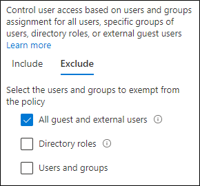

# Directivas para permitir el acceso de invitado y el acceso de usuarios externos B2BPolicies for allowing guest access and B2B external user access

En este artículo se describe cómo ajustar las directivas recomendadas de acceso a identidades y dispositivos para permitir el acceso a invitados y usuarios externos que tienen una cuenta de Azure Active Directory (Azure AD) empresa a empresa (B2B).This article discusses adjusting the recommended device and identity access policies to allow access for guests and external users that have an Azure Active Directory (Azure AD) Business-to-Business (B2B) account. Esta guía se basa en las directivas [comunes de acceso a dispositivos y identidades.](identity-access-policies.md)This guidance builds on the [common identity and device access policies](identity-access-policies.md).

Estas recomendaciones están diseñadas para aplicarse al nivel **de protección** de línea base.These recommendations are designed to apply to the **baseline** tier of protection. Pero también puede ajustar las recomendaciones en función de sus necesidades específicas de protección **confidencial** **y altamente** regulada.But you can also adjust the recommendations based on your specific needs for **sensitive** and **highly regulated** protection.

Proporcionar una ruta de acceso para que las cuentas B2B se autentiquen con el inquilino de Azure AD no proporciona a estas cuentas acceso a todo el entorno.Providing a path for B2B accounts to authenticate with your Azure AD tenant doesn't give these accounts access to your entire environment. Los usuarios B2B y sus cuentas tienen acceso a servicios y recursos, como archivos, compartidos con ellos mediante la directiva de acceso condicional.B2B users and their accounts have access to services and resources, like files, shared with them by Conditional Access policy.

## Actualizar las directivas comunes para permitir y proteger el acceso de invitados y usuarios externosUpdating the common policies to allow and protect guests and external user access

En este diagrama se muestran las directivas que se agregarán o actualizarán entre las directivas comunes de acceso a dispositivos y identidades, para el acceso de invitado b2B y de usuario externo.This diagram shows which policies to add or update among the common identity and device access policies, for B2B guest and external user access.

En la tabla siguiente se enumeran las directivas que debe crear y actualizar.The following table lists the policies you either need to create and update. Las directivas comunes se vinculan a las instrucciones de configuración asociadas en [el artículo Identidad común y directivas de acceso a dispositivos.](identity-access-policies.md)The common policies link to the associated configuration instructions in the [Common identity and device access policies](identity-access-policies.md) article.

|Nivel de protecciónProtection level|DirectivasPolicies|Más informaciónMore information|
|---|---|---|
|**Baseline****Baseline**|[Requerir MFA siempre para invitados y usuarios externosRequire MFA always for guests and external users](identity-access-policies.md#require-mfa-based-on-sign-in-risk)|Cree esta nueva directiva y configure:Create this new policy and configure: <ul><li>Para **Asignaciones > Usuarios** y grupos > Incluir , elija **Seleccionar** usuarios y grupos y, a continuación, seleccione Todos los usuarios **invitados y externos.**For **Assignments > Users and groups > Include**, choose **Select users and groups**, and then select **All guest and external users**.</li><li>Para **las asignaciones > condiciones > inicio** de sesión, deje todas las opciones desactivadas para aplicar siempre la autenticación multifactor (MFA).For **Assignments > Conditions > Sign-in**, leave all options unchecked to always enforce multi-factor authentication (MFA).</li></ul>|
||[Requerir MFA cuando el riesgo de inicio de sesión *es medio* o *alto*Require MFA when sign-in risk is *medium* or *high*](identity-access-policies.md#require-mfa-based-on-sign-in-risk)|Modifique esta directiva para excluir invitados y usuarios externos.Modify this policy to exclude guests and external users.|
||[Exigir equipos PC compatiblesRequire compliant PCs](identity-access-policies.md#require-compliant-pcs-but-not-compliant-phones-and-tablets)|Modifique esta directiva para excluir invitados y usuarios externos.Modify this policy to exclude guests and external users.|

Para incluir o excluir **invitados** y usuarios externos en directivas de acceso condicional, para Asignaciones > Usuarios y grupos > Incluir o **Excluir**, compruebe Todos los usuarios invitados **y externos**.To include or exclude guests and external users in Conditional Access policies, for **Assignments > Users and groups > Include** or **Exclude**, check **All guest and external users**.

## Más informaciónMore information

### Acceso de invitados y usuarios externos con Microsoft TeamsGuests and external user access with Microsoft Teams

Microsoft Teams define los siguientes usuarios:Microsoft Teams defines the following users:

- **El acceso** de invitado usa una cuenta B2B de Azure AD que se puede agregar como miembro de un equipo y tener acceso a las comunicaciones y recursos del equipo.**Guest access** uses an Azure AD B2B account that can be added as a member of a team and have access to the communications and resources of the team.

- **El acceso** externo es para un usuario externo que no tiene una cuenta B2B.**External access** is for an external user that doesn't have a B2B account. El acceso de usuarios externos incluye invitaciones, llamadas, chats y reuniones, pero no incluye la pertenencia al equipo ni el acceso a los recursos del equipo.External user access includes invitations, calls, chats, and meetings, but doesn't include team membership and access to the resources of the team.

Para obtener más información, vea la [comparación entre invitados y el acceso de usuarios externos para teams](/microsoftteams/communicate-with-users-from-other-organizations#compare-external-and-guest-access).For more information, see the [comparison between guests and external user access for teams](/microsoftteams/communicate-with-users-from-other-organizations#compare-external-and-guest-access).

Para obtener más información sobre cómo proteger las directivas de acceso a dispositivos y identidades para Teams, consulta Recomendaciones de directivas para proteger [chats,](teams-access-policies.md)grupos y archivos de Teams.For more information on securing identity and device access policies for Teams, see [Policy recommendations for securing Teams chats, groups, and files](teams-access-policies.md).

### Requerir MFA siempre para usuarios invitados y externosRequire MFA always for guest and external users

Esta directiva solicita a los invitados que se registren en MFA en el inquilino, independientemente de si están registrados para MFA en su inquilino principal.This policy prompts guests to register for MFA in your tenant, regardless of whether they're registered for MFA in their home tenant. Al obtener acceso a recursos en el inquilino, los invitados y los usuarios externos deben usar MFA para cada solicitud.When accessing resources in your tenant, guests and external users are required to use MFA for every request.

### Excluir invitados y usuarios externos de MFA basada en riesgosExcluding guests and external users from risk-based MFA

Aunque las organizaciones pueden aplicar directivas basadas en riesgos para usuarios B2B con Azure AD Identity Protection, existen limitaciones en la implementación de Azure AD Identity Protection para usuarios de colaboración B2B en un directorio de recursos debido a su identidad existente en su directorio principal.While organizations can enforce risk-based policies for B2B users using Azure AD Identity Protection, there are limitations in the implementation of Azure AD Identity Protection for B2B collaboration users in a resource directory due to their identity existing in their home directory. Debido a estas limitaciones, Microsoft recomienda excluir invitados de las directivas de MFA basadas en riesgos y requerir que estos usuarios usen siempre MFA.Due to these limitations, Microsoft recommends you exclude guests from risk-based MFA policies and require these users to always use MFA.

Para obtener más información, vea [Limitations of Identity Protection for B2B collaboration users](/azure/active-directory/identity-protection/concept-identity-protection-b2b#limitations-of-identity-protection-for-b2b-collaboration-users).For more information, see [Limitations of Identity Protection for B2B collaboration users](/azure/active-directory/identity-protection/concept-identity-protection-b2b#limitations-of-identity-protection-for-b2b-collaboration-users).

### Excluir invitados y usuarios externos de la administración de dispositivosExcluding guests and external users from device management

Solo una organización puede administrar un dispositivo.Only one organization can manage a device. Si no excluyes a los invitados ni a los usuarios externos de las directivas que requieren el cumplimiento de dispositivos, estas directivas bloquearán a estos usuarios.If you don't exclude guests and external users from policies that require device compliance, these policies will block these users.

## Paso siguienteNext step

Configurar directivas de acceso condicional para:Configure Conditional Access policies for:

- [Microsoft TeamsMicrosoft Teams](teams-access-policies.md)
- [Exchange OnlineExchange Online](secure-email-recommended-policies.md)
- [SharePointSharePoint](sharepoint-file-access-policies.md)