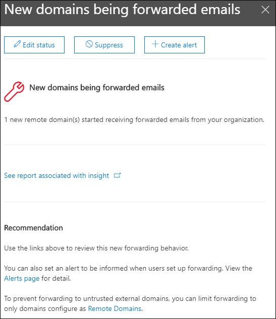

# Nuevos dominios que se reenvía información de correo electrónico en el Centro de seguridad & cumplimiento

[!INCLUDE [Microsoft 365 Defender rebranding](../includes/microsoft-defender-for-office.md)]

**Se aplica a**
- [Exchange Online Protection](exchange-online-protection-overview.md)
- [Plan 1 y Plan 2 de Microsoft Defender para Office 365](defender-for-office-365.md)
- [Microsoft 365 Defender](../defender/microsoft-365-defender.md)

Existen motivos empresariales válidos para reenviar mensajes de correo electrónico a destinatarios externos en dominios específicos. Sin embargo, es sospechoso cuando los usuarios de la organización comienzan de repente a reenviar mensajes a un dominio al que nadie de la organización haya reenviado mensajes (un nuevo dominio).

Esta condición puede indicar que las cuentas de usuario están en peligro. Si sospecha que las cuentas se han visto comprometidas, consulte [Responder a una cuenta de correo electrónico comprometida.](responding-to-a-compromised-email-account.md)

La **información de correo electrónico** nuevos dominios que se reenvía en el Centro de seguridad y [cumplimiento](https://protection.office.com) & le notifica cuándo los usuarios de su organización reenvía mensajes a nuevos dominios.

Esta información solo aparece cuando se detecta el problema y aparece en la página [Informe de reenvío.](view-mail-flow-reports.md#forwarding-report)

Al hacer clic en el widget, aparece un control flotante donde puede encontrar más detalles sobre los mensajes reenviados, incluido un vínculo al informe [de reenvío](view-mail-flow-reports.md#forwarding-report).

También puede acceder a esta página de detalles  al seleccionar la información después de hacer clic en Ver todo en el área Información **principal & recomendaciones** en (**Panel** de informes \>  o <https://protection.office.com/insightdashboard> ).

Para evitar el reenvío automático de mensajes a dominios externos, configure un dominio remoto para algunos o todos los dominios externos. Para obtener más información, vea [Manage remote domains in Exchange Online](/Exchange/mail-flow-best-practices/remote-domains/manage-remote-domains).

## Temas relacionados

Para obtener información acerca de otras perspectivas en el panel flujo de correo, vea [Mail flow insights in the Security & Compliance Center](mail-flow-insights-v2.md).