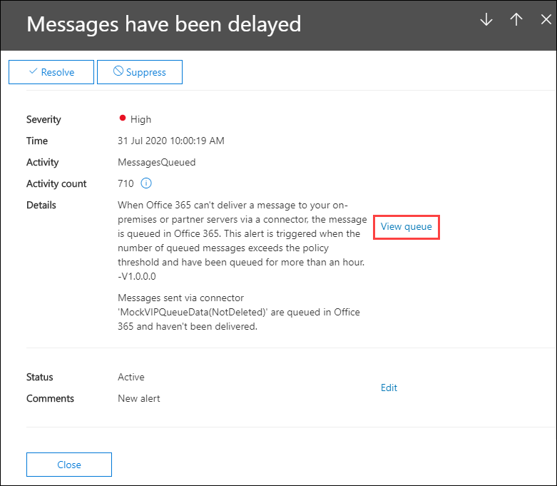

# Información sobre colas en el Centro de seguridad & cumplimientoQueues insight in the Security & Compliance Center

[!INCLUDE [Microsoft 365 Defender rebranding](../includes/microsoft-defender-for-office.md)]

**Se aplica a****Applies to**
- [Exchange Online ProtectionExchange Online Protection](exchange-online-protection-overview.md)
- [Plan 1 y Plan 2 de Microsoft Defender para Office 365Microsoft Defender for Office 365 plan 1 and plan 2](defender-for-office-365.md)
- [Microsoft 365 DefenderMicrosoft 365 Defender](../defender/microsoft-365-defender.md)

Cuando los mensajes no se pueden enviar desde su organización a los servidores de correo electrónico locales o asociados mediante conectores, los mensajes se ponen en cola en Microsoft 365.When messages can't be sent from your organization to your on-premises or partner email servers using connectors, the messages are queued in Microsoft 365. Algunos ejemplos comunes que causan esta condición son:Common examples that cause this condition are:

- El conector está configurado incorrectamente.The connector is incorrectly configured.
- Ha habido cambios de red o firewall en el entorno local.There have been networking or firewall changes in your on-premises environment.

Microsoft 365 seguirá reintentar la entrega durante 24 horas.Microsoft 365 will continue to retry to delivery for 24 hours. Después de 24 horas, los mensajes expirarán y se devolverán a los remitentes en informes de no entrega (también conocidos como NDR o mensajes de devolución).After 24 hours, the messages will expire and will be returned to the senders in non-delivery reports (also known as a NDRs or bounce messages).

Si el volumen de correo electrónico en cola supera el umbral predefinido (el valor predeterminado es 200 mensajes), la información estará disponible en las siguientes ubicaciones:If the queued email volume exceeds the pre-defined threshold (the default value is 200 messages), the information is available in the following locations:

- La **información de colas** en el panel Flujo de [correo](mail-flow-insights-v2.md) del Centro de seguridad [& cumplimiento](https://protection.office.com).The **Queues** insight in the [Mail flow dashboard](mail-flow-insights-v2.md) in the [Security & Compliance Center](https://protection.office.com). Para obtener más información, vea la sección [Queues insight en la sección Panel de flujo de correo](#queues-insight-in-the-mail-flow-dashboard) de este artículo.For more information, see the [Queues insight in the Mail flow dashboard](#queues-insight-in-the-mail-flow-dashboard) section in this article.

- Una alerta se muestra en **Alertas** recientes en el panel Alertas del Centro de [seguridad & cumplimiento](https://protection.office.com) ( Panel **de** \> **alertas** o <https://protection.office.com/alertsdashboard> ).An alert is displayed in **Recent alerts** the Alerts dashboard in the [Security & Compliance Center](https://protection.office.com) (**Alerts** \> **Dashboard** or <https://protection.office.com/alertsdashboard>).

  

- Los administradores recibirán una notificación por correo electrónico basada en la configuración de la directiva de alerta predeterminada denominada **Mensajes se han retrasado**.Admins will receive an email notification based on the configuration of the default alert policy named **Messages have been delayed**. Para configurar las opciones de notificación de esta alerta, consulte la siguiente sección.To configure the notification settings for this alert, see the next section.

  Para obtener más información acerca de las directivas de alerta, vea [Directivas de alerta en el Centro de seguridad & cumplimiento](../../compliance/alert-policies.md).For more information about alert policies, see [Alert policies in the Security & Compliance Center](../../compliance/alert-policies.md).

## Personalizar alertas de colaCustomize queue alerts

1. En el [Centro de & cumplimiento,](https://protection.office.com)vaya a **Directivas de** \> **alertas o** abra <https://protection.office.com/alertpolicies> .In the [Security & Compliance Center](https://protection.office.com), go to **Alerts** \> **Alert policies** or open <https://protection.office.com/alertpolicies>.

2. En la **página Directivas de** alerta, busque y seleccione la directiva denominada Mensajes que se han **retrasado**.On the **Alert policies** page, find and select the policy named **Messages have been delayed**.

3. En el **menú desplegable Mensaje se ha** retrasado que se abre, puede activar o desactivar la alerta y configurar las opciones de notificación.In the **Message have been delayed** flyout that opens, you can turn the alert on or off and configure the notification settings.

   

   - **Estado:** puede activar o desactivar la alerta.**Status**: You can toggle the alert on or off.

   - **Destinatarios de correo electrónico** y **límite de notificación diaria:** haga clic **en Editar** para configurar las siguientes opciones:**Email recipients** and **Daily notification limit**: Click **Edit** to configure the following settings:

4. Para configurar las opciones de notificación, haga clic **en Editar**.To configure the notification settings, click **Edit**. En el **control desplegable Editar** directiva que aparece, configure las siguientes opciones:In the **Edit policy** flyout that appears, configure the following settings:

   - **Enviar notificaciones por correo** electrónico: el valor predeterminado está en.**Send email notifications**: The default value is on.
   - **Destinatarios de correo** electrónico: el valor predeterminado es **TenantAdmins**.**Email recipients**: The default value is **TenantAdmins**.
   - **Límite de notificación diario:** el valor predeterminado **es No limit**.**Daily notification limit**: The default value is **No limit**.
   - **Umbral:** el valor predeterminado es 200.**Threshold**: The default value is 200.

   

5. Cuando haya terminado, haga clic en **Guardar** y **cerrar**.When you're finished, click **Save** and **Close**.

## Información sobre colas en el panel flujo de correoQueues insight in the Mail flow dashboard

Incluso si el volumen de mensajes en cola no ha superado el  umbral y ha  generado una alerta, puede usar la información de colas en el panel flujo de correo para ver los mensajes que se han puesto en cola durante más de una hora y realizar acciones antes de que el número de mensajes en cola sea demasiado grande.Even if the queued message volume hasn't exceeded the threshold and generated an alert, you can still use the **Queues** insight in the [Mail flow dashboard](mail-flow-insights-v2.md) to see messages that have been queued for more than one hour, and take action before the number of queued messages becomes too large.

Si hace clic en el número de mensajes del widget, aparecerá un **control** flotante Mensajes en cola con la siguiente información:If you click the number of messages on the widget, a **Messages queued** flyout appears with the following information:

- **Número de mensajes en cola****Number of queued messages**
- **Nombre del conector:** haga clic en el nombre del conector para administrar el conector en el Centro de administración de Exchange (EAC).**Connector name**: Click on the connector name to manage the connector in the Exchange admin center (EAC).
- **Hora de inicio de cola****Queue started time**
- **Mensajes más antiguos expirados****Oldest messages expired**
- **Servidor de destino****Destination server**
- **Última dirección IP****Last IP address**
- **Último error****Last error**
- **Cómo corregir:** hay problemas y soluciones comunes disponibles.**How to fix**: Common issues and solutions are available. Si es un **vínculo Corregir ahora está** disponible, haga clic en él para solucionar el problema.If is a **Fix it now** link is available, click it to fix the problem. De lo contrario, haga clic en los vínculos disponibles para obtener más información sobre el error y las posibles soluciones.Otherwise, click on any available links for more information about the error and possible solutions.

Se muestra el mismo menú desplegable después de hacer clic en **Ver cola** en los detalles de una alerta de retraso de **mensajes.**The same flyout is displayed after you click **View queue** in the details of a **Messages have been delayed** alert.

## Ver tambiénSee also

Para obtener información acerca de otras perspectivas en el panel flujo de correo, vea [Mail flow insights in the Security & Compliance Center](mail-flow-insights-v2.md).For information about other insights in the Mail flow dashboard, see [Mail flow insights in the Security & Compliance Center](mail-flow-insights-v2.md).
