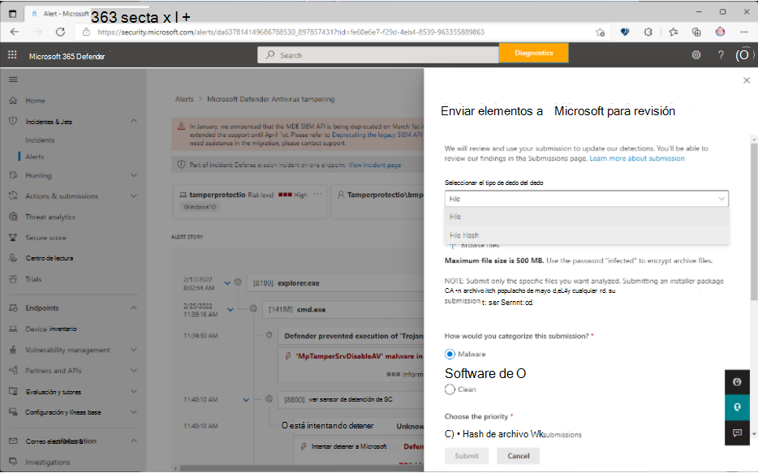

# Envío de archivos en Microsoft Defender para punto de conexión

[!INCLUDE [Microsoft 365 Defender rebranding](../../includes/microsoft-defender.md)]

**Se aplica a**

- [Microsoft Defender para punto de conexión](https://go.microsoft.com/fwlink/p/?linkid=2146806)
- [Microsoft 365 Defender](https://go.microsoft.com/fwlink/?linkid=2118804)

>¿Quiere experimentar Microsoft Defender para punto de conexión? [Regístrese para obtener una evaluación gratuita](https://www.microsoft.com/microsoft-365/windows/microsoft-defender-atp?ocid=docs-wdatp-usewdatp-abovefoldlink).

En Microsoft Defender para punto de conexión, los administradores pueden usar la característica envíos unificados para enviar archivos y hash de archivos (SHA) a Microsoft para su revisión. La experiencia de envíos unificados es una tienda integral para enviar correos electrónicos, direcciones URL, datos adjuntos de correo electrónico y archivos en una experiencia de envío fácil de usar. Los administradores pueden usar el portal de Microsoft 365 Defender o la página alerta de Microsoft Defender para punto de conexión para enviar archivos sospechosos.  

## ¿Qué necesita saber antes de empezar?

- La nueva experiencia de envíos unificados solo está disponible en suscripciones que incluyen Microsoft 365 Defender, Microsoft Defender para punto de conexión Plan 2 o Microsoft Defender para Office Plan 2.

- Para enviar archivos a Microsoft, debe ser miembro de uno de los siguientes grupos de roles:

  - **Administración de la organización** o **administrador de seguridad** en el [portal de Microsoft 365 Defender](../office-365-security/permissions-microsoft-365-security-center.md).

- Para obtener más información sobre cómo puede enviar datos adjuntos de correo no deseado, phish, direcciones URL y correo electrónico a Microsoft, consulte [Informe de mensajes y archivos a Microsoft](../office-365-security/report-junk-email-messages-to-microsoft.md).

## Informar de elementos a Microsoft desde el portal

Si tiene un archivo que sospecha que puede ser malware o que se está detectando incorrectamente (falso positivo), puede enviarlo a Microsoft para su análisis mediante el portal de Microsoft 365 Defender en https://security.microsoft.com/.

### Envío de un archivo o hash de archivo

1. Abra Microsoft 365 Defender en <https://security.microsoft.com/>, haga clic en **Acciones & envíos**, haga clic en **Envíos**, vaya a la pestaña **Archivos** y seleccione **Agregar nuevo envío**. 

    > [!div class="mx-imgBorder"]
    >  

2. Use el control flotante **Enviar elementos a Microsoft para revisar** que parece enviar el hash **Archivo** o **Archivo**.  

3. En el cuadro **Seleccionar el tipo de envío** , seleccione **Archivo** o **Hash de archivo** en la lista desplegable. 

4. Al enviar un archivo, haga clic en **Examinar archivos**. En el cuadro de diálogo que se abre, busque y seleccione el archivo y, a continuación, haga clic en **Abrir**. Tenga en cuenta que para los envíos **de hash** de archivos, tendrá que copiar o escribir el hash de archivo. 

5. En la sección **Este archivo debe haberse clasificado como** , elija **Malware** (falso negativo) o **Software no deseado** o **Limpiar** (falso positivo).
  
6. A continuación, **elija la prioridad**. Tenga en cuenta que, en el caso de los envíos **hash** de archivos, el envío bajo de **archivos masivos o hash de archivos** es la única opción y se selecciona automáticamente.

    > [!div class="mx-imgBorder"]
    >  

8. Haga clic en **Enviar**. 
 
   Si desea ver los detalles del envío, seleccione el envío en la lista **Nombre de envíos** para abrir el control flotante **Detalles** del resultado.

## Notificar elementos a Microsoft desde la página Alertas

También puede enviar un hash de archivo o archivo directamente desde la lista de alertas en la página **Alertas** . 

1. Abra el Microsoft 365 Defender en <https://security.microsoft.com/>, haga clic en **Incidentes & alertas** y, a continuación, haga clic en **Alertas** para ver la lista de alertas.

2. Seleccione la alerta que desea notificar. Tenga en cuenta que va a enviar un archivo que se encuentra dentro de la alerta.  

3. Haga clic en los puntos suspensivos situados junto a **Administrar alerta** para ver opciones adicionales. Seleccione **Enviar elementos a Microsoft para su revisión**.

    > [!div class="mx-imgBorder"]
    >  

4. En el siguiente control flotante que se abre, seleccione el tipo de envío. 

    > [!div class="mx-imgBorder"]
    >  

    Si selecciona **Archivo** como tipo de envío, cargue el archivo, clasifique el envío y elija la prioridad.
  
    Si selecciona **Hash de archivo** como tipo de envío, elija los hashes de archivo que están disponibles en la lista desplegable. Puede seleccionar varios hashes de archivo. 
 
5. Haga clic en **Enviar**. 

## Información relacionada

- [Microsoft Defender para punto de conexión en Microsoft 365 Defender](../defender/microsoft-365-security-center-mde.md)
- [Dirección de falsos positivos o negativos](defender-endpoint-false-positives-negatives.md)
- [Ver y organizar la cola de alertas en Microsoft Defender para punto de conexión](alerts-queue.md)
