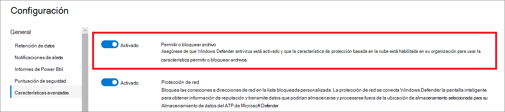

# Configurar características avanzadas en Defender para endpoint

**Se aplica a:**
- [Microsoft Defender para punto de conexión](https://go.microsoft.com/fwlink/p/?linkid=2154037)
- [Microsoft 365 Defender](https://go.microsoft.com/fwlink/?linkid=2118804)

[!INCLUDE [Microsoft 365 Defender rebranding](../../includes/microsoft-defender.md)]

> ¿Desea experimentar Defender for Endpoint? [Regístrate para obtener una versión de prueba gratuita.](https://www.microsoft.com/microsoft-365/windows/microsoft-defender-atp?ocid=docs-wdatp-advancedfeats-abovefoldlink)

Según los productos de seguridad de Microsoft que use, algunas características avanzadas podrían estar disponibles para integrar Defender for Endpoint con.

## Habilitar características avanzadas

1. En el panel de navegación, seleccione **Configuración de**  >  **preferencias Características avanzadas**.
2. Seleccione la característica avanzada que desea configurar y alternar la configuración entre **On** y **Off**.
3. Haga clic **en Guardar preferencias**.

Use las siguientes características avanzadas para protegerse mejor de los archivos potencialmente malintencionados y obtener una mejor información durante las investigaciones de seguridad.

## Investigación automatizada

Active esta característica para aprovechar las características automatizadas de investigación y corrección del servicio. Para obtener más información, vea [Investigación automatizada](automated-investigations.md).

## Respuesta en directo

Active esta característica para que los usuarios con los permisos adecuados puedan iniciar una sesión de respuesta en directo en dispositivos.

Para obtener más información acerca de las asignaciones de roles, vea [Create and manage roles](user-roles.md).

## Respuesta en directo para servidores
Active esta característica para que los usuarios con los permisos adecuados puedan iniciar una sesión de respuesta en directo en los servidores.

Para obtener más información acerca de las asignaciones de roles, vea [Create and manage roles](user-roles.md).

## Ejecución de script sin signo de respuesta en directo

Habilitar esta característica permite ejecutar scripts sin signo en una sesión de respuesta en directo.

## Corregir siempre la PUA
Las aplicaciones potencialmente no deseadas (PUA) son una categoría de software que puede hacer que el equipo se ejecute lentamente, muestre anuncios inesperados o, en el peor de los casos, instale otro software que pueda ser inesperado o no deseado. 

Active esta característica para que las aplicaciones potencialmente no deseadas (PUA) se corrija en todos los dispositivos del espacio empresarial, incluso si la protección pua no está configurada en los dispositivos. Esto ayudará a proteger a los usuarios de la instalación involuntaria de aplicaciones no deseadas en su dispositivo. Cuando está desactivada, la corrección depende de la configuración del dispositivo. 

## Restringir la correlación a grupos de dispositivos con ámbito
Cuando esta configuración está activada, las alertas se correlacionan con incidentes independientes en función de su grupo de dispositivos con ámbito. De forma predeterminada, la correlación de incidentes se produce en todo el ámbito del espacio empresarial.

>[!NOTE]
>Cambiar esta configuración afecta solo a las correlaciones futuras de alertas.

## Habilitar EDR en modo de bloqueo
La detección y respuesta de puntos de conexión (EDR) en modo de bloqueo proporciona protección contra artefactos malintencionados, incluso cuando antivirus de Microsoft Defender se ejecuta en modo pasivo. Cuando está activado, EDR en modo de bloqueo bloquea los artefactos o comportamientos malintencionados que se detectan en un dispositivo. EDR en modo de bloqueo funciona en segundo plano para corregir artefactos malintencionados detectados después de la infracción.

## Alertas remediadas de Autoresolve

Para los inquilinos creados en Windows 10, versión 1809 o después de windows 1809, la funcionalidad de investigación y corrección automatizada está configurada de forma predeterminada para resolver alertas en las que el estado del resultado del análisis automatizado es "No se encontraron amenazas" o "Corregido".  Si no quieres que las alertas se resuelvan automáticamente, tendrás que desactivar manualmente la característica.

> [!TIP]
> Para los inquilinos creados antes de esa versión, deberá activar manualmente esta característica desde la [página Características avanzadas.](https://securitycenter.windows.com/preferences2/integration)

> [!NOTE]
>
> - El resultado de la acción de resolución automática puede influir en el cálculo del nivel de riesgo del dispositivo, que se basa en las alertas activas encontradas en un dispositivo.
> - Si un analista de operaciones de seguridad establece manualmente el estado de una alerta en "En curso" o "Resuelto", la funcionalidad de resolución automática no la sobrescribirá.

## Permitir o bloquear archivo

El bloqueo solo está disponible si su organización cumple estos requisitos:

- Usa Antivirus de Microsoft Defender como solución antimalware activa y,
- La característica de protección basada en la nube está habilitada

Esta característica permite bloquear archivos potencialmente malintencionados en la red. El bloqueo de un archivo impedirá que se lea, se escriba o se ejecute en dispositivos de la organización.

Para activar **Permitir o bloquear** archivos:

1. En el panel de navegación, seleccione **Configuración**  >  **Características avanzadas** Permitir o bloquear  >  **archivo**.

1. Alterna la configuración entre **On** y **Off**.

    

1. Seleccione **Guardar preferencias** en la parte inferior de la página.

Después de activar esta característica, puede [bloquear archivos a través](respond-file-alerts.md#allow-or-block-file) de la pestaña Agregar **indicador** en la página de perfil de un archivo.

## Indicadores de red personalizados

Activar esta característica permite crear indicadores para direcciones IP, dominios o direcciones URL, que determinan si se permitirán o bloquearán en función de la lista de indicadores personalizada.

Para usar esta característica, los dispositivos deben ejecutar Windows 10 versión 1709 o posterior. También deben tener protección de red en modo de bloqueo y versión 4.18.1906.3 o posterior de la plataforma antimalware, vea [KB 4052623](https://go.microsoft.com/fwlink/?linkid=2099834).

Para obtener más información, vea [Administrar indicadores](manage-indicators.md).

> [!NOTE]
> La protección de red aprovecha los servicios de reputación que procesan solicitudes en ubicaciones que podrían estar fuera de la ubicación seleccionada para los datos de Defender para endpoint.

## Protección contra alteraciones
Durante algunos tipos de ataques cibernéticos, los actores malos intentan deshabilitar las características de seguridad, como la protección antivirus, en las máquinas. A los actores malintencionados les gusta deshabilitar las características de seguridad para obtener un acceso más fácil a los datos, para instalar malware o para aprovechar sus datos, identidades y dispositivos.

La protección contra alteraciones bloquea básicamente Antivirus de Microsoft Defender e impide que se cambie la configuración de seguridad a través de aplicaciones y métodos.

Mantenga activada la protección contra alteraciones para evitar cambios no deseados en la solución de seguridad y sus características esenciales.

## Mostrar detalles de usuario

Active esta característica para que pueda ver los detalles del usuario almacenados en Azure Active Directory. Los detalles incluyen la imagen, el nombre, el título y la información del departamento de un usuario al investigar entidades de cuenta de usuario. Puede encontrar información de cuenta de usuario en las siguientes vistas:

- Panel de operaciones de seguridad
- Cola de alertas
- Página de detalles del dispositivo

Para obtener más información, vea [Investigar una cuenta de usuario](investigate-user.md).

## Integración de Skype Empresarial

Habilitar la integración de Skype Empresarial le permite comunicarse con usuarios mediante Skype Empresarial, correo electrónico o teléfono. Esto puede ser útil cuando necesita comunicarse con el usuario y mitigar los riesgos.

> [!NOTE]
> Cuando un dispositivo se aísla de la red, hay una ventana emergente en la que puedes elegir habilitar las comunicaciones de Outlook y Skype que permiten las comunicaciones al usuario mientras están desconectadas de la red. Esta configuración se aplica a la comunicación de Skype y Outlook cuando los dispositivos están en modo aislado.

## Integración de Microsoft Defender para identidades

La integración con Azure Advanced Threat Protection le permite pivotar directamente en otro producto de seguridad de Microsoft Identity. Azure Advanced Threat Protection aumenta una investigación con información adicional sobre una cuenta comprometida sospechosa y recursos relacionados. Al habilitar esta característica, enriquecerás la funcionalidad de investigación basada en dispositivos al girar por la red desde un punto de vista de identificación.

> [!NOTE]
> Tendrás que tener la licencia adecuada para habilitar esta característica.

## Conexión de Inteligencia de amenazas de Office 365

Esta característica solo está disponible si tiene un office 365 E5 activo o el complemento de inteligencia de amenazas. Para obtener más información, vea la página de productos de Office 365 Enterprise E5.

Al activar esta característica, podrá incorporar datos de protección contra amenazas avanzada de Office 365 en el Centro de seguridad de Microsoft Defender para llevar a cabo una investigación de seguridad completa en buzones de Office 365 y dispositivos Windows.

> [!NOTE]
> Tendrás que tener la licencia adecuada para habilitar esta característica.

Para recibir la integración contextual de dispositivos en inteligencia de amenazas de Office 365, deberá habilitar la configuración de Defender para endpoints en el panel Seguridad & cumplimiento. Para obtener más información, vea [Threat investigation and response](https://docs.microsoft.com/microsoft-365/security/office-365-security/office-365-ti).

## Expertos en amenazas de Microsoft: notificaciones de ataques dirigidos

De los dos componentes de Microsoft Threat Expert, la notificación de ataques dirigidos está en disponibilidad general. La funcionalidad de expertos a petición aún está en versión preliminar. Solo puede usar la funcionalidad de expertos a petición si ha solicitado una vista previa y la aplicación se ha aprobado. Puedes recibir notificaciones de ataques dirigidos de expertos en amenazas de Microsoft a través del panel de alertas del portal de defender para puntos de conexión y por correo electrónico si lo configuras.

> [!NOTE]
> La funcionalidad de Expertos en amenazas de Microsoft en Defender para endpoint está disponible con una licencia E5 para [Enterprise Mobility + Security](https://www.microsoft.com/cloud-platform/enterprise-mobility-security).
## Microsoft Cloud App Security

Al habilitar esta configuración, Defender para las señales de punto de conexión se remite a Microsoft Cloud App Security para proporcionar una mayor visibilidad del uso de aplicaciones en la nube. Los datos reenviados se almacenan y procesan en la misma ubicación que los datos de Cloud App Security.

> [!NOTE]
> Esta característica estará disponible con una licencia E5 para [Enterprise Mobility + Security](https://www.microsoft.com/cloud-platform/enterprise-mobility-security) en dispositivos que ejecutan Windows 10, versión 1709 (compilación del sistema operativo 16299.1085 con [KB4493441](https://support.microsoft.com/help/4493441)), Windows 10, versión 1803 (compilación del sistema operativo 17134.704 con [KB4493464](https://support.microsoft.com/help/4493464)), Windows 10, versión 1809 (compilación del sistema operativo 17763.379 con [KB4489899)](https://support.microsoft.com/help/4489899)o versiones posteriores de Windows 10.

## Puntuación de seguridad de Microsoft

Reenvía las señales de Microsoft Defender para puntos de conexión a Puntuación segura de Microsoft en el centro de seguridad de Microsoft 365. Al activar esta característica, Microsoft Secure Score ofrece visibilidad sobre la posición de seguridad del dispositivo. Los datos reenviados se almacenan y procesan en la misma ubicación que los datos de puntuación segura de Microsoft.

### Habilitar la integración de Microsoft Defender para endpoints desde el portal de Microsoft Defender para identidades

Para recibir la integración contextual de dispositivos en Microsoft Defender for Identity, también tendrás que habilitar la característica en el portal de Microsoft Defender para identidad.

1. Inicie sesión en el [portal de Microsoft Defender para identidad](https://portal.atp.azure.com/) con un rol administrador global o administrador de seguridad.

2. Haga **clic en Crear la instancia**.

3. Alterna la configuración de integración a **Activar** y haz clic **en Guardar**.

Después de completar los pasos de integración en ambos portales, podrás ver alertas relevantes en la página detalles del dispositivo o detalles del usuario.

## Filtrado de contenido web
Bloquear el acceso a sitios web que contengan contenido no deseado y realizar un seguimiento de la actividad web en todos los dominios. Para especificar las categorías de contenido web que desea bloquear, cree una [directiva de filtrado de contenido web](https://security.microsoft.com/preferences2/web_content_filtering_policy). Asegúrese de que tiene protección de red en modo de bloqueo al implementar la línea base de seguridad de [Microsoft Defender para](https://devicemanagement.microsoft.com/#blade/Microsoft_Intune_Workflows/SecurityBaselineSummaryMenu/overview/templateType/2)endpoints .

## Compartir alertas de extremo con el Centro de cumplimiento de Microsoft
Reenvía las alertas de seguridad de puntos de conexión y su estado de evaluación al Centro de cumplimiento de Microsoft, lo que le permite mejorar las directivas de administración de riesgos internos con alertas y corregir los riesgos internos antes de que causen daños. Los datos reenviados se procesan y almacenan en la misma ubicación que los datos de Office 365.

Después de configurar los indicadores de infracción de directivas de seguridad en la configuración de administración de riesgos de insider, las [alertas](/microsoft-365/compliance/insider-risk-management-settings#indicators) de Defender for Endpoint se compartirán con la administración de riesgos de insider para los usuarios aplicables.

## Conexión de Microsoft Intune

Defender for Endpoint se puede integrar con [Microsoft Intune para](https://docs.microsoft.com/intune/what-is-intune) habilitar el acceso condicional basado en riesgos del [dispositivo.](https://docs.microsoft.com/intune/advanced-threat-protection#enable-windows-defender-atp-in-intune) Al activar [esta característica,](configure-conditional-access.md)podrás compartir información de dispositivo defender para endpoint con Intune, lo que mejora la aplicación de directivas.

> [!IMPORTANT]
> Tendrás que habilitar la integración en Intune y Defender for Endpoint para usar esta característica. Para obtener más información sobre pasos específicos, vea [Configure Conditional Access in Defender for Endpoint](configure-conditional-access.md).

Esta característica solo está disponible si tiene lo siguiente:

- Inquilino con licencia para Enterprise Mobility + Security E3 y Windows E5 (o Microsoft 365 Enterprise E5)
- Un entorno activo de Microsoft Intune, con dispositivos Windows 10 administrados por Intune [unidos a Azure AD.](https://docs.microsoft.com/azure/active-directory/devices/concept-azure-ad-join/)

### Directiva de acceso condicional

Al habilitar la integración de Intune, Intune creará automáticamente una directiva clásica de acceso condicional (CA). Esta directiva de ca clásica es un requisito previo para configurar informes de estado en Intune. No se debe eliminar.

> [!NOTE]
> La directiva de CA clásica creada por Intune es distinta de las directivas modernas de acceso [condicional,](https://docs.microsoft.com/azure/active-directory/conditional-access/overview/)que se usan para configurar puntos de conexión.

## Versión preliminar de las características

Obtén información sobre las nuevas características en la versión preliminar de Defender para endpoint y sé uno de los primeros en probar las próximas características al activar la experiencia de vista previa.

Tendrás acceso a las próximas características, sobre las que puedes proporcionar comentarios para ayudar a mejorar la experiencia general antes de que las características estén disponibles en general.

## Temas relacionados

- [Actualizar la configuración de retención de datos](data-retention-settings.md)
- [Configurar notificaciones de alerta](configure-email-notifications.md)
