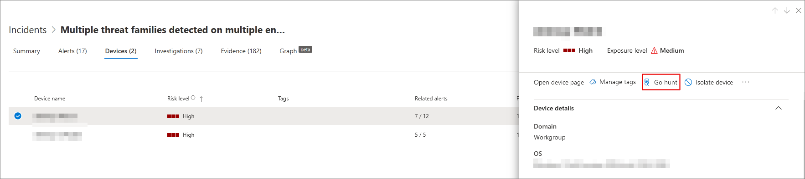

# <a name="quickly-hunt-for-entity-or-event-information-with-go-hunt"></a><span data-ttu-id="550b8-104">Búsqueda rápida de información de entidad o evento con go hunt</span><span class="sxs-lookup"><span data-stu-id="550b8-104">Quickly hunt for entity or event information with go hunt</span></span>

[!INCLUDE [Microsoft 365 Defender rebranding](../../includes/microsoft-defender.md)]

<span data-ttu-id="550b8-105">**Se aplica a:**</span><span class="sxs-lookup"><span data-stu-id="550b8-105">**Applies to:**</span></span>
- [<span data-ttu-id="550b8-106">Defender para punto de conexión</span><span class="sxs-lookup"><span data-stu-id="550b8-106">Defender for Endpoint</span></span>](https://go.microsoft.com/fwlink/?linkid=2154037)

><span data-ttu-id="550b8-107">¿Desea experimentar Defender for Endpoint?</span><span class="sxs-lookup"><span data-stu-id="550b8-107">Want to experience Defender for Endpoint?</span></span> [<span data-ttu-id="550b8-108">Regístrate para obtener una versión de prueba gratuita.</span><span class="sxs-lookup"><span data-stu-id="550b8-108">Sign up for a free trial.</span></span>](https://www.microsoft.com/microsoft-365/windows/microsoft-defender-atp?ocid=docs-wdatp-advancedhuntingref-abovefoldlink)


<span data-ttu-id="550b8-109">Con la *acción ir a la* búsqueda, puede investigar rápidamente eventos y varios tipos de entidad mediante potentes capacidades de búsqueda avanzada basadas en consultas. [](advanced-hunting-overview.md)</span><span class="sxs-lookup"><span data-stu-id="550b8-109">With the *go hunt* action, you can quickly investigate events and various entity types using powerful query-based [advanced hunting](advanced-hunting-overview.md) capabilities.</span></span> <span data-ttu-id="550b8-110">Esta acción ejecuta automáticamente una consulta de búsqueda avanzada para buscar información relevante sobre el evento o entidad seleccionado.</span><span class="sxs-lookup"><span data-stu-id="550b8-110">This action automatically runs an advanced hunting query to find relevant information about the selected event or entity.</span></span>

<span data-ttu-id="550b8-111">La *acción ir a la* búsqueda está disponible en varias secciones del centro de seguridad siempre que se muestren los detalles de evento o entidad.</span><span class="sxs-lookup"><span data-stu-id="550b8-111">The *go hunt* action is available in various sections of the security center whenever event or entity details are displayed.</span></span> <span data-ttu-id="550b8-112">Por ejemplo, puede usar *ir a buscar* desde las secciones siguientes:</span><span class="sxs-lookup"><span data-stu-id="550b8-112">For example, you can use *go hunt* from the following sections:</span></span>

- <span data-ttu-id="550b8-113">En la [página de incidentes,](investigate-incidents.md)puede revisar detalles sobre usuarios, dispositivos y muchas otras entidades asociadas con un incidente.</span><span class="sxs-lookup"><span data-stu-id="550b8-113">In the [incident page](investigate-incidents.md), you can review details about users, devices, and many other entities associated with an incident.</span></span> <span data-ttu-id="550b8-114">Al seleccionar una entidad, obtiene información adicional, así como diversas acciones que podría realizar en esa entidad.</span><span class="sxs-lookup"><span data-stu-id="550b8-114">When you select an entity, you get additional information as well as various actions you could take on that entity.</span></span> <span data-ttu-id="550b8-115">En el ejemplo siguiente, se selecciona un dispositivo, que muestra detalles sobre el dispositivo, así como la opción de buscar más información sobre el dispositivo.</span><span class="sxs-lookup"><span data-stu-id="550b8-115">In the example below, a device is selected, showing details about the device as well the option to hunt for more information about the device.</span></span>

    

- <span data-ttu-id="550b8-117">En la página de incidentes, también puede obtener acceso a una lista de entidades en la pestaña evidencia. Seleccionar una de estas entidades proporciona una opción para buscar rápidamente información sobre esa entidad.</span><span class="sxs-lookup"><span data-stu-id="550b8-117">In the incident page, you can also access a list of entities under the evidence tab. Selecting one of those entities provides an option to quickly hunt for information about that entity.</span></span>

    

- <span data-ttu-id="550b8-119">Al ver la escala de tiempo de un dispositivo, puedes seleccionar un evento en la escala de tiempo para ver información adicional sobre ese evento.</span><span class="sxs-lookup"><span data-stu-id="550b8-119">When viewing the timeline for a device, you can select an event in the timeline to view additional information about that event.</span></span> <span data-ttu-id="550b8-120">Una vez seleccionado un evento, se obtiene la opción de buscar otros eventos relevantes en la búsqueda avanzada.</span><span class="sxs-lookup"><span data-stu-id="550b8-120">Once an event is selected, you get the option to hunt for other relevant events in advanced hunting.</span></span>

    

<span data-ttu-id="550b8-122">Al seleccionar **Ir a la búsqueda** o a **La** búsqueda de eventos relacionados, se pasan distintas consultas, según si ha seleccionado una entidad o un evento.</span><span class="sxs-lookup"><span data-stu-id="550b8-122">Selecting **Go hunt** or **Hunt for related events** passes different queries, depending on whether you've selected an entity or an event.</span></span>

## <a name="query-for-entity-information"></a><span data-ttu-id="550b8-123">Consulta de información de entidad</span><span class="sxs-lookup"><span data-stu-id="550b8-123">Query for entity information</span></span>

<span data-ttu-id="550b8-124">Al usar *ir a buscar* para consultar información sobre un usuario, dispositivo o cualquier otro tipo de entidad, la consulta comprueba en todas las tablas de esquema relevantes cualquier evento que implique esa entidad.</span><span class="sxs-lookup"><span data-stu-id="550b8-124">When using *go hunt* to query for information about a user, device, or any other type of entity, the query checks all relevant schema tables for any events involving that entity.</span></span> <span data-ttu-id="550b8-125">Para que los resultados se puedan administrar, la consulta tiene el ámbito alrededor del mismo período de tiempo que la actividad más temprana de los últimos 30 días que implica a la entidad y está asociada con el incidente.</span><span class="sxs-lookup"><span data-stu-id="550b8-125">To keep the results manageable, the query is scoped to around the same time period as the earliest activity in the past 30 days that involves the entity and is associated with the incident.</span></span>

<span data-ttu-id="550b8-126">Este es un ejemplo de la consulta de búsqueda de ir para un dispositivo:</span><span class="sxs-lookup"><span data-stu-id="550b8-126">Here is an example of the go hunt query for a device:</span></span>

```kusto
let selectedTimestamp = datetime(2020-06-02T02:06:47.1167157Z);
let deviceName = "fv-az770.example.com";
let deviceId = "device-guid";
search in (DeviceLogonEvents, DeviceProcessEvents, DeviceNetworkEvents, DeviceFileEvents, DeviceRegistryEvents, DeviceImageLoadEvents, DeviceEvents, DeviceImageLoadEvents, IdentityLogonEvents, IdentityQueryEvents)
Timestamp between ((selectedTimestamp - 1h) .. (selectedTimestamp + 1h))
and DeviceName == deviceName
// or RemoteDeviceName == deviceName
// or DeviceId == deviceId
| take 100
```

### <a name="supported-entity-types"></a><span data-ttu-id="550b8-127">Tipos de entidad compatibles</span><span class="sxs-lookup"><span data-stu-id="550b8-127">Supported entity types</span></span>

<span data-ttu-id="550b8-128">Puede usar *ir a buscar después* de seleccionar cualquiera de estos tipos de entidad:</span><span class="sxs-lookup"><span data-stu-id="550b8-128">You can use *go hunt* after selecting any of these entity types:</span></span>

- <span data-ttu-id="550b8-129">Archivos</span><span class="sxs-lookup"><span data-stu-id="550b8-129">Files</span></span>
- <span data-ttu-id="550b8-130">Usuarios</span><span class="sxs-lookup"><span data-stu-id="550b8-130">Users</span></span>
- <span data-ttu-id="550b8-131">Dispositivos</span><span class="sxs-lookup"><span data-stu-id="550b8-131">Devices</span></span>
- <span data-ttu-id="550b8-132">Direcciones IP</span><span class="sxs-lookup"><span data-stu-id="550b8-132">IP addresses</span></span>
- <span data-ttu-id="550b8-133">Direcciones URL</span><span class="sxs-lookup"><span data-stu-id="550b8-133">URLs</span></span>

## <a name="query-for-event-information"></a><span data-ttu-id="550b8-134">Consulta de información de eventos</span><span class="sxs-lookup"><span data-stu-id="550b8-134">Query for event information</span></span>

<span data-ttu-id="550b8-135">Al usar *ir a buscar* para consultar información sobre un evento de escala de tiempo, la consulta comprueba todas las tablas de esquema relevantes para otros eventos en el momento del evento seleccionado.</span><span class="sxs-lookup"><span data-stu-id="550b8-135">When using *go hunt* to query for information about a timeline event, the query checks all relevant schema tables for other events around the time of the selected event.</span></span> <span data-ttu-id="550b8-136">Por ejemplo, la siguiente consulta enumera los eventos de varias tablas de esquema que se produjeron alrededor del mismo período de tiempo en el mismo dispositivo:</span><span class="sxs-lookup"><span data-stu-id="550b8-136">For example, the following query lists events in various schema tables that occurred around the same time period on the same device:</span></span>

```kusto
// List relevant events 30 minutes before and after selected RegistryValueSet event
let selectedEventTimestamp = datetime(2020-10-06T21:40:25.3466868Z);
search in (DeviceFileEvents, DeviceProcessEvents, DeviceEvents, DeviceRegistryEvents, DeviceNetworkEvents, DeviceImageLoadEvents, DeviceLogonEvents)
    Timestamp between ((selectedEventTimestamp - 30m) .. (selectedEventTimestamp + 30m))
    and DeviceId == "a305b52049c4658ec63ae8b55becfe5954c654a4"
| sort by Timestamp desc
| extend Relevance = iff(Timestamp == selectedEventTimestamp, "Selected event", iff(Timestamp < selectedEventTimestamp, "Earlier event", "Later event"))
| project-reorder Relevance
```

## <a name="adjust-the-query"></a><span data-ttu-id="550b8-137">Ajustar la consulta</span><span class="sxs-lookup"><span data-stu-id="550b8-137">Adjust the query</span></span>

<span data-ttu-id="550b8-138">Con cierto conocimiento del idioma [de consulta,](advanced-hunting-query-language.md)puede ajustar la consulta a su preferencia.</span><span class="sxs-lookup"><span data-stu-id="550b8-138">With some knowledge of the [query language](advanced-hunting-query-language.md), you can adjust the query to your preference.</span></span> <span data-ttu-id="550b8-139">Por ejemplo, puede ajustar esta línea, que determina el tamaño de la ventana de tiempo:</span><span class="sxs-lookup"><span data-stu-id="550b8-139">For example, you can adjust this line, which determines the size of the time window:</span></span>

```kusto
Timestamp between ((selectedTimestamp - 1h) .. (selectedTimestamp + 1h))
```

<span data-ttu-id="550b8-140">Además de modificar la consulta para obtener resultados más relevantes, también puede:</span><span class="sxs-lookup"><span data-stu-id="550b8-140">In addition to modifying the query to get more relevant results, you can also:</span></span>

- [<span data-ttu-id="550b8-141">Ver los resultados como gráficos</span><span class="sxs-lookup"><span data-stu-id="550b8-141">View the results as charts</span></span>](advanced-hunting-query-results.md#view-query-results-as-a-table-or-chart)
- [<span data-ttu-id="550b8-142">Crear una regla de detección personalizada</span><span class="sxs-lookup"><span data-stu-id="550b8-142">Create a custom detection rule</span></span>](custom-detection-rules.md)

## <a name="related-topics"></a><span data-ttu-id="550b8-143">Temas relacionados</span><span class="sxs-lookup"><span data-stu-id="550b8-143">Related topics</span></span>

- [<span data-ttu-id="550b8-144">Información general sobre la búsqueda avanzada</span><span class="sxs-lookup"><span data-stu-id="550b8-144">Advanced hunting overview</span></span>](advanced-hunting-overview.md)
- [<span data-ttu-id="550b8-145">Aprender el lenguaje de consulta</span><span class="sxs-lookup"><span data-stu-id="550b8-145">Learn the query language</span></span>](advanced-hunting-query-language.md)
- [<span data-ttu-id="550b8-146">Trabajar con resultados de consulta</span><span class="sxs-lookup"><span data-stu-id="550b8-146">Work with query results</span></span>](advanced-hunting-query-results.md)
- [<span data-ttu-id="550b8-147">Reglas de detección personalizada</span><span class="sxs-lookup"><span data-stu-id="550b8-147">Custom detection rules</span></span>](custom-detection-rules.md)
