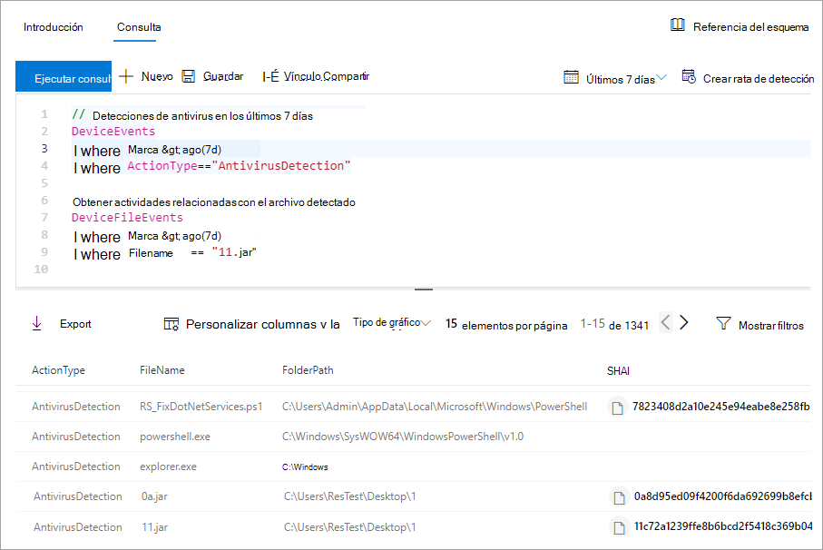
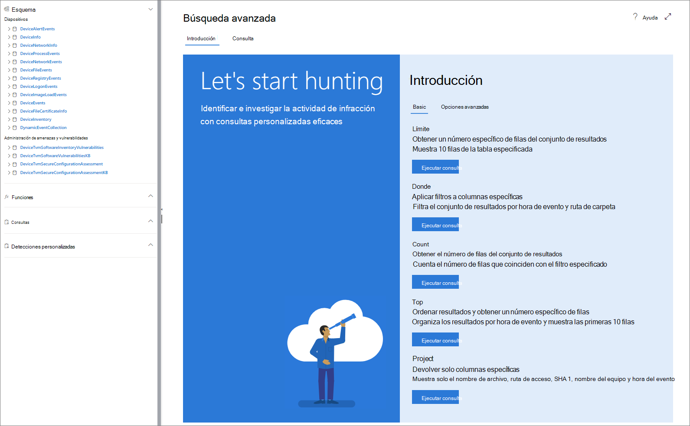

# <a name="learn-the-advanced-hunting-query-language"></a><span data-ttu-id="0c9de-104">Conozca el lenguaje de consulta de búsqueda avanzada</span><span class="sxs-lookup"><span data-stu-id="0c9de-104">Learn the advanced hunting query language</span></span>

[!INCLUDE [Microsoft 365 Defender rebranding](../../includes/microsoft-defender.md)]

<span data-ttu-id="0c9de-105">**Se aplica a:**</span><span class="sxs-lookup"><span data-stu-id="0c9de-105">**Applies to:**</span></span>
- [<span data-ttu-id="0c9de-106">Defender para punto de conexión</span><span class="sxs-lookup"><span data-stu-id="0c9de-106">Defender for Endpoint</span></span>](https://go.microsoft.com/fwlink/?linkid=2154037)

> <span data-ttu-id="0c9de-107">¿Desea experimentar Defender for Endpoint?</span><span class="sxs-lookup"><span data-stu-id="0c9de-107">Want to experience Defender for Endpoint?</span></span> [<span data-ttu-id="0c9de-108">Regístrate para obtener una versión de prueba gratuita.</span><span class="sxs-lookup"><span data-stu-id="0c9de-108">Sign up for a free trial.</span></span>](https://www.microsoft.com/microsoft-365/windows/microsoft-defender-atp?ocid=docs-wdatp-advancedhunting-abovefoldlink)

<span data-ttu-id="0c9de-109">La búsqueda avanzada se basa en el [lenguaje de consulta Kusto](https://docs.microsoft.com/azure/kusto/query/).</span><span class="sxs-lookup"><span data-stu-id="0c9de-109">Advanced hunting is based on the [Kusto query language](https://docs.microsoft.com/azure/kusto/query/).</span></span> <span data-ttu-id="0c9de-110">Puede usar operadores y instrucciones kusto para crear consultas que busquen información en un esquema [especializado.](advanced-hunting-schema-reference.md)</span><span class="sxs-lookup"><span data-stu-id="0c9de-110">You can use Kusto operators and statements to construct queries that locate information in a specialized [schema](advanced-hunting-schema-reference.md).</span></span> <span data-ttu-id="0c9de-111">Para entender mejor estos conceptos, ejecute la primera consulta.</span><span class="sxs-lookup"><span data-stu-id="0c9de-111">To understand these concepts better, run your first query.</span></span>

## <a name="try-your-first-query"></a><span data-ttu-id="0c9de-112">Pruebe la primera consulta</span><span class="sxs-lookup"><span data-stu-id="0c9de-112">Try your first query</span></span>

<span data-ttu-id="0c9de-113">En el Centro de seguridad de Microsoft Defender, vaya **a Búsqueda avanzada** para ejecutar la primera consulta.</span><span class="sxs-lookup"><span data-stu-id="0c9de-113">In Microsoft Defender Security Center, go to **Advanced hunting** to run your first query.</span></span> <span data-ttu-id="0c9de-114">Utilice el ejemplo siguiente:</span><span class="sxs-lookup"><span data-stu-id="0c9de-114">Use the following example:</span></span>

```kusto
// Finds PowerShell execution events that could involve a download
union DeviceProcessEvents, DeviceNetworkEvents
| where Timestamp > ago(7d)
// Pivoting on PowerShell processes
| where FileName in~ ("powershell.exe", "powershell_ise.exe")
// Suspicious commands
| where ProcessCommandLine has_any("WebClient",
    "DownloadFile",
    "DownloadData",
    "DownloadString",
    "WebRequest",
    "Shellcode",
    "http",
    "https")
| project Timestamp, DeviceName, InitiatingProcessFileName, InitiatingProcessCommandLine, 
FileName, ProcessCommandLine, RemoteIP, RemoteUrl, RemotePort, RemoteIPType
| top 100 by Timestamp
```
<span data-ttu-id="0c9de-115">**[Ejecutar esta consulta en búsqueda avanzada](https://securitycenter.windows.com/hunting?query=H4sIAAAAAAAEAI2TT0vDQBDF5yz4HUJPFcTqyZsXqyCIBFvxKNGWtpo_NVlbC8XP7m8mado0K5Zls8nkzdu3b2Z70pNAbmUmqYyk4D2UTJYyllwGMmWNGQHrN_NNvsSBzUBrbMFMiWieAx3xDEBl4GL4AuNd8B0bNgARENcdUmIZ3yM5liPwac3bN-YZPGPU5ET1rWDc7Ox4uod8YDp4MzI-GkjlX4Ne2nly0zEkKzFWh4ZE5sSuTN8Ehq5couvEMnvmUAhez-HsRBMipVa_W_OG6vEfGtT12JRHpqV064e1Kx04NsxFzXxW1aFjp_djXmDRPbfY3XMMcLogTz2bWZ2KqmIJI6q6wKe2WYnrRsa9KVeU9kCBBo2v7BzPxF_Bx2DKiqh63SGoRoc6Njti48z_yL71XHQAcgAur6rXRpcqH3l-4knZF23Utsbq2MircEqmw-G__xR1TdZ1r7zb7XLezmx3etkvGr-ze6NdGdW92azUfpcdluWvr-aqbh_nofnqcWI3aYyOsBV7giduRUO7187LMKTT5rxvHHX80_t8IeeMgLquvL7-Ak3q-kz8BAAA&runQuery=true&timeRangeId=week)**</span><span class="sxs-lookup"><span data-stu-id="0c9de-115">**[Run this query in advanced hunting](https://securitycenter.windows.com/hunting?query=H4sIAAAAAAAEAI2TT0vDQBDF5yz4HUJPFcTqyZsXqyCIBFvxKNGWtpo_NVlbC8XP7m8mado0K5Zls8nkzdu3b2Z70pNAbmUmqYyk4D2UTJYyllwGMmWNGQHrN_NNvsSBzUBrbMFMiWieAx3xDEBl4GL4AuNd8B0bNgARENcdUmIZ3yM5liPwac3bN-YZPGPU5ET1rWDc7Ox4uod8YDp4MzI-GkjlX4Ne2nly0zEkKzFWh4ZE5sSuTN8Ehq5couvEMnvmUAhez-HsRBMipVa_W_OG6vEfGtT12JRHpqV064e1Kx04NsxFzXxW1aFjp_djXmDRPbfY3XMMcLogTz2bWZ2KqmIJI6q6wKe2WYnrRsa9KVeU9kCBBo2v7BzPxF_Bx2DKiqh63SGoRoc6Njti48z_yL71XHQAcgAur6rXRpcqH3l-4knZF23Utsbq2MircEqmw-G__xR1TdZ1r7zb7XLezmx3etkvGr-ze6NdGdW92azUfpcdluWvr-aqbh_nofnqcWI3aYyOsBV7giduRUO7187LMKTT5rxvHHX80_t8IeeMgLquvL7-Ak3q-kz8BAAA&runQuery=true&timeRangeId=week)**</span></span>

### <a name="describe-the-query-and-specify-the-tables-to-search"></a><span data-ttu-id="0c9de-116">Describir la consulta y especificar las tablas que se buscarán</span><span class="sxs-lookup"><span data-stu-id="0c9de-116">Describe the query and specify the tables to search</span></span>
<span data-ttu-id="0c9de-117">Se ha agregado un breve comentario al principio de la consulta para describir para qué se trata.</span><span class="sxs-lookup"><span data-stu-id="0c9de-117">A short comment has been added to the beginning of the query to describe what it is for.</span></span> <span data-ttu-id="0c9de-118">Este comentario ayuda si más adelante decide guardar la consulta y compartirla con otros usuarios de la organización.</span><span class="sxs-lookup"><span data-stu-id="0c9de-118">This comment helps if you later decide to save the query and share it with others in your organization.</span></span>

```kusto
// Finds PowerShell execution events that could involve a download
```
<span data-ttu-id="0c9de-119">La consulta en sí suele comenzar con un nombre de tabla seguido de varios elementos que comienzan con una canalización ( `|` ).</span><span class="sxs-lookup"><span data-stu-id="0c9de-119">The query itself will typically start with a table name followed by several elements that start with a pipe (`|`).</span></span> <span data-ttu-id="0c9de-120">En este ejemplo, empezamos creando una unión de dos tablas y  `DeviceProcessEvents` `DeviceNetworkEvents` , y agregamos elementos canalizados según sea necesario.</span><span class="sxs-lookup"><span data-stu-id="0c9de-120">In this example, we start by creating a union of two tables,  `DeviceProcessEvents` and `DeviceNetworkEvents`, and add piped elements as needed.</span></span>

```kusto
union DeviceProcessEvents, DeviceNetworkEvents
```
### <a name="set-the-time-range"></a><span data-ttu-id="0c9de-121">Establecer el intervalo de tiempo</span><span class="sxs-lookup"><span data-stu-id="0c9de-121">Set the time range</span></span>
<span data-ttu-id="0c9de-122">El primer elemento canalado es un filtro de tiempo con el ámbito de los siete días anteriores.</span><span class="sxs-lookup"><span data-stu-id="0c9de-122">The first piped element is a time filter scoped to the previous seven days.</span></span> <span data-ttu-id="0c9de-123">Limitar el intervalo de tiempo ayuda a garantizar que las consultas tienen un buen rendimiento, que devuelven resultados manejables y que no hay tiempo de espera.</span><span class="sxs-lookup"><span data-stu-id="0c9de-123">Limiting the time range helps ensure that queries perform well, return manageable results, and don't time out.</span></span>

```kusto
| where Timestamp > ago(7d)
```

### <a name="check-specific-processes"></a><span data-ttu-id="0c9de-124">Comprobar procesos específicos</span><span class="sxs-lookup"><span data-stu-id="0c9de-124">Check specific processes</span></span>
<span data-ttu-id="0c9de-125">Al intervalo de tiempo le sigue inmediatamente una búsqueda de nombres de archivo de proceso que representen la aplicación de PowerShell.</span><span class="sxs-lookup"><span data-stu-id="0c9de-125">The time range is immediately followed by a search for process file names representing the PowerShell application.</span></span>

```kusto
// Pivoting on PowerShell processes
| where FileName in~ ("powershell.exe", "powershell_ise.exe")
```

### <a name="search-for-specific-command-strings"></a><span data-ttu-id="0c9de-126">Buscar cadenas de comandos específicas</span><span class="sxs-lookup"><span data-stu-id="0c9de-126">Search for specific command strings</span></span>
<span data-ttu-id="0c9de-127">Después, la consulta busca cadenas en líneas de comandos que normalmente se usan para descargar archivos con PowerShell.</span><span class="sxs-lookup"><span data-stu-id="0c9de-127">Afterwards, the query looks for strings in command lines that are typically used to download files using PowerShell.</span></span>

```kusto
// Suspicious commands
| where ProcessCommandLine has_any("WebClient",
    "DownloadFile",
    "DownloadData",
    "DownloadString",
    "WebRequest",
    "Shellcode",
    "http",
    "https")
```

### <a name="customize-result-columns-and-length"></a><span data-ttu-id="0c9de-128">Personalizar las columnas de resultados y la longitud</span><span class="sxs-lookup"><span data-stu-id="0c9de-128">Customize result columns and length</span></span> 
<span data-ttu-id="0c9de-129">Ahora que la consulta identifica claramente los datos que desea localizar, puede definir el aspecto de los resultados.</span><span class="sxs-lookup"><span data-stu-id="0c9de-129">Now that your query clearly identifies the data you want to locate, you can define what the results look like.</span></span> <span data-ttu-id="0c9de-130">`project` devuelve columnas específicas y `top` limita el número de resultados.</span><span class="sxs-lookup"><span data-stu-id="0c9de-130">`project` returns specific columns, and `top` limits the number of results.</span></span> <span data-ttu-id="0c9de-131">Estos operadores ayudan a garantizar que los resultados estén bien formatados y sean razonablemente grandes y fáciles de procesar.</span><span class="sxs-lookup"><span data-stu-id="0c9de-131">These operators help ensure the results are well-formatted and reasonably large and easy to process.</span></span>

```kusto
| project Timestamp, DeviceName, InitiatingProcessFileName, InitiatingProcessCommandLine, 
FileName, ProcessCommandLine, RemoteIP, RemoteUrl, RemotePort, RemoteIPType
| top 100 by Timestamp
```

<span data-ttu-id="0c9de-132">Seleccione **Ejecutar consulta** para ver los resultados.</span><span class="sxs-lookup"><span data-stu-id="0c9de-132">Select **Run query** to see the results.</span></span> <span data-ttu-id="0c9de-133">Use el icono expandir situado en la parte superior derecha del editor de consultas para centrarse en la consulta de búsqueda y los resultados.</span><span class="sxs-lookup"><span data-stu-id="0c9de-133">Use the expand icon at the top right of the query editor to focus on your hunting query and the results.</span></span> 


>[!TIP]
><span data-ttu-id="0c9de-135">Puede ver los resultados de la consulta como gráficos y ajustar rápidamente los filtros.</span><span class="sxs-lookup"><span data-stu-id="0c9de-135">You can view query results as charts and quickly adjust filters.</span></span> <span data-ttu-id="0c9de-136">Para obtener instrucciones, [lea sobre cómo trabajar con resultados de consulta](advanced-hunting-query-results.md)</span><span class="sxs-lookup"><span data-stu-id="0c9de-136">For guidance, [read about working with query results](advanced-hunting-query-results.md)</span></span>

## <a name="learn-common-query-operators-for-advanced-hunting"></a><span data-ttu-id="0c9de-137">Conozca más operadores comunes de consulta para la búsqueda avanzada</span><span class="sxs-lookup"><span data-stu-id="0c9de-137">Learn common query operators for advanced hunting</span></span>

<span data-ttu-id="0c9de-138">Acaba de ejecutar la primera consulta y tiene una idea general de sus componentes.</span><span class="sxs-lookup"><span data-stu-id="0c9de-138">You've just run your first query and have a general idea of its components.</span></span> <span data-ttu-id="0c9de-139">Es hora de retroceder ligeramente y aprender algunos conceptos básicos.</span><span class="sxs-lookup"><span data-stu-id="0c9de-139">It's time to backtrack slightly and learn some basics.</span></span> <span data-ttu-id="0c9de-140">El lenguaje de consulta Kusto que utiliza la búsqueda avanzada es compatible con una gama de operadores, entre ellos los siguientes operadores comunes.</span><span class="sxs-lookup"><span data-stu-id="0c9de-140">The Kusto query language used by advanced hunting supports a range of operators, including the following common ones.</span></span>

| <span data-ttu-id="0c9de-141">Operador</span><span class="sxs-lookup"><span data-stu-id="0c9de-141">Operator</span></span> | <span data-ttu-id="0c9de-142">Descripción y uso</span><span class="sxs-lookup"><span data-stu-id="0c9de-142">Description and usage</span></span> |
|--|--|
| `where` | <span data-ttu-id="0c9de-143">Filtra una tabla hasta llegar al subconjunto de filas que satisfacen un predicado.</span><span class="sxs-lookup"><span data-stu-id="0c9de-143">Filter a table to the subset of rows that satisfy a predicate.</span></span> |
| `summarize` | <span data-ttu-id="0c9de-144">Crea una tabla que agrega el contenido de la tabla de entrada.</span><span class="sxs-lookup"><span data-stu-id="0c9de-144">Produce a table that aggregates the content of the input table.</span></span> |
| `join` | <span data-ttu-id="0c9de-145">Combina las filas de dos tablas para formar una nueva tabla mediante la coincidencia de los valores de la columna o columnas especificadas de cada tabla.</span><span class="sxs-lookup"><span data-stu-id="0c9de-145">Merge the rows of two tables to form a new table by matching values of the specified column(s) from each table.</span></span> |
| `count` | <span data-ttu-id="0c9de-146">Devuelve el número de registros en el conjunto de registros de entrada.</span><span class="sxs-lookup"><span data-stu-id="0c9de-146">Return the number of records in the input record set.</span></span> |
| `top` | <span data-ttu-id="0c9de-147">Devuelve los primeros N registros ordenados según las columnas especificadas.</span><span class="sxs-lookup"><span data-stu-id="0c9de-147">Return the first N records sorted by the specified columns.</span></span> |
| `limit` | <span data-ttu-id="0c9de-148">Devuelve hasta el número de filas especificado.</span><span class="sxs-lookup"><span data-stu-id="0c9de-148">Return up to the specified number of rows.</span></span> |
| `project` | <span data-ttu-id="0c9de-149">Selecciona las columnas que desea incluir, cambia el nombre o elimina e inserta nuevas columnas calculadas.</span><span class="sxs-lookup"><span data-stu-id="0c9de-149">Select the columns to include, rename or drop, and insert new computed columns.</span></span> |
| `extend` | <span data-ttu-id="0c9de-150">Crea columnas calculadas y las anexa al conjunto de resultados.</span><span class="sxs-lookup"><span data-stu-id="0c9de-150">Create calculated columns and append them to the result set.</span></span> |
| `makeset` |  <span data-ttu-id="0c9de-151">Devuelve una matriz dinámica (JSON) del conjunto de valores distintivos que Expr toma en el grupo.</span><span class="sxs-lookup"><span data-stu-id="0c9de-151">Return a dynamic (JSON) array of the set of distinct values that Expr takes in the group.</span></span> |
| `find` | <span data-ttu-id="0c9de-152">Busca las filas que coinciden con un predicado en un conjunto de tablas.</span><span class="sxs-lookup"><span data-stu-id="0c9de-152">Find rows that match a predicate across a set of tables.</span></span> |

<span data-ttu-id="0c9de-153">Para ver un ejemplo en directo de  estos operadores, ejecutarlos desde la sección Introducción de la página de búsqueda avanzada.</span><span class="sxs-lookup"><span data-stu-id="0c9de-153">To see a live example of these operators, run them from the **Get started** section of the advanced hunting page.</span></span>

## <a name="understand-data-types"></a><span data-ttu-id="0c9de-154">Comprender tipos de datos</span><span class="sxs-lookup"><span data-stu-id="0c9de-154">Understand data types</span></span>

<span data-ttu-id="0c9de-155">La búsqueda avanzada admite tipos de datos kusto, incluidos los siguientes tipos comunes:</span><span class="sxs-lookup"><span data-stu-id="0c9de-155">Advanced hunting supports Kusto data types, including the following common types:</span></span>

| <span data-ttu-id="0c9de-156">Tipo de datos</span><span class="sxs-lookup"><span data-stu-id="0c9de-156">Data type</span></span> | <span data-ttu-id="0c9de-157">Descripción e implicaciones de la consulta</span><span class="sxs-lookup"><span data-stu-id="0c9de-157">Description and query implications</span></span> |
|--|--|
| `datetime` | <span data-ttu-id="0c9de-158">La información de datos y horas suele representar marcas de tiempo de eventos.</span><span class="sxs-lookup"><span data-stu-id="0c9de-158">Data and time information typically representing event timestamps.</span></span> [<span data-ttu-id="0c9de-159">Ver formatos de fecha y hora admitidos</span><span class="sxs-lookup"><span data-stu-id="0c9de-159">See supported datetime formats</span></span>](https://docs.microsoft.com/azure/data-explorer/kusto/query/scalar-data-types/datetime) |
| `string` | <span data-ttu-id="0c9de-160">Cadena de caracteres en UTF-8 entre comillas simples ( `'` ) o comillas dobles ( `"` ).</span><span class="sxs-lookup"><span data-stu-id="0c9de-160">Character string in UTF-8 enclosed in single quotes (`'`) or double quotes (`"`).</span></span> [<span data-ttu-id="0c9de-161">Más información sobre las cadenas</span><span class="sxs-lookup"><span data-stu-id="0c9de-161">Read more about strings</span></span>](https://docs.microsoft.com/azure/data-explorer/kusto/query/scalar-data-types/string) |
| `bool` | <span data-ttu-id="0c9de-162">Este tipo de datos admite `true` o `false` estados.</span><span class="sxs-lookup"><span data-stu-id="0c9de-162">This data type supports `true` or `false` states.</span></span> [<span data-ttu-id="0c9de-163">Ver literales y operadores admitidos</span><span class="sxs-lookup"><span data-stu-id="0c9de-163">See supported literals and operators</span></span>](https://docs.microsoft.com/azure/data-explorer/kusto/query/scalar-data-types/bool) |
| `int` | <span data-ttu-id="0c9de-164">Entero de 32 bits</span><span class="sxs-lookup"><span data-stu-id="0c9de-164">32-bit integer</span></span>  |
| `long` | <span data-ttu-id="0c9de-165">Entero de 64 bits</span><span class="sxs-lookup"><span data-stu-id="0c9de-165">64-bit integer</span></span> |

<span data-ttu-id="0c9de-166">Para obtener más información sobre estos tipos de datos, lea acerca de los tipos de datos [escalares de Kusto](https://docs.microsoft.com/azure/data-explorer/kusto/query/scalar-data-types/).</span><span class="sxs-lookup"><span data-stu-id="0c9de-166">To learn more about these data types, [read about Kusto scalar data types](https://docs.microsoft.com/azure/data-explorer/kusto/query/scalar-data-types/).</span></span>

## <a name="get-help-as-you-write-queries"></a><span data-ttu-id="0c9de-167">Obtener ayuda mientras escribe consultas</span><span class="sxs-lookup"><span data-stu-id="0c9de-167">Get help as you write queries</span></span>
<span data-ttu-id="0c9de-168">Aprovéchese de las funciones siguientes para escribir consultas más rápido:</span><span class="sxs-lookup"><span data-stu-id="0c9de-168">Take advantage of the following functionality to write queries faster:</span></span>

- <span data-ttu-id="0c9de-169">**Autosuggest:** al escribir consultas, la búsqueda avanzada proporciona sugerencias de IntelliSense.</span><span class="sxs-lookup"><span data-stu-id="0c9de-169">**Autosuggest**—as you write queries, advanced hunting provides suggestions from IntelliSense.</span></span>
- <span data-ttu-id="0c9de-170">**Árbol de esquema:** una representación de esquema que incluye la lista de tablas y sus columnas se proporciona junto al área de trabajo.</span><span class="sxs-lookup"><span data-stu-id="0c9de-170">**Schema tree**—a schema representation that includes the list of tables and their columns is provided next to your working area.</span></span> <span data-ttu-id="0c9de-171">Para obtener más información, mueva el puntero sobre un elemento.</span><span class="sxs-lookup"><span data-stu-id="0c9de-171">For more information, hover over an item.</span></span> <span data-ttu-id="0c9de-172">Haga doble clic en un elemento para insertarlo en el editor de consultas.</span><span class="sxs-lookup"><span data-stu-id="0c9de-172">Double-click an item to insert it to the query editor.</span></span>
- <span data-ttu-id="0c9de-173">**[Referencia de esquema](advanced-hunting-schema-reference.md#get-schema-information-in-the-security-center)**: referencia en el portal con descripciones de tabla y columna, así como tipos de eventos admitidos ( `ActionType` valores) y consultas de ejemplo</span><span class="sxs-lookup"><span data-stu-id="0c9de-173">**[Schema reference](advanced-hunting-schema-reference.md#get-schema-information-in-the-security-center)**—in-portal reference with table and column descriptions as well as supported event types (`ActionType` values) and sample queries</span></span>

## <a name="work-with-multiple-queries-in-the-editor"></a><span data-ttu-id="0c9de-174">Trabajar con varias consultas en el editor</span><span class="sxs-lookup"><span data-stu-id="0c9de-174">Work with multiple queries in the editor</span></span>
<span data-ttu-id="0c9de-175">Puede usar el editor de consultas para experimentar con varias consultas.</span><span class="sxs-lookup"><span data-stu-id="0c9de-175">You can use the query editor to experiment with multiple queries.</span></span> <span data-ttu-id="0c9de-176">Para usar varias consultas:</span><span class="sxs-lookup"><span data-stu-id="0c9de-176">To use multiple queries:</span></span>

- <span data-ttu-id="0c9de-177">Separe cada consulta con una línea vacía.</span><span class="sxs-lookup"><span data-stu-id="0c9de-177">Separate each query with an empty line.</span></span>
- <span data-ttu-id="0c9de-178">Coloque el cursor en cualquier parte de una consulta para seleccionar esa consulta antes de ejecutarla.</span><span class="sxs-lookup"><span data-stu-id="0c9de-178">Place the cursor on any part of a query to select that query before running it.</span></span> <span data-ttu-id="0c9de-179">Solo se ejecutará la consulta seleccionada.</span><span class="sxs-lookup"><span data-stu-id="0c9de-179">This will run only the selected query.</span></span> <span data-ttu-id="0c9de-180">Para ejecutar otra consulta, mueva el cursor en consecuencia y seleccione **Ejecutar consulta**.</span><span class="sxs-lookup"><span data-stu-id="0c9de-180">To run another query, move the cursor accordingly and select **Run query**.</span></span>

<span data-ttu-id="0c9de-181">
 _consultas con varias consultas_</span><span class="sxs-lookup"><span data-stu-id="0c9de-181">
_Query editor with multiple queries_</span></span>

## <a name="use-sample-queries"></a><span data-ttu-id="0c9de-182">Usar las consultas de ejemplo</span><span class="sxs-lookup"><span data-stu-id="0c9de-182">Use sample queries</span></span>

<span data-ttu-id="0c9de-183">La sección **Comenzar** ofrece algunas consultas sencillas con operadores de uso habitual.</span><span class="sxs-lookup"><span data-stu-id="0c9de-183">The **Get started** section provides a few simple queries using commonly used operators.</span></span> <span data-ttu-id="0c9de-184">Pruebe a ejecutar estas consultas y realizar pequeñas modificaciones en ellas.</span><span class="sxs-lookup"><span data-stu-id="0c9de-184">Try running these queries and making small modifications to them.</span></span>



> [!NOTE]
> <span data-ttu-id="0c9de-186">Además de los ejemplos de consultas básicas, también puede acceder a [consultas compartidas](advanced-hunting-shared-queries.md) done encontrará escenarios específicos de búsqueda de amenazas.</span><span class="sxs-lookup"><span data-stu-id="0c9de-186">Apart from the basic query samples, you can also access [shared queries](advanced-hunting-shared-queries.md) for specific threat hunting scenarios.</span></span> <span data-ttu-id="0c9de-187">Explore las consultas compartidas en el lado izquierdo de la página o el [repositorio de consultas de GitHub](https://aka.ms/hunting-queries).</span><span class="sxs-lookup"><span data-stu-id="0c9de-187">Explore the shared queries on the left side of the page or the [GitHub query repository](https://aka.ms/hunting-queries).</span></span>

## <a name="access-comprehensive-query-language-reference"></a><span data-ttu-id="0c9de-188">Referencia completa del lenguaje de consulta de acceso</span><span class="sxs-lookup"><span data-stu-id="0c9de-188">Access comprehensive query language reference</span></span>

<span data-ttu-id="0c9de-189">Para obtener información detallada sobre el idioma de consulta, vea Documentación del idioma de [consulta de Kusto](https://docs.microsoft.com/azure/kusto/query/).</span><span class="sxs-lookup"><span data-stu-id="0c9de-189">For detailed information about the query language, see [Kusto query language documentation](https://docs.microsoft.com/azure/kusto/query/).</span></span>

## <a name="related-topics"></a><span data-ttu-id="0c9de-190">Temas relacionados</span><span class="sxs-lookup"><span data-stu-id="0c9de-190">Related topics</span></span>
- [<span data-ttu-id="0c9de-191">Información general sobre la búsqueda avanzada de amenazas</span><span class="sxs-lookup"><span data-stu-id="0c9de-191">Advanced hunting overview</span></span>](advanced-hunting-overview.md)
- [<span data-ttu-id="0c9de-192">Trabajar con resultados de consulta</span><span class="sxs-lookup"><span data-stu-id="0c9de-192">Work with query results</span></span>](advanced-hunting-query-results.md)
- [<span data-ttu-id="0c9de-193">Usar consultas compartidas</span><span class="sxs-lookup"><span data-stu-id="0c9de-193">Use shared queries</span></span>](advanced-hunting-shared-queries.md)
- [<span data-ttu-id="0c9de-194">Entender el esquema</span><span class="sxs-lookup"><span data-stu-id="0c9de-194">Understand the schema</span></span>](advanced-hunting-schema-reference.md)
- [<span data-ttu-id="0c9de-195">Aplicar procedimientos recomendados de consulta</span><span class="sxs-lookup"><span data-stu-id="0c9de-195">Apply query best practices</span></span>](advanced-hunting-best-practices.md)
