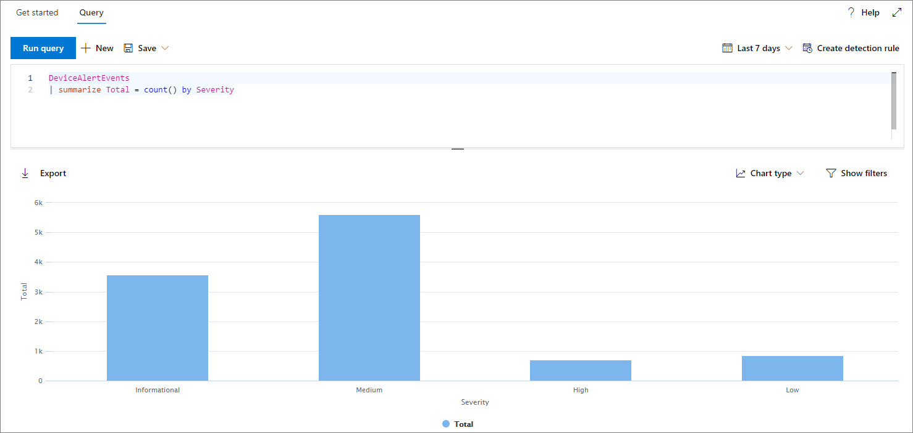

# <a name="work-with-advanced-hunting-query-results"></a>Trabajar con resultados avanzados de consulta de búsqueda

[!INCLUDE [Microsoft 365 Defender rebranding](../../includes/microsoft-defender.md)]

**Se aplica a:**
- [Microsoft Defender para punto de conexión](https://go.microsoft.com/fwlink/?linkid=2154037)

>¿Desea experimentar Defender for Endpoint? [Regístrate para obtener una versión de prueba gratuita.](https://www.microsoft.com/microsoft-365/windows/microsoft-defender-atp?ocid=docs-wdatp-advancedhunting-abovefoldlink)

Aunque puede crear [](advanced-hunting-overview.md) las consultas de búsqueda avanzadas para devolver información muy precisa, también puede trabajar con los resultados de la consulta para obtener más información e investigar actividades e indicadores específicos. Puede realizar las siguientes acciones en los resultados de la consulta:

- Ver resultados como una tabla o gráfico
- Exportar tablas y gráficos
- Profundizar en la información detallada de la entidad
- Ajustar las consultas directamente desde los resultados o aplicar filtros

## <a name="view-query-results-as-a-table-or-chart"></a>Ver resultados de consulta como tabla o gráfico
De forma predeterminada, la búsqueda avanzada muestra los resultados de la consulta como datos tabulares. También puede mostrar los mismos datos que un gráfico. La búsqueda avanzada admite las siguientes vistas:

| Tipo de vista | Descripción |
| -- | -- |
| **Table** | Muestra los resultados de la consulta en formato tabular |
| **Gráfico de columnas** | Representa una serie de elementos únicos en el eje X como barras verticales cuyas alturas representan valores numéricos de otro campo |
| **Gráfico de columnas apiladas** | Representa una serie de elementos únicos en el eje X como barras verticales apiladas cuyas alturas representan valores numéricos de uno o más campos |
| **Gráfico circular** | Representa los pies seccionales que representan elementos únicos. El tamaño de cada circular representa valores numéricos de otro campo. |
| **Gráfico de donas** | Representa arcos seccionales que representan elementos únicos. La longitud de cada arco representa valores numéricos de otro campo. |
| **Gráfico de líneas** | Traza valores numéricos para una serie de elementos únicos y conecta los valores trazados |
| **Gráfico de dispersión** | Traza valores numéricos para una serie de elementos únicos |
| **Gráfico de áreas** | Traza valores numéricos para una serie de elementos únicos y rellena las secciones debajo de los valores trazados |

### <a name="construct-queries-for-effective-charts"></a>Crear consultas para gráficos efectivos
Al representar gráficos, la búsqueda avanzada identifica automáticamente las columnas de interés y los valores numéricos que se agregan. Para obtener gráficos significativos, construya las consultas para devolver los valores específicos que desea ver visualizados. Estas son algunas consultas de ejemplo y los gráficos resultantes.

#### <a name="alerts-by-severity"></a>Alertas por gravedad
Use el `summarize` operador para obtener un recuento numérico de los valores que desea gráfico. La consulta siguiente usa el `summarize` operador para obtener el número de alertas por gravedad.

```kusto
DeviceAlertEvents
| summarize Total = count() by Severity
```
Al representar los resultados, un gráfico de columnas muestra cada valor de gravedad como una columna independiente:


 *como gráfico de columnas*

#### <a name="alert-severity-by-operating-system"></a>Gravedad de alerta por sistema operativo
También puede usar el operador para `summarize` preparar los resultados de los valores de gráfico de varios campos. Por ejemplo, es posible que desee comprender cómo se distribuyen las gravedades de alerta entre sistemas operativos (SO). 

La consulta siguiente usa un operador para extraer información del sistema operativo de la tabla y, a continuación, usa para contar los valores `join` `DeviceInfo` de las columnas `summarize` `OSPlatform` `Severity` y:

```kusto
DeviceAlertEvents
| join DeviceInfo on DeviceId
| summarize Count = count() by OSPlatform, Severity
```
Estos resultados se visualizan mejor con un gráfico de columnas apiladas:


 *como un gráfico apilado*

#### <a name="top-ten-device-groups-with-alerts"></a>Los diez grupos de dispositivos con alertas
Si está trabajando con una lista de valores que no es finita, puede usar el operador para mostrar solo los valores con más `Top` instancias. Por ejemplo, para obtener los diez grupos de dispositivos con más alertas, use la consulta siguiente:

```kusto
DeviceAlertEvents
| join DeviceInfo on DeviceId
| summarize Count = count() by MachineGroup
| top 10 by Count
```
Use la vista gráfico circular para mostrar de forma eficaz la distribución en los grupos superiores:


 *gráfico circular que muestra la distribución de alertas entre grupos de dispositivos*

#### <a name="malware-detections-over-time"></a>Detecciones de malware con el tiempo
Con el operador con la función, puede comprobar si hay eventos que impliquen un indicador determinado a lo `summarize` largo del `bin()` tiempo. La consulta siguiente cuenta las detecciones de un archivo de prueba EICAR a intervalos de 30 minutos para mostrar picos en las detecciones de ese archivo:

```kusto
DeviceEvents
| where ActionType == "AntivirusDetection"
| where SHA1 == "3395856ce81f2b7382dee72602f798b642f14140"
| summarize Detections = count() by bin(Timestamp, 30m)
```
El siguiente gráfico de líneas resalta claramente los períodos de tiempo con más detecciones del malware de prueba: 


 *un malware de prueba con el tiempo*


## <a name="export-tables-and-charts"></a>Exportar tablas y gráficos
Después de ejecutar una consulta, **seleccione Exportar** para guardar los resultados en un archivo local. La vista elegida determina cómo se exportan los resultados:

- **Vista tabla:** los resultados de la consulta se exportan en forma tabular como un libro de Microsoft Excel
- **Cualquier gráfico:** los resultados de la consulta se exportan como una imagen JPEG del gráfico representado

## <a name="drill-down-from-query-results"></a>Profundizar en los resultados de la consulta
Para ver más información sobre entidades, como dispositivos, archivos, usuarios, direcciones IP y direcciones URL, en los resultados de la consulta, simplemente haga clic en el identificador de entidad. Se abre una página de perfil detallada para la entidad seleccionada.

Para inspeccionar rápidamente un registro en los resultados de la consulta, seleccione la fila correspondiente para abrir el panel Inspeccionar registro. El panel proporciona la siguiente información basada en el registro seleccionado:

- **Activos:** una vista resumida de los activos principales (buzones, dispositivos y usuarios) que se encuentran en el registro, enriquecidos con información disponible, como los niveles de riesgo y exposición
- **Árbol de procesos:** un gráfico generado para registros con información del proceso y enriquecido con información contextual disponible; en general, las consultas que devuelven más columnas pueden dar como resultado árboles de proceso más enriquecidos.
- **Todos los detalles:** enumera todos los valores de las columnas del registro

## <a name="tweak-your-queries-from-the-results"></a>Modificar las consultas de los resultados
Haga clic con el botón derecho en un valor en el conjunto de resultados para mejorar la búsqueda rápidamente. Puede usar las opciones para:

- Buscar explícitamente el valor seleccionado (`==`)
- Excluir el valor seleccionado de la consulta (`!=`)
- Obtenga más operadores avanzados para agregar el valor a la consulta, como `contains`, `starts with` y `ends with` 


## <a name="filter-the-query-results"></a>Filtrar los resultados de la consulta
Los filtros que se muestran en el panel derecho proporcionan un resumen del conjunto de resultados. Cada columna tiene su propia sección en el panel, cada una de las cuales enumera los valores encontrados en esa columna y el número de instancias.

Refine la consulta seleccionando los botones o en `+` los valores que desea incluir o `-` excluir. A continuación, **seleccione Ejecutar consulta**.


Cuando aplica el filtro para modificar la consulta y, a continuación, ejecuta la consulta, los resultados se actualizan en consecuencia.

## <a name="related-topics"></a>Temas relacionados
- [Información general sobre la búsqueda avanzada](advanced-hunting-overview.md)
- [Aprender el lenguaje de consulta](advanced-hunting-query-language.md)
- [Usar consultas compartidas](advanced-hunting-shared-queries.md)
- [Entender el esquema](advanced-hunting-schema-reference.md)
- [Aplicar procedimientos recomendados de consulta](advanced-hunting-best-practices.md)
- [Introducción a las detecciones personalizadas](overview-custom-detections.md)
