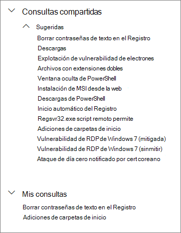
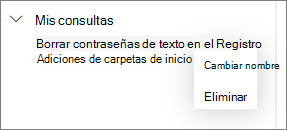

# Utilice las consultas compartidas en la búsqueda avanzada

[!INCLUDE [Microsoft 365 Defender rebranding](../../includes/microsoft-defender.md)]

**Se aplica a:**
- [Microsoft Defender para punto de conexión](https://go.microsoft.com/fwlink/p/?linkid=2154037)

>¿Desea experimentar Defender for Endpoint? [Regístrate para obtener una versión de prueba gratuita.](https://www.microsoft.com/microsoft-365/windows/microsoft-defender-atp?ocid=docs-wdatp-advancedhunting-abovefoldlink)

Las consultas en la [búsqueda avanzada](advanced-hunting-overview.md) pueden ser compartidas entre usuarios de la misma organización. También puede buscar las consultas compartidas de forma pública en GitHub. Estas consultas le permitirán seguir rápidamente los escenarios específicos de búsqueda contra amenazas sin tener que escribir las consultas desde cero.

## Guardar, modificar y compartir la consulta
Puede guardar una consulta nueva o existente para que sólo sea accesible para usted o compartida con otros usuarios en su organización.

1. Escriba una nueva consulta o cargue una existente desde **en Consultas compartidas** o **Mis consultas**.

2. Seleccione **Guardar** o **Guardar como en** las opciones de guardar. Para evitar sobrescribir una consulta existente, elija **Guardar como**.

3. Escriba un nombre para la consulta.

   

4. Seleccione la carpeta en la que desea guardar la consulta.
    - **Consultas compartidas:** compartidas para todos los usuarios de la organización
    - **Mis consultas** — accesibles sólo para usted.
    
5. Seleccione **Guardar**.

## Eliminar o cambiar el nombre de la consulta
1. Haga clic con el botón derecho en la consulta que desee cambiar o eliminar el nombre.

    

2. Seleccione **Eliminar** y confirme su eliminación. O seleccione **Cambiar el nombre** y proporcione un nombre nuevo para la consulta.

## Crear un vínculo directo a una consulta
Para generar un vínculo que abra la consulta directamente en el editor de consultas de búsqueda avanzada, finalizar la consulta y seleccionar **Compartir vínculo**.

## Acceder a las consultas en el repositorio de GitHub  
Los investigadores de la seguridad de Microsoft comparten regularmente las consultas de búsquedas avanzadas en un [repositorio público designado en GitHub](https://github.com/Microsoft/WindowsDefenderATP-Hunting-Queries). Este repositorio está abierto a contribuciones. Para contribuir, [únete a GitHub gratis](https://github.com/). 

>[!TIP]
>Los investigadores de la seguridad de Microsoft también proporcionan búsquedas avanzadas que puede ser utilizadas para buscar actividades e indicadores asociados a las amenazas emergentes. Estas consultas son proporcionadas en los informes del [análisis de amenazas](threat-analytics.md) del Centro de seguridad de Microsoft Defender.

## Temas relacionados
- [Información general sobre la búsqueda avanzada de amenazas](advanced-hunting-overview.md)
- [Aprender el lenguaje de consulta](advanced-hunting-query-language.md)
- [Trabajar con resultados de consulta](advanced-hunting-query-results.md)
- [Entender el esquema](advanced-hunting-schema-reference.md)
- [Aplicar procedimientos recomendados de consulta](advanced-hunting-best-practices.md)
- [Introducción a las detecciones personalizadas](overview-custom-detections.md)
