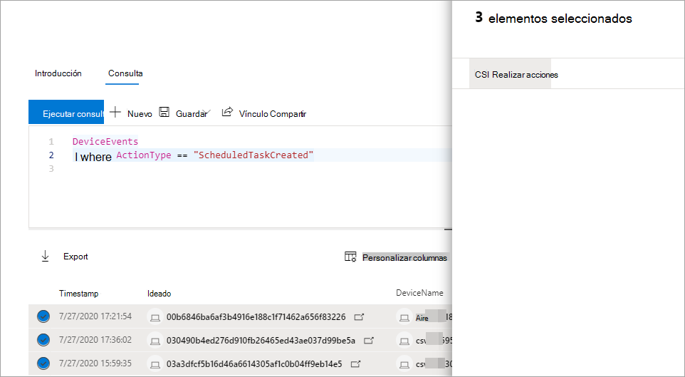

# Realizar acciones en los resultados avanzados de la consulta de búsquedaTake action on advanced hunting query results

**Se aplica a:****Applies to:**
- [Microsoft Defender para punto de conexiónMicrosoft Defender for Endpoint](https://go.microsoft.com/fwlink/p/?linkid=2154037)

> ¿Desea experimentar Defender for Endpoint?Want to experience Defender for Endpoint? [Regístrate para obtener una versión de prueba gratuita.Sign up for a free trial.](https://www.microsoft.com/microsoft-365/windows/microsoft-defender-atp?ocid=docs-wdatp-advancedhuntingref-abovefoldlink)

Puede contener rápidamente amenazas o solucionar activos en peligro que encuentre en la búsqueda avanzada [mediante](advanced-hunting-overview.md) opciones de acción eficaces y completas.You can quickly contain threats or address compromised assets that you find in [advanced hunting](advanced-hunting-overview.md) using powerful and comprehensive action options. Con estas opciones, puede:With these options, you can:

- Realizar varias acciones en dispositivosTake various actions on devices
- Archivos en cuarentenaQuarantine files

## Permisos necesariosRequired permissions

Para poder tomar medidas a través de la búsqueda avanzada, necesita un rol en Defender for Endpoint con permisos para enviar acciones de corrección [en dispositivos](https://docs.microsoft.com/microsoft-365/security/defender-endpoint/user-roles#permission-options).To be able to take action through advanced hunting, you need a role in Defender for Endpoint with [permissions to submit remediation actions on devices](https://docs.microsoft.com/microsoft-365/security/defender-endpoint/user-roles#permission-options). Si no puede tomar medidas, póngase en contacto con un administrador global para obtener el siguiente permiso:If you can't take action, contact a global administrator about getting the following permission:

*Acciones de corrección activas > administración de amenazas y vulnerabilidades: control de corrección**Active remediation actions > Threat and vulnerability management - Remediation handling*

## Realizar varias acciones en dispositivosTake various actions on devices

Puede realizar las siguientes acciones en dispositivos identificados por la `DeviceId` columna en los resultados de la consulta:You can take the following actions on devices identified by the `DeviceId` column in your query results:

- Aislar dispositivos afectados para contener una infección o evitar que los ataques se muevan lateralmenteIsolate affected devices to contain an infection or prevent attacks from moving laterally
- Recopilar paquete de investigación para obtener más información forenseCollect investigation package to obtain more forensic information
- Ejecutar un examen antivirus para buscar y eliminar amenazas con las últimas actualizaciones de inteligencia de seguridadRun an antivirus scan to find and remove threats using the latest security intelligence updates
- Iniciar una investigación automatizada para comprobar y corregir las amenazas en el dispositivo y posiblemente otros dispositivos afectadosInitiate an automated investigation to check and remediate threats on the device and possibly other affected devices
- Restringir la ejecución de aplicaciones solo a archivos ejecutables firmados por Microsoft, lo que impide la actividad de amenaza posterior a través de malware u otros ejecutables que no son de confianzaRestrict app execution to only Microsoft-signed executable files, preventing subsequent threat activity through malware or other untrusted executables

Para obtener más información sobre cómo se realizan estas acciones de respuesta a través de Defender for Endpoint, lea sobre las [acciones de respuesta en dispositivos](respond-machine-alerts.md).To learn more about how these response actions are performed through Defender for Endpoint, [read about response actions on devices](respond-machine-alerts.md).

## Archivos en cuarentenaQuarantine files

Puede implementar la acción *de cuarentena* en los archivos para que se pongan automáticamente en cuarentena cuando se encuentren.You can deploy the *quarantine* action on files so that they are automatically quarantined when encountered. Al seleccionar esta acción, puede elegir entre las siguientes columnas para identificar qué archivos de los resultados de la consulta se ponen en cuarentena:When selecting this action, you can choose between the following columns to identify which files in your query results to quarantine:

- `SHA1` — En la mayoría de las tablas de búsqueda avanzadas, este es el SHA-1 del archivo que se vio afectado por la acción grabada.`SHA1` — In most advanced hunting tables, this is the SHA-1 of the file that was affected by the recorded action. Por ejemplo, si se copia un archivo, este sería el archivo copiado.For example, if a file was copied, this would be the copied file.
- `InitiatingProcessSHA1` — En la mayoría de las tablas de búsqueda avanzadas, este es el archivo responsable de iniciar la acción grabada.`InitiatingProcessSHA1` — In most advanced hunting tables, this is the file responsible for initiating the recorded action. Por ejemplo, si se inicia un proceso secundario, este sería el proceso primario.For example, if a child process was launched, this would be the parent process. 
- `SHA256` — Este es el equivalente SHA-256 del archivo identificado por la `SHA1` columna.`SHA256` — This is the SHA-256 equivalent of the file identified by the `SHA1` column.
- `InitiatingProcessSHA256` — Este es el equivalente SHA-256 del archivo identificado por la `InitiatingProcessSHA1` columna.`InitiatingProcessSHA256` — This is the SHA-256 equivalent of the file identified by the `InitiatingProcessSHA1` column.

Para obtener más información sobre cómo se toman las acciones de cuarentena y cómo se pueden restaurar los archivos, lea acerca de las [acciones de respuesta en los archivos](respond-file-alerts.md).To learn more about how quarantine actions are taken and how files can be restored, [read about response actions on files](respond-file-alerts.md).

>[!NOTE]
>Para buscar archivos y ponerlos en cuarentena, los resultados de la consulta también deben incluir `DeviceId` valores como identificadores de dispositivo.To locate files and quarantine them, the query results should also include `DeviceId` values as device identifiers.  

## Tomar medidasTake action

Para realizar cualquiera de las acciones descritas, seleccione uno o más registros en los resultados de la consulta y, a continuación, **seleccione Realizar acciones**.To take any of the described actions, select one or more records in your query results and then select **Take actions**. Un asistente le guiará a través del proceso de selección y envío de las acciones preferidas.A wizard will guide you through the process of selecting and then submitting your preferred actions.

## Revisar acciones realizadasReview actions taken

Cada acción se registra individualmente en el centro de acciones, en **Historial del centro** de acciones (  >   [security.microsoft.com/action-center/history](https://security.microsoft.com/action-center/history)).Each action is individually recorded in the action center, under **Action center** > **History** ([security.microsoft.com/action-center/history](https://security.microsoft.com/action-center/history)). Vaya al centro de acciones para comprobar el estado de cada acción.Go to the action center to check the status of each action.
 
## Temas relacionadosRelated topics

- [Información general sobre la búsqueda avanzadaAdvanced hunting overview](advanced-hunting-overview.md)
- [Aprender el lenguaje de consultaLearn the query language](advanced-hunting-query-language.md)
- [Entender el esquemaUnderstand the schema](advanced-hunting-schema-reference.md)
- [Trabajar con resultados de consultaWork with query results](advanced-hunting-query-results.md)
- [Aplicar procedimientos recomendados de consultaApply query best practices](advanced-hunting-best-practices.md)
- [Introducción a las detecciones personalizadasCustom detections overview](overview-custom-detections.md)
