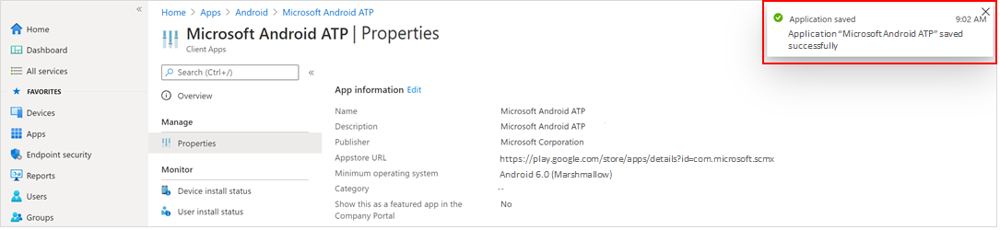
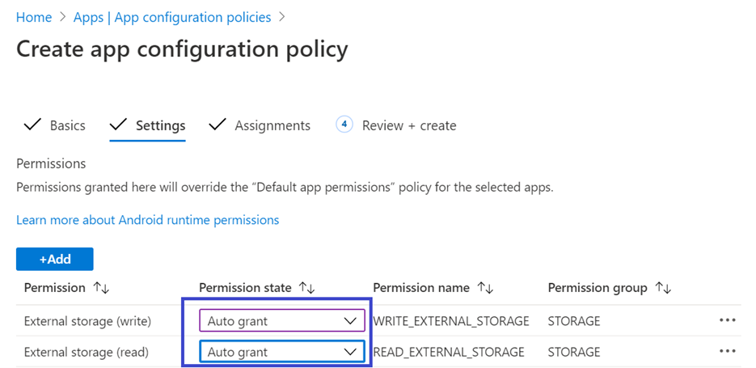
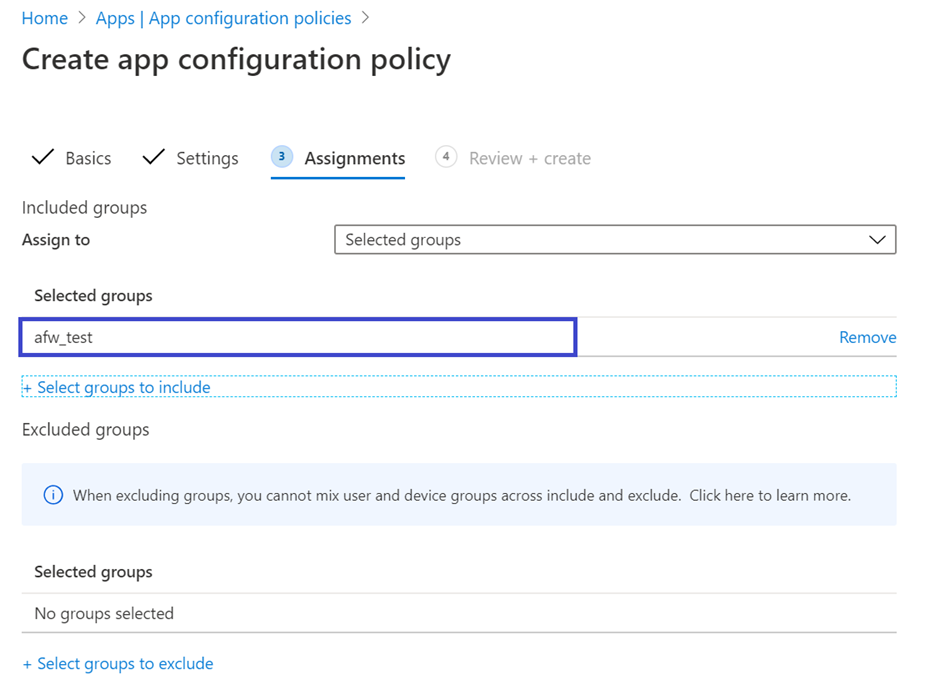
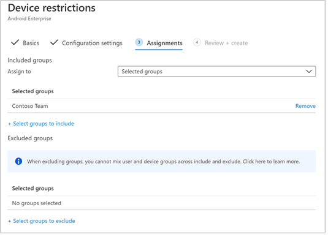

# Implementar Microsoft Defender para endpoint en Android con Microsoft IntuneDeploy Microsoft Defender for Endpoint on Android with Microsoft Intune 

[!INCLUDE [Microsoft 365 Defender rebranding](../../includes/microsoft-defender.md)]

**Se aplica a:****Applies to:**
- [Microsoft Defender para punto de conexiónMicrosoft Defender for Endpoint](https://go.microsoft.com/fwlink/p/?linkid=2154037)
- [Microsoft 365 DefenderMicrosoft 365 Defender](https://go.microsoft.com/fwlink/?linkid=2118804)

> ¿Desea experimentar Microsoft Defender para endpoint?Want to experience Microsoft Defender for Endpoint? [Regístrate para obtener una versión de prueba gratuita.Sign up for a free trial.](https://www.microsoft.com/microsoft-365/windows/microsoft-defender-atp?ocid=docs-wdatp-exposedapis-abovefoldlink) 

Obtenga información sobre cómo implementar Defender para Endpoint para Android en dispositivos inscritos en el Portal de empresa de Intune.Learn how to deploy Defender for Endpoint for Android on Intune Company Portal enrolled devices. Para obtener más información acerca de la inscripción de dispositivos de Intune, consulta  [Inscribir el dispositivo](https://docs.microsoft.com/mem/intune/user-help/enroll-device-android-company-portal).For more information about Intune device enrollment, see  [Enroll your device](https://docs.microsoft.com/mem/intune/user-help/enroll-device-android-company-portal).

> [!NOTE]
> **Defender para Endpoint para Android ya está disponible en [Google Play](https://play.google.com/store/apps/details?id=com.microsoft.scmx)****Defender for Endpoint for Android is now available on [Google Play](https://play.google.com/store/apps/details?id=com.microsoft.scmx)**  
> Puedes conectarte a Google Play desde Intune para implementar la aplicación Defender for Endpoint en los modos de inscripción administrador de dispositivos y Android Enterprise.You can connect to Google Play from Intune to deploy Defender for Endpoint app across Device Administrator and Android Enterprise entrollment modes.
Las actualizaciones de la aplicación son automáticas a través de Google Play.Updates to the app are automatic via Google Play.

## Implementar en dispositivos inscritos por el administrador de dispositivosDeploy on Device Administrator enrolled devices

**Implementar Defender para Endpoint para Android en Intune Company Portal: dispositivos inscritos por el administrador de dispositivos****Deploy Defender for Endpoint for Android on Intune Company Portal - Device Administrator enrolled devices**

Obtenga información sobre cómo implementar Defender for Endpoint para Android en Intune Company Portal: dispositivos inscritos por el administrador de dispositivos.Learn how to deploy Defender for Endpoint for Android on Intune Company Portal - Device Administrator enrolled devices. 

### Agregar como aplicación de la Tienda AndroidAdd as Android store app

1. En [el Centro de administración de Microsoft Endpoint Manager,](https://go.microsoft.com/fwlink/?linkid=2109431) ve a **Aplicaciones** \> **Android Apps** Agregar aplicación de la tienda \> **\> Android** y elige **Seleccionar**.In [Microsoft Endpoint Manager admin center](https://go.microsoft.com/fwlink/?linkid=2109431) , go to **Apps** \> **Android Apps** \> **Add \> Android store app** and choose **Select**.

   

2. En la **página Agregar aplicación** y en la sección Información de *la* aplicación, escriba:On the **Add app** page and in the *App Information* section enter: 

   - **Name****Name** 
   - **Descripción****Description**
   - **Publisher** como Microsoft.**Publisher** as Microsoft.
   - **Dirección URL de la Tienda de** aplicaciones como https://play.google.com/store/apps/details?id=com.microsoft.scmx (DIRECCIÓN URL de La aplicación Defender para endpoint de Google Play Store)**App store URL** as https://play.google.com/store/apps/details?id=com.microsoft.scmx (Defender for Endpoint app Google Play Store URL) 

   Otros campos son opcionales.Other fields are optional. Seleccione **Siguiente**.Select **Next**.

   

3. En la *sección Asignaciones,* vaya a la **sección Obligatorio** y seleccione **Agregar grupo.**In the *Assignments* section, go to the **Required** section and select **Add group.** A continuación, puedes elegir los grupos de usuarios a los que te gustaría dirigirte a Defender para endpoint para la aplicación Android.You can then choose the user group(s) that you would like to target Defender for Endpoint for Android app. Elija **Seleccionar** y, a **continuación, Siguiente**.Choose **Select** and then **Next**.

    >[!NOTE]
    >El grupo de usuarios seleccionado debe estar formado por usuarios inscritos en Intune.The selected user group should consist of Intune enrolled users.

    > [!div class="mx-imgBorder"]

    > 

4. En la **sección Review+Create,** compruebe que toda la información especificada es correcta y, a continuación, **seleccione Crear**.In the **Review+Create** section, verify that all the information entered is correct and then select **Create**.

    En unos instantes, la aplicación Defender for Endpoint se crearía correctamente y se mostraría una notificación en la esquina superior derecha de la página.In a few moments, the Defender for Endpoint app would be created successfully, and a notification would show up at the top-right corner of the page.

    

5. En la página de información de la aplicación  que se muestra, en la sección **Supervisar,** seleccione Estado de instalación del dispositivo para comprobar que la instalación del dispositivo se ha completado correctamente.In the app information page that is displayed, in the **Monitor** section, select **Device install status** to verify that the device installation has completed successfully.

    > [!div class="mx-imgBorder"]
    > 

### Completar la incorporación y comprobar el estadoComplete onboarding and check status

1. Una vez que Defender para Endpoint para Android se haya instalado en el dispositivo, verás el icono de la aplicación.Once Defender for Endpoint for Android has been installed on the device, you'll see the app icon.

    

2. Pulsa el icono de la aplicación atp de Microsoft Defender y sigue las instrucciones en pantalla para completar la incorporación de la aplicación.Tap the Microsoft Defender ATP app icon and follow the on-screen instructions to complete onboarding the app. Los detalles incluyen la aceptación por parte del usuario final de los permisos de Android requeridos por Defender para Endpoint para Android.The details include end-user acceptance of Android permissions required by Defender for Endpoint for Android.

3. Tras la incorporación correcta, el dispositivo empezará a aparecer en la lista dispositivos del Centro de seguridad de Microsoft Defender.Upon successful onboarding, the device will start showing up on the Devices list in Microsoft Defender Security Center.

    

## Implementar en dispositivos inscritos en Android EnterpriseDeploy on Android Enterprise enrolled devices

Defender para Endpoint para Android admite dispositivos inscritos en Android Enterprise.Defender for Endpoint for Android supports Android Enterprise enrolled devices.

Para obtener más información sobre las opciones de inscripción admitidas por Intune, vea [Opciones de inscripción](https://docs.microsoft.com/mem/intune/enrollment/android-enroll).For more information on the enrollment options supported by Intune, see [Enrollment Options](https://docs.microsoft.com/mem/intune/enrollment/android-enroll).

**Actualmente, los dispositivos de propiedad personal con perfil de trabajo y las inscripciones de dispositivos de usuario totalmente administrados de propiedad corporativa se admiten para la implementación.****Currently, Personally owned devices with work profile and Corporate-owned fully managed user device enrollments are supported for deployment.**

## Agregar Microsoft Defender para endpoint en Android como una aplicación administrada de Google PlayAdd Microsoft Defender for Endpoint on Android as a Managed Google Play app

Sigue los pasos siguientes para agregar la aplicación Microsoft Defender para endpoint a tu Google Play administrado.Follow the steps below to add Microsoft Defender for Endpoint app into your managed Google Play.

1. En [el Centro de administración de Microsoft Endpoint Manager,](https://go.microsoft.com/fwlink/?linkid=2109431) ve a **Aplicaciones** para Agregar \> **aplicaciones android** y selecciona Aplicación administrada de Google \>  **Play.**In [Microsoft Endpoint Manager admin center](https://go.microsoft.com/fwlink/?linkid=2109431) , go to **Apps** \> **Android Apps** \> **Add** and select **Managed Google Play app**.

    > [!div class="mx-imgBorder"]
    > 

2. En la página administrada de Google Play que se carga posteriormente, ve al cuadro de búsqueda y busca **Microsoft Defender.**On your managed Google Play page that loads subsequently, go to the search box and lookup **Microsoft Defender.** La búsqueda debe mostrar la aplicación Microsoft Defender para endpoint en tu Google Play administrado.Your search should display the Microsoft Defender for Endpoint app in your Managed Google Play. Haz clic en la aplicación Microsoft Defender para endpoint desde el resultado de la búsqueda Aplicaciones.Click on the Microsoft Defender for Endpoint app from the Apps search result.

    

3. En la página Descripción de la aplicación que aparece a continuación, deberías poder ver los detalles de la aplicación en Defender para endpoint.In the App description page that comes up next, you should be able to see app details on Defender for Endpoint. Revise la información de la página y, a continuación, seleccione **Aprobar**.Review the information on the page and then select **Approve**.

    > [!div class="mx-imgBorder"]
    > 

4. Se te mostrarán los permisos que Defender for Endpoint obtiene para que funcione.You'll be presented with the permissions that Defender for Endpoint obtains for it to work. Repase y, a continuación, **seleccione Aprobar**.Review them and then select **Approve**.

    

5. Se le mostrará la página Configuración de aprobación.You'll be presented with the Approval settings page. La página confirma tu preferencia para controlar los nuevos permisos de la aplicación que Defender for Endpoint para Android podría pedir.The page confirms your preference to handle new app permissions that Defender for Endpoint for Android might ask. Revisa las opciones y selecciona la opción preferida.Review the choices and select your preferred option. Seleccione **Listo**.Select **Done**.

    De forma predeterminada, Google Play administrado selecciona Mantener aprobado cuando *la aplicación solicita nuevos permisos*By default, managed Google Play selects *Keep approved when app requests new permissions*

    > [!div class="mx-imgBorder"]
    > 

6. Después de realizar la selección de control de permisos, selecciona **Sincronizar** para sincronizar Microsoft Defender para Endpoint con la lista de aplicaciones.After the permissions handling selection is made, select **Sync** to sync Microsoft Defender for Endpoint to your apps list.

    > [!div class="mx-imgBorder"]
    > 

7. La sincronización se completará en unos minutos.The sync will complete in a few minutes.

    

8. Selecciona el **botón** Actualizar en la pantalla Aplicaciones de Android y ATP de Microsoft Defender debe estar visible en la lista de aplicaciones.Select the **Refresh** button in the Android apps screen and Microsoft Defender ATP should be visible in the apps list.

    > [!div class="mx-imgBorder"]
    > 

9. Defender for Endpoint admite directivas de configuración de aplicaciones para dispositivos administrados a través de Intune.Defender for Endpoint supports App configuration policies for managed devices via Intune. Esta funcionalidad se puede aprovechar para aplicar automáticamente los permisos de Android aplicables, por lo que el usuario final no necesita aceptar estos permisos.This capability can be leveraged to autogrant applicable Android permission(s), so the end user does not need to accept these permission(s).

    1. En la **página Aplicaciones,** vaya a Directiva > de configuración de **aplicaciones > Agregar > dispositivos administrados.**In the **Apps** page, go to **Policy > App configuration policies > Add > Managed devices**.

       

    1. En la **página Crear directiva de configuración de aplicaciones,** escriba los siguientes detalles:In the **Create app configuration policy** page, enter the following details:
    
        - Nombre: ATP de Microsoft Defender.Name: Microsoft Defender ATP.
        - Elija **Android Enterprise** como plataforma.Choose **Android Enterprise** as platform.
        - Elija **Perfil de trabajo solo** como Tipo de perfil.Choose **Work Profile only** as Profile Type.
        - Haga **clic en Seleccionar aplicación,** elija ATP de Microsoft **Defender,** **seleccione Aceptar** y, a continuación, **Siguiente**.Click **Select App**, choose **Microsoft Defender ATP**, select **OK** and then **Next**.
    
        > [!div class="mx-imgBorder"]
        > 

    1. En la **página Configuración,** vaya a la sección Permisos haga clic en Agregar para ver la lista de permisos admitidos.In the **Settings** page, go to the Permissions section click on Add to view the list of supported permissions. En la sección Agregar permisos, seleccione los siguientes permisos:In the Add Permissions section, select the following permissions:

       - Almacenamiento externo (lectura)External storage (read)
       - Almacenamiento externo (escritura)External storage (write)

       A continuación, seleccione **Aceptar**.Then select **OK**.

       > [!div class="mx-imgBorder"]
      > 

    1. Ahora debería ver los dos permisos enumerados y ahora puede autograntar  eligiendo autogrant en la lista desplegable Estado de permisos y, a continuación, **seleccione Siguiente**.You should now see both the permissions listed and now you can autogrant both by choosing autogrant in the **Permission state** drop-down and then select **Next**.

       > [!div class="mx-imgBorder"]
       > 

    1. En la **página Asignaciones,** seleccione el grupo de usuarios al que se asignaría esta directiva de configuración de aplicaciones.In the **Assignments** page, select the user group to which this app config policy would be assigned to. Haga **clic en Seleccionar grupos para** incluir y seleccionar el grupo aplicable y, a continuación, seleccione **Siguiente**.Click **Select groups to include** and selecting the applicable group and then selecting **Next**.  El grupo seleccionado aquí suele ser el mismo grupo al que asignaría Microsoft Defender para la aplicación Android de punto de conexión.The group selected here is usually the same group to which you would assign Microsoft Defender for Endpoint Android app. 

       > [!div class="mx-imgBorder"]
       > 
    

     1. En la **página Revisar + Crear** que aparece a continuación, revise toda la información y, a continuación, seleccione **Crear**.In the **Review + Create** page that comes up next, review all the information and then select **Create**.  
    
        La directiva de configuración de la aplicación para Defender for Endpoint autogranting the storage permission is now assigned to the selected user group.The app configuration policy for Defender for Endpoint autogranting the storage permission is now assigned to the selected user group.

        > [!div class="mx-imgBorder"]
        > 

10. Selecciona **Aplicación ATP de Microsoft Defender** en la lista \> **Propiedades** \> **Asignaciones** \> **Editar**.Select **Microsoft Defender ATP** app in the list \> **Properties** \> **Assignments** \> **Edit**.

    

11. Asigna la aplicación como *una aplicación* necesaria a un grupo de usuarios.Assign the app as a *Required* app to a user group. Se instala automáticamente en el perfil de trabajo *durante* la próxima sincronización del dispositivo a través de la aplicación Portal de empresa.It is automatically installed in the *work profile* during the next sync of the device via Company Portal app. Para realizar esta asignación, vaya a la *sección* Obligatorio Agregar \> **grupo,** seleccione el grupo de usuarios y haga clic en **Seleccionar**.This assignment can be done by navigating to the *Required* section \> **Add group,** selecting the user group and click **Select**.

    > [!div class="mx-imgBorder"]
    > 

12. En la **página Editar aplicación,** revise toda la información especificada anteriormente.In the **Edit Application** page, review all the information that was entered above. A **continuación, seleccione Revisar + Guardar** y, a continuación, Vuelva **a** guardar para iniciar la asignación.Then select **Review + Save** and then **Save** again to commence assignment.

### Configuración automática de VPN always-onAuto Setup of Always-on VPN 
Defender for Endpoint admite directivas de configuración de dispositivos para dispositivos administrados a través de Intune.Defender for Endpoint supports Device configuration policies for managed devices via Intune. Esta funcionalidad se puede aprovechar para la configuración automática de **VPN** siempre en dispositivos inscritos en Android Enterprise, por lo que el usuario final no necesita configurar el servicio VPN durante la incorporación.This capability can be leveraged to **Auto setup of Always-on VPN** on Android Enterprise enrolled devices, so the end user does not need to set up VPN service while onboarding.
1.  En Dispositivos, seleccione **Perfiles de configuración**  >  **Crear**  >    >   **restricciones** de dispositivo de selección de plataforma de perfil de Android Enterprise en una de las siguientes opciones, según el tipo de inscripción del dispositivoOn **Devices**, select **Configuration Profiles** > **Create Profile** > **Platform** > **Android Enterprise** Select **Device restrictions** under one of the following, based on your device enrollment type 
- **Perfil de trabajo totalmente administrado, dedicado y Corporate-Owned trabajo****Fully Managed, Dedicated, and Corporate-Owned Work Profile**
- **Perfil de trabajo de propiedad personal****Personally owned Work Profile**

Seleccione **Crear**.Select **Create**.
 
   > 
    
2. **Configuración** Proporcione un **nombre y** una **descripción para** identificar de forma única el perfil de configuración.**Configuration Settings** Provide a **Name** and a **Description** to uniquely identify the configuration profile. 

   > 
   
 3. Seleccione **Conectividad** y configure VPN:Select **Connectivity** and configure VPN:
- Habilite **La configuración de VPN siempre** activa un cliente VPN en el perfil de trabajo para conectarse automáticamente y volver a conectarse a la VPN siempre que sea posible.Enable **Always-on VPN** Setup a VPN client in the work profile to automatically connect and reconnect to the VPN whenever possible. Solo se puede configurar un cliente VPN para VPN siempre en un dispositivo determinado, por lo que asegúrate de que no se implemente más de una directiva VPN siempre en un solo dispositivo.Only one VPN client can be configured for always-on VPN on a given device, so be sure to have no more than one always-on VPN policy deployed to a single device. 
- Seleccione **Custom** in VPN client dropdown list Custom VPN in this case is Defender for Endpoint VPN which is used to provide the Web Protection feature.Select **Custom** in VPN client dropdown list Custom VPN in this case is Defender for Endpoint VPN which is used to provide the Web Protection feature. 
    > [!NOTE]
    > La aplicación ATP de Microsoft Defender debe instalarse en el dispositivo del usuario para que funcione la configuración automática de esta VPN.Microsoft Defender ATP app must be installed on user’s device, in order to functioning of auto setup of this VPN.

- Escribe **El identificador del paquete** de la aplicación ATP de Microsoft Defender en Google Play Store.Enter **Package ID** of the Microsoft Defender ATP app in Google Play store. Para la dirección URL de la aplicación https://play.google.com/store/apps/details?id=com.microsoft.scmx defender, el identificador del paquete **es com.microsoft.scmx**For the Defender app URL https://play.google.com/store/apps/details?id=com.microsoft.scmx, Package ID is **com.microsoft.scmx**  
- **Modo de bloqueo** No configurado (predeterminado)**Lockdown mode** Not configured (Default) 

     
   
4. **Asignación** En la  **página Asignaciones,** seleccione el grupo de usuarios al que se asignaría esta directiva de   configuración de aplicaciones.**Assignment** In the **Assignments** page, select the user group to which this app config policy would be assigned to. Haga **clic en** Seleccionar grupos para incluir y seleccionar el grupo aplicable y, a continuación, haga clic en **Siguiente**.Click **Select groups** to include and selecting the applicable group and then click **Next**. El grupo seleccionado aquí suele ser el mismo grupo al que asignaría Microsoft Defender para la aplicación Android de punto de conexión.The group selected here is usually the same group to which you would assign Microsoft Defender for Endpoint Android app. 

     

5. En la **página Revisar + Crear** que aparece a continuación, revise toda la información y, a continuación, seleccione **Crear**.In the **Review + Create** page that comes up next, review all the information and then select **Create**. El perfil de configuración del dispositivo ahora se asigna al grupo de usuarios seleccionado.The device configuration profile is now assigned to the selected user group.    

    

## Completar la incorporación y comprobar el estadoComplete onboarding and check status

1. Confirme el estado de instalación de Microsoft Defender para Endpoint en Android haciendo clic en **el estado de instalación del dispositivo**.Confirm the installation status of Microsoft Defender for Endpoint on Android by clicking on the **Device Install Status**. Comprueba que el dispositivo se muestra aquí.Verify that the device is displayed here.

    > [!div class="mx-imgBorder"]
    > 

2. En el dispositivo, puedes validar el estado de incorporación yendo al **perfil de trabajo**.On the device, you can validate the onboarding status by going to the **work profile**. Confirme que Defender for Endpoint está disponible y que está inscrito en los dispositivos de propiedad **personal con perfil de trabajo**.Confirm that Defender for Endpoint is available and that you are enrolled to the **Personally owned devices with work profile**.  Si estás inscrito en un dispositivo de usuario totalmente administrado propiedad de la **empresa,** tendrá un único perfil en el dispositivo donde puedes confirmar que Defender for Endpoint está disponible.If you are enrolled to a **Corporate-owned, fully managed user device**, you will have a single profile on the device where you can confirm that Defender for Endpoint is available.

    

3. Cuando la aplicación esté instalada, abre la aplicación y acepta los permisos y, a continuación, la incorporación debe ser correcta.When the app is installed, open the app and accept the permissions and then your onboarding should be successful.

    

4. En esta fase, el dispositivo se incorpora correctamente a Defender para Endpoint para Android.At this stage the device is successfully onboarded onto Defender for Endpoint for Android. Para comprobar esto en el Centro de seguridad de [Microsoft Defender,](https://securitycenter.microsoft.com) vaya a la **página Dispositivos.**You can verify this on the [Microsoft Defender Security Center](https://securitycenter.microsoft.com) by navigating to the **Devices** page.

    

## Temas relacionadosRelated topics
- [Información general sobre Microsoft Defender para endpoint en AndroidOverview of Microsoft Defender for Endpoint on Android](microsoft-defender-endpoint-android.md)
- [Configurar Microsoft Defender para las características de Punto de conexión en AndroidConfigure Microsoft Defender for Endpoint on Android features](android-configure.md)
