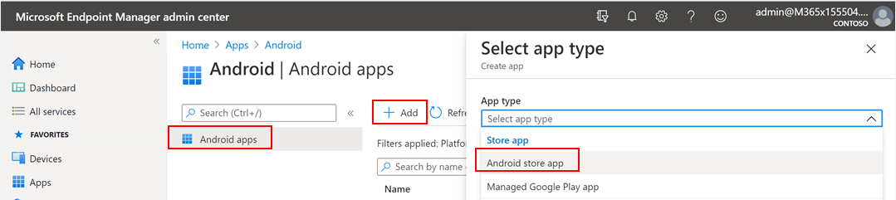
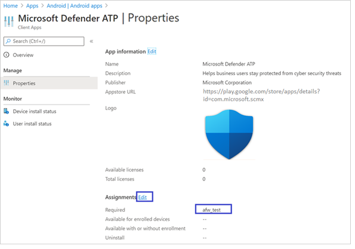
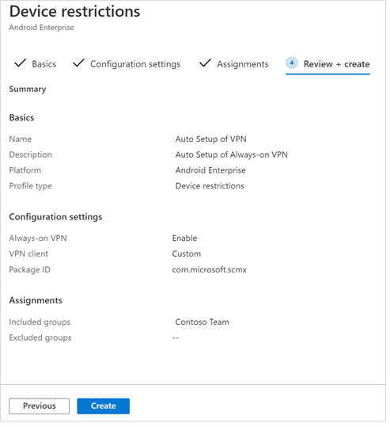
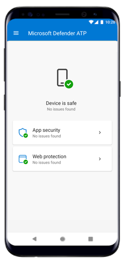

# Implementar Microsoft Defender para endpoint para Android con Microsoft Intune 

[!INCLUDE [Microsoft 365 Defender rebranding](../../includes/microsoft-defender.md)]

**Se aplica a:**
- [Microsoft Defender para punto de conexión](https://go.microsoft.com/fwlink/p/?linkid=2154037)
- [Microsoft 365 Defender](https://go.microsoft.com/fwlink/?linkid=2118804)

> ¿Desea experimentar Microsoft Defender para endpoint? [Regístrate para obtener una versión de prueba gratuita.](https://www.microsoft.com/microsoft-365/windows/microsoft-defender-atp?ocid=docs-wdatp-exposedapis-abovefoldlink) 

Obtenga información sobre cómo implementar Defender para Endpoint para Android en dispositivos inscritos en el Portal de empresa de Intune. Para obtener más información acerca de la inscripción de dispositivos de Intune, consulta  [Inscribir el dispositivo](https://docs.microsoft.com/mem/intune/user-help/enroll-device-android-company-portal).

> [!NOTE]
> **Defender para Endpoint para Android ya está disponible en [Google Play](https://play.google.com/store/apps/details?id=com.microsoft.scmx)**  
> Puedes conectarte a Google Play desde Intune para implementar la aplicación Defender for Endpoint en los modos de inscripción administrador de dispositivos y Android Enterprise.
Las actualizaciones de la aplicación son automáticas a través de Google Play.

## Implementar en dispositivos inscritos por el administrador de dispositivos

**Implementar Defender para Endpoint para Android en Intune Company Portal: dispositivos inscritos por el administrador de dispositivos**

Obtenga información sobre cómo implementar Defender for Endpoint para Android en Intune Company Portal: dispositivos inscritos por el administrador de dispositivos. 

### Agregar como aplicación de la Tienda Android

1. En [el Centro de administración de Microsoft Endpoint Manager,](https://go.microsoft.com/fwlink/?linkid=2109431) ve a **Aplicaciones** \> **Android Apps** Agregar aplicación de la tienda \> **\> Android** y elige **Seleccionar**.

   

2. En la **página Agregar aplicación** y en la sección Información de *la* aplicación, escriba: 

   - **Nombre** 
   - **Descripción**
   - **Publisher** como Microsoft.
   - **Dirección URL de la Tienda de** aplicaciones como https://play.google.com/store/apps/details?id=com.microsoft.scmx (DIRECCIÓN URL de La aplicación Defender para endpoint de Google Play Store) 

   Otros campos son opcionales. Seleccione **Siguiente**.

   

3. En la *sección Asignaciones,* vaya a la **sección Obligatorio** y seleccione **Agregar grupo.** A continuación, puedes elegir los grupos de usuarios a los que te gustaría dirigirte a Defender para endpoint para la aplicación Android. Elija **Seleccionar** y, a **continuación, Siguiente**.

    >[!NOTE]
    >El grupo de usuarios seleccionado debe estar formado por usuarios inscritos en Intune.

    > [!div class="mx-imgBorder"]

    > 

4. En la **sección Review+Create,** compruebe que toda la información especificada es correcta y, a continuación, **seleccione Crear**.

    En unos instantes, la aplicación Defender for Endpoint se crearía correctamente y se mostraría una notificación en la esquina superior derecha de la página.

    

5. En la página de información de la aplicación  que se muestra, en la sección **Supervisar,** seleccione Estado de instalación del dispositivo para comprobar que la instalación del dispositivo se ha completado correctamente.

    > [!div class="mx-imgBorder"]
    > 

### Completar la incorporación y comprobar el estado

1. Una vez que Defender para Endpoint para Android se haya instalado en el dispositivo, verás el icono de la aplicación.

    

2. Pulsa el icono de la aplicación atp de Microsoft Defender y sigue las instrucciones en pantalla para completar la incorporación de la aplicación. Los detalles incluyen la aceptación por parte del usuario final de los permisos de Android requeridos por Defender para Endpoint para Android.

3. Tras la incorporación correcta, el dispositivo empezará a aparecer en la lista dispositivos del Centro de seguridad de Microsoft Defender.

    

## Implementar en dispositivos inscritos en Android Enterprise

Defender para Endpoint para Android admite dispositivos inscritos en Android Enterprise.

Para obtener más información sobre las opciones de inscripción admitidas por Intune, vea [Opciones de inscripción](https://docs.microsoft.com/mem/intune/enrollment/android-enroll).

**Actualmente, los dispositivos de propiedad personal con perfil de trabajo y las inscripciones de dispositivos de usuario totalmente administrados de propiedad corporativa se admiten para la implementación.**

## Agregar Microsoft Defender para endpoint para Android como una aplicación administrada de Google Play

Sigue los pasos siguientes para agregar la aplicación Microsoft Defender para endpoint a tu Google Play administrado.

1. En [el Centro de administración de Microsoft Endpoint Manager,](https://go.microsoft.com/fwlink/?linkid=2109431) ve a **Aplicaciones** para Agregar \> **aplicaciones android** y selecciona Aplicación administrada de Google \>  **Play.**

    > [!div class="mx-imgBorder"]
    > 

2. En la página administrada de Google Play que se carga posteriormente, ve al cuadro de búsqueda y busca **Microsoft Defender.** La búsqueda debe mostrar la aplicación Microsoft Defender para endpoint en tu Google Play administrado. Haz clic en la aplicación Microsoft Defender para endpoint desde el resultado de la búsqueda Aplicaciones.

    

3. En la página Descripción de la aplicación que aparece a continuación, deberías poder ver los detalles de la aplicación en Defender para endpoint. Revise la información de la página y, a continuación, seleccione **Aprobar**.

    > [!div class="mx-imgBorder"]
    > 

4. Se te mostrarán los permisos que Defender for Endpoint obtiene para que funcione. Repase y, a continuación, **seleccione Aprobar**.

    

5. Se le mostrará la página Configuración de aprobación. La página confirma tu preferencia para controlar los nuevos permisos de la aplicación que Defender for Endpoint para Android podría pedir. Revisa las opciones y selecciona la opción preferida. Seleccione **Listo**.

    De forma predeterminada, Google Play administrado selecciona Mantener aprobado cuando *la aplicación solicita nuevos permisos*

    > [!div class="mx-imgBorder"]
    > 

6. Después de realizar la selección de control de permisos, selecciona **Sincronizar** para sincronizar Microsoft Defender para Endpoint con la lista de aplicaciones.

    > [!div class="mx-imgBorder"]
    > 

7. La sincronización se completará en unos minutos.

    

8. Selecciona el **botón** Actualizar en la pantalla Aplicaciones de Android y ATP de Microsoft Defender debe estar visible en la lista de aplicaciones.

    > [!div class="mx-imgBorder"]
    > 

9. Defender for Endpoint admite directivas de configuración de aplicaciones para dispositivos administrados a través de Intune. Esta funcionalidad se puede aprovechar para aplicar automáticamente los permisos de Android aplicables, por lo que el usuario final no necesita aceptar estos permisos.

    1. En la **página Aplicaciones,** vaya a Directiva > de configuración de **aplicaciones > Agregar > dispositivos administrados.**

       

    1. En la **página Crear directiva de configuración de aplicaciones,** escriba los siguientes detalles:
    
        - Nombre: ATP de Microsoft Defender.
        - Elija **Android Enterprise** como plataforma.
        - Elija **Perfil de trabajo solo** como Tipo de perfil.
        - Haga **clic en Seleccionar aplicación,** elija ATP de Microsoft **Defender,** **seleccione Aceptar** y, a continuación, **Siguiente**.
    
        > [!div class="mx-imgBorder"]
        > 

    1. En la **página Configuración,** vaya a la sección Permisos haga clic en Agregar para ver la lista de permisos admitidos. En la sección Agregar permisos, seleccione los siguientes permisos:

       - Almacenamiento externo (lectura)
       - Almacenamiento externo (escritura)

       A continuación, seleccione **Aceptar**.

       > [!div class="mx-imgBorder"]
      > 

    1. Ahora debería ver los dos permisos enumerados y ahora puede autograntar  eligiendo autogrant en la lista desplegable Estado de permisos y, a continuación, **seleccione Siguiente**.

       > [!div class="mx-imgBorder"]
       > 

    1. En la **página Asignaciones,** seleccione el grupo de usuarios al que se asignaría esta directiva de configuración de aplicaciones. Haga **clic en Seleccionar grupos para** incluir y seleccionar el grupo aplicable y, a continuación, seleccione **Siguiente**.  El grupo seleccionado aquí suele ser el mismo grupo al que asignaría Microsoft Defender para la aplicación Android de punto de conexión. 

       > [!div class="mx-imgBorder"]
       > 
    

     1. En la **página Revisar + Crear** que aparece a continuación, revise toda la información y, a continuación, seleccione **Crear**.  
    
        La directiva de configuración de la aplicación para Defender for Endpoint autogranting the storage permission is now assigned to the selected user group.

        > [!div class="mx-imgBorder"]
        > 

10. Selecciona **Aplicación ATP de Microsoft Defender** en la lista \> **Propiedades** \> **Asignaciones** \> **Editar**.

    

11. Asigna la aplicación como *una aplicación* necesaria a un grupo de usuarios. Se instala automáticamente en el perfil de trabajo *durante* la próxima sincronización del dispositivo a través de la aplicación Portal de empresa. Para realizar esta asignación, vaya a la *sección* Obligatorio Agregar \> **grupo,** seleccione el grupo de usuarios y haga clic en **Seleccionar**.

    > [!div class="mx-imgBorder"]
    > 

12. En la **página Editar aplicación,** revise toda la información especificada anteriormente. A **continuación, seleccione Revisar + Guardar** y, a continuación, Vuelva **a** guardar para iniciar la asignación.

### Configuración automática de VPN always-on 
Defender for Endpoint admite directivas de configuración de dispositivos para dispositivos administrados a través de Intune. Esta funcionalidad se puede aprovechar para la configuración automática de **VPN** siempre en dispositivos inscritos en Android Enterprise, por lo que el usuario final no necesita configurar el servicio VPN durante la incorporación.
1.  En Dispositivos, seleccione **Perfiles de configuración**  >  **Crear**  >    >   **restricciones** de dispositivo de selección de plataforma de perfil de Android Enterprise en una de las siguientes opciones, según el tipo de inscripción del dispositivo 
- **Perfil de trabajo totalmente administrado, dedicado y Corporate-Owned trabajo**
- **Perfil de trabajo de propiedad personal**

Seleccione **Crear**.
 
   > 
    
2. **Configuración** Proporcione un **nombre y** una **descripción para** identificar de forma única el perfil de configuración. 

   > 
   
 3. Seleccione **Conectividad** y configure VPN:
- Habilite **La configuración de VPN siempre** activa un cliente VPN en el perfil de trabajo para conectarse automáticamente y volver a conectarse a la VPN siempre que sea posible. Solo se puede configurar un cliente VPN para VPN siempre en un dispositivo determinado, por lo que asegúrate de que no se implemente más de una directiva VPN siempre en un solo dispositivo. 
- Seleccione **Custom** in VPN client dropdown list Custom VPN in this case is Defender for Endpoint VPN which is used to provide the Web Protection feature. 
    > [!NOTE]
    > La aplicación ATP de Microsoft Defender debe instalarse en el dispositivo del usuario para que funcione la configuración automática de esta VPN.

- Escribe **El identificador del paquete** de la aplicación ATP de Microsoft Defender en Google Play Store. Para la dirección URL de la aplicación https://play.google.com/store/apps/details?id=com.microsoft.scmx defender, el identificador del paquete **es com.microsoft.scmx**  
- **Modo de bloqueo** No configurado (predeterminado) 

     
   
4. **Asignación** En la  **página Asignaciones,** seleccione el grupo de usuarios al que se asignaría esta directiva de   configuración de aplicaciones. Haga **clic en** Seleccionar grupos para incluir y seleccionar el grupo aplicable y, a continuación, haga clic en **Siguiente**. El grupo seleccionado aquí suele ser el mismo grupo al que asignaría Microsoft Defender para la aplicación Android de punto de conexión. 

     

5. En la **página Revisar + Crear** que aparece a continuación, revise toda la información y, a continuación, seleccione **Crear**. El perfil de configuración del dispositivo ahora se asigna al grupo de usuarios seleccionado.    

    

## Completar la incorporación y comprobar el estado

1. Confirme el estado de instalación de Microsoft Defender para Endpoint para Android haciendo clic en El estado **de instalación del dispositivo**. Comprueba que el dispositivo se muestra aquí.

    > [!div class="mx-imgBorder"]
    > 

2. En el dispositivo, puedes validar el estado de incorporación yendo al **perfil de trabajo**. Confirme que Defender for Endpoint está disponible y que está inscrito en los dispositivos de propiedad **personal con perfil de trabajo**.  Si estás inscrito en un dispositivo de usuario totalmente administrado propiedad de la **empresa,** tendrá un único perfil en el dispositivo donde puedes confirmar que Defender for Endpoint está disponible.

    

3. Cuando la aplicación esté instalada, abre la aplicación y acepta los permisos y, a continuación, la incorporación debe ser correcta.

    

4. En esta fase, el dispositivo se incorpora correctamente a Defender para Endpoint para Android. Para comprobar esto en el Centro de seguridad de [Microsoft Defender,](https://securitycenter.microsoft.com) vaya a la **página Dispositivos.**

    

## Temas relacionados
- [Información general sobre Microsoft Defender para endpoint para Android](microsoft-defender-endpoint-android.md)
- [Configurar Microsoft Defender para las características de Punto de conexión para Android](android-configure.md)
