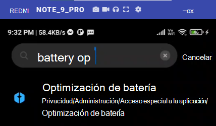
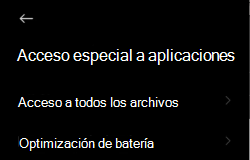
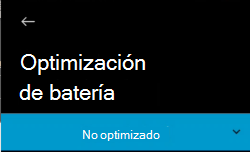
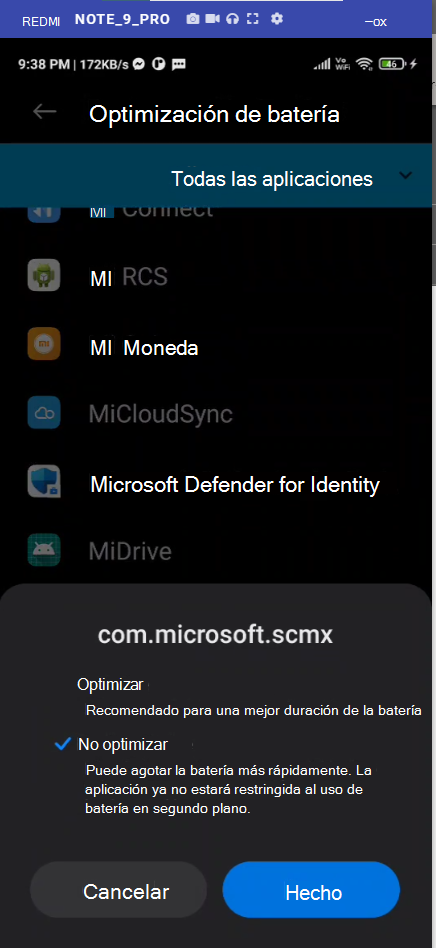

# Solución de problemas en Microsoft Defender para punto de conexión en Android

[!INCLUDE [Microsoft 365 Defender rebranding](../../includes/microsoft-defender.md)]

**Se aplica a:**
- [Microsoft Defender para punto de conexión](https://go.microsoft.com/fwlink/p/?linkid=2154037)
- [Microsoft 365 Defender](https://go.microsoft.com/fwlink/?linkid=2118804)

> ¿Quiere experimentar Microsoft Defender para punto de conexión? [Regístrese para obtener una prueba gratuita.](https://signup.microsoft.com/create-account/signup?products=7f379fee-c4f9-4278-b0a1-e4c8c2fcdf7e&ru=https://aka.ms/MDEp2OpenTrial?ocid=docs-wdatp-exposedapis-abovefoldlink)

Al incorporar un dispositivo, es posible que veas problemas de inicio de sesión después de instalar la aplicación.

Durante la incorporación, es posible que encuentres problemas de inicio de sesión después de instalar la aplicación en el dispositivo.

En este artículo se proporcionan soluciones para ayudar a solucionar los problemas de inicio de sesión.

## Error de inicio de sesión: error inesperado

**Error de inicio de sesión:** *error inesperado, inténtelo más tarde*

**Mensaje:**

Error inesperado, inténtelo más tarde

**Causa:**

Tienes instalada una versión anterior de la aplicación "Microsoft Authenticator" en el dispositivo.

**Solución:**

Instalar la versión más reciente [y Microsoft Authenticator](https://play.google.com/store/apps/details?androidid=com.azure.authenticator) de Google Play Store e intentarlo de nuevo

## Error al iniciar sesión: licencia no válida

**Error al iniciar sesión: licencia** *no válida, póngase en contacto con el administrador*

**Mensaje: Licencia** *no válida, póngase en contacto con el administrador*

**Causa:**

No tiene asignada Microsoft 365 licencia o su organización no tiene una licencia para Microsoft 365 Enterprise suscripción.

**Solución:**

Póngase en contacto con el administrador para obtener ayuda.

## Informe de sitio no seguro

Los sitios web de suplantación de identidad suplantan sitios web de confianza con el fin de obtener su información personal o financiera. Visita la [página Proporcionar comentarios sobre la protección de](https://www.microsoft.com/wdsi/filesubmission/exploitguard/networkprotection) red si quieres informar de un sitio web que podría ser un sitio de suplantación de identidad.

## Las páginas de suplantación de identidad no están bloqueadas en algunos dispositivos OEM

**Se aplica a:** Oem específicos solo

- **Xiaomi**

El phishing y las amenazas web nocivas detectadas por Defender para Endpoint para Android no se bloquean en algunos dispositivos Xiaomi. La siguiente funcionalidad no funciona en estos dispositivos.

**Causa:**

Los dispositivos Xiaomi incluyen un nuevo modelo de permisos. Esto impide que Defender para Endpoint para Android muestre ventanas emergentes mientras se ejecuta en segundo plano.

Permiso de dispositivos Xiaomi: "Mostrar ventanas emergentes mientras se ejecuta en segundo plano".

**Solución:**

Habilite el permiso necesario en dispositivos Xiaomi.

- Mostrar ventanas emergentes mientras se ejecuta en segundo plano.

## No se puede permitir el permiso para la "protección permanente" durante la incorporación en algunos dispositivos OEM

**Se aplica a:** Solo dispositivos OEM específicos.

- **Xiaomi con Android 11**

Defender App pide permiso de optimización de batería/protección permanente en  dispositivos como parte de la incorporación de aplicaciones y al seleccionar Permitir se devuelve un error que no se pudo establecer el permiso. Solo afecta al último permiso denominado "Protección permanente". 

**Causa:**

Xiomi cambió los permisos de optimización de batería en Android 11. Defender no puede configurar esta configuración para omitir las optimizaciones de batería.

**Solución:**

Estamos trabajando con OEM para encontrar una solución que habilite este permiso desde la pantalla de incorporación de aplicaciones. Actualizaremos la documentación cuando se resuelva.
Los usuarios pueden seguir estos pasos para habilitar los mismos permisos desde la configuración del dispositivo: 

1. Ve a **Configuración** en el dispositivo.

2. Busque y seleccione **Optimización de batería.**

   

3. En **Acceso especial a la aplicación,** selecciona **Optimización de batería.**

   

4. Cambie el menú desplegable para mostrar **Todas las aplicaciones**.

   

   

5. Busque "Punto de conexión de Microsoft Defender" y seleccione **No optimizar**.

   

Vuelva a la pantalla de incorporación de Puntos de conexión de Microsoft Defender, seleccione **Permitir** y se le redirigirá a la pantalla del panel.
