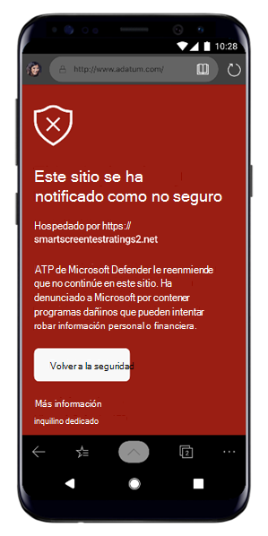

# Solución de problemas en Microsoft Defender para Endpoint para Android

[!INCLUDE [Microsoft 365 Defender rebranding](../../includes/microsoft-defender.md)]

**Se aplica a:**
- [Microsoft Defender para punto de conexión](https://go.microsoft.com/fwlink/p/?linkid=2154037)
- [Microsoft 365 Defender](https://go.microsoft.com/fwlink/?linkid=2118804)

> ¿Desea experimentar Microsoft Defender para endpoint? [Regístrate para obtener una versión de prueba gratuita.](https://www.microsoft.com/microsoft-365/windows/microsoft-defender-atp?ocid=docs-wdatp-exposedapis-abovefoldlink) 

Al incorporar un dispositivo, es posible que veas problemas de inicio de sesión después de instalar la aplicación.

Durante la incorporación, es posible que encuentres problemas de inicio de sesión después de instalar la aplicación en el dispositivo.

En este artículo se proporcionan soluciones para ayudar a solucionar los problemas de inicio de sesión.  

## Error de inicio de sesión: error inesperado
**Error de inicio de sesión:** *error inesperado, inténtelo más tarde*

**Mensaje:**

Error inesperado, inténtelo más tarde

**Causa:**

Tienes instalada una versión anterior de la aplicación "Microsoft Authenticator" en el dispositivo.

**Solución:**

Instalar la versión más reciente y [Microsoft Authenticator](https://play.google.com/store/apps/details?androidid=com.azure.authenticator) de Google Play Store e intentarlo de nuevo

## Error al iniciar sesión: licencia no válida

**Error al iniciar sesión: licencia** *no válida, póngase en contacto con el administrador*

**Mensaje: Licencia** *no válida, póngase en contacto con el administrador*

**Causa:**

No tiene asignada la licencia de Microsoft 365 o su organización no tiene una licencia para la suscripción a Microsoft 365 Enterprise.

**Solución:**

Póngase en contacto con el administrador para obtener ayuda.

## Las páginas de suplantación de identidad no están bloqueadas en algunos dispositivos OEM

**Se aplica a:** Oem específicos solo

-   **Xiaomi**

El phishing y las amenazas web nocivas detectadas por Defender para Endpoint para Android no se bloquean en algunos dispositivos Xiaomi. La siguiente funcionalidad no funciona en estos dispositivos.

**Causa:**

Los dispositivos Xiaomi incluyen un nuevo modelo de permisos. Esto impide que Defender para Endpoint para Android muestre ventanas emergentes mientras se ejecuta en segundo plano.

Permiso de dispositivos Xiaomi: "Mostrar ventanas emergentes mientras se ejecuta en segundo plano".

**Solución:**

Habilite el permiso necesario en dispositivos Xiaomi.

- Mostrar ventanas emergentes mientras se ejecuta en segundo plano.
