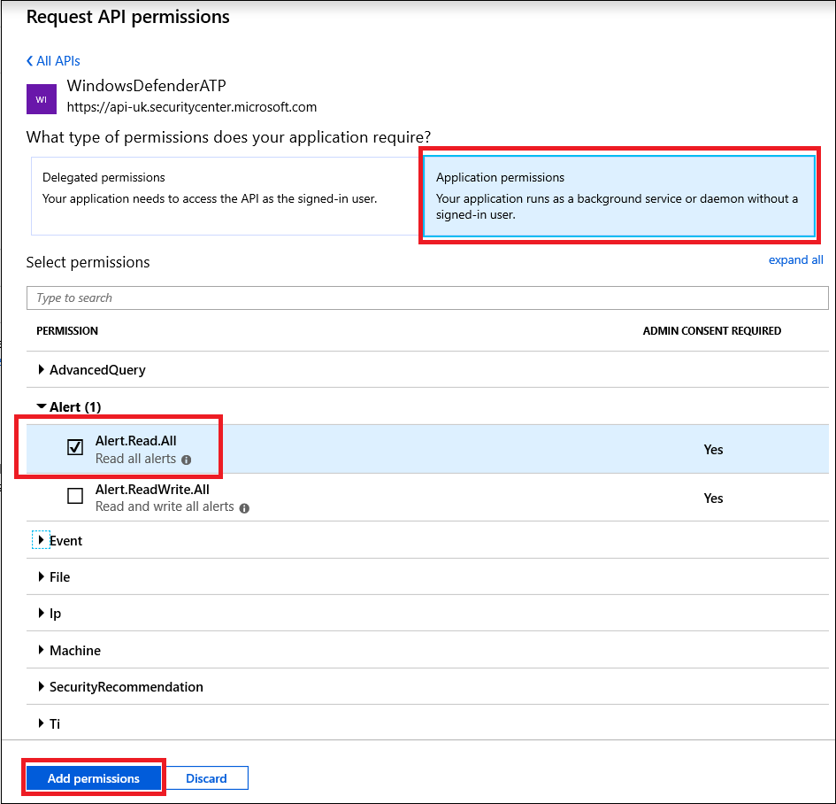

# <a name="microsoft-defender-for-endpoint-api---hello-world"></a>Microsoft Defender para la API de punto de conexión: Hello World

[!INCLUDE [Microsoft 365 Defender rebranding](../../includes/microsoft-defender.md)]


**Se aplica a:**
- [Microsoft Defender para punto de conexión](https://go.microsoft.com/fwlink/?linkid=2154037)


- ¿Desea experimentar Microsoft Defender para endpoint? [Regístrate para obtener una versión de prueba gratuita.](https://www.microsoft.com/microsoft-365/windows/microsoft-defender-atp?ocid=docs-wdatp-exposedapis-abovefoldlink)

[!include[Microsoft Defender for Endpoint API URIs for US Government](../../includes/microsoft-defender-api-usgov.md)]

[!include[Improve request performance](../../includes/improve-request-performance.md)]


## <a name="get-alerts-using-a-simple-powershell-script"></a>Obtener alertas con un script de PowerShell simple

### <a name="how-long-it-takes-to-go-through-this-example"></a>¿Cuánto tiempo se tarda en pasar por este ejemplo?
Solo se tardan 5 minutos en dos pasos:
- Registro de la aplicación
- Usar ejemplos: solo requiere copiar y pegar un script corto de PowerShell

### <a name="do-i-need-a-permission-to-connect"></a>¿Necesito un permiso para conectarme?
Para la fase de registro de aplicaciones, debe tener un rol de administrador **global** en el espacio empresarial Azure Active Directory (Azure AD).

### <a name="step-1---create-an-app-in-azure-active-directory"></a>Paso 1: Crear una aplicación en Azure Active Directory

1. Inicie sesión en [Azure](https://portal.azure.com) con el **usuario administrador** global.

2. Vaya a **Azure Active Directory**  >  **registros de aplicaciones** Nuevo  >  **registro**.

   

3. En el formulario de registro, elija un nombre para la aplicación y, a continuación, haga clic **en Registrar**.

4. Permitir que la aplicación tenga acceso a Defender for Endpoint y asignarle el permiso **"Leer todas las** alertas":

   - En la página de la aplicación, haga clic en Permisos de **API** Agregar API de permisos que mi organización usa > tipo  >    >   **WindowsDefenderATP** y haga clic en **WindowsDefenderATP**.

   - **Nota:** WindowsDefenderATP no aparece en la lista original. Debe empezar a escribir su nombre en el cuadro de texto para verlo aparecer.

   

   - Elija **Permisos de aplicación**  >  **Alert.Read.All** > Haga clic en Agregar **permisos**

   

   **Nota importante:** Debe seleccionar los permisos pertinentes. "Leer todas las alertas" es solo un ejemplo.

     Por ejemplo,

     - Para [ejecutar consultas avanzadas,](run-advanced-query-api.md)seleccione el permiso "Ejecutar consultas avanzadas"
     - Para [aislar una máquina,](isolate-machine.md)seleccione el permiso "Aislar máquina"
     - Para determinar qué permiso necesita, consulte la sección **Permisos** de la API a la que está interesado llamar.

5. Haga clic **en Conceder consentimiento**

   - **Nota:** Cada vez que agregue permiso, debe hacer clic en **Conceder consentimiento** para que el nuevo permiso suba a efecto.

   

6. Agregue un secreto a la aplicación.

   - Haga **clic en Certificados & secretos,** agregue una descripción al secreto y haga clic en **Agregar**.

    **Importante:** Después de hacer clic en Agregar, **copie el valor secreto generado**. No podrás recuperarlo después de salir.

    

7. Anote el identificador de la aplicación y el identificador de inquilino:

   - En la página de la aplicación, vaya a **Información general** y copie lo siguiente:

   

¡Listo! Ha registrado correctamente una aplicación.

### <a name="step-2---get-a-token-using-the-app-and-use-this-token-to-access-the-api"></a>Paso 2: obtener un token con la aplicación y usar este token para obtener acceso a la API.

- Copie el script siguiente en PowerShell ISE o en un editor de texto y guárdelo como "**Get-Token.ps1**"
- Si se ejecuta este script, se generará un token y se guardará en la carpeta de trabajo con el nombre "**Latest-token.txt**".

   ```powershell
   # That code gets the App Context Token and save it to a file named "Latest-token.txt" under the current directory
   # Paste below your Tenant ID, App ID and App Secret (App key).

   $tenantId = '' ### Paste your tenant ID here
   $appId = '' ### Paste your Application ID here
   $appSecret = '' ### Paste your Application secret here

   $resourceAppIdUri = 'https://api.securitycenter.microsoft.com'
   $oAuthUri = "https://login.microsoftonline.com/$TenantId/oauth2/token"
   $authBody = [Ordered] @{
       resource = "$resourceAppIdUri"
       client_id = "$appId"
       client_secret = "$appSecret"
       grant_type = 'client_credentials'
   }
   $authResponse = Invoke-RestMethod -Method Post -Uri $oAuthUri -Body $authBody -ErrorAction Stop
   $token = $authResponse.access_token
   Out-File -FilePath "./Latest-token.txt" -InputObject $token
   return $token
   ```

- Comprobación de la cordura:
  - Ejecute el script.
  - En el explorador, vaya a: <https://jwt.ms/>
  - Copie el token (el contenido del Latest-token.txt archivo).
  - Pegue en el cuadro superior.
  - Busque la sección "roles". Busque el rol Alert.Read.All.

  

### <a name="lets-get-the-alerts"></a>Vamos a obtener las alertas.

- El script siguiente **usará** Get-Token.ps1acceso a la API y recibirá las últimas 48 horas de alertas.
- Guarde este script en la misma carpeta en la que guardó el script **anteriorGet-Token.ps1**.
- El script crea dos archivos (json y csv) con los datos de la misma carpeta que los scripts.

  ```powershell
  # Returns Alerts created in the past 48 hours.

  $token = ./Get-Token.ps1       #run the script Get-Token.ps1  - make sure you are running this script from the same folder of Get-Token.ps1

  # Get Alert from the last 48 hours. Make sure you have alerts in that time frame.
  $dateTime = (Get-Date).ToUniversalTime().AddHours(-48).ToString("o")

  # The URL contains the type of query and the time filter we create above
  # Read more about other query options and filters at   Https://TBD- add the documentation link
  $url = "https://api.securitycenter.microsoft.com/api/alerts?`$filter=alertCreationTime ge $dateTime"

  # Set the WebRequest headers
  $headers = @{
      'Content-Type' = 'application/json'
      Accept = 'application/json'
      Authorization = "Bearer $token"
  }

  # Send the webrequest and get the results.
  $response = Invoke-WebRequest -Method Get -Uri $url -Headers $headers -ErrorAction Stop

  # Extract the alerts from the results.
  $alerts =  ($response | ConvertFrom-Json).value | ConvertTo-Json

  # Get string with the execution time. We concatenate that string to the output file to avoid overwrite the file
  $dateTimeForFileName = Get-Date -Format o | foreach {$_ -replace ":", "."}

  # Save the result as json and as csv
  $outputJsonPath = "./Latest Alerts $dateTimeForFileName.json"
  $outputCsvPath = "./Latest Alerts $dateTimeForFileName.csv"

  Out-File -FilePath $outputJsonPath -InputObject $alerts
  ($alerts | ConvertFrom-Json) | Export-CSV $outputCsvPath -NoTypeInformation
  ```

¡Ya ha terminado! Acaba de hacerlo correctamente:

- Creación y registro y aplicación
- Permiso concedido para que esa aplicación lea alertas
- Conectado a la API
- Uso de un script de PowerShell para devolver alertas creadas en las últimas 48 horas

## <a name="related-topic"></a>Tema relacionado

- [Microsoft Defender para api de punto de conexión](exposed-apis-list.md)
- [Access Microsoft Defender for Endpoint with application context](exposed-apis-create-app-webapp.md)
- [Access Microsoft Defender for Endpoint with user context](exposed-apis-create-app-nativeapp.md)
