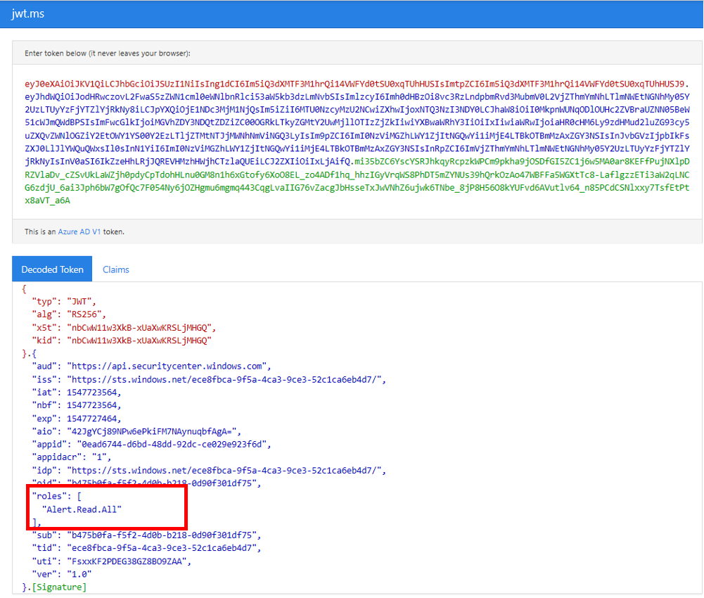

# <a name="microsoft-defender-for-endpoint-api---hello-world"></a><span data-ttu-id="bbecb-104">Microsoft Defender para la API de punto de conexión: Hello World</span><span class="sxs-lookup"><span data-stu-id="bbecb-104">Microsoft Defender for Endpoint API - Hello World</span></span>

[!INCLUDE [Microsoft 365 Defender rebranding](../../includes/microsoft-defender.md)]


<span data-ttu-id="bbecb-105">**Se aplica a:**</span><span class="sxs-lookup"><span data-stu-id="bbecb-105">**Applies to:**</span></span>
- [<span data-ttu-id="bbecb-106">Microsoft Defender para punto de conexión</span><span class="sxs-lookup"><span data-stu-id="bbecb-106">Microsoft Defender for Endpoint</span></span>](https://go.microsoft.com/fwlink/?linkid=2154037)


- <span data-ttu-id="bbecb-107">¿Desea experimentar Microsoft Defender para endpoint?</span><span class="sxs-lookup"><span data-stu-id="bbecb-107">Want to experience Microsoft Defender for Endpoint?</span></span> [<span data-ttu-id="bbecb-108">Regístrate para obtener una versión de prueba gratuita.</span><span class="sxs-lookup"><span data-stu-id="bbecb-108">Sign up for a free trial.</span></span>](https://www.microsoft.com/microsoft-365/windows/microsoft-defender-atp?ocid=docs-wdatp-exposedapis-abovefoldlink)

[!include[Microsoft Defender for Endpoint API URIs for US Government](../../includes/microsoft-defender-api-usgov.md)]

[!include[Improve request performance](../../includes/improve-request-performance.md)]


## <a name="get-alerts-using-a-simple-powershell-script"></a><span data-ttu-id="bbecb-109">Obtener alertas con un script de PowerShell simple</span><span class="sxs-lookup"><span data-stu-id="bbecb-109">Get Alerts using a simple PowerShell script</span></span>

### <a name="how-long-it-takes-to-go-through-this-example"></a><span data-ttu-id="bbecb-110">¿Cuánto tiempo se tarda en pasar por este ejemplo?</span><span class="sxs-lookup"><span data-stu-id="bbecb-110">How long it takes to go through this example?</span></span>
<span data-ttu-id="bbecb-111">Solo se tardan 5 minutos en dos pasos:</span><span class="sxs-lookup"><span data-stu-id="bbecb-111">It only takes 5 minutes done in two steps:</span></span>
- <span data-ttu-id="bbecb-112">Registro de la aplicación</span><span class="sxs-lookup"><span data-stu-id="bbecb-112">Application registration</span></span>
- <span data-ttu-id="bbecb-113">Usar ejemplos: solo requiere copiar y pegar un script corto de PowerShell</span><span class="sxs-lookup"><span data-stu-id="bbecb-113">Use examples: only requires copy/paste of a short PowerShell script</span></span>

### <a name="do-i-need-a-permission-to-connect"></a><span data-ttu-id="bbecb-114">¿Necesito un permiso para conectarme?</span><span class="sxs-lookup"><span data-stu-id="bbecb-114">Do I need a permission to connect?</span></span>
<span data-ttu-id="bbecb-115">Para la fase de registro de aplicaciones, debe tener un rol de administrador **global** en el espacio empresarial Azure Active Directory (Azure AD).</span><span class="sxs-lookup"><span data-stu-id="bbecb-115">For the Application registration stage, you must have a **Global administrator** role in your Azure Active Directory (Azure AD) tenant.</span></span>

### <a name="step-1---create-an-app-in-azure-active-directory"></a><span data-ttu-id="bbecb-116">Paso 1: Crear una aplicación en Azure Active Directory</span><span class="sxs-lookup"><span data-stu-id="bbecb-116">Step 1 - Create an App in Azure Active Directory</span></span>

1. <span data-ttu-id="bbecb-117">Inicie sesión en [Azure](https://portal.azure.com) con el **usuario administrador** global.</span><span class="sxs-lookup"><span data-stu-id="bbecb-117">Log on to [Azure](https://portal.azure.com) with your **Global administrator** user.</span></span>

2. <span data-ttu-id="bbecb-118">Vaya a **Azure Active Directory**  >  **registros de aplicaciones** Nuevo  >  **registro**.</span><span class="sxs-lookup"><span data-stu-id="bbecb-118">Navigate to **Azure Active Directory** > **App registrations** > **New registration**.</span></span>

   

3. <span data-ttu-id="bbecb-120">En el formulario de registro, elija un nombre para la aplicación y, a continuación, haga clic **en Registrar**.</span><span class="sxs-lookup"><span data-stu-id="bbecb-120">In the registration form, choose a name for your application and then click **Register**.</span></span>

4. <span data-ttu-id="bbecb-121">Permitir que la aplicación tenga acceso a Defender for Endpoint y asignarle el permiso **"Leer todas las** alertas":</span><span class="sxs-lookup"><span data-stu-id="bbecb-121">Allow your Application to access Defender for Endpoint and assign it **'Read all alerts'** permission:</span></span>

   - <span data-ttu-id="bbecb-122">En la página de la aplicación, haga clic en Permisos de **API** Agregar API de permisos que mi organización usa > tipo  >    >   **WindowsDefenderATP** y haga clic en **WindowsDefenderATP**.</span><span class="sxs-lookup"><span data-stu-id="bbecb-122">On your application page, click **API Permissions** > **Add permission** > **APIs my organization uses** > type **WindowsDefenderATP** and click on **WindowsDefenderATP**.</span></span>

   - <span data-ttu-id="bbecb-123">**Nota:** WindowsDefenderATP no aparece en la lista original.</span><span class="sxs-lookup"><span data-stu-id="bbecb-123">**Note**: WindowsDefenderATP does not appear in the original list.</span></span> <span data-ttu-id="bbecb-124">Debe empezar a escribir su nombre en el cuadro de texto para verlo aparecer.</span><span class="sxs-lookup"><span data-stu-id="bbecb-124">You need to start writing its name in the text box to see it appear.</span></span>

   

   - <span data-ttu-id="bbecb-126">Elija **Permisos de aplicación**  >  **Alert.Read.All** > Haga clic en Agregar **permisos**</span><span class="sxs-lookup"><span data-stu-id="bbecb-126">Choose **Application permissions** > **Alert.Read.All** > Click on **Add permissions**</span></span>

   

   <span data-ttu-id="bbecb-128">**Nota importante:** Debe seleccionar los permisos pertinentes.</span><span class="sxs-lookup"><span data-stu-id="bbecb-128">**Important note**: You need to select the relevant permissions.</span></span> <span data-ttu-id="bbecb-129">"Leer todas las alertas" es solo un ejemplo.</span><span class="sxs-lookup"><span data-stu-id="bbecb-129">'Read All Alerts' is only an example!</span></span>

     <span data-ttu-id="bbecb-130">Por ejemplo,</span><span class="sxs-lookup"><span data-stu-id="bbecb-130">For instance,</span></span>

     - <span data-ttu-id="bbecb-131">Para [ejecutar consultas avanzadas,](run-advanced-query-api.md)seleccione el permiso "Ejecutar consultas avanzadas"</span><span class="sxs-lookup"><span data-stu-id="bbecb-131">To [run advanced queries](run-advanced-query-api.md), select 'Run advanced queries' permission</span></span>
     - <span data-ttu-id="bbecb-132">Para [aislar una máquina,](isolate-machine.md)seleccione el permiso "Aislar máquina"</span><span class="sxs-lookup"><span data-stu-id="bbecb-132">To [isolate a machine](isolate-machine.md), select 'Isolate machine' permission</span></span>
     - <span data-ttu-id="bbecb-133">Para determinar qué permiso necesita, consulte la sección **Permisos** de la API a la que está interesado llamar.</span><span class="sxs-lookup"><span data-stu-id="bbecb-133">To determine which permission you need, please look at the **Permissions** section in the API you are interested to call.</span></span>

5. <span data-ttu-id="bbecb-134">Haga clic **en Conceder consentimiento**</span><span class="sxs-lookup"><span data-stu-id="bbecb-134">Click **Grant consent**</span></span>

   - <span data-ttu-id="bbecb-135">**Nota:** Cada vez que agregue permiso, debe hacer clic en **Conceder consentimiento** para que el nuevo permiso suba a efecto.</span><span class="sxs-lookup"><span data-stu-id="bbecb-135">**Note**: Every time you add permission you must click on **Grant consent** for the new permission to take effect.</span></span>

   

6. <span data-ttu-id="bbecb-137">Agregue un secreto a la aplicación.</span><span class="sxs-lookup"><span data-stu-id="bbecb-137">Add a secret to the application.</span></span>

   - <span data-ttu-id="bbecb-138">Haga **clic en Certificados & secretos,** agregue una descripción al secreto y haga clic en **Agregar**.</span><span class="sxs-lookup"><span data-stu-id="bbecb-138">Click **Certificates & secrets**, add description to the secret and click **Add**.</span></span>

    <span data-ttu-id="bbecb-139">**Importante:** Después de hacer clic en Agregar, **copie el valor secreto generado**.</span><span class="sxs-lookup"><span data-stu-id="bbecb-139">**Important**: After click Add, **copy the generated secret value**.</span></span> <span data-ttu-id="bbecb-140">No podrás recuperarlo después de salir.</span><span class="sxs-lookup"><span data-stu-id="bbecb-140">You won't be able to retrieve after you leave!</span></span>

    

7. <span data-ttu-id="bbecb-142">Anote el identificador de la aplicación y el identificador de inquilino:</span><span class="sxs-lookup"><span data-stu-id="bbecb-142">Write down your application ID and your tenant ID:</span></span>

   - <span data-ttu-id="bbecb-143">En la página de la aplicación, vaya a **Información general** y copie lo siguiente:</span><span class="sxs-lookup"><span data-stu-id="bbecb-143">On your application page, go to **Overview** and copy the following:</span></span>

   

<span data-ttu-id="bbecb-145">¡Listo!</span><span class="sxs-lookup"><span data-stu-id="bbecb-145">Done!</span></span> <span data-ttu-id="bbecb-146">Ha registrado correctamente una aplicación.</span><span class="sxs-lookup"><span data-stu-id="bbecb-146">You have successfully registered an application!</span></span>

### <a name="step-2---get-a-token-using-the-app-and-use-this-token-to-access-the-api"></a><span data-ttu-id="bbecb-147">Paso 2: obtener un token con la aplicación y usar este token para obtener acceso a la API.</span><span class="sxs-lookup"><span data-stu-id="bbecb-147">Step 2 - Get a token using the App and use this token to access the API.</span></span>

- <span data-ttu-id="bbecb-148">Copie el script siguiente en PowerShell ISE o en un editor de texto y guárdelo como "**Get-Token.ps1**"</span><span class="sxs-lookup"><span data-stu-id="bbecb-148">Copy the script below to PowerShell ISE or to a text editor, and save it as "**Get-Token.ps1**"</span></span>
- <span data-ttu-id="bbecb-149">Si se ejecuta este script, se generará un token y se guardará en la carpeta de trabajo con el nombre "**Latest-token.txt**".</span><span class="sxs-lookup"><span data-stu-id="bbecb-149">Running this script will generate a token and will save it in the working folder under the name "**Latest-token.txt**".</span></span>

   ```powershell
   # That code gets the App Context Token and save it to a file named "Latest-token.txt" under the current directory
   # Paste below your Tenant ID, App ID and App Secret (App key).

   $tenantId = '' ### Paste your tenant ID here
   $appId = '' ### Paste your Application ID here
   $appSecret = '' ### Paste your Application secret here

   $resourceAppIdUri = 'https://api.securitycenter.microsoft.com'
   $oAuthUri = "https://login.microsoftonline.com/$TenantId/oauth2/token"
   $authBody = [Ordered] @{
       resource = "$resourceAppIdUri"
       client_id = "$appId"
       client_secret = "$appSecret"
       grant_type = 'client_credentials'
   }
   $authResponse = Invoke-RestMethod -Method Post -Uri $oAuthUri -Body $authBody -ErrorAction Stop
   $token = $authResponse.access_token
   Out-File -FilePath "./Latest-token.txt" -InputObject $token
   return $token
   ```

- <span data-ttu-id="bbecb-150">Comprobación de la cordura:</span><span class="sxs-lookup"><span data-stu-id="bbecb-150">Sanity Check:</span></span>
  - <span data-ttu-id="bbecb-151">Ejecute el script.</span><span class="sxs-lookup"><span data-stu-id="bbecb-151">Run the script.</span></span>
  - <span data-ttu-id="bbecb-152">En el explorador, vaya a: <https://jwt.ms/></span><span class="sxs-lookup"><span data-stu-id="bbecb-152">In your browser go to: <https://jwt.ms/></span></span>
  - <span data-ttu-id="bbecb-153">Copie el token (el contenido del Latest-token.txt archivo).</span><span class="sxs-lookup"><span data-stu-id="bbecb-153">Copy the token (the content of the Latest-token.txt file).</span></span>
  - <span data-ttu-id="bbecb-154">Pegue en el cuadro superior.</span><span class="sxs-lookup"><span data-stu-id="bbecb-154">Paste in the top box.</span></span>
  - <span data-ttu-id="bbecb-155">Busque la sección "roles".</span><span class="sxs-lookup"><span data-stu-id="bbecb-155">Look for the "roles" section.</span></span> <span data-ttu-id="bbecb-156">Busque el rol Alert.Read.All.</span><span class="sxs-lookup"><span data-stu-id="bbecb-156">Find the Alert.Read.All role.</span></span>

  

### <a name="lets-get-the-alerts"></a><span data-ttu-id="bbecb-158">Vamos a obtener las alertas.</span><span class="sxs-lookup"><span data-stu-id="bbecb-158">Lets get the Alerts!</span></span>

- <span data-ttu-id="bbecb-159">El script siguiente **usará** Get-Token.ps1acceso a la API y recibirá las últimas 48 horas de alertas.</span><span class="sxs-lookup"><span data-stu-id="bbecb-159">The script below will use **Get-Token.ps1** to access the API and will get the past 48 hours Alerts.</span></span>
- <span data-ttu-id="bbecb-160">Guarde este script en la misma carpeta en la que guardó el script **anteriorGet-Token.ps1**.</span><span class="sxs-lookup"><span data-stu-id="bbecb-160">Save this script in the same folder you saved the previous script **Get-Token.ps1**.</span></span>
- <span data-ttu-id="bbecb-161">El script crea dos archivos (json y csv) con los datos de la misma carpeta que los scripts.</span><span class="sxs-lookup"><span data-stu-id="bbecb-161">The script creates two files (json and csv) with the data in the same folder as the scripts.</span></span>

  ```powershell
  # Returns Alerts created in the past 48 hours.

  $token = ./Get-Token.ps1       #run the script Get-Token.ps1  - make sure you are running this script from the same folder of Get-Token.ps1

  # Get Alert from the last 48 hours. Make sure you have alerts in that time frame.
  $dateTime = (Get-Date).ToUniversalTime().AddHours(-48).ToString("o")

  # The URL contains the type of query and the time filter we create above
  # Read more about other query options and filters at   Https://TBD- add the documentation link
  $url = "https://api.securitycenter.microsoft.com/api/alerts?`$filter=alertCreationTime ge $dateTime"

  # Set the WebRequest headers
  $headers = @{
      'Content-Type' = 'application/json'
      Accept = 'application/json'
      Authorization = "Bearer $token"
  }

  # Send the webrequest and get the results.
  $response = Invoke-WebRequest -Method Get -Uri $url -Headers $headers -ErrorAction Stop

  # Extract the alerts from the results.
  $alerts =  ($response | ConvertFrom-Json).value | ConvertTo-Json

  # Get string with the execution time. We concatenate that string to the output file to avoid overwrite the file
  $dateTimeForFileName = Get-Date -Format o | foreach {$_ -replace ":", "."}

  # Save the result as json and as csv
  $outputJsonPath = "./Latest Alerts $dateTimeForFileName.json"
  $outputCsvPath = "./Latest Alerts $dateTimeForFileName.csv"

  Out-File -FilePath $outputJsonPath -InputObject $alerts
  ($alerts | ConvertFrom-Json) | Export-CSV $outputCsvPath -NoTypeInformation
  ```

<span data-ttu-id="bbecb-162">¡Ya ha terminado!</span><span class="sxs-lookup"><span data-stu-id="bbecb-162">You're all done!</span></span> <span data-ttu-id="bbecb-163">Acaba de hacerlo correctamente:</span><span class="sxs-lookup"><span data-stu-id="bbecb-163">You have just successfully:</span></span>

- <span data-ttu-id="bbecb-164">Creación y registro y aplicación</span><span class="sxs-lookup"><span data-stu-id="bbecb-164">Created and registered and application</span></span>
- <span data-ttu-id="bbecb-165">Permiso concedido para que esa aplicación lea alertas</span><span class="sxs-lookup"><span data-stu-id="bbecb-165">Granted permission for that application to read alerts</span></span>
- <span data-ttu-id="bbecb-166">Conectado a la API</span><span class="sxs-lookup"><span data-stu-id="bbecb-166">Connected the API</span></span>
- <span data-ttu-id="bbecb-167">Uso de un script de PowerShell para devolver alertas creadas en las últimas 48 horas</span><span class="sxs-lookup"><span data-stu-id="bbecb-167">Used a PowerShell script to return alerts created in the past 48 hours</span></span>

## <a name="related-topic"></a><span data-ttu-id="bbecb-168">Tema relacionado</span><span class="sxs-lookup"><span data-stu-id="bbecb-168">Related topic</span></span>

- [<span data-ttu-id="bbecb-169">Microsoft Defender para api de punto de conexión</span><span class="sxs-lookup"><span data-stu-id="bbecb-169">Microsoft Defender for Endpoint APIs</span></span>](exposed-apis-list.md)
- [<span data-ttu-id="bbecb-170">Access Microsoft Defender for Endpoint with application context</span><span class="sxs-lookup"><span data-stu-id="bbecb-170">Access Microsoft Defender for Endpoint with application context</span></span>](exposed-apis-create-app-webapp.md)
- [<span data-ttu-id="bbecb-171">Access Microsoft Defender for Endpoint with user context</span><span class="sxs-lookup"><span data-stu-id="bbecb-171">Access Microsoft Defender for Endpoint with user context</span></span>](exposed-apis-create-app-nativeapp.md)
