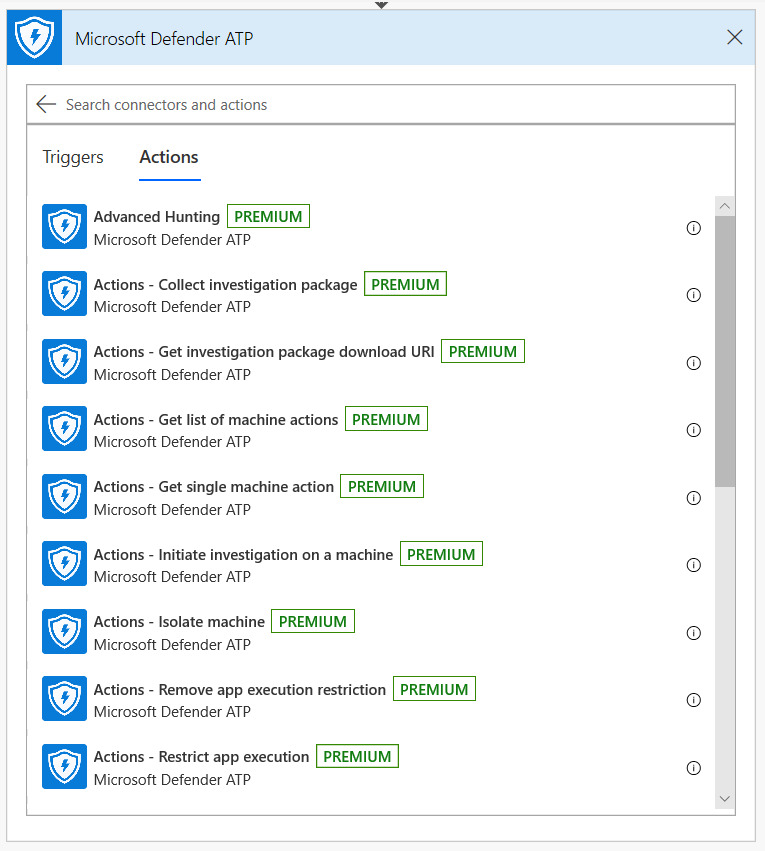
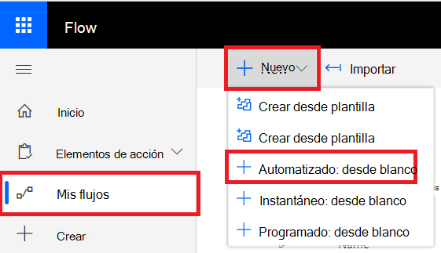

# Microsoft Power Automate (anteriormente Microsoft Flow) y Azure FunctionsMicrosoft Power Automate (formerly Microsoft Flow), and Azure Functions

[!INCLUDE [Microsoft 365 Defender rebranding](../../includes/microsoft-defender.md)]

**Se aplica a:****Applies to:**
- [Microsoft Defender para punto de conexiónMicrosoft Defender for Endpoint](https://go.microsoft.com/fwlink/p/?linkid=2154037)
- [Microsoft 365 DefenderMicrosoft 365 Defender](https://go.microsoft.com/fwlink/?linkid=2118804)

- ¿Desea experimentar Microsoft Defender para endpoint?Want to experience Microsoft Defender for Endpoint? [Regístrate para obtener una versión de prueba gratuita.Sign up for a free trial.](https://www.microsoft.com/microsoft-365/windows/microsoft-defender-atp?ocid=docs-wdatp-exposedapis-abovefoldlink) 

Automatizar los procedimientos de seguridad es un requisito estándar para todos los centros de operaciones de seguridad modernos.Automating security procedures is a standard requirement for every modern Security Operations Center. La falta de ciberdelincuntes profesionales obliga a SOC a trabajar de la manera más eficiente y la automatización es una obligación.The lack of professional cyber defenders forces SOC to work in the most efficient way and automation is a must. Microsoft Power Automate admite diferentes conectores creados exactamente para ello.Microsoft Power Automate supports different connectors that were built exactly for that. Puede crear una automatización de procedimientos de extremo a extremo en unos minutos.You can build an end-to-end procedure automation within a few minutes.

La API de Microsoft Defender tiene un conector de flujo oficial con muchas capacidades.Microsoft Defender API has an official Flow Connector with many capabilities.

> [!NOTE]
> Para obtener más información acerca de los requisitos previos de licencias de conectores premium, vea [Licensing for premium connectors](https://docs.microsoft.com/power-automate/triggers-introduction#licensing-for-premium-connectors).For more details about premium connectors licensing prerequisites, see [Licensing for premium connectors](https://docs.microsoft.com/power-automate/triggers-introduction#licensing-for-premium-connectors).

## Ejemplo de usoUsage example

En el ejemplo siguiente se muestra cómo crear un flujo que se desencadena cada vez que se produce una nueva alerta en el espacio empresarial.The following example demonstrates how to create a Flow that is triggered any time a new Alert occurs on your tenant.

1. Inicie sesión en [Microsoft Power Automate](https://flow.microsoft.com).Log in to [Microsoft Power Automate](https://flow.microsoft.com).

2. Vaya a **Mis flujos**  >  **Nuevo**  >  **automatizado desde en blanco**.Go to **My flows** > **New** > **Automated-from blank**.

    

3. Elija un nombre para el flujo, busque "Desencadenadores de ATP de Microsoft Defender" como desencadenador y, a continuación, seleccione el nuevo desencadenador de alertas.Choose a name for your Flow, search for "Microsoft Defender ATP Triggers" as the trigger, and then select the new Alerts trigger.

    

Ahora tienes un flujo que se desencadena cada vez que se produce una nueva alerta.Now you have a Flow that is triggered every time a new Alert occurs.

Todo lo que necesita hacer ahora es elegir los pasos siguientes.All you need to do now is choose your next steps.
Por ejemplo, puedes aislar el dispositivo si la gravedad de la alerta es alta y enviar un correo electrónico al respecto.For example, you can isolate the device if the Severity of the Alert is High and send an email about it.
El desencadenador de alerta solo proporciona el identificador de alerta y el id. de máquina.The Alert trigger provides only the Alert ID and the Machine ID. Puede usar el conector para expandir estas entidades.You can use the connector to expand these entities.

### Obtener la entidad Alert mediante el conectorGet the Alert entity using the connector

1. Elija **ATP de Microsoft Defender** para el nuevo paso.Choose **Microsoft Defender ATP** for the new step.

2. Choose **Alerts - Get single alert API**.Choose **Alerts - Get single alert API**.

3. Establezca el **identificador de alerta** del último paso como **Input**.Set the **Alert ID** from the last step as **Input**.

    

### Aislar el dispositivo si la gravedad de la alerta es altaIsolate the device if the Alert's severity is High

1. Agregue **Condition** como un paso nuevo.Add **Condition** as a new step.

2. Compruebe si la gravedad de la alerta **es igual a** Alta.Check if the Alert severity **is equal to** High.

   Si es así, agrega la **acción Atp de Microsoft Defender:** aislar la acción del equipo con el id. de máquina y un comentario.If yes, add the **Microsoft Defender ATP - Isolate machine** action with the Machine ID and a comment.

    

3. Agregue un nuevo paso para enviar mensajes de correo electrónico sobre la alerta y el aislamiento.Add a new step for emailing about the Alert and the Isolation. Hay varios conectores de correo electrónico que son muy fáciles de usar, como Outlook o Gmail.There are multiple email connectors that are very easy to use, such as Outlook or Gmail.

4. Guarde el flujo.Save your flow.

También puedes crear un **flujo programado que** ejecute consultas de búsqueda avanzada y mucho más.You can also create a **scheduled** flow that runs Advanced Hunting queries and much more!

## Tema relacionadoRelated topic
- [Microsoft Defender para api de punto de conexiónMicrosoft Defender for Endpoint APIs](apis-intro.md)
