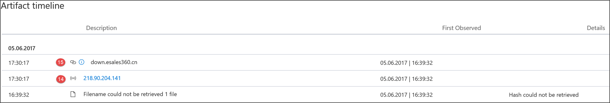

# Campos de la API de Microsoft Defender para detecciones de puntos de conexión

[!INCLUDE [Microsoft 365 Defender rebranding](../../includes/microsoft-defender.md)]

**Se aplica a:**
- [Microsoft Defender para punto de conexión](https://go.microsoft.com/fwlink/p/?linkid=2154037)
- [Microsoft 365 Defender](https://go.microsoft.com/fwlink/?linkid=2118804)

>¿Desea experimentar Defender for Endpoint? [Regístrate para obtener una versión de prueba gratuita.](https://www.microsoft.com/microsoft-365/windows/microsoft-defender-atp?ocid=docs-wdatp-apiportalmapping-abovefoldlink)

Comprender qué campos de datos se exponen como parte de la API de detecciones y cómo se asignan a Centro de seguridad de Microsoft Defender.

>[!Note]
>- [Defender for Endpoint Alert](alerts.md) se compone de una o más detecciones.
>- **ATP de Microsoft Defender Detection** se compone del evento sospechoso que se produjo en el dispositivo y sus detalles **de alerta** relacionados.
>- La API de alerta de punto de conexión de Microsoft Defender es la API más reciente para el consumo de alertas y contiene una lista detallada de pruebas relacionadas para cada alerta. Para obtener más información, vea [Alert methods and properties y](alerts.md) List [alerts](get-alerts.md).

## Campos de API de detecciones y asignación de portal
En la tabla siguiente se enumeran los campos disponibles expuestos en la carga de la API de detecciones. Muestra ejemplos de los valores rellenados y una referencia sobre cómo se reflejan los datos en el portal.

La columna de campo ArcSight contiene la asignación predeterminada entre los campos Defender para endpoint y los campos integrados en ArcSight. Puede descargar el archivo de asignación del portal cuando habilite la característica de integración siem y pueda modificarlo para que coincida con las necesidades de su organización. Para obtener más información, vea [Enable SIEM integration in Defender for Endpoint](enable-siem-integration.md).

Los números de campo coinciden con los números de las imágenes siguientes.

> [!div class="mx-tableFixed"]
> 
> | Etiqueta del portal   | Nombre del campo SIEM           | Campo ArcSight      | Valor de ejemplo                                                                      | Descripción                                                                                                                                                                    |
> |------------------|---------------------------|---------------------|------------------------------------------------------------------------------------|--------------------------------------------------------------------------------------------------------------------------------------------------------------------------------|
> | 1                | AlertTitle                | name                | Antivirus de Microsoft Defender detectado malware de alta gravedad de "Mikatz" | Valor disponible para cada detección.                                                                                                                                               |
> | 2                | Gravedad                  | deviceSeverity      | Alto                                                                             | Valor disponible para cada detección.                                                                                                                                               |
> | 3                | Categoría                  | deviceEventCategory | Malware                                                               | Valor disponible para cada detección.                                                                                                                                               |
> | 4                 | Origen de detección                    | sourceServiceName   | Antivirus                                                                 | Antivirus de Microsoft Defender o Defender para endpoint. Valor disponible para cada detección.                                                                                         |
> | 5                 | MachineName               | sourceHostName      | desktop-4a5ngd6                                                                           | Valor disponible para cada detección.                                                                                                                                               |
> | 6                 | FileName                  | fileName            | Robocopy.exe                                                                       | Disponible para detecciones asociadas a un archivo o proceso.                                                                                                                      |
> | 7                 | FilePath                  | filePath            | C:\Windows\System32\Robocopy.exe                                                   | Disponible para detecciones asociadas a un archivo o proceso.                                                                                                                     |
> | 8                 | UserDomain                | sourceNtDomain      | CONTOSO                                                                            | Dominio del contexto de usuario que ejecuta la actividad, disponible para detecciones basadas en comportamiento de Defender para endpoint.                                                           |
> | 9                 | UserName                  | sourceUserName      | liz.bean                                                                           | El contexto de usuario que ejecuta la actividad, disponible para detecciones basadas en comportamiento de Defender para endpoint.                                                                           |
> | 10               | Sha1                      | fileHash            | 3da065e07b990034e9db7842167f70b63aa5329                                           | Disponible para detecciones asociadas a un archivo o proceso.                                                                                                                      |
> | 11               | Sha256                    | deviceCustomString6 | ebf54f745dc81e1958f75e4ca91d0ab989fc9787bb6b0bf993e2f5                   | Disponible para detecciones de ANTIVIRUS de Microsoft Defender.                                                                                                                                    |
> | 12                | Md5                       | deviceCustomString5 | db979c04a99b96d370988325bb5a8b21                                                   | Disponible para detecciones de ANTIVIRUS de Microsoft Defender.                                                                                                                                    |
> | 13               | ThreatName                | deviceCustomString1  | HackTool:Win32/Mikatz!dha                                                         | Disponible para detecciones de ANTIVIRUS de Microsoft Defender.                                                                                                                                    |
> | 14                | IpAddress                 | sourceAddress       | 218.90.204.141                                                                     | Disponible para detecciones asociadas a eventos de red. Por ejemplo, "Comunicación a un destino de red malintencionado".                                                        |
> | 15               | Url                       | requestUrl          | down.esales360.cn                                                                  | Disponible para detecciones asociadas a eventos de red. Por ejemplo, "Comunicación a un destino de red malintencionado".                                                         |
> | 16                | RemediationIsSuccess      | deviceCustomNumber2 | TRUE                                                                               | Disponible para detecciones de ANTIVIRUS de Microsoft Defender. El valor de ArcSight es 1 cuando TRUE y 0 cuando FALSE.                                                                                    |
> | 17                | WasExecutingWhileDetected | deviceCustomNumber1 | FALSE                                                                              | Disponible para detecciones de ANTIVIRUS de Microsoft Defender. El valor de ArcSight es 1 cuando TRUE y 0 cuando FALSE.                                                                                    |
> | 18                | AlertId                   | externalId          | 636210704265059241_673569822                                                       | Valor disponible para cada detección.                                                                                                                                               |
> | 19               | LinkToWDATP               | flexString1         | `https://securitycenter.windows.com/alert/636210704265059241_673569822`            | Valor disponible para cada detección.                                                                                                                                               |
> | 20               | AlertTime                 | deviceReceiptTime   | 2017-05-07T01:56:59.3191352Z                                                       | Hora en que se produjo el evento. Valor disponible para cada detección.                                                                                       |
> |  21               | MachineDomain             | sourceDnsDomain     | contoso.com                                                                        | Nombre de dominio no relevante para dispositivos unidos a AAD. Valor disponible para cada detección.                                                                                           |
> | 22               | Actor                     | deviceCustomString4 | BORON                                                                                   | Disponible para alertas relacionadas con un grupo de actores conocido.                                                                                                                         |
> | 21+5             | ComputerDnsName           | Sin asignación          | liz-bean.contoso.com                                                               | Nombre de dominio completo del dispositivo. Valor disponible para cada detección.                                                                                                    |
> |                  | LogOnUsers                | sourceUserId        | contoso\liz-bean;   contoso\jay-hardee                                             | El dominio y el usuario del usuario o usuarios de inicio de sesión interactivos en el momento del evento. Nota: Para los dispositivos Windows 10 versión 1607, la información del dominio no estará disponible. |
> |                  | InternalIPv4List          | Sin asignación          | 192.168.1.7, 10.1.14.1                                                             | Lista de direcciones IP internas IPV4 para interfaces de red activas.                                                                                                                                                                               |
> |                  | InternalIPv6List          | Sin asignación          | fd30:0000:0000:0001:ff4e:003e:0009:000e, FE80:CD00:0000:0CDE:1257:0000:211E:729C | Lista de direcciones IP internas IPV6 para interfaces de red activas.                                                                                                                                                                               |
| | LinkToMTP | Sin asignación | `https://security.microsoft.com/alert/da637370718981685665_16349121` | Valor disponible para cada detección.
| | IncidentLinkToMTP | Sin asignación | `"https://security.microsoft.com/incidents/byalert?alertId=da637370718981685665_16349121&source=SIEM` | Valor disponible para cada detección.
| | IncidentLinkToWDATP | Sin asignación | `https://securitycenter.windows.com/incidents/byalert?alertId=da637370718981685665_16349121&source=SIEM` | Valor disponible para cada detección.
> | Campo interno | LastProcessedTimeUtc      | Sin asignación          | 2017-05-07T01:56:58.9936648Z                                                       | Hora en que el evento llegó al back-end. Este campo se puede usar al establecer el parámetro de solicitud para el intervalo de tiempo que se recuperan las detecciones.                         |
> |                  | No forma parte del esquema    | deviceVendor        |                                                                                    | Valor estático en la asignación de ArcSight: 'Microsoft'.                                                                                                                          |
> |                  | No forma parte del esquema    | deviceProduct       |                                                                                    | Valor estático en la asignación de ArcSight: "ATP de Microsoft Defender".                                                                                                               |
> |                  | No forma parte del esquema    | deviceVersion       |                                                                                    | Valor estático en la asignación de ArcSight - '2.0', que se usa para identificar las versiones de asignación.                                                                                         

## Temas relacionados
- [Habilitar la integración de SIEM en Microsoft Defender para endpoint](enable-siem-integration.md)
- [Configurar ArcSight para extraer Microsoft Defender para detecciones de puntos de conexión](configure-arcsight.md)
- [Extraer Microsoft Defender para detecciones de puntos de conexión mediante la API de REST](pull-alerts-using-rest-api.md)
- [Solucionar problemas de integración de la herramienta SIEM](troubleshoot-siem.md)
